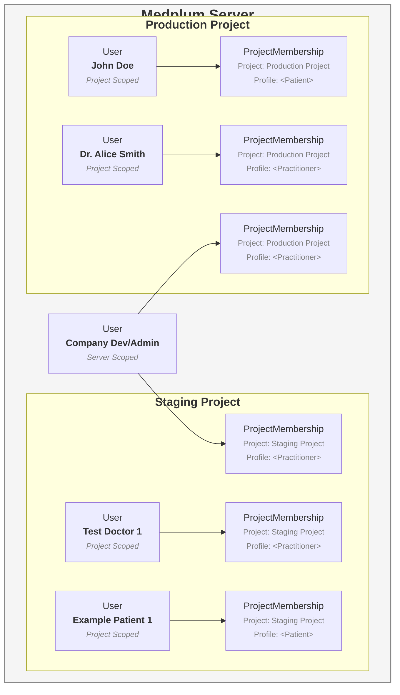

# Project vs Server Scoped Users

You can specify the scope of a [User](/docs/api/fhir/medplum/user) by adding the `scope` parameter to the [Invite User](/docs/api/project-admin/invite) endpoint.

```ts
const response = await medplum.post('/admin/projects/:projectId/invite', {
  resourceType: 'Practitioner',
  firstName: 'Test',
  lastName: 'User',
  email: 'test@example.com',
  scope: 'project' // or 'server'
})
```
 **Server Scoped Users** - Used for developers and administrators that need to interact with multiple projects (e.g. staging and production).

 **Project Scoped Users** - Used for real practicing clinicians and patients that will only interact with your single production project. By default, the server scopes all Patient [`Users`](https://www.medplum.com/docs/api/fhir/medplum/user) to the project.





:::info
For **hosted customers**, you will only have control over the User resources for your project scoped users, but hosted customers can access **server scoped users** from their [super admin project](/docs/self-hosting/super-admin-guide).
:::

:::note
If you want to create a [custom email flow](/docs/auth/custom-emails) for your Practitioners, they will need to be invited as a Project Scoped Users so that the UserSecurityRequest resources are also scoped to the project.
:::
