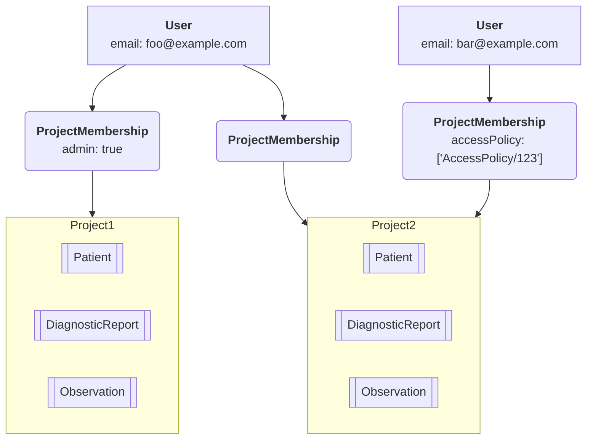

import ExampleCode from '!!raw-loader!@site/..//examples/src/auth/user-management-guide.ts';
import MedplumCodeBlock from '@site/src/components/MedplumCodeBlock';
import Tabs from '@theme/Tabs';
import TabItem from '@theme/TabItem';

# User Management Guide

This guide walks through how to **create and manage users** via the Medplum App and via API. Medplum supports multiple authentication options, but always maintains a representation of the user identities, and gives developers control over which authentication method to use for an identity, as well as what access controls are applied.

## Background: User Model

Medplum has several resources that represent user identities. The following resources are fundamental to building a correctly functioning application. This table describes how identities are represented in the system, and provides links to the administrative settings in the [Medplum App](https://app.medplum.com).

| Resource                                                      | Description                                                                                                                                                                                                                       | Medplum App                                                                                                              |
| ------------------------------------------------------------- | --------------------------------------------------------------------------------------------------------------------------------------------------------------------------------------------------------------------------------- | ------------------------------------------------------------------------------------------------------------------------ |
| User                                                          | A resource that represents a user identity. Users exist above the Project level and can only be self-updated.                                                                                                                     | None                                                                                                                     |
| Project                                                       | A [Project](/docs/tutorials/register#medplum-projects) is an isolated set of resources. With the exception of User, resources do not exist across Projects                                                                        | [Project Admin](https://app.medplum.com/admin/project)                                                                   |
| [ProjectMembership](/docs/api/fhir/medplum/projectmembership) | A ProjectMembership represents granting a user access to the resources within a Project. Inviting a user to a project, and specifying their `profile` and `accessPolicy` you can determine what set of resources they can access. | [Invite (Admins only)](https://app.medplum.com/admin/invite), [Users (Admins only)](https://app.medplum.com/admin/users) |

:::note Example



:::

The resources below serve as modifier to the ProjectMembership resource (i.e. `ProjectMembership.profile`) that enable sophisticated access controls. The `ProjectMembership.accessPolicy` may rely on the `ProjectMembership.profile` resource.

| Resource      | Description                                                                                                                             | Medplum App                                            |
| ------------- | --------------------------------------------------------------------------------------------------------------------------------------- | ------------------------------------------------------ |
| Patient       | Patient is a fundamental FHIR resource and linking it to an identity allows the simple use case of granting access to personal records. | [Patients](https://app.medplum.com/Patient)            |
| Practitioner  | Practitioners are staff members of a healthcare organization and generally have access to multiple patients' data.                      | [Practitioner](https://app.medplum.com/Practitioner)   |
| RelatedPerson | RelatedPerson is a family member or caregiver of a patient, who may be granted access to a small number of patient records              | [RelatedPerson](https://app.medplum.com/RelatedPerson) |

There are several `ProjectMembership.profile` resources that are related to programmatic access, which serve as modifiers to the ProjectMembership resource (i.e. `ProjectMembership.profile`) and do not represent people, but rather applications that access data. This table describes the programmatic access profiles with links on where to set them up in the Medplum App.

| Resource          | Description                                            | Medplum App                                                  |
| ----------------- | ------------------------------------------------------ | ------------------------------------------------------------ |
| ClientApplication | API Keys that allow programmatic access to resources   | [Client Applications](https://app.medplum.com/admin/clients) |
| Bot               | Event driven [custom functions](/docs/bots/bot-basics) | [Bots](https://app.medplum.com/Bot)                          |

## Creating a new Project

### UI

The simplest way to create a project is to visit https://app.medplum.com/register and fill out the new project registration form.

:::caution Note

If you are self-hosting, replace `app.medplum.com` with `app.your-base-url.com`

:::


### API

To create a new `Project` resource via the API, you will need to create a `ClientApplication` with super admin privileges. 

:::warning 

Super admin features can cause unrepairable damage. We highly recommend adding an [Access Policy](/docs/auth/access-control) to this `ClientApplication` to reduce it's privileges. 

::: 

With is `ClientApplication`, you can create a `Project` resource and invite the a new user as a project admin. 

<MedplumCodeBlock language="ts" selectBlocks="createProject">
  {ExampleCode}
</MedplumCodeBlock>


## User Administration via Medplum App

Users in Medplum can be members of multiple projects, so cannot be edited directly. You'll need to invite a user to a project in order to grant access. If the user does not exist, it will be created when invited.

### Creating Memberships

Only administrators can invite users, and can do so on the [Invite](https://app.medplum.com/admin/invite) page. You can specify a role and [AccessPolicy](/docs/auth/access-control) at time of invite. The invite flow will do the following:

1. Create a `User` if one does not already exist
2. Create a FHIR resource (Patient, Practitioner or RelatedPerson)
3. Create a ProjectMembership that links User, ProfileResource and access policy
4. (Optional) send an email invite user

:::caution Note

Do not delete Patient, Practitioner or RelatedPerson resources that belong to ProjectMemberships. This will cause the login to be non-functional. Do not edit or change the ProjectMembership resources directly.

:::

### Removing Memberships

Tor remove users from the existing project navigate to your [Project settings](https://app.medplum.com/admin/project) and to the Users and Patient tabs respectively. Click on a specific users or patients and click **Remove User**.

We highly recommend leaving the associated FHIR resource (Patient, Practitioner, etc.) in place for audibility, record keeping and in case the membership needs to be reconstructed for some reason.

### Searching for Project Members

You can search for all project members by performing a search for all `ProjectMembership` resources

#### Example: Search for all project members

<Tabs groupId="language">
  <TabItem value="ts" label="Typescript">
    <MedplumCodeBlock language="ts" selectBlocks="searchProjectMembershipTs">
      {ExampleCode}
    </MedplumCodeBlock>
  </TabItem>
  <TabItem value="cli" label="CLI">
    <MedplumCodeBlock language="bash" selectBlocks="searchProjectMembershipCli">
      {ExampleCode}
    </MedplumCodeBlock>
  </TabItem>
  <TabItem value="curl" label="cURL">
    <MedplumCodeBlock language="bash" selectBlocks="searchProjectMembershipCurl">
      {ExampleCode}
    </MedplumCodeBlock>
  </TabItem>
</Tabs>


You can also use the `profile-type`  search parameter to narrow your search

#### Example: Search for all human members

<Tabs groupId="language">
  <TabItem value="ts" label="Typescript">
    <MedplumCodeBlock language="ts" selectBlocks="searchExcludingClientBotTs">
      {ExampleCode}
    </MedplumCodeBlock>
  </TabItem>
  <TabItem value="cli" label="CLI">
    <MedplumCodeBlock language="bash" selectBlocks="searchExcludingClientBotCli">
      {ExampleCode}
    </MedplumCodeBlock>
  </TabItem>
  <TabItem value="curl" label="cURL">
    <MedplumCodeBlock language="bash" selectBlocks="searchExcludingClientBotCurl">
      {ExampleCode}
    </MedplumCodeBlock>
  </TabItem>
</Tabs>


#### Example: Search for all project `Patients`


<Tabs groupId="language">
  <TabItem value="ts" label="Typescript">
    <MedplumCodeBlock language="ts" selectBlocks="searchProfileTypePatientTs">
      {ExampleCode}
    </MedplumCodeBlock>
  </TabItem>
  <TabItem value="cli" label="CLI">
    <MedplumCodeBlock language="bash" selectBlocks="searchProfileTypePatientCli">
      {ExampleCode}
    </MedplumCodeBlock>
  </TabItem>
  <TabItem value="curl" label="cURL">
    <MedplumCodeBlock language="bash" selectBlocks="searchProfileTypePatientCurl">
      {ExampleCode}
    </MedplumCodeBlock>
  </TabItem>
</Tabs>


#### Example: Search for all project `Practitioners`

<Tabs groupId="language">
  <TabItem value="ts" label="Typescript">
    <MedplumCodeBlock language="ts" selectBlocks="searchProfileTypePractitionerTs">
      {ExampleCode}
    </MedplumCodeBlock>
  </TabItem>
  <TabItem value="cli" label="CLI">
    <MedplumCodeBlock language="bash" selectBlocks="searchProfileTypePractitionerCli">
      {ExampleCode}
    </MedplumCodeBlock>
  </TabItem>
  <TabItem value="curl" label="cURL">
    <MedplumCodeBlock language="bash" selectBlocks="searchProfileTypePractitionerCurl">
      {ExampleCode}
    </MedplumCodeBlock>
  </TabItem>
</Tabs>


Refer to our [search documentation](/docs/search/basic-search) for more details on FHIR search

## Invite via API

Inviting users can be done programmatically using the `/invite` endpoint

Prepare JSON payload:

```json
{
  "resourceType": "Patient",
  "firstName": "Homer",
  "lastName": "Simpson",
  "email": "homer@example.com",
  "sendEmail": false
}
```

Then POST to the `/invite` endpoint:

```bash
curl 'https://api.medplum.com/admin/projects/${projectId}/invite' \
  -H 'Authorization: Bearer ${accessToken}' \
  -H 'Content-Type: application/json' \
  --data-raw '{"resourceType":"Patient","firstName":"Homer","lastName":"Simpson","email":"homer@example.com", "sendEmail":"false"}'
```

The `/invite` endpoint creates a [`ProjectMembership`](/docs/api/fhir/medplum/projectmembership). The `ProjectMembership` resource includes additional properties to customize the user experience. The `/invite` endpoint accepts a partial `ProjectMembership` in the `membership` property where you can provide membership details.

For example, use `admin: true` to make the new user a project administrator:

```json
{
  "resourceType": "Practitioner",
  "firstName": "Homer",
  "lastName": "Simpson",
  "email": "homer@example.com",
  "membership": {
    "admin": true
  }
}
```

Or use the `access` property to specify a user's `AccessPolicy` with optional parameters.

```json
{
  "resourceType": "Patient",
  "firstName": "Homer",
  "lastName": "Simpson",
  "email": "homer@example.com",
  "membership": {
    "access": [
      {
        "policy": { "reference": "AccessPolicy/123" },
        "parameter": [
          {
            "name": "provider_organization",
            "valueReference": { "reference": "Organization/abc" }
          }
        ]
      },
      {
        "policy": { "reference": "AccessPolicy/123" },
        "parameter": [
          {
            "name": "provider_organization",
            "valueReference": { "reference": "Organization/def" }
          }
        ]
      }
    ]
  }
}
```

See [Access Control](/docs/auth/access-control) for more details.

:::caution

Creating Practitioners via API is an advanced scenario and should be done with extreme caution. If you are planning to do programmatic creation of Practitioners, we highly recommend trying it in a test environment first and ensuring that the logins and associated access controls behave as expected.

:::
