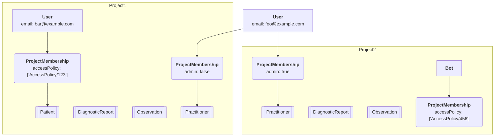
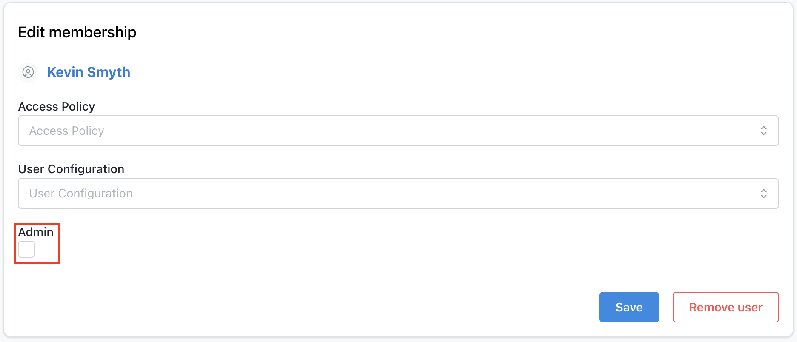

import ExampleCode from '!!raw-loader!@site/..//examples/src/auth/user-management-guide.ts';
import MedplumCodeBlock from '@site/src/components/MedplumCodeBlock';
import Tabs from '@theme/Tabs';
import TabItem from '@theme/TabItem';

# User Management Guide

This guide walks through how to **create and manage users** via the Medplum App and via API. Medplum supports multiple authentication options, but always maintains a representation of the user identities, and gives developers control over which authentication method to use for an identity, as well as what access controls are applied.

## Background: User Model

Medplum has several resources that represent user identities. The following resources are fundamental to building a correctly functioning application. This table describes how identities are represented in the system, and provides links to the administrative settings in the [Medplum App](https://app.medplum.com).

| Resource                                                        | Description                                                                                                                                                                                                                       | Medplum App                                                                                                              |
| --------------------------------------------------------------- | --------------------------------------------------------------------------------------------------------------------------------------------------------------------------------------------------------------------------------- | ------------------------------------------------------------------------------------------------------------------------ |
| [`User`](/docs/api/fhir/medplum/user)                           | A resource that represents a user identity. Users exist above the Project level and can only be self-updated.                                                                                                                     | None                                                                                                                     |
| [`Project`](/docs/api/fhir/medplum/project)                     | A [Project](/docs/tutorials/register#medplum-projects) is an isolated set of resources. See the [Projects guide](/docs/access/projects)                                                                                           | [Project Admin](https://app.medplum.com/admin/project)                                                                   |
| [`ProjectMembership`](/docs/api/fhir/medplum/projectmembership) | A ProjectMembership represents granting a user access to the resources within a Project. Inviting a user to a project, and specifying their `profile` and `accessPolicy` you can determine what set of resources they can access. | [Invite (Admins only)](https://app.medplum.com/admin/invite), [Users (Admins only)](https://app.medplum.com/admin/users) |

### Users

The [User](/docs/api/fhir/medplum/user) resource is the main resource that represents digital identity during authentication.

[Users](/docs/api/fhir/medplum/user) can have two different scopes:

- Server scoped users
- Project scoped users

#### Server Scoped Users

Server scoped [`Users`](/docs/api/fhir/medplum/user) are typically used for `Practitioners`. Practitioners can be members of multiple projects (e.g. "staging" and "prod"), and having their `Users` at the server level allows them to easily sign into multiple projects.

#### Project Scoped Users

Project scoped [`Users`](/docs/api/fhir/medplum/user) only exist inside a project level, and cannot sign into server-level tools such as the [Medplum App](/docs/app). The most common use case is for [`Patient`](/docs/api/fhir/resources/patient) users. These users will have to be invited and enrolled separately to each[ `Project` ](/docs/api/fhir/medplum/project) they are a part of, and there will be no link between their identities across projects.

This is desirable in multi-tenant use cases, where patients enrolled with one tenant should not be aware of other tenants.

By default, the server scopes all users [`Users`](/docs/api/fhir/medplum/user) enrolled as with a [`Patient`](/docs/api/fhir/resources/patient) profile ([see below](#profiles)) as project-scoped users.

### Profiles

_Within_ each project, a project member is represented by a specific FHIR resource, known as their **profile**. The `ProjectMembership.profile` element links the [` ProjectMembership`](/docs/api/fhir/medplum/projectmembership) to the profile resource.

A user's profile can be one of the three resource types in the table below. Incorporating the resources in the table below into ProjectMembership enable sophisticated access controls, as [Access Policies](/docs/access/access-policies) can access the profile of the current user ([read more](/docs/access/access-policies#patient-access))

| Resource                                                  | Description                                                                                                                             | Medplum App                                            |
| --------------------------------------------------------- | --------------------------------------------------------------------------------------------------------------------------------------- | ------------------------------------------------------ |
| [`Patient`](/docs/api/fhir/resources/patient)             | Patient is a fundamental FHIR resource and linking it to an identity allows the simple use case of granting access to personal records. | [Patients](https://app.medplum.com/Patient)            |
| [`Practitioner`](/docs/api/fhir/resources/practitioner)   | Practitioners are staff members of a healthcare organization and generally have access to multiple patients' data.                      | [Practitioner](https://app.medplum.com/Practitioner)   |
| [`RelatedPerson`](/docs/api/fhir/resources/relatedperson) | RelatedPerson is a family member or caregiver of a patient, who may be granted access to a small number of patient records              | [RelatedPerson](https://app.medplum.com/RelatedPerson) |

There are several `ProjectMembership.profile` resources that are related to programmatic access, which serve as modifiers to the ProjectMembership resource (i.e. `ProjectMembership.profile`) and do not represent people, but rather applications that access data. This table describes the programmatic access profiles with links on where to set them up in the Medplum App.

| Resource          | Description                                            | Medplum App                                                  |
| ----------------- | ------------------------------------------------------ | ------------------------------------------------------------ |
| ClientApplication | API Keys that allow programmatic access to resources   | [Client Applications](https://app.medplum.com/admin/clients) |
| Bot               | Event driven [custom functions](/docs/bots/bot-basics) | [Bots](https://app.medplum.com/Bot)                          |

## Creating a new Project

### UI

The simplest way to create a project is to visit https://app.medplum.com/register and fill out the new project registration form.

:::caution Note

If you are self-hosting, replace `app.medplum.com` with `app.your-base-url.com`

:::

### API

To create a new `Project` resource via the API, you will need to create a `ClientApplication` with super admin privileges.

:::warning

Super admin features can cause unrepairable damage. We highly recommend adding an [Access Policy](/docs/access/access-policies) to this `ClientApplication` to reduce it's privileges.

:::

With is `ClientApplication`, you can create a `Project` resource and invite the a new user as a project admin.

#### Create a New Project

<Tabs groupId="language">
  <TabItem value="ts" label="Typescript">
    <MedplumCodeBlock language="ts" selectBlocks="createProjectTs">
      {ExampleCode}
    </MedplumCodeBlock>
  </TabItem>
  <TabItem value="cli" label="CLI">
    <MedplumCodeBlock language="bash" selectBlocks="createProjectCli">
      {ExampleCode}
    </MedplumCodeBlock>
  </TabItem>
  <TabItem value="curl" label="cURL">
    <MedplumCodeBlock language="bash" selectBlocks="createProjectCurl">
      {ExampleCode}
    </MedplumCodeBlock>
  </TabItem>
</Tabs>

#### Invite a New User as an Admin

<Tabs groupId="language">
  <TabItem value="ts" label="Typescript">
    <MedplumCodeBlock language="ts" selectBlocks="inviteNewAdminTs">
      {ExampleCode}
    </MedplumCodeBlock>
  </TabItem>
  <TabItem value="cli" label="CLI">
    <MedplumCodeBlock language="bash" selectBlocks="inviteNewAdminCli">
      {ExampleCode}
    </MedplumCodeBlock>
  </TabItem>
  <TabItem value="curl" label="cURL">
    <MedplumCodeBlock language="bash" selectBlocks="inviteNewAdminCurl">
      {ExampleCode}
    </MedplumCodeBlock>
  </TabItem>
</Tabs>

## User Administration via Medplum App

Users in Medplum can be members of multiple projects, so cannot be edited directly. You'll need to invite a user to a project in order to grant access. If the user does not exist, it will be created when invited.

### Creating Memberships

Only administrators can invite users, and can do so on the [Invite](https://app.medplum.com/admin/invite) page. You can specify a role and [AccessPolicy](/docs/access/access-policies) at time of invite. The invite flow will do the following:

1. Create a `User` if one does not already exist
2. Create a FHIR resource (Patient, Practitioner or RelatedPerson)
3. Create a ProjectMembership that links User, ProfileResource and access policy
4. (Optional) send an email invite user

:::danger Note

Do not delete [`Patient`](/docs/api/fhir/resources/patient), [`Practitioner`](/docs/api/fhir/resources/practitioner) or [`RelatedPerson`](/docs/api/fhir/resources/relatedperson) resources that belong to [`ProjectMemberships`](/docs/api/fhir/medplum/projectmembership). This will cause the login to be non-functional. Do not edit or change the [`ProjectMembership`](/docs/api/fhir/medplum/projectmembership) resources directly. If you do delete one of these resources, you will need to register a new project.

:::

### Removing Memberships

To remove users from the existing project navigate to your [Project settings](https://app.medplum.com/admin/project) and to the Users and Patient tabs respectively. Click on a specific users or patients and click **Remove User**.

We highly recommend leaving the associated FHIR resource (Patient, Practitioner, etc.) in place for audibility, record keeping and in case the membership needs to be reconstructed for some reason.

### Searching for Project Members

You can search for all project members by performing a search for all `ProjectMembership` resources

#### Example: Search for all project members

<Tabs groupId="language">
  <TabItem value="ts" label="Typescript">
    <MedplumCodeBlock language="ts" selectBlocks="searchProjectMembershipTs">
      {ExampleCode}
    </MedplumCodeBlock>
  </TabItem>
  <TabItem value="cli" label="CLI">
    <MedplumCodeBlock language="bash" selectBlocks="searchProjectMembershipCli">
      {ExampleCode}
    </MedplumCodeBlock>
  </TabItem>
  <TabItem value="curl" label="cURL">
    <MedplumCodeBlock language="bash" selectBlocks="searchProjectMembershipCurl">
      {ExampleCode}
    </MedplumCodeBlock>
  </TabItem>
</Tabs>

You can also use the `profile-type` search parameter to narrow your search

#### Example: Search for all human members

<Tabs groupId="language">
  <TabItem value="ts" label="Typescript">
    <MedplumCodeBlock language="ts" selectBlocks="searchExcludingClientBotTs">
      {ExampleCode}
    </MedplumCodeBlock>
  </TabItem>
  <TabItem value="cli" label="CLI">
    <MedplumCodeBlock language="bash" selectBlocks="searchExcludingClientBotCli">
      {ExampleCode}
    </MedplumCodeBlock>
  </TabItem>
  <TabItem value="curl" label="cURL">
    <MedplumCodeBlock language="bash" selectBlocks="searchExcludingClientBotCurl">
      {ExampleCode}
    </MedplumCodeBlock>
  </TabItem>
</Tabs>

#### Example: Search for all project `Patients`

<Tabs groupId="language">
  <TabItem value="ts" label="Typescript">
    <MedplumCodeBlock language="ts" selectBlocks="searchProfileTypePatientTs">
      {ExampleCode}
    </MedplumCodeBlock>
  </TabItem>
  <TabItem value="cli" label="CLI">
    <MedplumCodeBlock language="bash" selectBlocks="searchProfileTypePatientCli">
      {ExampleCode}
    </MedplumCodeBlock>
  </TabItem>
  <TabItem value="curl" label="cURL">
    <MedplumCodeBlock language="bash" selectBlocks="searchProfileTypePatientCurl">
      {ExampleCode}
    </MedplumCodeBlock>
  </TabItem>
</Tabs>

#### Example: Search for all project `Practitioners`

<Tabs groupId="language">
  <TabItem value="ts" label="Typescript">
    <MedplumCodeBlock language="ts" selectBlocks="searchProfileTypePractitionerTs">
      {ExampleCode}
    </MedplumCodeBlock>
  </TabItem>
  <TabItem value="cli" label="CLI">
    <MedplumCodeBlock language="bash" selectBlocks="searchProfileTypePractitionerCli">
      {ExampleCode}
    </MedplumCodeBlock>
  </TabItem>
  <TabItem value="curl" label="cURL">
    <MedplumCodeBlock language="bash" selectBlocks="searchProfileTypePractitionerCurl">
      {ExampleCode}
    </MedplumCodeBlock>
  </TabItem>
</Tabs>

Refer to our [search documentation](/docs/search/basic-search) for more details on FHIR search

### Promote Existing User to Admin

If you are already an admin, you can promote other existing users to an admin as well. To do so navigate to the [Project Admin panel](https://app.medplum.com/admin/project) and go to the Users tab. From here, select the `User` you want to make an admin.

Check the box under the `Admin` label, and then save the user. This user will now be an admin on your project.

To _invite_ a user as an admin in the app, please see the [Invite a User docs](https://www.medplum.com/docs/app/invite).

Promoting a user to admin can also be done programmatically. To do so, you will need to update the user's `ProjectMembership`.

<Tabs groupId="language">
  <TabItem value="ts" label="Typescript">
    <MedplumCodeBlock language="ts" selectBlocks="makeAdminTs">
      {ExampleCode}
    </MedplumCodeBlock>
  </TabItem>
  <TabItem value="cli" label="CLI">
    <MedplumCodeBlock language="bash" selectBlocks="makeAdminCli">
      {ExampleCode}
    </MedplumCodeBlock>
  </TabItem>
  <TabItem value="curl" label="cURL">
    <MedplumCodeBlock language="bash" selectBlocks="makeAdminCurl">
      {ExampleCode}
    </MedplumCodeBlock>
  </TabItem>
</Tabs>

It is important to spread the original `ProjectMembership` to ensure that you are only updating the `admin` field.

## Invite via API

Inviting users can be done programmatically using the [`/invite` endpoint](/docs/api/project-admin/invite). Like inviting via the [Medplum App](https://app.medplum.com), this can only be done by [project admins](/docs/access/admin#project-admin).

Prepare JSON payload:

<MedplumCodeBlock language="ts" selectBlocks="prepareJson">
  {ExampleCode}
</MedplumCodeBlock>

Then POST to the [`/invite` endpoint](/docs/api/project-admin/invite):

<Tabs groupId="language">
  <TabItem value="ts" label="Typescript">
    <MedplumCodeBlock language="ts" selectBlocks="inviteUserTs">
      {ExampleCode}
    </MedplumCodeBlock>
  </TabItem>
  <TabItem value="cli" label="CLI">
    <MedplumCodeBlock language="bash" selectBlocks="inviteUserCli">
      {ExampleCode}
    </MedplumCodeBlock>
  </TabItem>
  <TabItem value="curl" label="cURL">
    <MedplumCodeBlock language="bash" selectBlocks="inviteUserCurl">
      {ExampleCode}
    </MedplumCodeBlock>
  </TabItem>
</Tabs>

The [`/invite` endpoint](/docs/api/project-admin/invite) creates a [`ProjectMembership`](/docs/api/fhir/medplum/projectmembership). The `ProjectMembership` resource includes additional properties to customize the user experience. The [`/invite` endpoint](/docs/api/project-admin/invite) accepts a partial `ProjectMembership` in the `membership` property where you can provide membership details.

For example, use `admin: true` to make the new user a project administrator:

<MedplumCodeBlock language="ts" selectBlocks="prepareJsonAdmin">
  {ExampleCode}
</MedplumCodeBlock>

Or use the `access` property to specify a user's `AccessPolicy` with optional parameters.

<MedplumCodeBlock language="ts" selectBlocks="prepareJsonAccessPolicy">
  {ExampleCode}
</MedplumCodeBlock>

For more information, see the [`/invite` endpoint API docs](/docs/api/project-admin/invite)

See [Access Control](/docs/access/access-policies) for more details.

:::caution

Creating Practitioners via API is an advanced scenario and should be done with extreme caution. If you are planning to do programmatic creation of Practitioners, we highly recommend trying it in a test environment first and ensuring that the logins and associated access controls behave as expected.

:::
