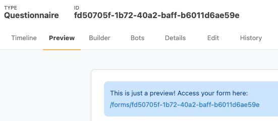

# Bot for QuestionnaireResponse

Bots are an advanced Medplum feature that enable complex workflows.

One of the most powerful uses is to combine Bots with [Questionnaires](/docs/api/fhir/resources/questionnaire)

A FHIR [Questionnaire](/docs/api/fhir/resources/questionnaire) is a customizable form. You can add custom questions, question types, multiple choice options, etc. You can think of a FHIR Questionnaire as a healthcare-specific Google Forms or Survey Monkey.

Connecting a Bot to a Questionnaire enables custom workflows that you control top to bottom.

## Example uses

Consider some of these Bot and Questionnaire use cases:

- Patient registration - Create a Patient plus initial [Appointment](/docs/api/fhir/resources/appointment) or [ServiceRequest](/docs/api/fhir/resources/servicerequest)
- Observation entry - From one form, create many [Observation](/docs/api/fhir/resources/observation) and [DiagnosticReport](/docs/api/fhir/resources/diagnosticreport) resources
- Quick ordering - Create shortcut forms for common orders or workflows

These capabilities would normally require writing custom code, HTTP servers, webhooks, and managing credentials for a separate service.

By using Bots, the entire logic is self contained and managed in one place. Like all FHIR resources in Medplum, the Bot resource is versioned with full history tracking, so you can see exactly what changed over time.

## Patient registration example

Let's create a simple example Patient Registration form to see how this works. We'll write a simple questionnaire to collect information from a patient, and then write a Bot that creates the corresponding [Patient](/docs/api/fhir/resources/patient) and [ServiceRequest](/docs/api/fhir/resources/servicerequest) resources.

### 1. Create the Questionnaire

import questionnaireSidebarURL from './questionnaire-sidebar.png'

Our first step will be to create the questionnaire in the Medplum App

1. Log into the [Medplum App](https://app.medplum.com)
2. <span>Click "Questionnaire" on the left sidebar or navigate to <a href="https://app.medplum.com/Questionnaire">app.medplum.com/Questionnaire</a> </span>
3. Click "new"
4. This brings you to the default Resource editor. However, we are going to use an alternate method to author the Questionnaire. For now:
   1. Enter a "Title" for your new Questionnaire
   2. Scroll to the bottom of the page and click "OK"
5. Once you click "OK", navigate to the "Builder" Tab to actually create the Questionnaire

### 2. Edit the Questionnaire

On the "Builder tab", you can add items to the Questionnaire with a Google Forms-like interface.


Click the "Add Item" link at the bottom of the page to add each question. For each question, you will have to set the following properties:

- **Type**: Select the question type from the dropdown
- **Text:** The displayed text for the question
- **Link Id**: The machine-readable identifier for the question. While Medplum supplies a default `linkId`, **_we highly recommend that users supply their own ids_** that are semantically relevant in their particular context.

For this sample patient registration form, we will create five questions:

- First Name (type: `string`, linkId: `firstName`)
- Last Name (type: `string`, linkId: `lastName`)
- Email (type: `string`, linkId: `email`)
- Phone (type: `string`, linkId: `phone`)
- Reason for Visiting (type: `choice`, linkId: `reasonForVisit`)


### 3. Submit the Form

When you’re done, click on the “Preview” tab to see how your questionnaire will look.

At the top, you will see this notice:



To actually fill out the form, you will need to click on this link to be taken to the "form" page for your Questionnaire. You can also share this link with other users.

Click on your form, fill it out, and click “Submit”.

Now we’ll inspect the data. Click on the “Review your Answers” link.

import reviewAnswersUrl from './review-answers.png';


Let’s take a look at the resource that is created:

- The resulting resource is of type [QuestionnaireResponse](/docs/api/fhir/resources/questionnaireresponse)
- The main property of interest is called `item`, all the form questions as well as their answers.
- Each item has a `linkId` that you set in the builder, as well an answer array. Most of the time this array will contain 0 or 1 elements, but it could contain multiple elements in the case of multi-choice fields
- The `questionnaire` property contains a reference to the original questionnaire that generated this response

### 4. Write the Bot

Next, we'll write a Bot that creates a [Patient](/docs/api/fhir/resources/patient) and [ServiceRequest](/docs/api/fhir/resources/servicerequest) based on the the user's response. To learn how to set up a new Bot, see the [Bot Basics tutorial](./bot-basics)

To parse out the answers in the '[QuestionnaireResponse](/docs/api/fhir/resources/questionnaireresponse), we'll use the [`getQuestionnaireAnswers`](/docs/sdk/core.getquestionnaireanswers) utility function. This function returns a map from the question's `linkId` to the response.

```ts
// Use the getQuestionnaireAnswers utility function to convert the response into
// a map of [linkId, answer] pairs.
const response = event.input as QuestionnaireResponse;
const answers = getQuestionnaireAnswers(response);

// Read out the the user's answers into separate variables
// Here we provide default answers if the user's answer is 'undefined'
const firstName = answers['firstName']?.valueString || '';
const lastName = answers['lastName']?.valueString || '';
const email = answers['email']?.valueString || 'No Email Given';
const phone = answers['phone']?.valueString || 'No Phone Number Given';
const reasonForVisiting = answers['reasonForVisit']?.valueString || 'No Reason Given';
```

We can combine this with the [`medplum.createResource`](/docs/sdk/core.medplumclient.createresource) method to create the [Patient](/docs/api/fhir/resources/patient) and [ServiceRequest](/docs/api/fhir/resources/servicerequest) . The final Bot then looks like this:

```ts
import { BotEvent, MedplumClient, getQuestionnaireAnswers, createReference } from '@medplum/core';
import { QuestionnaireResponse, Patient, ServiceRequest } from '@medplum/fhirtypes';

export async function handler(medplum: MedplumClient, event: BotEvent): Promise<any> {
  const response = event.input as QuestionnaireResponse;

  // Use the getQuestionnaireAnswers utility function to convert the response into
  // a map of [linkId, answer] pairs.
  const answers = getQuestionnaireAnswers(response);

  // Read out the the user's answers into separate variables
  // Here we provide default answers if the user's answer is 'undefined'
  const firstName = answers['firstName']?.valueString || '';
  const lastName = answers['lastName']?.valueString || '';
  const email = answers['email']?.valueString || 'No Email Given';
  const phone = answers['phone']?.valueString || 'No Phone Number Given';
  const reasonForVisiting = answers['reasonForVisit']?.valueString || 'No Reason Given';

  // Create the patient
  const patient = await medplum.createResource<Patient>({
    resourceType: 'Patient',
    name: [
      {
        given: [firstName],
        family: lastName,
      },
    ],
    telecom: [
      {
        system: 'email',
        value: email,
      },
      {
        system: 'phone',
        value: phone,
      },
    ],
  });
  console.log('Created Patient ', patient.id);

  // Create the Service Request
  const serviceRequest = await medplum.createResource<ServiceRequest>({
    resourceType: 'ServiceRequest',
    status: 'active',
    intent: 'order',
    subject: createReference(patient),
    reasonCode: [
      {
        text: reasonForVisiting,
      },
    ],
  });

  console.log('Created ServiceRequest ', serviceRequest.id);
}
```

### 5. Create the Subscription

The last step is to have your Bot listen to your Questionnaire responses.

1. Go to you the your Questionnaire's page in the [Medplum App](https://app.medplum.com/Questionnaire)
2. Click on the the "Bots" tab
3. Start typing the name of your Bot.
4. When your Bot appears in the type ahead, select it and click "Connect"

import connectBotUrl from './connect-bot.png';


:::caution Ordering of Subscription Events

Because of the variable timing and routes of http traffic, the Medplum server cannot guarantee the order in which [`Subscription`](/docs/api/fhir/resources/subscription) webhooks are received by the client.

:::

### 6. Watch it work

Now if you [submit the form](#3-submit-the-form) again, you'll notice that a new [Patient](/docs/api/fhir/resources/patient) and [ServiceRequest](/docs/api/fhir/resources/servicerequest) have been created.


## Conclusion

The Bots + Questionnaire patten is a powerful way to use Medplum to automate your medical workflows. While this was a very simple example, you can check out the [Medplum Demo Bots repo](https://github.com/medplum/medplum-demo-bots/) for more examples on how to use Bots.
