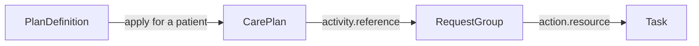

# Automating Care Workflows

Once a coordinator completes intake, the review Task should appear without someone remembering to create it. That's a good candidate for automation. The less obvious part is making sure the same event doesn't create three review Tasks when it is retried.

Start by defining the owners, completion evidence, and exception paths. Medplum Bots and Subscriptions execute your rules; FHIR resources retain the state those rules act on.

## Choose What Starts the Work {/* #choose-how-work-starts */}

| Trigger | Implementation | Identity for generated work |
| --- | --- | --- |
| Staff action | Application creates a Task | Stable action/submission identifier |
| Resource transition | Scoped Subscription invokes a Bot | Source resource plus step and relevant occurrence |
| Admission or discharge event | HL7 integration maps the event to FHIR; a Bot creates the follow-up work | Source encounter plus the intended follow-up occurrence |
| Recurring follow-up | Scheduled Bot evaluates due occurrences | Source plan/case plus step and occurrence date or sequence |
| Reusable clinical protocol | Apply PlanDefinition and ActivityDefinition | Track each intended application and inspect its generated resources |

For example, an [HL7 ADT discharge message](/docs/integration/hl7-interfacing/adt) can lead to a follow-up Task after the integration resolves the patient and encounter. Define which discharge event starts the work and how corrections or cancellations affect it. Preserve source message identifiers for ingestion and a stable encounter/step key for the follow-up.

Use local work-type and stage CodeSystems consistently. An identifier is an identity key, not the current stage; it must remain stable across retries.

## Turn a Protocol into Patient Work {/* #apply-a-protocol */}

[Clinical Protocols](/docs/careplans/protocols) describes authoring PlanDefinition and ActivityDefinition. Medplum's [`PlanDefinition/$apply`](/docs/api/fhir/operations/plandefinition-apply) creates a patient CarePlan whose activity references a RequestGroup. RequestGroup actions reference generated Tasks; supported ActivityDefinitions can also produce a ServiceRequest.

The generated RequestGroup sits between the plan and its Tasks. Follow those references when building the patient's work list.

Inspect generated Tasks' focus, inputs, owners, status, and patient context. Configure supported task-element extensions where appropriate. Applying a definition is not a guarantee that arbitrary FHIR conditions, repetition rules, or temporal dependencies will execute. Verify the supported subset against the deployed Medplum version and implement the remaining orchestration explicitly.

:::caution[A timeout does not mean nothing was created]

Do not blindly retry `$apply` after a timeout: it can create another set of resources. Reconcile the previous application's outcome before retrying. Applications that need a fully idempotent launch should design the launch identity and resource creation workflow explicitly; this is separate from reusable protocol authoring.

:::

## React to the Change That Matters {/* #scope-subscriptions-to-meaningful-events */}

Subscribe to the resource type and work type you intend to handle. For preparation becoming completed, use the Medplum interaction and FHIRPath criteria extensions to restrict execution to updates where status changes to the required state. Handle creation separately if it should trigger work; `%previous` is absent then.

The [Subscription Extensions guide](/docs/subscriptions/subscription-extensions) defines these Medplum-specific features. Re-check the current source resource in the Bot before acting: another update may have cancelled or replaced the work since the event occurred.

## Make the Second Run Safe {/* #make-processing-repeatable */}

If the same event arrives twice, both runs should lead to the same work item. Use conditional create keyed by `identifier`, such as `createResourceIfNoneExist`, for generated work. Do not search and then create: concurrent runs can both observe no match. Use version checking when advancing an existing Task so a stale event cannot overwrite a later decision.

When linked writes must succeed together, use a transaction Bundle with conditional creates and version-checked updates. A transaction covers FHIR writes; it cannot roll back an external fax, email, or payer submission.

:::tip[Track the send as well as the Task]

For external side effects, persist the intended operation and correlation identifier, use the provider's idempotency mechanism when available, and reconcile uncertain outcomes before resending. Reusing a Task does not prevent duplicate delivery by itself.

:::

## Create the Next Follow-Up When It Is Due {/* #schedule-recurring-and-overdue-work */}

Use a [scheduled Bot](/docs/bots/bot-cron-job) to evaluate eligible plans or cases and create each due occurrence once. Define the calendar, time zone, missed-run catch-up policy, and stop conditions. Re-check eligibility before creation so a closed case does not keep generating work.

For overdue work, update or escalate the existing item rather than creating a new copy of the obligation. See [Handoffs and Escalation](/docs/careplans/handoffs-and-escalation) for deadline semantics and paused clocks.

## Let the Assignee Know {/* #let-the-assignee-know */}

Use [WebSocket subscriptions](/docs/react/use-subscription) to refresh an open work queue when Tasks are assigned, changed, or escalated. On reconnect, query the current queue so the UI catches changes that happened while it was offline.

When staff need an alert outside the application, use a scoped Subscription and Bot to invoke the configured notification integration. Define the recipient, channel, and a stable notification key for the assignment or escalation event. Keep sensitive details in the authenticated application, and let staff reach the Task from the notification. The Task remains the work record even if delivery fails; monitor and retry notification delivery separately.

## Give Failed Runs a Recovery Path {/* #operate-and-recover */}

Monitor Bot failures and maintain a recovery queue with source identifiers and the failed step. Bot-channel Subscriptions do not use the external rest-hook retry policy; implement the recovery behavior you require. See [Bots in Production](/docs/bots/bots-in-production).

Test duplicate events, out-of-order events, competing claims, a cancelled source, and partial external failure. Run Bots under access policies appropriate to their work, and preserve the distinction between the software actor and clinical requester.

When a protocol changes, decide whether existing patients retain their original plan or receive an explicit reviewed migration. Record the definition/version used where the chosen canonical model supports it. A new definition version should not silently reinterpret completed work.
