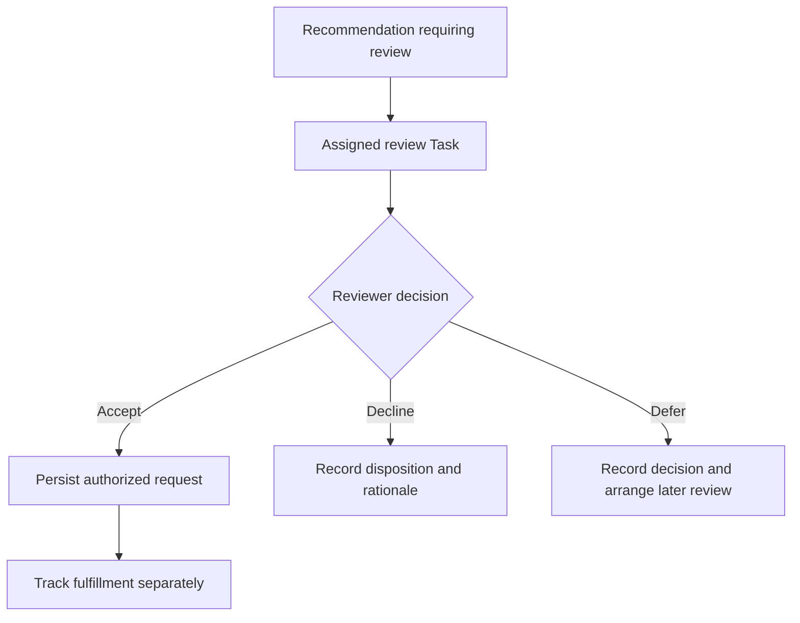

# Clinical Decision Support and Follow-Through

A recommendation is useful only if it reaches someone who can act on it. Sometimes a link in the chart is enough. Sometimes the recommendation needs an owner and follow-up that will still be there when the chart is closed.

Clinical decision support (CDS) can provide reference material, rule-based recommendations, or predictive results. This guide covers how to bring that guidance into a care workflow and track the work it creates.

## Meet the Clinician Where the Decision Happens {/* #choose-the-interaction */}

| Need | Approach |
| --- | --- |
| Contextual reference material | Link from the relevant chart context; record follow-up only when the workflow requires it |
| Guidance during chart review or ordering | Use a supported CDS Hooks interaction, embedded application, or the service's documented API |
| Background identification of work | A Bot evaluates scoped patient data and creates an appropriately assigned review Task |
| Follow-through after review | Persist the authorized request and separately track its fulfillment |

Use [CDS Hooks](/docs/integration/cds-hooks) for the discovery, request, prefetch, and card contract. Use [SMART App Launch](/docs/integration/smart-app-launch) when launching an external application. These integration choices do not determine the clinical approval policy.

## Show the Guidance and Its Evidence {/* #present-guidance-in-context */}

For a Medplum-hosted CDS Hooks service, configure the Bot's `cdsService` hook and prefetch requirements. The client invokes the service at the intended workflow point and displays returned cards. It must implement the user interaction for suggestions and proposed actions.

:::caution[Displaying a suggestion does not authorize an order]

A returned card is not automatically a persisted clinical request or Task. Check proposed resources against FHIR R4, the receiving application, and the user's authority before committing a clinical action. Preserve the clinician's decision separately from the service's evaluation result.

:::

Display the guidance source and relevant evidence. Handle unavailable services and incomplete context explicitly. A failure can create a manual review obligation when the clinical workflow requires one; it should not silently appear as a successful evaluation with no recommendations.

## Turn Recommendations into Review Tasks {/* #track-actionable-review */}

For recommendations that need follow-through, give the reviewer a work item that survives closing the chart:

Use a review Task when a recommendation requires acknowledgment, ownership, or follow-up across sessions. Populate `for`, an accountable `owner` or required `performerType`, and the relevant evidence in `focus` or `input`. Use a stable identifier derived from the rule and triggering event or review period so repeated evaluations do not create duplicate open work.

Record the decision in a governed local `businessStatus`, with an authored, timestamped rationale in `note` and any resulting clinical request in `output`. A completed review Task means review is finished. The recommendation may have been accepted, declined, or deferred according to the workflow; its clinical service is not thereby complete.

If accepted guidance leads to a referral, use a ServiceRequest and fulfillment Tasks as described in [Referrals](/docs/careplans/referrals). If it changes a treatment plan, update the CarePlan through the clinical review path. Preserve patient references on every resulting resource.

## Keep Evaluation Records When You Need Them {/* #decide-whether-to-retain-every-evaluation */}

Suppose a rule runs ten times during a week, but only one result needs review. One review Task may cover the work. Retaining all ten evaluations is a separate requirement. Some applications also need the inputs, rule/model version, evaluation result, and disposition for informational results that never create a Task.

FHIR R4 `GuidanceResponse` is a candidate for the evaluation result: it can identify the evaluated module, patient, occurrence time, output Parameters, and a resulting CarePlan or RequestGroup. Its `status` describes evaluation success or failure, not clinician acceptance. A CDS Hooks card does not automatically map to GuidanceResponse, and Medplum's CDS Hooks endpoint does not establish that persistence model for you.

:::note[GuidanceResponse is an additional modeling choice]

Choose this additional model only after defining retention and retrieval requirements and the mapping for the particular service. If it is adopted, a review Task can reference that evaluation in `focus` or `input`. Keep this choice explicit rather than creating a Task for every informational card.

:::

## Check Whether Guidance Leads to Follow-Through {/* #operate-and-evaluate-the-workflow */}

Track who maintains the rules, how versions are introduced, when repeat review is warranted, and how to recover missed work. Measure actionable reviews, accepted and declined recommendations, follow-up completion, and alert burden with clear denominators. Clinical outcomes need separate evidence.

Apply [Access Policies](/docs/access/access-policies) to the service context and stored outputs.

## Understand the Certification Context {/* #certification-context */}

Medplum's [ONC certification documentation](/docs/compliance/onc#criteria-certified) lists the certified product and criteria, including (b)(11) Decision Support Interventions. Use that page and its linked product listing for certification scope. Building a CDS workflow on Medplum still requires evaluating the particular application, intervention, and use case.

Under HTI-1, the (b)(11) criterion replaced the legacy (a)(9) CDS criterion. The [ONC Decision Support Interventions guidance](https://healthit.gov/test-method/decision-support-interventions/) describes evidence-based and predictive interventions, source information, feedback, and applicable risk-management requirements. Treat the [Insights Condition](https://healthit.gov/certification-health-it/insights-condition/) as a separate reporting topic with its own applicability and measures; operational Task counts alone do not establish that reporting model.

For context-aware reference links, [HL7 Infobutton](https://www.hl7.org/implement/standards/product_brief.cfm?product_id=208) is another integration option. Choose the interaction that fits the clinician's workflow, then confirm the requirements for the product being delivered.

See [Automating Care Workflows](/docs/careplans/automating-workflows) for event handling and [Operational Reporting](/docs/careplans/operational-reporting) for transitions and measures.
