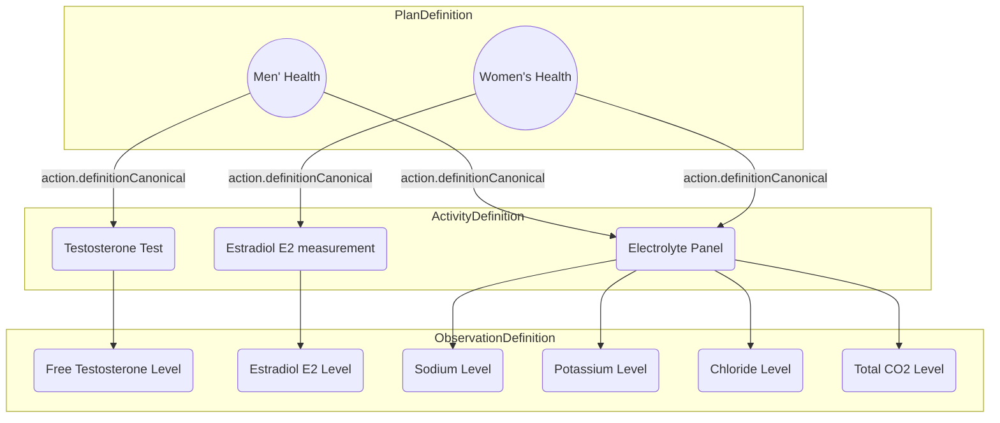

import MedplumCodeBlock from '@site/src/components/MedplumCodeBlock';
import Tabs from '@theme/Tabs';
import TabItem from '@theme/TabItem';

import ExampleCode from '!!raw-loader!@site/..//examples/src/careplans/diagnostic-catalog.ts';

# Defining your Diagnostic Catalog

Administering your diagnostic services begins with the crucial task of outlining your service catalog. This encompasses defining your diagnostics tests , panels, specimen collection requirements, and reference ranges for clinical results.

Having a well-defined, structured catalog enables:

- Robust access controls
- Higher quality analytics
- Smoother CLI/CAP certification
- Streamlined billing

This guide will cover the basic framework to defining a building catalog in FHIR. The steps are:

1. Define your clinical observations
2. Define your specimens
3. Define your orderable services
4. Define your laboratory procedures

Our recommendations are informed by the follow the [Order Catalog Implementation Guide](http://hl7.org/fhir/uv/order-catalog/2020Sep/) implementation guide, which has been informed by contributors from Labcorp and Quest Diagnostics.

## Define your clinical observations

The first step in building your catalog is to define the clinical results you measure for the patient.

The `Observation` is the primary _operational_ resource used to record a clinical measurements for a specific patient. `ObservationDefinition` is the corresponding _administrative_ counterpart, and is used to define how an `Observation` should be measured, interpreted, a reported.

`Observations` and `ObservationDefinitions ` are linked by sharing a common `code` element, which should include a [LOINC code](./loinc) in most cases.

The table below highlights the most important fields for creating good `ObservationDefinitions`:

| Element                                | Description                                                                                                                                                                    | Code System                               | Example                                                                       |
| -------------------------------------- | ------------------------------------------------------------------------------------------------------------------------------------------------------------------------------ | ----------------------------------------- | ----------------------------------------------------------------------------- |
| `code`                                 | Code representing the observation type.                                                                                                                                        | LOINC (see [LOINC codes](./loinc))        | [2951-2](https://loinc.org/2951-2) - Sodium [Moles/volume] in Serum or Plasma |
| `quantitativeDetails.unit`             | Units expressing the observation value.                                                                                                                                        | [UCUM](https://hl7.org/fhir/R4/ucum.html) | mmol/L                                                                        |
| `quantitativeDetails.decimalPrecision` | Number of places of precision _to the right of the decimal point_                                                                                                              |                                           | 2 (e.g. `0.11`)                                                               |
| `qualifiedInterval`                    | 
Range of valid or reference values for the observation, to be used during interpretation. 

See our [guide on reference ranges](./reference-ranges) for more info.
 |                                           | TODO                                                                          |
| `preferredReportName`                  | Preferred name used for reporting the observation results to the patient.                                                                                                      |                                           | Sodium Level                                                                  |

Key amongst these is the `qualifiedInterval` element, which is used to define _how results should be interpreted._ See our [guide on reference ranges](./reference-ranges) for more information.

Example: Blood Sodium Level 

  <MedplumCodeBlock language="ts" selectBlocks="observationDefinitionSodium">
    {ExampleCode}
  </MedplumCodeBlock>

## Define your specimens

In the context of laboratory use cases, it's essential to recognize that observations are based on samples extracted from patients, known as "specimens". A well constructed diagnostic catalog links the specimen requirements for each test to the test definition, to provide lab operators a complete picture of the collection and diagnostic process.

The `Specimen` resource is the _operational_ resource that stores information about the material extracted from a patient. As with `Observations`, `Specimen` has a corresponding _administrative_ resource, called `SpecimenDefinition`.

`SpecimenDefinition` describes the type of specimen material to be collected, as well as details about the collection process, storage, handling, and preparation for testing.

The `SpecimenDefinition` allows you to specify a lot of details about your specimen, but the most relevant are:

| Field                  | Description                                         | Code System                                                                                                                                                       | Example                                                                                                                                                      |
| ---------------------- | --------------------------------------------------- | ----------------------------------------------------------------------------------------------------------------------------------------------------------------- | ------------------------------------------------------------------------------------------------------------------------------------------------------------ |
| `typeCollected`        | Type of material collected.                         | [SNOMED (children of 123038009 - Specimen)](https://browser.ihtsdotools.org/?perspective=full&conceptId1=123038009&edition=MAIN/2023-07-31&release=&languages=en) | [122554006](https://browser.ihtsdotools.org/?perspective=full&conceptId1=122554006&edition=MAIN/2023-07-31&release=&languages=en) - Capillary Blood Specimen |
| `collection`           | Procedure used for collection.                      | [SNOMED (children of 118292001 - Removal)](https://browser.ihtsdotools.org/?perspective=full&conceptId1=118292001&edition=MAIN/2023-07-31&release=&languages=en)  | [278450005](https://browser.ihtsdotools.org/?perspective=full&conceptId1=278450005&edition=MAIN/2023-07-31&release=&languages=en) - Finger-prick sampling    |
| `typeTested.container` | Details about the container storing the specimen.   | [Specimen Container Type](https://hl7.org/fhir/R4/valueset-specimen-container-type.html)                                                                          | [467989009](https://browser.ihtsdotools.org/?perspective=full&conceptId1=467989009) - Capillary blood collection tube, no-additive                           |
| `typeTested.handling`  | Duration of storage at different temperature ranges | [Handling Condition](https://hl7.org/fhir/R4/valueset-handling-condition.html)                                                                                    | Store refrigerated at 2-8°C for up to 48 hours                                                                                                               |

:::tip `typeCollected` vs `typeTested`

Difference between type tested and typeCollected - material that is collected from a patient may be split up, prepared, and handled different ways. The typeTested elements describe _all_ the _outputs_ of the collection process, and contains a lot more information about the containment vessel, rejection criteria, and temperature restrictions for _each_ output.

:::

Example: Capillary Blood Sample 

The following examples defines a fingerprick blood sample that is distributed into two collection tubes: a red cap and a green cap.
  <MedplumCodeBlock language="ts" selectBlocks="fingerprickSpecimen">
    {ExampleCode}
  </MedplumCodeBlock>

## Define your services

The next step is to roll up your individual tests into **orderable services** that your patients can order. These can be thought of as your diagnostic "product offerings."

These products are represented as `PlanDefinition` resources. The `PlanDefinition` is primarily a grouping resource that stores metadata about the service and references the `ActivityDefinitions` you will create in the next section.

Important fields:

| Field                        | Description                                                                                                        | Code System                                                                                                    | Example                                                                          |
| ---------------------------- | ------------------------------------------------------------------------------------------------------------------ | -------------------------------------------------------------------------------------------------------------- | -------------------------------------------------------------------------------- |
| `name`                       | The computer-friendly name of the service.                                                                         |                                                                                                                | mens-health-panel                                                                |
| `title`                      | The human-friendly name of the service.                                                                            |                                                                                                                | Men's Health Panel                                                               |
| `identifier`                 | Business identifier for the service (i.e. product or SKU code)                                                     |                                                                                                                | dx-panel-12345                                                                   |
| `type`                       | Whether the service is a single test or a panel                                                                    | [Laboratory service types](http://hl7.org/fhir/uv/order-catalog/2020Sep/ValueSet-laboratory-service-type.html) | panel                                                                            |
| `useContext`                 | How this `PlanDefinition` should be interpreted. For diagnostic procedures, this is a fixed value: Lab Order Entry |                                                                                                                | [Lab Order Entry](https://terminology.hl7.org/1.0.0//CodeSystem-v3-ActCode.html) |
| `action.code`                | The code for lab procedure corresponding                                                                           | [LOINC](./loinc)                                                                                               | Administer medication                                                            |
| `action.definitionCanonical` | The "canonical url" of the the `ActivityDefinition` representing the procedure (see [below](#activitydefinitions)) |                                                                                                                | http://example.org/ActivityDefinition/electrolyte-panel                          |

In the next section, we'll learn more about the `PlanDefinition.action` element, which defines the lab procedures used to _fulfill_ the diagnostic service order.

## Define your lab procedures

The last step is to carve up your services into lab procedures to aid the lab in fulfilling your orders. These procedures will be defined using the `ActivityDefinition` resource.

While `PlanDefintions` are patient facing resources, `ActivityDefinitions` are primarily used by lab operators to aid them in fulfilling the order. To link the two, each entry in `PlanDefinition.action` references an individual lab procedure, with `PlanDefinition.action.definitionCanonical` referencing an `ActivityDefintion` resource for details.

:::caution Note: Canonical References

`PlanDefinitions` and `ActivityDefinitions` are linked via what is known as a _canonical_ reference, not a standard reference as with most other resources. `PlanDefinition.action.definitionCanonical` is a URL string, that must match the `url` field of the `ActivityDefinition` it references.

:::

There is a bit of an art to determining divide the individual tests into procedures, and it requires an understanding of your lab operations. Some considerations to help guide you:

- Are there reusable groups of tests that are _always_ performed together?
- Do these groups have their own [LOINC](./loinc) codes?
- Do your analyzers have a single input to order this group of results?

### ActivityDefinitions

The `ActivityDefinition` resource stores detailed information about each procedure, and is the resource that links `PlanDefinition.action`, to the `ObservationDefintions` and `SpecimenDefinitions` we defined earlier.

The most important fields for `ActivityDefinition` are summarized below:

| Element                        | Description                                                                                                                                                                                                                                                                                                                                                                                                                                                                                  | Code System      | Example                                                             |
| ------------------------------ | -------------------------------------------------------------------------------------------------------------------------------------------------------------------------------------------------------------------------------------------------------------------------------------------------------------------------------------------------------------------------------------------------------------------------------------------------------------------------------------------- | ---------------- | ------------------------------------------------------------------- |
| `code`                         | The LOINC code corresponding to this procedure. Should match the code used in `PlanDefinition.action`                                                                                                                                                                                                                                                                                                                                                                                        | [LOINC](./loinc) | Glucose [Mass/volume] in Blood ([2339-0](https://loinc.org/2339-0)) |
| `url`                          | 
Known as the "canonical URL" for the resource. This should be a fully qualified, globally unique URL. 

FHIR recommends for many administrative resources (aka "definitional resources") to have canonical URLs to provide a globally unique business identifier. Read more about canonical URLs [here](https://hl7.org/fhir/resource.html#canonical)

A recommended pattern for constructing this URL is:  `http://[your-company-url]/ActivityDefinition/[test-name]`
 |                  | http://example.org/ActivityDefinition/electrolyte-panel             |
| `observationResultRequirement` | References to the `ObservationDefinition` resources for the test results produced by this procedure (see above).                                                                                                                                                                                                                                                                                                                                                                             | See above        |                                                                     |
| `specimenRequirement`          | References to the `SpecimenDefinition` resources for the test results produced by this procedure (see above).                                                                                                                                                                                                                                                                                                                                                                                | See above        |                                                                     |
| `name`                         | A computer-friendly name for the procedure                                                                                                                                                                                                                                                                                                                                                                                                                                                   |                  | glucose                                                             |
| `title`                        | A human-friendly name for the procedure                                                                                                                                                                                                                                                                                                                                                                                                                                                      |                  | Glucose in Blood                                                    |
| `kind`                         | The kind of resource that will represent the lab order. For diagnostics, this is always `ServiceRequest`.                                                                                                                                                                                                                                                                                                                                                                                    |                  | ServiceRequest                                                      |

### The Simple Case

In most cases, each service will only require a single laboratory procedure. In these cases, you will only need a single `PlanDefinition.action` and `ActivityDefinition`, representing the main operational procedure performed to fulfill this laboratory service.

Example: Electrolyte Panel 

  In the example below, a patient can order an Electrolyte Panel, which is a single laboratory procedure
  <h5>Patient-facing service</h5>
  <MedplumCodeBlock language="ts" selectBlocks="electrolytesPanelService">
    {ExampleCode}
  </MedplumCodeBlock>
  <h5>Laboratory Procedure</h5>
    <MedplumCodeBlock language="ts" selectBlocks="electrolytesPanel">
    {ExampleCode}
  </MedplumCodeBlock>

### Reusing Procedures

In some cases, a product offering might _embed_ multiple procedures that are reused across service offerings. In these cases, we can define multiple entries in `PlanDefinition.action`, each with their own `ActivityDefinition`.

This allows you to reuse the data definition of your procedures, while allowing you to compose them into different patient-facing product offerings.

Example: Men's Health Panel 

  

    This PlanDefintion reuses the Electrolyte Panel from the previous example, and but adds a free testosterone test.
  

    <h5>
    Patient-facing service
  </h5>
  <MedplumCodeBlock language="ts" selectBlocks="mensHealthService">
    {ExampleCode}
  </MedplumCodeBlock>
  <h5>
    Laboratory Procedures
  </h5>
  <h6>Testosterone Procedure</h6>
    <MedplumCodeBlock language="ts" selectBlocks="testosteroneProcedure">
    {ExampleCode}
  </MedplumCodeBlock>

  <h6>Electolytes Procedure</h6>
  <MedplumCodeBlock language="ts" selectBlocks="electrolytesPanel">
    {ExampleCode}
  </MedplumCodeBlock>

:::tip Sub actions

Beyond flat lists of procedures, FHIR `PlanDefinitions` can be used to represent sub-procedures, mutually exclusive groups of procedures, reflex tests, and other complicated arrangements.

These advanced scenarios are out of scope for this guide, but you can check out the [this implementation guide](http://hl7.org/fhir/uv/order-catalog/2020Sep/exlabservices.html) for examples of how these might be implemented

:::

## Querying your catalog

You can query all `PlanDefinitions` that represent a laboratory procedure using the and the associated `ActivityDefinitions` with this query:

<Tabs groupId="language">
  <TabItem value="ts" label="Typescript">
    <MedplumCodeBlock language="ts" selectBlocks="searchPdsTS">
      {ExampleCode}
    </MedplumCodeBlock>
  </TabItem>
  <TabItem value="cli" label="CLI">
    <MedplumCodeBlock language="bash" selectBlocks="searchPdsCLI">
      {ExampleCode}
    </MedplumCodeBlock>
  </TabItem>
  <TabItem value="curl" label="cURL">
    <MedplumCodeBlock language="bash" selectBlocks="searchPdsCurl">
      {ExampleCode}
    </MedplumCodeBlock>
  </TabItem>
</Tabs>

Another common query is to get all the `ObservationDefintion` and `SpecimenDefinitions` in a single service. Unfortunately, there is currently no way to do this using a single query. However, this can be done in two parts:

1. Query all ActivityDefinitions for a given PlanDefinition using [`_include`](/docs/search/includes#_include-and-_revinclude) directive
   <Tabs groupId="language">
   <TabItem value="ts" label="Typescript">
   <MedplumCodeBlock language="ts" selectBlocks="searchActivitiesTS">
   {ExampleCode}
   </MedplumCodeBlock>
   </TabItem>
   <TabItem value="cli" label="CLI">
   <MedplumCodeBlock language="bash" selectBlocks="searchActivitiesCLI">
   {ExampleCode}
   </MedplumCodeBlock>
   </TabItem>
   <TabItem value="curl" label="cURL">
   <MedplumCodeBlock language="bash" selectBlocks="searchActivitiesCurl">
   {ExampleCode}
   </MedplumCodeBlock>
   </TabItem>
   </Tabs>

2. For each resulting `ActivityDefinition`, read each `ObservationDefinition` and `SpecimenDefinition` . This operation is well suited to [GraphQL](https://www.medplum.com/docs/graphql/basic-queries)

   <Tabs groupId="language">
     <TabItem value="graphql" label="GraphQL">
       <MedplumCodeBlock language="graphql" selectBlocks="getODsandSDs">
         {ExampleCode}
       </MedplumCodeBlock>
     </TabItem>
     <TabItem value="ts" label="TypeScript">
       <MedplumCodeBlock language="ts" selectBlocks="getODsandSDsTS">
         {ExampleCode}
       </MedplumCodeBlock>
     </TabItem>
   </Tabs>

## Putting it all together

Now we'll put all these concepts together to model a basic lab catalog. The diagram below illustrates the setup we will be modeling:

- We have two orderable services, a "Men's Health Panel" and a "Women's Health Panel"
- Each service has a shared procedure, the "Electrolyte Panel"
- Each service also has a sex-specific procedure: "Testosterone" for men and "Estradiol" for women
- The Men's health panel will produce the following clinical measurements:
  - Free Testosterone Level
  - Sodium Level
  - Potassium Level
  - Chloride Level
  - Total CO2 Level
- The Women's health panel will produce the following clinical measurements:
  - Estradiol E2 Level
  - Sodium Level
  - Potassium Level
  - Chloride Level
  - Total CO2 Level

Services (<code>PlanDefinition</code>)

    <h5>
    Men's Health
  </h5>
  <MedplumCodeBlock language="ts" selectBlocks="mensHealthService">
    {ExampleCode}
  </MedplumCodeBlock>
  <h5>
    Women's Health
  </h5>
    <MedplumCodeBlock language="ts" selectBlocks="womensHealthService">
    {ExampleCode}
  </MedplumCodeBlock>

Procedures (<code>ActivityDefinition</code>)

    <h5>
    Testosterone
  </h5>
  <MedplumCodeBlock language="ts" selectBlocks="testosteroneProcedure">
    {ExampleCode}
  </MedplumCodeBlock>
  <h5>
    Estradiol
  </h5>
    <MedplumCodeBlock language="ts" selectBlocks="estradiolProcedure">
    {ExampleCode}
  </MedplumCodeBlock>
  <h5>
    Electrolytes
  </h5>
    <MedplumCodeBlock language="ts" selectBlocks="electrolytesPanel">
    {ExampleCode}
  </MedplumCodeBlock>

Observations (<code>ObservationDefinition</code>)

    <h5>
    Free Testosterone
  </h5>
  <MedplumCodeBlock language="ts" selectBlocks="observationDefinitionTestosterone">
    {ExampleCode}
  </MedplumCodeBlock>
    <h5>
    Estradiol
  </h5>
    <MedplumCodeBlock language="ts" selectBlocks="observationDefinitionEstradiol">
    {ExampleCode}
  </MedplumCodeBlock>
  <h5>
    Sodium
  </h5>
    <MedplumCodeBlock language="ts" selectBlocks="observationDefinitionSodium">
    {ExampleCode}
  </MedplumCodeBlock>
  <h5>
    Potassium
  </h5>
    <MedplumCodeBlock language="ts" selectBlocks="observationDefinitionPotassium">
    {ExampleCode}
  </MedplumCodeBlock>
  <h5>
    Chloride
  </h5>
    <MedplumCodeBlock language="ts" selectBlocks="observationDefinitionChloride">
    {ExampleCode}
  </MedplumCodeBlock>
    <h5>
    CO2
  </h5>
    <MedplumCodeBlock language="ts" selectBlocks="observationDefinitionCarbonDioxide">
    {ExampleCode}
  </MedplumCodeBlock>

Specimen (<code>SpecimenDefinition</code>)

    <h5>
    Finger-prick Capillary Blood
  </h5>
  <MedplumCodeBlock language="ts" selectBlocks="fingerprickSpecimen">
    {ExampleCode}
  </MedplumCodeBlock>

