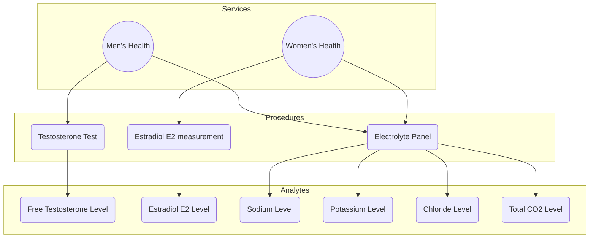
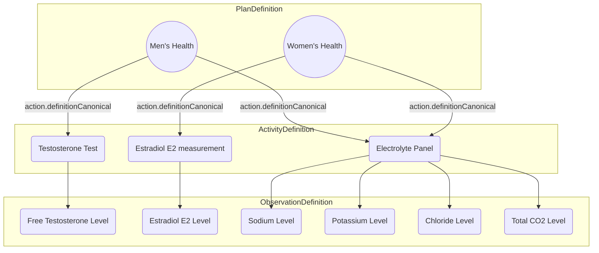

import ExampleCode from '!!raw-loader!@site/..//examples/src/careplans/diagnostic-catalog.ts';
import MedplumCodeBlock from '@site/src/components/MedplumCodeBlock';
import Tabs from '@theme/Tabs';
import TabItem from '@theme/TabItem';

# Defining your Diagnostic Catalog

A **diagnostic catalog** contains all the pertinent information about the diagnostic services you provide, including your analytes, reference ranges, panels, specimen requirements, and laboratory procedures.

Having a well-defined, structured catalog enables:

- Robust access controls
- Higher quality analytics
- Smoother [CLIA/CAP certification](/docs/compliance/clia-cap)
- [Streamlined billing](/docs/compliance/clia-cap)

At the end of this guide, you will understand how to represent your diagnostic catalog in FHIR at a detailed level an example of which is shown in this diagram.

Follow the guide step-by-step to build up the components shown:

1. Define your clinical observations
2. Define your specimens
3. Define your orderable services
4. Define your laboratory procedures

Our recommendations are informed by the [Order Catalog Implementation Guide](http://hl7.org/fhir/uv/order-catalog/2020Sep/) implementation guide, which developed with contributions from Labcorp, Quest Diagnostics, and other industry leaders.

:::tip Sample Data
You can download the examples in this guide as a FHIR bundle [here](./sample-diagnostic-catalog.json), and upload them to your project using the [Medplum Batch Upload Tool](/docs/tutorials/importing-sample-data#batch-upload-tool)
:::

## Define your clinical observations

The first step in building your catalog is to define which clinical quantities, or "observations", you will measure. In a lab context, an example of a clinical observation would be an an HBA1c percentage. For a given patient, this observation might have a value such as 5.3%.

The [`Observation`](/docs/api/fhir/resources/observation) is the primary _operational_ resource used to record a clinical quantity for a specific patient. [`ObservationDefinition`](/docs/api/fhir/resources/observationdefinition) is the corresponding _administrative_ counterpart, and is used to define how an [`Observation`](/docs/api/fhir/resources/observation) should be measured, interpreted, and reported.

[`Observations`](/docs/api/fhir/resources/observation) and [`ObservationDefinitions`](/docs/api/fhir/resources/observationdefinition) are linked by sharing a common `code` element, which should include a [LOINC code](./loinc) in most cases.

A great [`ObservationDefinition`](/docs/api/fhir/resources/observationdefinition) contains the following:

| Element                                | Description                                                                                                                                                                    | Code System                               | Example                                                                                                                    |
| -------------------------------------- | ------------------------------------------------------------------------------------------------------------------------------------------------------------------------------ | ----------------------------------------- | -------------------------------------------------------------------------------------------------------------------------- |
| `code`                                 | Code representing the observation type.                                                                                                                                        | LOINC  (see [LOINC codes](./loinc))  | [2951-2](https://loinc.org/2951-2) - Sodium [Moles/volume] in Serum or Plasma                                              |
| `quantitativeDetails.unit`             | Units expressing the observation value.                                                                                                                                        | [UCUM](https://hl7.org/fhir/R4/ucum.html) | mmol/L                                                                                                                     |
| `quantitativeDetails.decimalPrecision` | Number of places of precision _to the right of the decimal point_                                                                                                              |                                           | 2 (e.g. `0.11`)                                                                                                            |
| `qualifiedInterval`                    | 
Range of valid or reference values for the observation, to be used during interpretation. 

See our [guide on reference ranges](./reference-ranges) for more info.
 |                                           | <ul><li>Low: &lt;= 134.00 mmol/L</li><li>Normal: 135.00 mmol/L - 145.00 mmol/L</li><li>High: &gt;= 146.00 mmol/L</li></ul> |
| `preferredReportName`                  | Patient-friendly name used for reporting the observation result.                                                                                                               |                                           | Sodium Level                                                                                                               |

Key amongst these is the `qualifiedInterval` element, which is used to define _how results should be interpreted._ See our [guide on reference ranges](./reference-ranges) for more information.

  
Example: Blood Sodium Level 

  <MedplumCodeBlock language="ts" selectBlocks="observationDefinitionSodium">
    {ExampleCode}
  </MedplumCodeBlock>

## Define your specimens

In the context of laboratory use cases, it's essential to recognize that observations are based on samples extracted from patients, known as "specimens". A well constructed diagnostic catalog links the specimen requirements for each test to the test definition to provide lab operators a complete picture of the collection process.

The [`Specimen`](/docs/api/fhir/resources/specimen) resource resource refers to a specific specimen, like a tube of blood, usually belonging to a patient. As with [`Observations`](/docs/api/fhir/resources/observation), [`Specimen`](/docs/api/fhir/resources/specimen) has a corresponding _administrative_ resource, called [`SpecimenDefinition`](/docs/api/fhir/resources/specimendefinition).

[`SpecimenDefinition`](/docs/api/fhir/resources/specimendefinition) describes the type of specimen material to be collected, as well as details about the collection process, storage, handling, and preparation for testing.

The [`SpecimenDefinition`](/docs/api/fhir/resources/specimendefinition) allows you to specify many details about your specimen, but the most relevant are:

| Field                   | Description                                                           | Code System                                                                                                                                                       | Example                                                                                                                                                      |
| ----------------------- | --------------------------------------------------------------------- | ----------------------------------------------------------------------------------------------------------------------------------------------------------------- | ------------------------------------------------------------------------------------------------------------------------------------------------------------ |
| `typeCollected`         | Type of material collected.                                           | [SNOMED (children of 123038009 - Specimen)](https://browser.ihtsdotools.org/?perspective=full&conceptId1=123038009&edition=MAIN/2023-07-31&release=&languages=en) | [122554006](https://browser.ihtsdotools.org/?perspective=full&conceptId1=122554006&edition=MAIN/2023-07-31&release=&languages=en) - Capillary Blood Specimen |
| `collection`            | Procedure used for collection.                                        | [SNOMED (children of 118292001 - Removal)](https://browser.ihtsdotools.org/?perspective=full&conceptId1=118292001&edition=MAIN/2023-07-31&release=&languages=en)  | [278450005](https://browser.ihtsdotools.org/?perspective=full&conceptId1=278450005&edition=MAIN/2023-07-31&release=&languages=en) - Finger-prick sampling    |
| `typeTested.container`  | Details about the container storing the specimen.                     | [Specimen Container Type](https://hl7.org/fhir/R4/valueset-specimen-container-type.html)                                                                          | [467989009](https://browser.ihtsdotools.org/?perspective=full&conceptId1=467989009) - Capillary blood collection tube, no-additive                           |
| `typeTested.handling`   | Duration of storage at different temperature ranges                   | [Handling Condition](https://hl7.org/fhir/R4/valueset-handling-condition.html)                                                                                    | Store refrigerated at 2-8°C for up to 48 hours                                                                                                               |
| `typeTested.preference` | Whether this collection output is the preferred form, or an alternate | preferred \| alternate                                                                                                                                            | preferred                                                                                                                                                    |

:::tip `typeCollected` vs `typeTested`

Material that is collected from a patient may be split up, prepared, and handled different ways. The `typeTested` elements describe _all the potential outputs_ of the collection process, and contains a lot more information about the containment vessel, rejection criteria, and temperature restrictions for _each_ output.

:::

  
Example: Capillary Blood Sample 

  The following examples defines a fingerprick blood sample that is distributed into two collection tubes: a red cap and
  a green cap.
  <MedplumCodeBlock language="ts" selectBlocks="fingerprickSpecimen">
    {ExampleCode}
  </MedplumCodeBlock>

## Define your services

The next step is to roll up your individual tests into **orderable services** that your patients can order. These can be thought of as your diagnostic "product offerings," and are commonly known as "panels" in a lab context.

These products are represented as [`PlanDefinition`](/docs/api/fhir/resources/plandefinition) resources. The [`PlanDefinition`](/docs/api/fhir/resources/plandefinition) is primarily a grouping resource that stores metadata about the service and references the [`ActivityDefinitions`](/docs/api/fhir/resources/activitydefinition) you will create in the next section.

[`PlanDefinition's`](/docs/api/fhir/resources/plandefinition) important fields:

| Field                        | Description                                                                                                                                                       | Code System                                                                                                    | Example                                                                          |
| ---------------------------- | ----------------------------------------------------------------------------------------------------------------------------------------------------------------- | -------------------------------------------------------------------------------------------------------------- | -------------------------------------------------------------------------------- |
| `name`                       | The computer-friendly name of the service.                                                                                                                        |                                                                                                                | mens-health-panel                                                                |
| `title`                      | The human-friendly name of the service.                                                                                                                           |                                                                                                                | Men's Health Panel                                                               |
| `identifier`                 | Business identifier for the service (i.e. product or SKU code)                                                                                                    |                                                                                                                | dx-panel-12345                                                                   |
| `type`                       | Whether the service is a single test or a panel                                                                                                                   | [Laboratory service types](http://hl7.org/fhir/uv/order-catalog/2020Sep/ValueSet-laboratory-service-type.html) | panel                                                                            |
| `useContext`                 | How this [`PlanDefinition`](/docs/api/fhir/resources/plandefinition) should be interpreted. For diagnostic procedures, this is a fixed value: Lab Order Entry     |                                                                                                                | [Lab Order Entry](https://terminology.hl7.org/1.0.0//CodeSystem-v3-ActCode.html) |
| `status`                     | Whether or not the[`PlanDefinition`](/docs/api/fhir/resources/plandefinition) is active                                                                           |                                                                                                                | active                                                                           |
| `action.code`                | The code for lab procedure corresponding                                                                                                                          | [LOINC](./loinc)                                                                                               | [55231-5](https://loinc.org/55231-5) - Electrolytes panel - Blood                |
| `action.definitionCanonical` | The "canonical url" of the the [`ActivityDefinition`](/docs/api/fhir/resources/activitydefinition) representing the procedure (see [below](#activitydefinitions)) |                                                                                                                | http://example.org/ActivityDefinition/electrolyte-panel                          |

In the next section, we'll learn more about the `PlanDefinition.action` element, which represents the lab procedures used to _fulfill_ the diagnostic service order.

## Define your lab procedures

Now that you have represented your service menu as [`PlanDefinitions`](/docs/api/fhir/resources/plandefinition) , you will use [`ActivityDefinition`](/docs/api/fhir/resources/activitydefinition) resource to define your corresponding procedures to fulfill each service.

While [`PlanDefinitions`](/docs/api/fhir/resources/plandefinition) are patient facing resources, [`ActivityDefinitions`](/docs/api/fhir/resources/activitydefinition) are primarily used by lab operators to aid them in fulfilling the order. To link the two, each entry in `PlanDefinition.action` references an individual lab procedure, with `PlanDefinition.action.definitionCanonical` referencing an [`ActivityDefinition`](/docs/api/fhir/resources/activitydefinition) resource for details.

:::caution Note: Canonical References

[`PlanDefinitions`](/docs/api/fhir/resources/plandefinition) and [`ActivityDefinitions`](/docs/api/fhir/resources/activitydefinition) are linked via what is known as a _canonical_ reference, not a standard reference as with most other resources. `PlanDefinition.action.definitionCanonical` is a URL string, that must match the `url` field of the [`ActivityDefinition`](/docs/api/fhir/resources/activitydefinition) it references.

:::

There is a bit of an art to determining divide the individual tests into procedures, and it requires an understanding of your lab operations. Some considerations to help guide you:

- Are there reusable groups of tests that are _always_ performed together?
- Do these groups have their own [LOINC](./loinc) codes?
- Do your analyzers have a single input to order this group of results?

### ActivityDefinitions

The [`ActivityDefinition`](/docs/api/fhir/resources/activitydefinition) resource stores detailed information about each procedure, and is the resource that links `PlanDefinition.action`, to the [`ObservationDefinitions`](/docs/api/fhir/resources/observationdefinition) and [`SpecimenDefinitions`](/docs/api/fhir/resources/specimendefinition) we defined earlier.

The most important fields for [`ActivityDefinition`](/docs/api/fhir/resources/activitydefinition) are summarized below:

| Element                        | Description                                                                                                                                                                                                                                                                                                                                                                                                                                                                                  | Code System                                     | Example                                                           |
| ------------------------------ | -------------------------------------------------------------------------------------------------------------------------------------------------------------------------------------------------------------------------------------------------------------------------------------------------------------------------------------------------------------------------------------------------------------------------------------------------------------------------------------------- | ----------------------------------------------- | ----------------------------------------------------------------- |
| `code`                         | The LOINC code corresponding to this procedure. Should match the code used in `PlanDefinition.action`                                                                                                                                                                                                                                                                                                                                                                                        | [LOINC](./loinc)                                | [55231-5](https://loinc.org/55231-5) - Electrolytes panel - Blood |
| `url`                          | 
Known as the "canonical URL" for the resource. This should be a fully qualified, globally unique URL. 

FHIR recommends for many administrative resources (aka "definitional resources") to have canonical URLs to provide a globally unique business identifier. Read more about canonical URLs [here](https://hl7.org/fhir/resource.html#canonical)

A recommended pattern for constructing this URL is:  `http://[your-company-url]/ActivityDefinition/[test-name]`
 |                                                 | http://example.org/ActivityDefinition/electrolyte-panel           |
| `observationResultRequirement` | References to the [`ObservationDefinition`](/docs/api/fhir/resources/observationdefinition) resources for the test results produced by this procedure (see above).                                                                                                                                                                                                                                                                                                                           | [See above](#define-your-clinical-observations) |                                                                   |
| `specimenRequirement`          | References to the [`SpecimenDefinition`](/docs/api/fhir/resources/specimendefinition) resources for the test results produced by this procedure (see above).                                                                                                                                                                                                                                                                                                                                 | [See above](#define-your-specimens)             |                                                                   |
| `name`                         | A computer-friendly name for the procedure                                                                                                                                                                                                                                                                                                                                                                                                                                                   |                                                 | electrolytes-panel-blood-measurement                              |
| `title`                        | A human-friendly name for the procedure                                                                                                                                                                                                                                                                                                                                                                                                                                                      |                                                 | Electrolytes panel measurement in blood                           |
| `kind`                         | The kind of resource that will represent the lab order. For diagnostics, this is always `ServiceRequest`.                                                                                                                                                                                                                                                                                                                                                                                    |                                                 | ServiceRequest                                                    |
| `status`                       | Whether or not the[`ActivityDefinition`](/docs/api/fhir/resources/activitydefinition) is active                                                                                                                                                                                                                                                                                                                                                                                              |                                                 | active                                                            |

### The Simple Case

In most cases, each service will only require a single laboratory procedure. In these cases, you will only need a single `PlanDefinition.action` and [`ActivityDefinition`](/docs/api/fhir/resources/activitydefinition), representing the main operational procedure performed to fulfill this laboratory service.

  
Example: Electrolyte Panel

  In the example below, a patient can order an Electrolyte Panel, which is a single laboratory procedure
  <h5>Patient-facing service</h5>
  <MedplumCodeBlock language="ts" selectBlocks="electrolytesPanelService">
    {ExampleCode}
  </MedplumCodeBlock>
  <h5>Laboratory Procedure</h5>
  <MedplumCodeBlock language="ts" selectBlocks="electrolytesPanel">
    {ExampleCode}
  </MedplumCodeBlock>

### Reusing Procedures

In some cases, a product offering might _embed_ multiple procedures that are reused across service offerings. In these cases, we can define multiple entries in `PlanDefinition.action`, each with their own [`ActivityDefinition`](/docs/api/fhir/resources/activitydefinition).

This allows you to reuse the data definition of your procedures, while allowing you to compose them into different patient-facing product offerings.

  
Example: Men's Health Panel

  

    This PlanDefinition reuses the Electrolyte Panel from the previous example, and but adds a free testosterone test.
  

    <h5>
    Patient-facing service
  </h5>
  <MedplumCodeBlock language="ts" selectBlocks="mensHealthService">
    {ExampleCode}
  </MedplumCodeBlock>
  <h5>
    Laboratory Procedures
  </h5>
  <h6>Testosterone Procedure</h6>
    <MedplumCodeBlock language="ts" selectBlocks="testosteroneProcedure">
    {ExampleCode}
  </MedplumCodeBlock>

  <h6>Electrolytes Procedure</h6>
  <MedplumCodeBlock language="ts" selectBlocks="electrolytesPanel">
    {ExampleCode}
  </MedplumCodeBlock>

:::tip Sub actions

Beyond flat lists of procedures, FHIR [`PlanDefinitions`](/docs/api/fhir/resources/plandefinition) can be used to represent sub-procedures, mutually exclusive groups of procedures, reflex tests, and other complicated arrangements.

These advanced scenarios are out of scope for this guide, but you can check out the [this implementation guide](http://hl7.org/fhir/uv/order-catalog/2020Sep/exlabservices.html) for examples of how these might be implemented

:::

## Querying your catalog

You can query all [`PlanDefinitions`](/docs/api/fhir/resources/plandefinition) that represent a laboratory procedure using the and the associated [`ActivityDefinitions`](/docs/api/fhir/resources/activitydefinition) with this query:

<Tabs groupId="language">
  <TabItem value="ts" label="Typescript">
    <MedplumCodeBlock language="ts" selectBlocks="searchPdsTS">
      {ExampleCode}
    </MedplumCodeBlock>
  </TabItem>
  <TabItem value="cli" label="CLI">
    <MedplumCodeBlock language="bash" selectBlocks="searchPdsCLI">
      {ExampleCode}
    </MedplumCodeBlock>
  </TabItem>
  <TabItem value="curl" label="cURL">
    <MedplumCodeBlock language="bash" selectBlocks="searchPdsCurl">
      {ExampleCode}
    </MedplumCodeBlock>
  </TabItem>
</Tabs>

Another common query is to get all the [`ObservationDefinition`](/docs/api/fhir/resources/observationdefinition) and [`SpecimenDefinitions`](/docs/api/fhir/resources/specimendefinition) in a single service. Unfortunately, there is currently no way to do this using a single query. However, this can be done in two parts:

1. Query all ActivityDefinitions for a given PlanDefinition using [`_include`](/docs/search/includes#_include-and-_revinclude) directive

   <Tabs groupId="language">
     <TabItem value="ts" label="Typescript">
       <MedplumCodeBlock language="ts" selectBlocks="searchActivitiesTS">
         {ExampleCode}
       </MedplumCodeBlock>
     </TabItem>
     <TabItem value="cli" label="CLI">
       <MedplumCodeBlock language="bash" selectBlocks="searchActivitiesCLI">
         {ExampleCode}
       </MedplumCodeBlock>
     </TabItem>
     <TabItem value="curl" label="cURL">
       <MedplumCodeBlock language="bash" selectBlocks="searchActivitiesCurl">
         {ExampleCode}
       </MedplumCodeBlock>
     </TabItem>
   </Tabs>

2. For each resulting [`ActivityDefinition`](/docs/api/fhir/resources/activitydefinition), read each [`ObservationDefinition`](/docs/api/fhir/resources/observationdefinition) and [`SpecimenDefinition`](/docs/api/fhir/resources/specimendefinition). This operation is well suited to [GraphQL](https://www.medplum.com/docs/graphql/basic-queries)

   <Tabs groupId="language">
     <TabItem value="graphql" label="GraphQL">
       <MedplumCodeBlock language="graphql" selectBlocks="getODsandSDs">
         {ExampleCode}
       </MedplumCodeBlock>
     </TabItem>
     <TabItem value="ts" label="TypeScript">
       <MedplumCodeBlock language="ts" selectBlocks="getODsandSDsTS">
         {ExampleCode}
       </MedplumCodeBlock>
     </TabItem>
   </Tabs>

## Putting it all together

Now we'll put all these concepts together to model a basic lab catalog. The diagram below illustrates the setup we will be modeling:

- We have two orderable services, a "Men's Health Panel" and a "Women's Health Panel"
- Each service has a shared procedure, the "Electrolyte Panel"
- Each service also has a sex-specific procedure: "Testosterone" for men and "Estradiol" for women
- The Men's health panel will produce the following clinical measurements:
  - Free Testosterone Level
  - Sodium Level
  - Potassium Level
  - Chloride Level
  - Total CO2 Level
- The Women's health panel will produce the following clinical measurements:
  - Estradiol E2 Level
  - Sodium Level
  - Potassium Level
  - Chloride Level
  - Total CO2 Level

  
Services (PlanDefinition)

  <h5>Men's Health</h5>
  <MedplumCodeBlock language="ts" selectBlocks="mensHealthService">
    {ExampleCode}
  </MedplumCodeBlock>
  <h5>Women's Health</h5>
  <MedplumCodeBlock language="ts" selectBlocks="womensHealthService">
    {ExampleCode}
  </MedplumCodeBlock>

  
Procedures (ActivityDefinition)

  <h5>Testosterone</h5>
  <MedplumCodeBlock language="ts" selectBlocks="testosteroneProcedure">
    {ExampleCode}
  </MedplumCodeBlock>
  <h5>Estradiol</h5>
  <MedplumCodeBlock language="ts" selectBlocks="estradiolProcedure">
    {ExampleCode}
  </MedplumCodeBlock>
  <h5>Electrolytes</h5>
  <MedplumCodeBlock language="ts" selectBlocks="electrolytesPanel">
    {ExampleCode}
  </MedplumCodeBlock>

  
Observations (ObservationDefinition)

  <h5>Free Testosterone</h5>
  <MedplumCodeBlock language="ts" selectBlocks="observationDefinitionTestosterone">
    {ExampleCode}
  </MedplumCodeBlock>
  <h5>Estradiol</h5>
  <MedplumCodeBlock language="ts" selectBlocks="observationDefinitionEstradiol">
    {ExampleCode}
  </MedplumCodeBlock>
  <h5>Sodium</h5>
  <MedplumCodeBlock language="ts" selectBlocks="observationDefinitionSodium">
    {ExampleCode}
  </MedplumCodeBlock>
  <h5>Potassium</h5>
  <MedplumCodeBlock language="ts" selectBlocks="observationDefinitionPotassium">
    {ExampleCode}
  </MedplumCodeBlock>
  <h5>Chloride</h5>
  <MedplumCodeBlock language="ts" selectBlocks="observationDefinitionChloride">
    {ExampleCode}
  </MedplumCodeBlock>
  <h5>CO2</h5>
  <MedplumCodeBlock language="ts" selectBlocks="observationDefinitionCarbonDioxide">
    {ExampleCode}
  </MedplumCodeBlock>

  
Specimen (SpecimenDefinition)

  <h5>Finger-prick Capillary Blood</h5>
  <MedplumCodeBlock language="ts" selectBlocks="fingerprickSpecimen">
    {ExampleCode}
  </MedplumCodeBlock>

