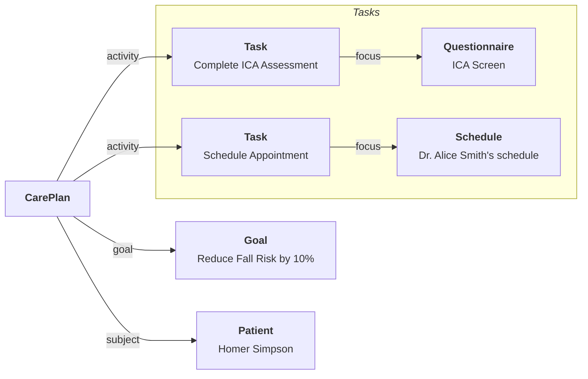

# Care Plans

Care Plans are representations of protocols that patients are meant to follow. They exist in two modes:

- **In abstract**, a protocol that could apply to a _hypothetical patient_, which is represented in FHIR as a [PlanDefinition](/docs/api/fhir/resources/plandefinition).
- **In concrete**, a protocol that is planned for a _specific patient_, the PlanDefinition is instantiated (in FHIR terms, they call this `$apply`) into an optional [CarePlan](/docs/api/fhir/resources/careplan) with a linked [RequestGroup](/docs/api/fhir/resources/requestgroup) representing all the items that need to be done and their status.

It can be helpful to think of the historical analogs to these resources in the physical world. A `PlanDefinition` can be thought of as a written manual or protocol document that would be given to staff for training. A `CarePlan`/`RequestGroup` can be thought of a checklist that is added to a patient chart.

## Key Resources

| **Resource**                                                | **Description**                                                                                                                             |
| ----------------------------------------------------------- | ------------------------------------------------------------------------------------------------------------------------------------------- |
| [`Task`](/docs/api/fhir/resources/task)                     | A workhorse resource defining all clinical work items to be completed.                                                                      |
| [`Goal`](/docs/api/fhir/resources/goal)                     | A resource to define a measurable target to achieve.                                                                                        |
| [`CarePlan`](/docs/api/fhir/resources/careplan)             | A grouping resource to organize a group of [`Tasks`](/docs/api/fhir/resources/task) for each [`Patient`](/docs/api/fhir/resources/patient). |
| [`PlanDefinition`](/docs/api/fhir/resources/plandefinition) | A resource that defines a clinical protocol that can be implemented on a per-patient basis.                                                 |
| [`RequestGroup`](/docs/api/fhir/resources/requestgroup)     | A resource that can define complex relationships between tasks, including temporal tasks, recurring tasks, mutually exclusive tasks, etc.   |

## Key Code Systems

| **Code System**                                       | **Description**                                                                          |
| ----------------------------------------------------- | ---------------------------------------------------------------------------------------- |
| [LOINC](https://www.medplum.com/docs/careplans/loinc) | Used to define the target measure of a [`Goal`](/docs/api/fhir/resources/goal) resource. |

## Other Resources

:::caution Note

Feel free to reach out to us at hello@medplum.com if you have questions about your care plan setup.

:::

Care planning can range from very simple - for example, a single prescription, to very complex - like a surgery with post operative follow up, evaluations, medications and more. For basic use, we recommend looking at reference care plans and customizing them to your needs.

- [Sample Care Plan Resources](https://github.com/medplum/medplum/blob/86bfdc2435035478d5672daf9cd45a609a012119/packages/react/src/stories/covid19.ts) including PlanDefinition, CarePlan and RequestGroup
- [PlanDefinitions on Medplum App](https://app.medplum.com/PlanDefinition) - if you look at the tabs, you will see an `$apply` tab that allows you to convert a PlanDefinition into a RequestGroup that belongs to a specific patient.
- [RequestGroup on Medplum App](https://app.medplum.com/RequestGroup)
- [PlanDefinition Builder sample on Storybook](https://storybook.medplum.com/?path=/docs/medplum-plandefinitionbuilder--basic)
- [RequestGroup sample on Storybook](https://storybook.medplum.com/?path=/docs/medplum-requestgroupdisplay--simple)
- [Care Plan Features and Fixes](https://github.com/medplum/medplum/pulls?q=is%3Apr+label%3Acareplans) on Github
