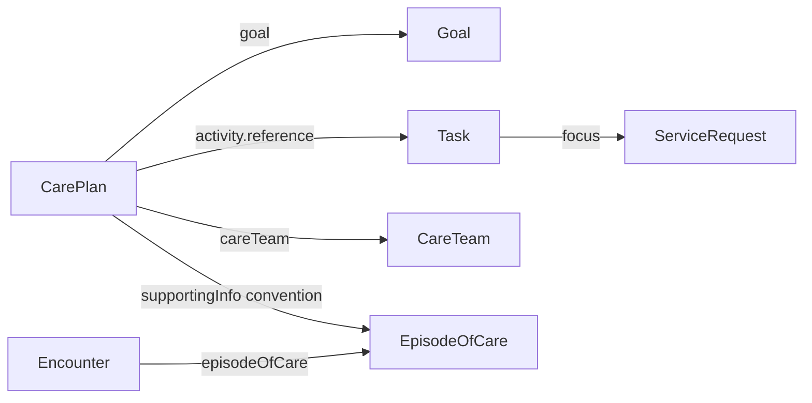

# Care Coordination

A patient needs a follow-up visit. Someone has to review the assessment, contact the patient, arrange the visit, and make sure the result gets back to the care team. Each step is straightforward on its own. Keeping track of who owns the next step is where care coordination becomes useful.

This section covers operational workflows across the practice, from a shared task queue to ongoing patient case management. Medplum provides the FHIR resources, search, access policies, and automation tools you can combine to build these workflows.

:::tip[Start with the workflow]

Use the [Care Coordination Decision Guide](/docs/decision-guides/care-coordination) to work through ownership, handoffs, and follow-up with your team. You can start with Tasks and add a case or clinical plan as your care model needs it.

:::

## Start with the Work Your Team Needs to Do {/* #choose-the-resources-for-your-workflow */}

| Need | Model | What it represents |
| --- | --- | --- |
| Assign and track an action | `Task` | A unit of work with its own owner, lifecycle, inputs, and outputs |
| Request a clinical service | `ServiceRequest` or another specific request resource | The clinical request or authorization that work fulfills |
| Coordinate ongoing participants | `CareTeam` | People and organizations involved in care, with roles and participation periods |
| Track responsibility across visits | `EpisodeOfCare` | A period of responsibility for a patient, including organization, coordinator, and team |
| Agree on a patient's care | `CarePlan` and `Goal` | Intended activities and objectives, with evidence of progress |
| Reuse a clinical protocol | `PlanDefinition` and `ActivityDefinition` | Definitions that can be applied to patient-specific work |

```mermaid
flowchart LR
  plan[CarePlan] -->|goal| goal[Goal]
  plan -->|activity.reference| task[Task]
  task -->|focus| request[ServiceRequest]
  plan -->|careTeam| team[CareTeam]
  plan -->|supportingInfo convention| episode[EpisodeOfCare]
  encounter[Encounter] -->|episodeOfCare| episode
```

This diagram shows one directly authored plan. Resources also carry their own patient references. The `supportingInfo` association is an application convention; a shared Condition alone does not establish case membership. Protocol-generated plans can have an intermediate RequestGroup.

## Build Your Care Coordination Workflow {/* #build-the-operational-workflow */}

1. [Tasks and Work Queues](/docs/careplans/tasks): identify work, expose queues, and claim items safely.
2. [Teams, Assignment, and Top-of-License Care](/docs/careplans/teams-and-delegation): assign eligible roles and preserve required review.
3. [Handoffs, Deadlines, and Escalation](/docs/careplans/handoffs-and-escalation): define completion evidence, dependencies, and exceptions.
4. [Longitudinal Patient Case Tracking](/docs/careplans/longitudinal-patient-case-tracking): maintain continuity and responsibility across visits.
5. [Care Plans, Goals, and Progress](/docs/careplans/care-plans-and-goals): connect planned work to clinical objectives.
6. [Automating Care Workflows](/docs/careplans/automating-workflows): create and advance work reliably.
7. [Clinical Decision Support and Follow-Through](/docs/careplans/clinical-decision-support): connect guidance to review and action.
8. [Operational Reporting](/docs/careplans/operational-reporting): measure workload, delays, and outcomes.

## Connect the Rest of the Practice {/* #connect-to-other-workflows */}

[Referrals](/docs/careplans/referrals), [messaging](/docs/communications/messaging-data-model), and [scheduling](/docs/scheduling) use these coordination patterns. Keep domain-specific clinical records in those models and use Tasks for the work around them. [Clinical Protocols](/docs/careplans/protocols) covers reusable definition authoring.

Enforce visibility through [AccessPolicy and ProjectMembership](/docs/access/access-policies). Assignment and CareTeam membership do not automatically grant access. Populate each resource's own patient references, including work created by Bots.

For the operational motivation, see [Digital Health is an Operations Game](/blog/digital-health-operations), particularly its discussion of task classification, delegation, and asynchronous care.
