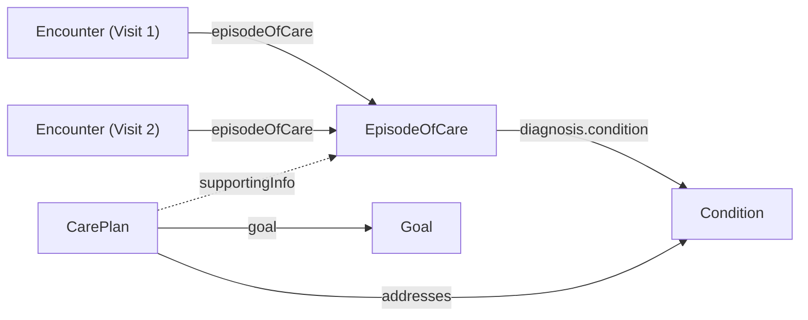
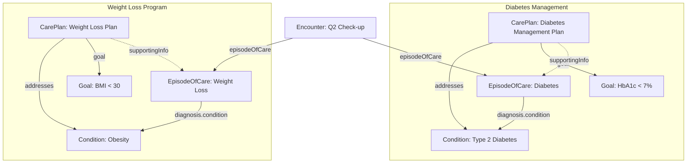

import MedplumCodeBlock from '@site/src/components/MedplumCodeBlock';
import Tabs from '@theme/Tabs';
import TabItem from '@theme/TabItem';

import ExampleCode from '!!raw-loader!@site/..//examples/src/careplans/longitudinal-tracking-examples.ts';

# Longitudinal Patient Case Tracking

Many clinical scenarios span multiple visits over weeks, months, or years. A patient managing type 2 diabetes, for example, will have quarterly check-ups, lab orders, specialist referrals, and lifestyle interventions that all belong to the same ongoing case. A single [`Encounter`](/docs/api/fhir/resources/encounter) captures one visit, but it cannot represent the full arc of care.

FHIR provides two complementary resources for grouping this longitudinal activity: [`EpisodeOfCare`](/docs/api/fhir/resources/episodeofcare) for administrative encounter grouping, and [`CarePlan`](/docs/api/fhir/resources/careplan) for clinical planning. Together, they give you both the temporal grouping you need and the rich goal and activity context you want.

## Key Concepts

[`EpisodeOfCare`](/docs/api/fhir/resources/episodeofcare) is intentionally lightweight. Its job is purely administrative grouping — it acts as an umbrella that encounters attach to. It tracks which organization is responsible for a patient's care during a period, and which conditions are being addressed. It does not capture clinical planning details like goals, activities, or care team assignments.

[`CarePlan`](/docs/api/fhir/resources/careplan) handles the clinical layer. It defines treatment goals, scheduled activities, conditions being addressed, and care team members. A CarePlan sits alongside an EpisodeOfCare and provides the planning context that the episode intentionally omits.

A patient can have multiple concurrent episodes and care plans. For instance, one episode for diabetes management and another for a weight loss program, each with its own CarePlan. A single encounter (like a quarterly check-up) can be linked to multiple episodes through [`Encounter.episodeOfCare`](/docs/api/fhir/resources/encounter), which accepts an array of references.

## Resource Overview

| Resource | Role | Description |
| --- | --- | --- |
| [`EpisodeOfCare`](/docs/api/fhir/resources/episodeofcare) | Administrative grouping | Groups encounters into a named care episode for a specific condition |
| [`CarePlan`](/docs/api/fhir/resources/careplan) | Clinical protocol | Defines goals, activities, and conditions for the treatment plan |
| [`Encounter`](/docs/api/fhir/resources/encounter) | Visit record | Individual visit linked to one or more episodes |
| [`Condition`](/docs/api/fhir/resources/condition) | Problem / diagnosis | The clinical problem being tracked across the episode |
| [`Goal`](/docs/api/fhir/resources/goal) | Treatment objective | Measurable target within a care plan |

## How the Resources Fit Together

All resources below reference the Patient. The diagram omits those references to focus on the relationships that matter for longitudinal tracking.

The key relationships are:

- Encounters link to their episode via `Encounter.episodeOfCare`
- Both EpisodeOfCare and CarePlan reference the same [`Condition`](/docs/api/fhir/resources/condition) resources, creating an implicit link through shared diagnoses
- `CarePlan.supportingInfo` explicitly references the EpisodeOfCare, providing a direct link from plan to episode
- [`Goal`](/docs/api/fhir/resources/goal) resources are referenced from the CarePlan via `CarePlan.goal`

:::note[Navigating between EpisodeOfCare and CarePlan]
The `supportingInfo` link is one-directional: you can follow it from CarePlan to EpisodeOfCare, but there is no field on EpisodeOfCare that points back to a CarePlan. To navigate in the reverse direction (episode to plan), query by the shared Condition: `CarePlan?condition=Condition/{id}`. This is the natural clinical query — "show me all plans addressing this diagnosis" — and works regardless of how many episodes or plans reference that condition.
:::

## Creating an Episode of Care

An [`EpisodeOfCare`](/docs/api/fhir/resources/episodeofcare) represents an administrative period of care for a specific concern. Create one when a patient begins a new care episode, such as starting chronic disease management or entering a treatment program.

Key fields:

| Field | Purpose |
| --- | --- |
| `status` | Lifecycle state: `planned`, `waitlist`, `active`, `onhold`, `finished`, `cancelled` |
| `patient` | Reference to the patient |
| `type` | Category of care being provided |
| `diagnosis` | Conditions being addressed, with optional role (chief complaint, comorbidity) |
| `period` | Start and optional end date of the episode |
| `managingOrganization` | Organization responsible for the episode |

<MedplumCodeBlock language="ts" selectBlocks="createEpisodeOfCareTs">{ExampleCode}</MedplumCodeBlock>

## Linking Encounters to an Episode

When a patient has a visit related to an ongoing care episode, link the [`Encounter`](/docs/api/fhir/resources/encounter) to the episode via `Encounter.episodeOfCare`. This field is an array, so a single encounter can belong to multiple episodes simultaneously. This is useful when a visit addresses more than one ongoing concern.

<MedplumCodeBlock language="ts" selectBlocks="createEncounterTs">{ExampleCode}</MedplumCodeBlock>

In this example, the encounter is linked to both a diabetes episode and a weight loss episode, reflecting that both concerns were addressed during the same visit. 

You are not limited to encounters that already took place. Link future visits to an episode by creating encounters in advance and pointing `Encounter.episodeOfCare` at the `EpisodeOfCare`. Use `Encounter.status` (for example planned) to record that the encounter is scheduled or not yet started, in line with FHIR’s encounter lifecycle.

## Creating a Care Plan with Goals

While the EpisodeOfCare groups encounters, the [`CarePlan`](/docs/api/fhir/resources/careplan) captures what should happen clinically. Start by creating [`Goal`](/docs/api/fhir/resources/goal) resources for the treatment objectives, then reference them from the CarePlan.

### Creating a Goal

<MedplumCodeBlock language="ts" selectBlocks="createGoalTs">{ExampleCode}</MedplumCodeBlock>

### Creating the Care Plan

The CarePlan brings together the condition being addressed, the goals to achieve, scheduled activities, and a reference to the associated EpisodeOfCare via `supportingInfo`.

<MedplumCodeBlock language="ts" selectBlocks="createCarePlanTs">{ExampleCode}</MedplumCodeBlock>

:::tip[]
`CarePlan.supportingInfo` accepts `Reference<Resource>[]`, making it flexible enough to reference an EpisodeOfCare, related documents, or any other supporting resource.
:::

## Cross-Linking EpisodeOfCare and CarePlan

FHIR R4 does not provide a direct field on EpisodeOfCare that points to a CarePlan, so the link between them is asymmetric. The recommended pattern uses two complementary strategies:

1. `CarePlan.supportingInfo` directly references the EpisodeOfCare. This gives you an explicit, unambiguous pointer when reading a CarePlan — follow `supportingInfo` to find the episode it belongs to.
2. Both resources reference the same [`Condition`](/docs/api/fhir/resources/condition) resources (`EpisodeOfCare.diagnosis.condition` and `CarePlan.addresses`). This shared condition serves as the queryable link in the reverse direction: starting from an EpisodeOfCare, read its conditions and then search `CarePlan?condition=Condition/{id}` to find the associated plans.

| Direction | How to navigate |
| --- | --- |
| CarePlan → EpisodeOfCare | Follow `CarePlan.supportingInfo` directly |
| EpisodeOfCare → CarePlan | Query `CarePlan?condition={shared-condition-id}` |

Together, these two strategies cover both navigation directions. The `supportingInfo` pointer is explicit and fast for single-resource reads; the shared Condition query handles the reverse direction and is the natural clinical question ("what plans address this diagnosis?").

## Querying Longitudinal Data

### Finding All Encounters for an Episode

Retrieve every visit associated with a care episode using the `episode-of-care` search parameter on [`Encounter`](/docs/api/fhir/resources/encounter).

<Tabs groupId="language">
  <TabItem value="ts" label="TypeScript">
    <MedplumCodeBlock language="ts" selectBlocks="searchEncountersByEpisodeTs">{ExampleCode}</MedplumCodeBlock>
  </TabItem>
  <TabItem value="cli" label="CLI">
    <MedplumCodeBlock language="bash" selectBlocks="searchEncountersByEpisodeCli">{ExampleCode}</MedplumCodeBlock>
  </TabItem>
  <TabItem value="curl" label="cURL">
    <MedplumCodeBlock language="bash" selectBlocks="searchEncountersByEpisodeCurl">{ExampleCode}</MedplumCodeBlock>
  </TabItem>
</Tabs>

### Finding Care Plans for a Condition

Find all care plans addressing a specific condition for a patient.

<Tabs groupId="language">
  <TabItem value="ts" label="TypeScript">
    <MedplumCodeBlock language="ts" selectBlocks="searchCarePlansByConditionTs">{ExampleCode}</MedplumCodeBlock>
  </TabItem>
  <TabItem value="cli" label="CLI">
    <MedplumCodeBlock language="bash" selectBlocks="searchCarePlansByConditionCli">{ExampleCode}</MedplumCodeBlock>
  </TabItem>
  <TabItem value="curl" label="cURL">
    <MedplumCodeBlock language="bash" selectBlocks="searchCarePlansByConditionCurl">{ExampleCode}</MedplumCodeBlock>
  </TabItem>
</Tabs>

### Finding All Episodes for a Patient

List all active care episodes for a patient to see their ongoing cases at a glance.

<Tabs groupId="language">
  <TabItem value="ts" label="TypeScript">
    <MedplumCodeBlock language="ts" selectBlocks="searchEpisodesByPatientTs">{ExampleCode}</MedplumCodeBlock>
  </TabItem>
  <TabItem value="cli" label="CLI">
    <MedplumCodeBlock language="bash" selectBlocks="searchEpisodesByPatientCli">{ExampleCode}</MedplumCodeBlock>
  </TabItem>
  <TabItem value="curl" label="cURL">
    <MedplumCodeBlock language="bash" selectBlocks="searchEpisodesByPatientCurl">{ExampleCode}</MedplumCodeBlock>
  </TabItem>
</Tabs>

## Example: Concurrent Care Episodes

Consider a patient, Homer Simpson, who is managing two ongoing concerns: type 2 diabetes and a weight loss program. Each concern has its own EpisodeOfCare and CarePlan, but some visits address both.

All resources reference Patient: Homer Simpson. Those references are omitted below to keep the diagram focused.

In this setup:

- Each concern has its own EpisodeOfCare, Condition, CarePlan, and Goal
- The Q2 check-up Encounter is linked to both episodes because both concerns were addressed during that visit
- To get the full picture of Homer's diabetes care, query `Encounter?episode-of-care=EpisodeOfCare/diabetes-episode` for all visits, and `CarePlan?condition=Condition/diabetes-type-2` for the treatment plan
- To see all of Homer's active cases, query `EpisodeOfCare?patient=Patient/homer-simpson&status=active`

## See Also

- [`EpisodeOfCare`](/docs/api/fhir/resources/episodeofcare) FHIR resource API
- [`CarePlan`](/docs/api/fhir/resources/careplan) FHIR resource API
- [`Encounter`](/docs/api/fhir/resources/encounter) FHIR resource API
- [`Condition`](/docs/api/fhir/resources/condition) FHIR resource API
- [`Goal`](/docs/api/fhir/resources/goal) FHIR resource API
- [Care Plans](/docs/careplans)
- [Using Tasks to Manage Clinical Workflow](/docs/careplans/tasks)
- [Creating SOAP Notes](/docs/charting/soap-notes)
