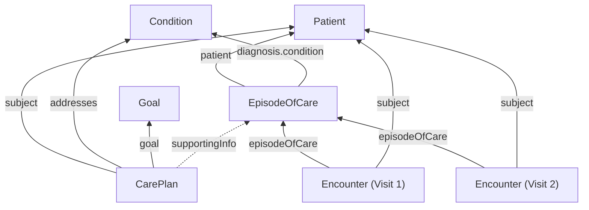
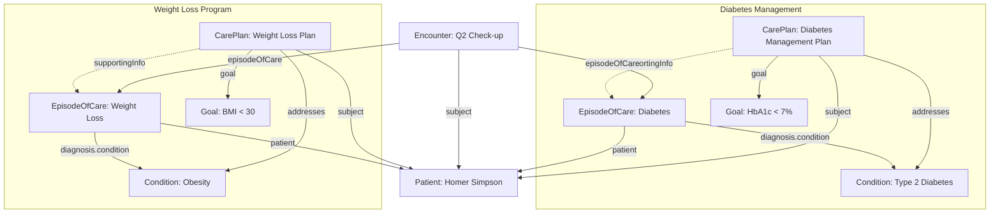

import MedplumCodeBlock from '@site/src/components/MedplumCodeBlock';
import Tabs from '@theme/Tabs';
import TabItem from '@theme/TabItem';

import ExampleCode from '!!raw-loader!@site/..//examples/src/careplans/longitudinal-tracking-examples.ts';

# Longitudinal Patient Case Tracking

Many clinical scenarios span multiple visits over weeks, months, or years. A patient managing type 2 diabetes, for example, will have quarterly check-ups, lab orders, specialist referrals, and lifestyle interventions that all belong to the same ongoing case. A single [`Encounter`](/docs/api/fhir/resources/encounter) captures one visit, but it cannot represent the full arc of care.

FHIR provides two complementary resources for grouping this longitudinal activity: [`EpisodeOfCare`](/docs/api/fhir/resources/episodeofcare) for administrative encounter grouping, and [`CarePlan`](/docs/api/fhir/resources/careplan) for clinical planning. Together, they give you both the temporal grouping you need and the rich goal and activity context you want.

## Key Concepts

[`EpisodeOfCare`](/docs/api/fhir/resources/episodeofcare) is intentionally lightweight. Its job is purely administrative grouping — it acts as an umbrella that encounters attach to. It tracks which organization is responsible for a patient's care during a period, and which conditions are being addressed. It does not capture clinical planning details like goals, activities, or care team assignments.

[`CarePlan`](/docs/api/fhir/resources/careplan) handles the clinical layer. It defines treatment goals, scheduled activities, conditions being addressed, and care team members. A CarePlan sits alongside an EpisodeOfCare and provides the planning context that the episode intentionally omits.

A patient can have multiple concurrent episodes and care plans. For instance, one episode for diabetes management and another for a weight loss program, each with its own CarePlan. A single encounter (like a quarterly check-up) can be linked to multiple episodes through [`Encounter.episodeOfCare`](/docs/api/fhir/resources/encounter), which accepts an array of references.

## Resource Overview

| Resource | Role | Description |
| --- | --- | --- |
| [`EpisodeOfCare`](/docs/api/fhir/resources/episodeofcare) | Administrative grouping | Groups encounters into a named care episode for a specific condition |
| [`CarePlan`](/docs/api/fhir/resources/careplan) | Clinical protocol | Defines goals, activities, and conditions for the treatment plan |
| [`Encounter`](/docs/api/fhir/resources/encounter) | Visit record | Individual visit linked to one or more episodes |
| [`Condition`](/docs/api/fhir/resources/condition) | Problem / diagnosis | The clinical problem being tracked across the episode |
| [`Goal`](/docs/api/fhir/resources/goal) | Treatment objective | Measurable target within a care plan |

## How the Resources Fit Together

The key relationships are:

- Encounters link to their episode via `Encounter.episodeOfCare`
- Both EpisodeOfCare and CarePlan reference the same [`Condition`](/docs/api/fhir/resources/condition) resources, creating an implicit link through shared diagnoses
- `CarePlan.supportingInfo` can explicitly reference the EpisodeOfCare, providing a direct cross-link
- [`Goal`](/docs/api/fhir/resources/goal) resources are referenced from the CarePlan via `CarePlan.goal`

## Creating an Episode of Care

An [`EpisodeOfCare`](/docs/api/fhir/resources/episodeofcare) represents an administrative period of care for a specific concern. Create one when a patient begins a new care episode, such as starting chronic disease management or entering a treatment program.

Key fields:

| Field | Purpose |
| --- | --- |
| `status` | Lifecycle state: `planned`, `waitlist`, `active`, `onhold`, `finished`, `cancelled` |
| `patient` | Reference to the patient |
| `type` | Category of care being provided |
| `diagnosis` | Conditions being addressed, with optional role (chief complaint, comorbidity) |
| `period` | Start and optional end date of the episode |
| `managingOrganization` | Organization responsible for the episode |

<MedplumCodeBlock language="ts" selectBlocks="createEpisodeOfCareTs">{ExampleCode}</MedplumCodeBlock>

## Linking Encounters to an Episode

When a patient has a visit related to an ongoing care episode, link the [`Encounter`](/docs/api/fhir/resources/encounter) to the episode via `Encounter.episodeOfCare`. This field is an array, so a single encounter can belong to multiple episodes simultaneously. This is useful when a visit addresses more than one ongoing concern.

<MedplumCodeBlock language="ts" selectBlocks="createEncounterTs">{ExampleCode}</MedplumCodeBlock>

In this example, the encounter is linked to both a diabetes episode and a weight loss episode, reflecting that both concerns were addressed during the same visit.

## Creating a Care Plan with Goals

While the EpisodeOfCare groups encounters, the [`CarePlan`](/docs/api/fhir/resources/careplan) captures what should happen clinically. Start by creating [`Goal`](/docs/api/fhir/resources/goal) resources for the treatment objectives, then reference them from the CarePlan.

### Creating a Goal

<MedplumCodeBlock language="ts" selectBlocks="createGoalTs">{ExampleCode}</MedplumCodeBlock>

### Creating the Care Plan

The CarePlan brings together the condition being addressed, the goals to achieve, scheduled activities, and a reference to the associated EpisodeOfCare via `supportingInfo`.

<MedplumCodeBlock language="ts" selectBlocks="createCarePlanTs">{ExampleCode}</MedplumCodeBlock>

:::tip
`CarePlan.supportingInfo` accepts `Reference<Resource>[]`, making it flexible enough to reference an EpisodeOfCare, related documents, or any other supporting resource.
:::

## Cross-Linking EpisodeOfCare and CarePlan

The recommended pattern for connecting these resources is:

1. `CarePlan.supportingInfo` directly references the EpisodeOfCare
2. Both resources reference the same [`Condition`](/docs/api/fhir/resources/condition) resources (`EpisodeOfCare.diagnosis.condition` and `CarePlan.addresses`)

This dual linkage means you can navigate from either direction: start from the EpisodeOfCare to find related CarePlans through shared conditions, or start from the CarePlan and follow `supportingInfo` to the episode. There is no single "correct" direction — use whichever fits your query pattern.

## Querying Longitudinal Data

### Finding All Encounters for an Episode

Retrieve every visit associated with a care episode using the `episode-of-care` search parameter on [`Encounter`](/docs/api/fhir/resources/encounter).

<Tabs groupId="language">
  <TabItem value="ts" label="TypeScript">
    <MedplumCodeBlock language="ts" selectBlocks="searchEncountersByEpisodeTs">{ExampleCode}</MedplumCodeBlock>
  </TabItem>
  <TabItem value="cli" label="CLI">
    <MedplumCodeBlock language="bash" selectBlocks="searchEncountersByEpisodeCli">{ExampleCode}</MedplumCodeBlock>
  </TabItem>
  <TabItem value="curl" label="cURL">
    <MedplumCodeBlock language="bash" selectBlocks="searchEncountersByEpisodeCurl">{ExampleCode}</MedplumCodeBlock>
  </TabItem>
</Tabs>

### Finding Care Plans for a Condition

Find all care plans addressing a specific condition for a patient.

<Tabs groupId="language">
  <TabItem value="ts" label="TypeScript">
    <MedplumCodeBlock language="ts" selectBlocks="searchCarePlansByConditionTs">{ExampleCode}</MedplumCodeBlock>
  </TabItem>
  <TabItem value="cli" label="CLI">
    <MedplumCodeBlock language="bash" selectBlocks="searchCarePlansByConditionCli">{ExampleCode}</MedplumCodeBlock>
  </TabItem>
  <TabItem value="curl" label="cURL">
    <MedplumCodeBlock language="bash" selectBlocks="searchCarePlansByConditionCurl">{ExampleCode}</MedplumCodeBlock>
  </TabItem>
</Tabs>

### Finding All Episodes for a Patient

List all active care episodes for a patient to see their ongoing cases at a glance.

<Tabs groupId="language">
  <TabItem value="ts" label="TypeScript">
    <MedplumCodeBlock language="ts" selectBlocks="searchEpisodesByPatientTs">{ExampleCode}</MedplumCodeBlock>
  </TabItem>
  <TabItem value="cli" label="CLI">
    <MedplumCodeBlock language="bash" selectBlocks="searchEpisodesByPatientCli">{ExampleCode}</MedplumCodeBlock>
  </TabItem>
  <TabItem value="curl" label="cURL">
    <MedplumCodeBlock language="bash" selectBlocks="searchEpisodesByPatientCurl">{ExampleCode}</MedplumCodeBlock>
  </TabItem>
</Tabs>

## Example: Concurrent Care Episodes

Consider a patient, Homer Simpson, who is managing two ongoing concerns: type 2 diabetes and a weight loss program. Each concern has its own EpisodeOfCare and CarePlan, but some visits address both.

In this setup:

- Each concern has its own EpisodeOfCare, Condition, CarePlan, and Goal
- The Q2 check-up Encounter is linked to both episodes because both concerns were addressed during that visit
- To get the full picture of Homer's diabetes care, query `Encounter?episode-of-care=EpisodeOfCare/diabetes-episode` for all visits, and `CarePlan?condition=Condition/diabetes-type-2` for the treatment plan
- To see all of Homer's active cases, query `EpisodeOfCare?patient=Patient/homer-simpson&status=active`

## See Also

- [`EpisodeOfCare`](/docs/api/fhir/resources/episodeofcare) FHIR resource API
- [`CarePlan`](/docs/api/fhir/resources/careplan) FHIR resource API
- [`Encounter`](/docs/api/fhir/resources/encounter) FHIR resource API
- [`Condition`](/docs/api/fhir/resources/condition) FHIR resource API
- [`Goal`](/docs/api/fhir/resources/goal) FHIR resource API
- [Care Plans](/docs/careplans)
- [Using Tasks to Manage Clinical Workflow](/docs/careplans/tasks)
- [Creating SOAP Notes](/docs/charting/soap-notes)
