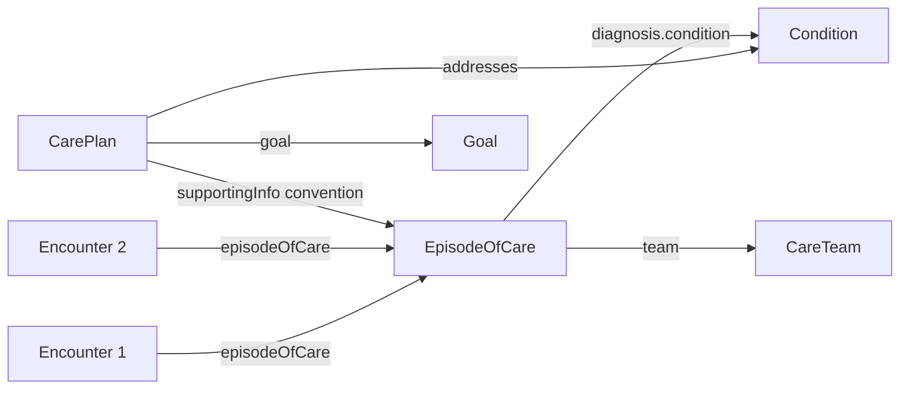

import ExampleCode from '!!raw-loader!@site/../examples/src/careplans/longitudinal-tracking-examples.ts';
import MedplumCodeBlock from '@site/src/components/MedplumCodeBlock';

# Longitudinal Patient Case Tracking

A patient may have several visits, messages, and follow-up Tasks during one care program. The team still needs a way to answer: who is responsible for this case, and is it still active?

Use an [EpisodeOfCare](/docs/api/fhir/resources/episodeofcare) for that period of responsibility. A program enrollment, treatment course, or ongoing case can justify an episode. Independent tasks or a single visit can use their existing resources.

## Start a Case and Name the Responsible Team {/* #establish-case-identity-and-responsibility */}

| Field | Purpose |
| --- | --- |
| `patient` | Patient whose care is being tracked |
| `identifier` | Stable business identity for the enrollment or case |
| `status` and `statusHistory` | Current lifecycle and periods spent in earlier states |
| `type` | Program or kind of episode |
| `period` | Period of responsibility |
| `managingOrganization` | Organization responsible for the episode |
| `careManager` and `team` | Responsible coordinator and CareTeam references |
| `diagnosis.condition` | Conditions relevant to this episode |

EpisodeOfCare can record both coordinator and team assignments. Clinical goals and planned activities belong in CarePlan and Goal.

:::tip[Two cases can share a diagnosis]

Create each case with its own identity. Two concurrent episodes can address the same Condition; the diagnosis is not the case identifier. Use conditional create on a stable enrollment identifier when imports or launch requests may repeat.

:::

## Bring Visits and Plans into the Case {/* #link-visits-and-clinical-plans */}


```mermaid
flowchart LR
  visit1[Encounter 1] -->|episodeOfCare| episode[EpisodeOfCare]
  visit2[Encounter 2] -->|episodeOfCare| episode
  plan[CarePlan] -->|supportingInfo convention| episode
  plan -->|addresses| condition[Condition]
  episode -->|diagnosis.condition| condition
  plan -->|goal| goal[Goal]
  episode -->|team| team[CareTeam]
```

`Encounter.episodeOfCare` is an array, so one visit can contribute to multiple episodes. Use Appointment for the booking workflow; create a planned Encounter only when the encounter model calls for it, rather than creating one merely to group an appointment.

:::note[Choose the plan-to-case convention explicitly]

For a plan formed in the context of a case, this guide uses `CarePlan.supportingInfo` to reference the EpisodeOfCare. This is a supporting-context convention, not a dedicated R4 case-membership field. Decide whether one plan can relate to multiple episodes and document that rule consistently.

:::

```json
{
  "resourceType": "CarePlan",
  "status": "active",
  "intent": "plan",
  "title": "Patient follow-up plan",
  "subject": { "reference": "Patient/example" },
  "supportingInfo": [{ "reference": "EpisodeOfCare/program-enrollment" }],
  "careTeam": [{ "reference": "CareTeam/patient-team" }],
  "activity": [{ "reference": { "reference": "Task/follow-up" } }]
}
```

Use a stable enrollment key to create the episode and its plan. This function takes references to an existing patient and organization and uses the episode's returned ID in the plan. Each conditional create can be retried with the same key if the process stops between writes; existing records retain their current state.

<MedplumCodeBlock language="ts" selectBlocks="caseImports, createCaseTs">
  {ExampleCode}
</MedplumCodeBlock>

Apply the [patient-context and access rules](/docs/careplans/teams-and-delegation#assignment-and-access) to the linked records.

## Find the Records for One Case {/* #retrieve-the-correct-case-context */}

```http
GET /fhir/R4/EpisodeOfCare?patient=Patient/example&status=active
GET /fhir/R4/Encounter?episode-of-care=EpisodeOfCare/program-enrollment
GET /fhir/R4/CarePlan?patient=Patient/example
```

For the last query, follow pagination and select plans whose `supportingInfo` explicitly references the episode. This selection resolves an association among already authorized resources; access remains enforced by AccessPolicy.

This example follows every page of authorized plans and checks the explicit episode reference:

<MedplumCodeBlock language="ts" selectBlocks="findCasePlansTs">
  {ExampleCode}
</MedplumCodeBlock>

A Condition search can find plans addressing a diagnosis, but cannot uniquely find an episode's plans. There is no standard R4 CarePlan search parameter for this `supportingInfo` association. If direct server-side episode-to-plan queries are essential at scale, agree on and validate a custom SearchParameter before relying on one.

For work authorized by the plan, `Task.basedOn` can reference the CarePlan; keep `focus` for the actual request or resource being acted on. Work directly concerning case administration can focus on the EpisodeOfCare. Avoid overwriting a clinical focus merely to simplify case grouping. Other case-level work may need a documented grouping convention; an Encounter reference alone cannot identify one case when the visit spans several.

## Transfer or Close the Case Without Dropping Work {/* #change-responsibility-and-close-the-case */}

For a coordinator change within the same period of organizational responsibility, update `careManager` or team membership and retain history. Update individual open Task owners separately. A transfer to another organization can require a new episode, particularly when responsibility periods or system ownership differ; agree on the transfer boundary instead of silently reassigning the entire history.

Before setting the episode to `finished`, review open plans and Tasks. Complete, cancel, or transfer each obligation according to its own criteria. Set the episode's end date and retain the evidence of who remained responsible at each stage. Finishing an episode does not automatically close its plans, goals, appointments, or Tasks.

See [Care Plans and Goals](/docs/careplans/care-plans-and-goals) and [Teams and Delegation](/docs/careplans/teams-and-delegation). The [Chamber Cardio case study](/blog/chamber-cardio-case-study) provides an example of the broader care-coordination problem these models support.
