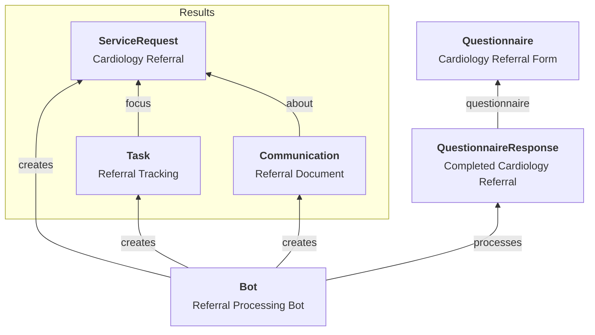

# Referral Creation & Capture {#referral-creation}

## Capturing Referral Requests

A variety of referral capture experiences are possible, and customizability is one of the key reasons to use a headless system. From a technical perspective, the referral capture process should result in the creation of a complete [`ServiceRequest`](/docs/api/fhir/resources/servicerequest) resource along with supporting information.

Some implementations use a simple form interface that collects basic information about the patient, reason for referral, and intended recipient, then constructs a [`ServiceRequest`](/docs/api/fhir/resources/servicerequest) resource.

More sophisticated implementations use a library of [`Questionnaires`](/docs/questionnaires/) tailored to different specialties or referral types, and then use [`Bots`](/docs/bots/bot-for-questionnaire-response) to process the [`QuestionnaireResponse`](/docs/api/fhir/resources/questionnaireresponse) and create the appropriate resources.



## Example Bot for Processing Referrals

Here's an example of a Medplum Bot that processes a QuestionnaireResponse and creates the necessary referral resources:

```typescript
import { BotEvent, MedplumClient } from '@medplum/core';
import { 
  QuestionnaireResponse, 
  ServiceRequest, 
  Task,
  Communication,
  DocumentReference
} from '@medplum/fhirtypes';

/**
 * This bot processes a cardiology referral questionnaire response
 * and creates all necessary referral resources.
 */
export async function handler(medplum: MedplumClient, event: BotEvent): Promise<any> {
  // Get the QuestionnaireResponse
  const questionnaireResponse = event.input as QuestionnaireResponse;
  
  // Helper function to get answers from the QuestionnaireResponse
  function getAnswerValue(linkId: string): any {
    const item = questionnaireResponse.item?.find(i => i.linkId === linkId)
      || questionnaireResponse.item?.flatMap(i => i.item || []).find(i => i.linkId === linkId);
    
    if (!item || !item.answer || item.answer.length === 0) {
      return undefined;
    }
    
    const answer = item.answer[0];
    
    if ('valueString' in answer) return answer.valueString;
    if ('valueReference' in answer) return answer.valueReference;
    if ('valueCoding' in answer) return answer.valueCoding;
    if ('valueDate' in answer) return answer.valueDate;
    if ('valueAttachment' in answer) return answer.valueAttachment;
    if ('valueBoolean' in answer) return answer.valueBoolean;
    
    return undefined;
  }
  
  // Get values from the questionnaire response
  const patientReference = questionnaireResponse.subject;
  const referralCategory = getAnswerValue('referral-category');
  const specialty = getAnswerValue('specialty');
  const urgency = getAnswerValue('urgency');
  const reason = getAnswerValue('reason');
  const symptoms = getAnswerValue('symptoms');
  const duration = getAnswerValue('duration');
  const history = getAnswerValue('relevant-history');
  const medications = getAnswerValue('medications');
  const allergies = getAnswerValue('allergies');
  
  if (!patientReference) {
    throw new Error('Missing patient reference');
  }

  // Create a ServiceRequest
  const serviceRequest: ServiceRequest = {
    resourceType: 'ServiceRequest',
    status: 'active',
    intent: 'order',
    category: [{
      coding: [referralCategory]
    }],
    priority: urgency || 'routine',
    code: {
      coding: [specialty],
      text: specialty?.display || 'Specialist consultation'
    },
    subject: patientReference,
    authoredOn: new Date().toISOString(),
    requester: {
      reference: `Practitioner/${event.context.author?.id}`
    },
    performer: [
      // This would typically be determined based on the specialty
      // and your provider directory
      {
        reference: 'Practitioner/cardiologist-id',
        display: 'Dr. Helen Cardio'
      }
    ],
    reasonCode: [{
      text: reason
    }],
    note: [{
      text: `${symptoms || ''}\n${duration ? 'Duration: ' + duration : ''}\n${history ? 'History: ' + history : ''}\n${medications ? 'Medications: ' + medications : ''}\n${allergies ? 'Allergies: ' + allergies : ''}`
    }]
  };
  
  // Create the ServiceRequest in Medplum
  const createdServiceRequest = await medplum.createResource(serviceRequest);
  
  // Create a Task to track the referral
  const task: Task = {
    resourceType: 'Task',
    status: 'requested',
    intent: 'order',
    priority: urgency || 'routine',
    code: {
      coding: [{
        system: 'http://terminology.hl7.org/CodeSystem/task-code',
        code: 'fulfill',
        display: 'Fulfill the focal request'
      }]
    },
    focus: {
      reference: `ServiceRequest/${createdServiceRequest.id}`
    },
    for: patientReference,
    authoredOn: new Date().toISOString(),
    lastModified: new Date().toISOString(),
    requester: {
      reference: `Practitioner/${event.context.author?.id}`
    },
    owner: {
      reference: 'Practitioner/cardiologist-id'
    },
    description: `${specialty?.display || 'Specialist'} referral for ${reason}`
  };
  
  // Create the Task in Medplum
  const createdTask = await medplum.createResource(task);
  
  // Get patient details for the referral document
  const patient = await medplum.readReference(patientReference);
  
  // Create a Communication to inform the specialist
  const communication: Communication = {
    resourceType: 'Communication',
    status: 'completed',
    category: [{
      coding: [{
        system: 'http://terminology.hl7.org/CodeSystem/communication-category',
        code: 'notification',
        display: 'Notification'
      }],
      text: 'Referral'
    }],
    subject: patientReference,
    about: [{
      reference: `ServiceRequest/${createdServiceRequest.id}`
    }],
    sent: new Date().toISOString(),
    recipient: [{
      reference: 'Practitioner/cardiologist-id'
    }],
    sender: {
      reference: `Practitioner/${event.context.author?.id}`
    },
    payload: [{
      contentString: `New referral received for ${patient.name?.[0]?.given?.[0] || ''} ${patient.name?.[0]?.family || ''} for ${reason}.`
    }]
  };
  
  // Create the Communication in Medplum
  const createdCommunication = await medplum.createResource(communication);
  
  return {
    serviceRequest: createdServiceRequest,
    task: createdTask,
    communication: createdCommunication
  };
}
```

## Key Resources

| **Resource**                                                         | **Description**                                                                                                                              |
| -------------------------------------------------------------------- | -------------------------------------------------------------------------------------------------------------------------------------------- |
| [`Questionnaire`](/docs/api/fhir/resources/questionnaire)            | Defines the structure and content of the referral form.                                                                                       |
| [`QuestionnaireResponse`](/docs/api/fhir/resources/questionnaireresponse) | Contains the completed referral data.                                                                                                 |
| [`ServiceRequest`](/docs/api/fhir/resources/servicerequest)          | The primary referral resource created from the QuestionnaireResponse.                                                                         |
| [`Task`](/docs/api/fhir/resources/task)                              | Created to track the workflow status of the referral.                                                                                         |
| [`Communication`](/docs/api/fhir/resources/communication)            | Created to represent the transmission of the referral to the receiving provider.                                                              |

## Key Code Systems

| **Code System**                                                | **Description**                                                                                                                                     |
| -------------------------------------------------------------- | --------------------------------------------------------------------------------------------------------------------------------------------------- |
| [SNOMED CT](https://www.snomed.org/)                           | Used to code referral types (e.g., "308447001" for "Referral to specialist").                                                                       |
| [LOINC](https://loinc.org/)                                    | Can be used to standardize questionnaire items when capturing referral data.                                                                        |


