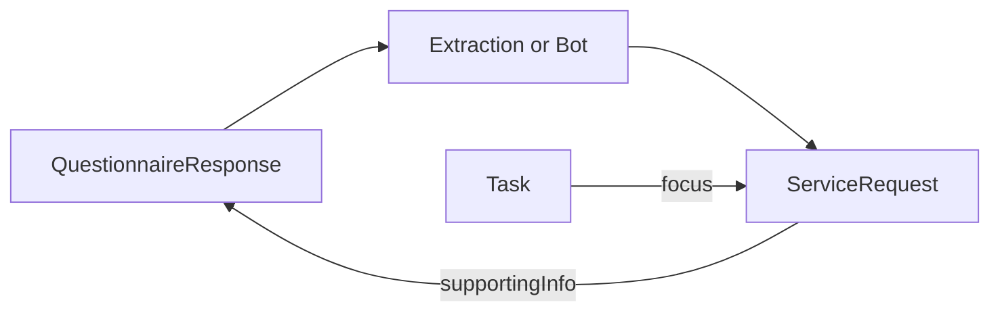

# Creating and Capturing Referrals {/* #referral-creation */}

Referral forms vary by specialty, but the receiving team usually needs the same starting point: who the patient is, what service is requested, why it is needed, and who is requesting it. Capture that common information consistently, then add the specialty-specific details.

## Give Each Requested Service Its Own Identity {/* #start-with-the-servicerequest */}

Use one [ServiceRequest](/docs/api/fhir/resources/servicerequest) for each independently managed requested service. If a form requests several distinct services, create separate requests and use a shared `requisition` identifier when they were authorized together.

| Field | What to capture |
| --- | --- |
| `subject` | The confirmed Patient reference |
| `identifier` | A stable referral number in the assigning system's namespace |
| `status` and `intent` | The request's lifecycle and whether it is a proposal, plan, or order |
| `category` and `code` | Referral classification and the service requested |
| `priority` | Clinically agreed urgency using R4 request-priority values |
| `requester` | The person or organization responsible for the request |
| `performer` | The intended clinician, organization, or service, when known |
| `reasonCode` or `reasonReference` | The reason for the service, in text/coding or linked clinical records |
| `supportingInfo` | Relevant assessments, results, or documents |
| `encounter` | The originating encounter, when the request arose during one |

:::tip[A referral does not need a visit first]

You can create a referral outside a visit. Keep `encounter` optional for intake or outreach workflows rather than creating an Encounter just to fill the field.

:::

## Turn Form Answers into a Referral {/* #capture-and-map-the-form */}

A simple application form can construct the ServiceRequest directly. For reusable forms, use a [Questionnaire](/docs/questionnaires) and retain the QuestionnaireResponse. A shared set of core questions helps specialty forms produce a consistent request model.

Choose one [extraction strategy](/docs/questionnaires/parsing-questionnaire-responses) for each form: SDC template extraction or a Bot that maps the answers. Validate required answers, patient identity, allowed values, and the selected recipient before creating the request. Use the core QuestionnaireResponse helpers for nested and repeated answers rather than assuming every answer is a top-level item.


```mermaid
flowchart LR
  form[QuestionnaireResponse] --> mapping[Extraction or Bot]
  mapping --> referral[ServiceRequest]
  task[Task] -->|focus| referral
  referral -->|supportingInfo| form
```

Keep an audit of the mapping and clinical author. Record the clinical author in `ServiceRequest.requester` and preserve the Bot's execution identity separately.

## Let the Clinician Review Before Release {/* #save-drafts-and-release-orders */}

A draft order uses `status: draft` and `intent: order`. Once the authorized user releases it, change the status to `active` and record when it became actionable in `authoredOn`. Sending is a later operational step and can fail while the clinical order remains active.

:::note[Draft and proposal mean different things]

A proposal recommends care; a draft order is an order being prepared. If your workflow starts with a true proposal, retain it and create the authorized order with `basedOn` referencing the proposal. Do not use `intent` as a save-draft flag. See the [R4 ServiceRequest definitions](https://hl7.org/fhir/R4/servicerequest-definitions.html#ServiceRequest.intent).

:::

This example shows a released order. The text labels are illustrative; configure clinically validated terminology for production forms.

```json
{
  "resourceType": "ServiceRequest",
  "identifier": [{
    "system": "https://example.org/referrals",
    "value": "REF-2026-001"
  }],
  "status": "active",
  "intent": "order",
  "priority": "routine",
  "code": { "text": "Specialist consultation" },
  "subject": { "reference": "Patient/example" },
  "requester": { "reference": "PractitionerRole/referring-clinician" },
  "authoredOn": "2026-10-06T16:00:00Z",
  "reasonCode": [{ "text": "Clinical reason documented by the referring clinician" }]
}
```

## Make Submission Safe to Repeat

A user may click Submit twice, or a Bot may receive the same event again. Use a stable submission or referral identifier for conditional create, including when a Bot processes the form. `createResourceIfNoneExist` avoids a search-then-create race. Replaying the same submission should retrieve the existing request.

If the request and its initial Task must be created together, use a transaction Bundle with `urn:uuid` fullUrls for their cross-references. See the [Worked Referral Example](/docs/careplans/referrals/fhir-resource-examples). Conditional create does not apply later edits to an existing match; use an authorized, version-checked update path for amendments.

Next, choose the [recipient and referral package](/docs/careplans/referrals/recipients-and-packages).
