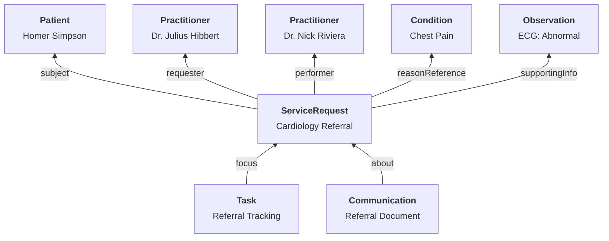

# Referral Management

Building out a referral management experience requires composing multiple FHIR resources into a workflow that meets the requirements of both referring and receiving providers. There are three primary interactions that developers should consider when building out a custom referral management solution:

- **Capturing referral requests** from the referring provider
- **Transmitting referrals** to receiving providers
- **Tracking referral status** throughout the workflow

## Referral Overview

Here is a **sample** of what a referral management experience might look like - to be clear, referral interfaces can look however you want them to. A sample referral application could be built using Medplum [React components](https://storybook.medplum.com/?path=/docs/medplum-introduction--docs).

When capturing referral information, gathering the essential details using a [Questionnaire](/docs/api/fhir/resources/questionnaire.mdx) is a good first step. This can be used to create a [ServiceRequest](/docs/api/fhir/resources/servicerequest.mdx) which serves as the core referral resource. You can query all resources related to a given referral from the [ServiceRequest](/docs/api/fhir/resources/servicerequest.mdx) endpoint.

Depending on your use case, you might need to include different supporting information such as [Conditions](/docs/api/fhir/resources/condition.mdx), [Observations](/docs/api/fhir/resources/observation.mdx), or [DocumentReferences](/docs/api/fhir/resources/documentreference.mdx). [Search](/docs/search/) is useful to construct the specific queries that will give the context needed for a complete referral.

React components are available to aid in building a quick referral experience. [QuestionnaireForm](https://storybook.medplum.com/?path=/docs/medplum-questionnaireform--basic), [ResourceTable](https://storybook.medplum.com/?path=/docs/medplum-resourcetable--basic), [Search control](https://storybook.medplum.com/?path=/docs/medplum-searchcontrol--checkboxes), [ResourceAvatar](https://storybook.medplum.com/?path=/docs/medplum-resourceavatar--image), and [Timeline](https://storybook.medplum.com/?path=/docs/medplum-timeline--basic) are potential components that can speed development of the referral management interface.

### Key Resources

| **Resource**                                                   | **Description**                                                                                                                                  |
| -------------------------------------------------------------- | ------------------------------------------------------------------------------------------------------------------------------------------------ |
| [`ServiceRequest`](/docs/api/fhir/resources/servicerequest)    | The primary resource for representing a referral. Contains details about the requested service, priority, and supporting information.             |
| [`Task`](/docs/api/fhir/resources/task)                        | Used to track the status of the referral through its lifecycle (requested, accepted, rejected, in-progress, completed).                          |
| [`Questionnaire`](/docs/api/fhir/resources/questionnaire)      | Defines structured forms for capturing referral information consistently.                                                                         |
| [`QuestionnaireResponse`](/docs/api/fhir/resources/questionnaireresponse) | Contains the completed referral form data that can be processed to create a ServiceRequest.                                          |
| [`Communication`](/docs/api/fhir/resources/communication)      | Represents the transmission of referral information between providers, including attachments and delivery status.                                 |
| [`DocumentReference`](/docs/api/fhir/resources/documentreference) | Used to attach clinical documents, images, or other files to the referral.                                                                    |
| [`Condition`](/docs/api/fhir/resources/condition)              | Represents diagnoses that justify the reason for the referral.                                                                                    |
| [`Observation`](/docs/api/fhir/resources/observation)          | Contains clinical measurements or findings that support the referral.                                                                             |

### Key Code Systems

| **Code System**                                                | **Description**                                                                                                                                |
| -------------------------------------------------------------- | ---------------------------------------------------------------------------------------------------------------------------------------------- |
| [SNOMED CT](https://www.snomed.org/)                           | Used in [`ServiceRequest`](/docs/api/fhir/resources/servicerequest) resources to specify referral types and specialties.                       |
| [ICD-10](https://www.cdc.gov/nchs/icd/icd10cm_browsertool.htm) | Used in [`Condition`](/docs/api/fhir/resources/condition) resources to specify diagnoses that justify the referral.                           |
| [LOINC](https://loinc.org/)                                    | Used in [`Observation`](/docs/api/fhir/resources/observation) resources to specify clinical measurements included in the referral.            |

## Reference

- [FHIR ServiceRequest Resource](https://hl7.org/fhir/R4/servicerequest.html)
- [FHIR Task Resource](https://hl7.org/fhir/R4/task.html)
- [FHIR Communication Resource](https://hl7.org/fhir/R4/communication.html)
- [Medplum Questionnaires Documentation](/docs/questionnaires/)
- [Medplum Bots Documentation](/docs/bots/)
