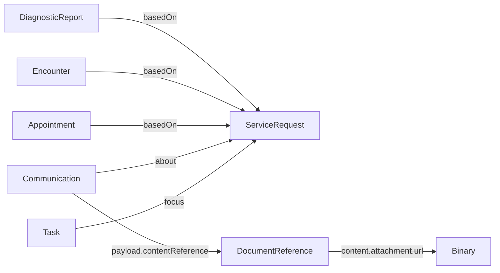

# Referrals

A referral can be sent successfully and still go nowhere. The receiving clinic may need another document, the patient may need help scheduling, or the consultation note may never make it back to the referring team. A useful referral workflow keeps those next steps visible.

In Medplum, start with a [ServiceRequest](/docs/api/fhir/resources/servicerequest) for the requested clinical service. Add Tasks for the work around it and link the messages, documents, appointments, and results as they arrive.

:::tip[Plan the workflow first]

Use the [Referrals Decision Guide](/docs/decision-guides/referrals) to decide which sending, receiving, and follow-up steps your product supports. You can build either side of the exchange without implementing every workflow in this section.

:::

## The Referral Data Model

| Resource | Role in the workflow |
| --- | --- |
| `ServiceRequest` | The requested service, patient, requester, intended performer, and clinical context |
| `Task` | An accountable work item, such as intake review, scheduling, or reviewing the returned note |
| `QuestionnaireResponse` | Answers captured in a referral form, retained alongside the resulting request |
| `Communication` | Messages about the referral, including the material sent and relevant transmission times |
| `DocumentReference` and `Binary` | Document metadata and the actual file bytes |
| `Appointment` and `Encounter` | The booking and the care interaction that follows |
| `DiagnosticReport` or another clinical result | Evidence of the service provided |

```mermaid
flowchart LR
  task[Task] -->|focus| referral[ServiceRequest]
  message[Communication] -->|about| referral
  message -->|payload.contentReference| document[DocumentReference]
  document -->|content.attachment.url| binary[Binary]
  appointment[Appointment] -->|basedOn| referral
  encounter[Encounter] -->|basedOn| referral
  result[DiagnosticReport] -->|basedOn| referral
```

Each patient-related resource also needs its own patient reference. The arrows in this diagram connect clinical and workflow context; access is enforced by [AccessPolicy and ProjectMembership](/docs/access/access-policies).

## Keep the Milestones Distinct

A delivery receipt tells you that a package arrived. It does not tell you that the clinic accepted the referral or that the patient received the service. Track these milestones separately:

| Milestone | Evidence |
| --- | --- |
| Package delivered | Channel acknowledgment correlated to the outbound message |
| Referral accepted | Receiving team's explicit acceptance of the work |
| Visit scheduled | Appointment linked to the ServiceRequest |
| Service performed | Encounter or clinical result, with request status reconciled by the responsible party |
| Loop closed | Returned information reviewed and any required follow-up assigned |

`ServiceRequest.status` describes the clinical request. `Task.status` describes a particular unit of work. Use `Task.businessStatus` for local stages such as waiting for documents; keep the meaning of each stage consistent across the UI and automation.

## Build Your Referral Workflow

1. [Creating and Capturing Referrals](/docs/careplans/referrals/creation-and-capture): forms, draft orders, identifiers, and release.
2. [Recipients and Referral Packages](/docs/careplans/referrals/recipients-and-packages): directory choices, supporting context, and file handling.
3. [Sending Referrals and Tracking Delivery](/docs/careplans/referrals/transmition-and-tracking): channels, communication records, acknowledgments, and retries.
4. [Receiving and Triaging Referrals](/docs/careplans/referrals/receiving-and-triage): source retention, patient matching, duplicate handling, and review.
5. [Processing and Coordinating Referrals](/docs/careplans/referrals/processing-and-coordination): ownership, authorization, scheduling, and rerouting.
6. [Results and Closing the Loop](/docs/careplans/referrals/results-and-closure): matching returned records and defining completion.
7. [Worked Referral Example](/docs/careplans/referrals/fhir-resource-examples): a connected set of R4 resources.

For patterns shared with other practice workflows, see [Care Coordination](/docs/careplans), especially [Tasks and Work Queues](/docs/careplans/tasks) and [Handoffs and Escalation](/docs/careplans/handoffs-and-escalation).
