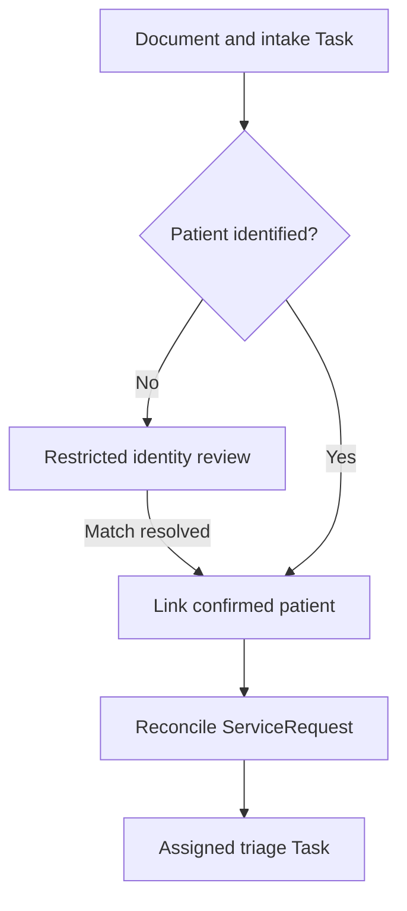

# Receiving and Triaging Referrals

An incoming referral may be a clean API request or a scanned document with a hard-to-read patient name. Both need an accountable intake path. Preserve what arrived, confirm who it belongs to, and make the next action clear to the receiving team.

## Keep What Arrived {/* #preserve-the-source */}

Store incoming files as Binary with a DocumentReference describing the source and receipt context. Retain sender identifiers and transmission identifiers separately: the same referral can arrive through more than one channel.

For structured FHIR, validate the resource and resolve its references before persisting it locally. For C-CDA or other structured documents, parse the source fields directly. Image-only documents may need OCR and human review before the extracted values become clinical records.

The [Titan case study](/blog/titan-case-study) illustrates why normalization and review matter in referral intake. Automated extraction can reduce transcription work, but the source remains useful when a reviewer needs to resolve an ambiguity.

## Confirm Which Patient the Referral Belongs To {/* #resolve-patient-identity-before-clinical-intake */}

An uncertain match needs a place to wait and someone to resolve it. Keep that review separate from the clinical intake that follows:

Match against trusted identifiers with their assigning namespaces. When identifiers are missing or conflict, send the item through a defined review process. Similar names and dates of birth can support a match decision; they are not a safe substitute for resolving it.

If the patient is not yet identified, create an intake Task focused on the source DocumentReference. Omit `Task.for` and `DocumentReference.subject` until the match is established, and protect both through an organization-scoped intake AccessPolicy. Binary uses the corresponding security context. These unmatched records will not appear in a patient-compartment view.

After confirmation, add the patient references to the intake records and create or reconcile the ServiceRequest. A patient referral needs a valid `ServiceRequest.subject`; do not attach an uncertain referral to a convenient placeholder patient.

:::tip[Identity and duplicate handling are different steps]

A conditional create can keep the same external referral number from producing two ServiceRequests. It cannot decide whether two similar demographic records represent the same person. Resolve identity first, then use stable identifiers to make ingestion repeatable.

:::

## Give the Intake Team a Clear Next Step {/* #create-the-receiving-work-item */}

Preserve the sender's request semantics, including the clinical requester, service, priority, and identifiers. Use a receiving-side Task for triage, focused on the ServiceRequest and assigned to the intake organization, service, or individual.

| Intake outcome | Representation |
| --- | --- |
| Received for review | `Task.status: received` when acknowledging a request for work |
| Accepted by the receiving team | `Task.status: accepted`, with an accountable owner |
| Review has begun | `Task.status: in-progress` |
| Waiting for missing material | `Task.status: on-hold`, local `businessStatus`, and an explanatory `statusReason` |
| Receiving team declines the work | `Task.status: rejected` with a reason and a response to the sender |

These statuses belong to the Task whose requested work is being accepted or declined. If you model triage as its own review Task, that review can be `completed` with a declined disposition while the fulfillment request remains unaccepted. Choose the scope of each Task before defining its transitions.

The receiver's decision does not itself revoke the sender's clinical order. Reconcile `ServiceRequest.status` through the agreed request-authority model.

## Recognize a Repeat Delivery or a Changed Request {/* #handle-repeated-and-amended-referrals */}

Use the source referral identifier, including its namespace, for conditional create. Use a stable identity for the initial receiving Task as well. Preserve each incoming transmission even when it relates to an existing request.

If a second document lacks a reliable referral identifier, flag a potential duplicate for review. Patient plus specialty alone is not unique: a patient can have more than one legitimate referral for the same service.

:::caution[An amendment needs review, even when the ID matches]

An amendment needs a version-checked update or an explicit replacement workflow. Conditional create only finds an existing match; it does not merge new clinical content. Record who reviewed the amendment and retain the source evidence.

:::

Send acknowledgments through the [transmission workflow](/docs/careplans/referrals/transmition-and-tracking), then move accepted work into [Processing and Coordination](/docs/careplans/referrals/processing-and-coordination).
