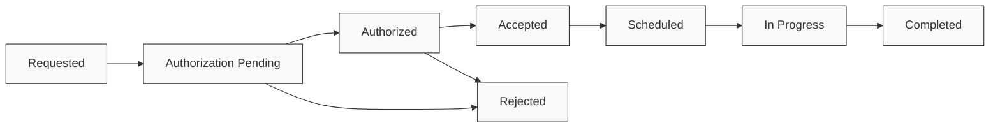

# Referral Transmission & Tracking

## Transmitting Referrals

Referrals need to be securely transmitted to receiving providers. This can be done using various methods depending on the technical capabilities of the receiving system.

The [`Communication`](/docs/api/fhir/resources/communication) resource is used to represent the transmission event, including details about the sender, recipient, and payload. For recipients without a FHIR API, a [`Bot`](/docs/bots/) can be used to generate and send a PDF of the referral information.

### C-CDA Transitions of Care

For interoperability with external systems, referrals often need to be transmitted as C-CDA (Consolidated Clinical Document Architecture) documents. The Transitions of Care template is specifically designed for referral scenarios and includes structured sections for:

- Reason for referral
- Current medications
- Allergies and adverse reactions
- Problem list
- Relevant diagnostic results
- Care plan and instructions

See the [C-CDA Transitions of Care documentation](/docs/integration/c-cda#transitions-of-care) for implementation details on generating standards-compliant referral documents.

```typescript
// Example of generating a C-CDA Transitions of Care document for a referral
const ccdaDocument = await medplum.generateCCDA({
  patient: patientReference,
  templateType: 'transitions-of-care',
  serviceRequest: serviceRequestReference,
  includeSection: [
    'reason-for-referral',
    'medications',
    'allergies',
    'problems',
    'results',
    'care-plan'
  ]
});
```

## Essential Referral Data Requirements

### Clinical Documentation Requirements

Successful referrals require comprehensive clinical documentation to ensure:
- **Specialist acceptance**: Clear justification for the referral
- **Insurance authorization**: Medical necessity documentation
- **Reimbursement compliance**: Proper diagnostic and procedural coding
- **Continuity of care**: Complete clinical context transfer

### Core Data Elements

| **Category** | **Required Elements** | **FHIR Resources** | **Billing Impact** |
|--------------|----------------------|-------------------|-------------------|
| **Patient Demographics** | Name, DOB, MRN, Insurance ID | [`Patient`](/docs/api/fhir/resources/patient) | Required for claims processing |
| **Clinical Justification** | Primary/secondary diagnoses with ICD-10 codes | [`Condition`](/docs/api/fhir/resources/condition) | Medical necessity for authorization |
| **Diagnostic Evidence** | Lab results, imaging reports, diagnostic tests | [`Observation`](/docs/api/fhir/resources/observation), [`DiagnosticReport`](/docs/api/fhir/resources/diagnosticreport) | Supports medical necessity |
| **Treatment History** | Previous interventions, medications tried | [`MedicationRequest`](/docs/api/fhir/resources/medicationrequest), [`Procedure`](/docs/api/fhir/resources/procedure) | Demonstrates step therapy compliance |
| **Current Medications** | Active prescriptions with dosages | [`MedicationRequest`](/docs/api/fhir/resources/medicationrequest) | Drug interaction screening |
| **Allergies & Intolerances** | Known allergies and adverse reactions | [`AllergyIntolerance`](/docs/api/fhir/resources/allergyintolerance) | Safety screening |
| **Insurance Information** | Coverage details, authorization requirements | [`Coverage`](/docs/api/fhir/resources/coverage) | Claims processing and authorization |


## Tracking Referral Status

Once a referral has been sent, it's important to track its status through the entire lifecycle. The [`Task`](/docs/api/fhir/resources/task) resource is ideal for this purpose, as it provides a standard way to represent workflow status.



### Enhanced Status Tracking

The Task resource should include business-specific status information:

```json
{
  "resourceType": "Task",
  "businessStatus": {
    "coding": [
      {
        "system": "http://example.org/referral-status",
        "code": "prior-auth-pending",
        "display": "Prior authorization pending"
      }
    ]
  },
  "statusReason": {
    "text": "Waiting for insurance authorization - submitted 2024-01-15"
  }
}
```

### Diagnostic Report Transfer

When diagnostic reports are required for the referral, ensure proper linkage:

```json
{
  "resourceType": "DiagnosticReport",
  "id": "ecg-report-for-referral",
  "status": "final",
  "category": [
    {
      "coding": [
        {
          "system": "http://terminology.hl7.org/CodeSystem/v2-0074",
          "code": "CUS",
          "display": "Cardiology"
        }
      ]
    }
  ],
  "code": {
    "coding": [
      {
        "system": "http://loinc.org",
        "code": "11524-6",
        "display": "EKG study"
      }
    ]
  },
  "basedOn": [
    {
      "reference": "ServiceRequest/cardiology-referral-example"
    }
  ],
  "presentedForm": [
    {
      "contentType": "application/pdf",
      "data": "JVBERi0xLjMKJcTl8uXrp...",
      "title": "ECG Report - John Smith"
    }
  ]
}
```

## Specialist Response Integration

When a specialist responds to a referral, their response can be captured as a [`DocumentReference`](/docs/api/fhir/resources/documentreference) and linked to the original referral through the [`ServiceRequest`](/docs/api/fhir/resources/servicerequest). If the response results in an appointment, an [`Appointment`](/docs/api/fhir/resources/appointment) resource can be created and linked to the referral.

### Billing Code Integration

Specialist responses should include appropriate billing codes for services rendered:

```json
{
  "resourceType": "Encounter",
  "id": "specialist-consultation",
  "status": "finished",
  "class": {
    "system": "http://terminology.hl7.org/CodeSystem/v3-ActCode",
    "code": "AMB",
    "display": "ambulatory"
  },
  "type": [
    {
      "coding": [
        {
          "system": "http://www.ama-assn.org/go/cpt",
          "code": "99244",
          "display": "Office consultation for a new or established patient"
        }
      ]
    }
  ],
  "basedOn": [
    {
      "reference": "ServiceRequest/cardiology-referral-example"
    }
  ],
  "diagnosis": [
    {
      "condition": {
        "reference": "Condition/final-cardiac-diagnosis"
      },
      "use": {
        "coding": [
          {
            "system": "http://terminology.hl7.org/CodeSystem/diagnosis-role",
            "code": "AD",
            "display": "Admission diagnosis"
          }
        ]
      }
    }
  ]
}
```

## Example Specialist Response

```json
{
  "resourceType": "DocumentReference",
  "id": "specialist-response-example",
  "status": "current",
  "docStatus": "final",
  "type": {
    "coding": [
      {
        "system": "http://loinc.org",
        "code": "11488-4",
        "display": "Consultation note"
      }
    ]
  },
  "subject": {
    "reference": "Patient/example-patient-id",
    "display": "John Smith"
  },
  "date": "2023-06-15T10:00:00Z",
  "author": [
    {
      "reference": "Practitioner/cardiologist-id",
      "display": "Dr. Helen Cardio"
    }
  ],
  "authenticator": {
    "reference": "Practitioner/cardiologist-id",
    "display": "Dr. Helen Cardio"
  },
  "content": [
    {
      "attachment": {
        "contentType": "application/pdf",
        "data": "JVBERi0xLjMKJcTl8uXrp...",
        "title": "Cardiology Consultation Report - John Smith",
        "creation": "2023-06-15T10:00:00Z"
      }
    }
  ],
  "context": {
    "related": [
      {
        "reference": "ServiceRequest/cardiology-referral-example"
      }
    ]
  }
}
```
