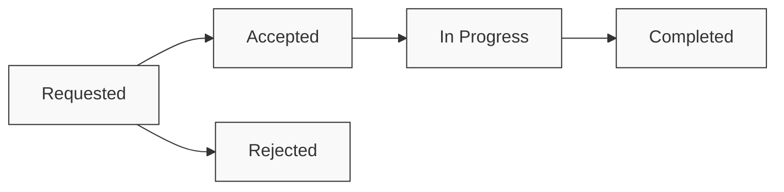

# Referral Transmission & Tracking

## Transmitting Referrals

Referrals need to be securely transmitted to receiving providers. This can be done using various methods depending on the technical capabilities of the receiving system.

The [`Communication`](/docs/api/fhir/resources/communication) resource is used to represent the transmission event, including details about the sender, recipient, and payload. For recipients without a FHIR API, a [`Bot`](/docs/bots/) can be used to generate and send a PDF of the referral information.

## Tracking Referral Status

Once a referral has been sent, it's important to track its status through the entire lifecycle. The [`Task`](/docs/api/fhir/resources/task) resource is ideal for this purpose, as it provides a standard way to represent workflow status.



When a specialist responds to a referral, their response can be captured as a [`DocumentReference`](/docs/api/fhir/resources/documentreference) and linked to the original referral through the [`ServiceRequest`](/docs/api/fhir/resources/servicerequest). If the response results in an appointment, an [`Appointment`](/docs/api/fhir/resources/appointment) resource can be created and linked to the referral.

## Example Specialist Response

```json
{
  "resourceType": "DocumentReference",
  "id": "specialist-response-example",
  "status": "current",
  "docStatus": "final",
  "type": {
    "coding": [
      {
        "system": "http://loinc.org",
        "code": "11488-4",
        "display": "Consultation note"
      }
    ]
  },
  "subject": {
    "reference": "Patient/example-patient-id",
    "display": "John Smith"
  },
  "date": "2023-06-15T10:00:00Z",
  "author": [
    {
      "reference": "Practitioner/cardiologist-id",
      "display": "Dr. Helen Cardio"
    }
  ],
  "authenticator": {
    "reference": "Practitioner/cardiologist-id",
    "display": "Dr. Helen Cardio"
  },
  "content": [
    {
      "attachment": {
        "contentType": "application/pdf",
        "data": "JVBERi0xLjMKJcTl8uXrp...", // Base64 encoded PDF content (truncated)
        "title": "Cardiology Consultation Report - John Smith",
        "creation": "2023-06-15T10:00:00Z"
      }
    }
  ],
  "context": {
    "related": [
      {
        "reference": "ServiceRequest/cardiology-referral-example"
      }
    ]
  }
}
```


