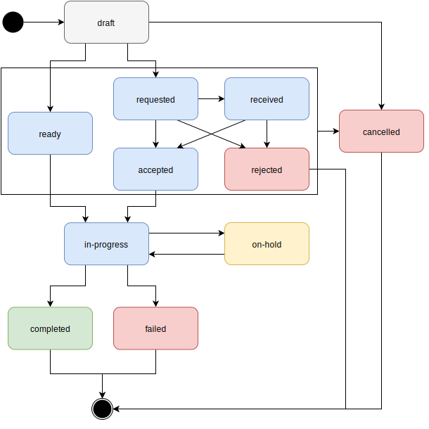

import MedplumCodeBlock from '@site/src/components/MedplumCodeBlock';
import Tabs from '@theme/Tabs';
import TabItem from '@theme/TabItem';

import ExampleCode from '!!raw-loader!@site/..//examples/src/careplans/tasks.ts';

# Using `Tasks` to Manage Clinical Workflow

Workflow management is an essential part of healthcare, and healthcare operations requiring coordination of many manual steps physicians, patients, nurses, care coordinators, etc. Generally, our goals are to

- **Top-of-License Care:** Ensure clinicians' time is being used efficiently.
- **Compliant Fifty-State Workflow:** Make sure we can serve patients across a wide geographic area robustly and efficiently
- **Automation:** Eliminate routine tasks to avoid clinician burnout.


The Medplum [Clinical Task Management Demo](https://github.com/medplum/medplum-task-demo) provides an in-depth reference implementation of a task management system that addresses these concerns.

<div style={{textAlign: 'center'}}>
  <iframe width="560" height="315" src="https://www.youtube.com/embed/xQH27B8sP9o?start=0" title="YouTube video player" frameborder="0" allow="accelerometer; autoplay; clipboard-write; encrypted-media; gyroscope; picture-in-picture" allowfullscreen/>
</div>


## Introduction
While the majority of FHIR resources represent clinical data that is _operated on_, FHIR also defines a set of workflow resources that describe and track _work to be done._ This guide will discuss the usage of the [`Task`](/docs/api/fhir/resources/task) resource, which is the basic building-block resource used to implement care plans and track workflow progress.

For example, a [`Task`](/docs/api/fhir/resources/task) might represent the task of having a practitioner complete a [PHQ-9 questionnaire](https://www.apa.org/depression-guideline/patient-health-questionnaire.pdf) for a patient as part of their onboarding.

A common application is for organizations to build **task queue systems** to route tasks to the correct practitioner based on specialty, level of credential, and availability. The [Medplum Task Demo](https://github.com/medplum/medplum-task-demo) application provides a minimalist task queue that demonstrates task search, assignment, and status.

## Task type

The `Task.code` element is used to represent the task type, equivalent to the task title. This can either be different from task to task, or selected from a standard set of task types. Using the latter approach helps enable querying across all `Tasks` of the same type.

While using SNOMED or LOINC codes are preferred, many implementations simply use the `Task.code.text` element, as task types are often implementation-specific.

`Task.description` can be used to add additional descriptive text to the specific [`Task`](/docs/api/fhir/resources/task) instance.

**Example: **

```ts
{
  resourceType: 'Task',
  id: 'example-task',
  code: {
    text: 'Complete PHQ-9',
    coding: [{
      code: '715252007',
      system: 'http://snomed.info/sct'
    }]
  },
  description: "Patient to complete PHQ-9 depression screening",
  //...
}
```

## Task status

Designing status codes for tasks varies from implementation to implementation, and requires a good understanding of your operations.

[`Task`](/docs/api/fhir/resources/task) provides three fields: `status`, `businessStatus`, and `statusReason`.

`Task.status` maps to the FHIR task lifecycle shown below. It provides coarse-grained information about the activity state of a [`Task`](/docs/api/fhir/resources/task) and is most useful for day-to-day operations, as it allows for efficient queries on active, completed, and cancelled tasks. These queries will remain stable as your implementation scales. (**Note**: in the diagram below, the codes `requested`, `received`, `accepted`, and `rejected` only apply when `Tasks` are shared between systems. Most implementations will just use `ready` to indicate a `Task` can be actioned.)



`Task.businessStatus` should map to your implementation's specific operational funnel. It provides fine-grained information to help customer service and operations teams troubleshoot tasks and monitor progress. It is also useful for analytics teams to compute conversion metrics between pipeline stages.

`Task.statusReason` describes _why_ the [`Task`](/docs/api/fhir/resources/task) has the current status, and is most commonly used when `status` is set to `"on-hold"` or `"cancelled"`. Using an orthogonal `statusReason` allows operations teams to efficiently query for all tasks at the same point in the funnel, while analytics teams can further break down by all the reasons they may be on hold.

## Task priority

`Task.priority` can be used to indicate the urgency of the task. This field uses a fixed set of codes that are borrowed from acute in-patient care settings.

| **Code**                                                                                       | **Definition**                                                                               |
| ---------------------------------------------------------------------------------------------- | -------------------------------------------------------------------------------------------- |
| [`routine`](https://hl7.org/fhir/R4/codesystem-request-priority.html#request-priority-routine) | The request has normal priority.                                                             |
| [`urgent`](https://hl7.org/fhir/R4/codesystem-request-priority.html#request-priority-urgent)   | The request should be actioned promptly - higher priority than `routine`.                    |
| [`asap`](https://hl7.org/fhir/R4/codesystem-request-priority.html#request-priority-asap)       | The request should be actioned as soon as possible - higher priority than `urgent`.          |
| [`stat`](https://hl7.org/fhir/R4/codesystem-request-priority.html#request-priority-stat)       | The request should be actioned immediately - highest possible priority (i.e., an emergency). |

While these terms might feel awkward in a digital health setting, Medplum recommends that implementations use these codes rather than create their own extensions in order to maintain interoperability with the ecosystem.

## Task assignment

`Task.for` indicates who _benefits_ from the task, and is most commonly the patient for whom care is being delivered.

`Task.owner` indicates the party responsible for _performing_ the task. This can be either:

- An individual: [`Practitioner`](/docs/api/fhir/resources/practitioner), [`PractitionerRole`](/docs/api/fhir/resources/practitionerrole), [`Patient`](/docs/api/fhir/resources/patient), [`RelatedPerson`](/docs/api/fhir/resources/relatedperson), or
- A group: [`Organization`](/docs/api/fhir/resources/organization), [`HealthcareService`](/docs/api/fhir/resources/healthcareservice), [`CareTeam`](/docs/api/fhir/resources/careteam)

You can search for all unassigned tasks using the [`:missing`](/docs/search/basic-search#missing) search modifier.

<Tabs groupId="language">
  <TabItem value="ts" label="Typescript">
    <MedplumCodeBlock language="ts" selectBlocks="searchMissingTs">
      {ExampleCode}
    </MedplumCodeBlock>
  </TabItem>
  <TabItem value="cli" label="CLI">
    <MedplumCodeBlock language="bash" selectBlocks="searchMissingCli">
      {ExampleCode}
    </MedplumCodeBlock>
  </TabItem>
  <TabItem value="curl" label="cURL">
    <MedplumCodeBlock language="bash" selectBlocks="searchMissingCurl">
      {ExampleCode}
    </MedplumCodeBlock>
  </TabItem>
</Tabs>

:::tip Assigning tasks to roles

A common pattern in telehealth practices is the assignment of tasks to all practitioners with a given role (e.g., clinical specialty, level of credential, etc.). `Task.performerType` is a searchable element that can be used to indicate which roles can/should perform this task.

It is a best practice to select these roles from a standard code system to promote interoperability. The [US Core Guidelines](/docs/fhir-datastore/understanding-uscdi-dataclasses) recommend using the [SNOMED Care Team Member Function](https://vsac.nlm.nih.gov/valueset/2.16.840.1.113762.1.4.1099.30/expansion) valueset for `performerType`.

In rare instances, SNOMED might not contain an appropriate code for a given role (e.g., Customer Service Representative). Medplum recommends using the [Standard Occupational Classification (SOC)](https://www.bls.gov/soc/) codes published by the Bureau of Labor Statistics.

The table below contains SNOMED codes for common roles used in digital healthcare. Use the [SNOMED online browser](https://browser.ihtsdotools.org/?perspective=full&conceptId1=223366009&edition=MAIN/2023-06-30&release=&languages=en) to search for additional codes.

| Name                       | SNOMED Code                                                                                                                                                    | SOC Code                                                  |
| -------------------------- | -------------------------------------------------------------------------------------------------------------------------------------------------------------- | --------------------------------------------------------- |
| Doctors                    | 158965000 ([Doctor](https://browser.ihtsdotools.org/?perspective=full&conceptId1=158965000&edition=MAIN/2023-03-31&release=&languages=en))                     | 29-1210 (Physicians)                                      |
| Nurse Practitioner         | 224571005 ([Nurse Practitioner](https://browser.ihtsdotools.org/?perspective=full&conceptId1=224571005&edition=MAIN/2023-03-31&release=&languages=en))         | 29-1171 (Nurse Practitioners)                             |
| Registered Nurse           | 224535009 ([Registered Nurse](https://browser.ihtsdotools.org/?perspective=full&conceptId1=224535009&edition=MAIN/2023-03-31&release=&languages=en))           | 29-1141 (Registered Nurses)                               |
| Care Coordinator           | 768820003 ([Care Coordinator](https://browser.ihtsdotools.org/?perspective=full&conceptId1=768820003&edition=MAIN/2023-03-31&release=&languages=en))           | 11-9111 (Medical and Health Services Managers)            |
| Care Team Coordinator      | 768821004 ([Care Team Coordinator](https://browser.ihtsdotools.org/?perspective=full&conceptId1=768821004&edition=MAIN/2023-03-31&release=&languages=en))      | 11-9111 (Medical and Health Services Managers)            |
| Medical Billing Specialist | 1251542004 ([Medical Coder](https://browser.ihtsdotools.org/?perspective=full&conceptId1=1251542004&edition=MAIN/2023-04-30&release=&languages=en))            | 29-2072 (Medical Records Specialists)                     |
| Quality Assurance          | 56542007 ([Medical record administrator](https://browser.ihtsdotools.org/?perspective=full&conceptId1=56542007&edition=MAIN/2023-04-30&release=&languages=en)) | 15-1253 (Software Quality Assurance Analysts and Testers) |
| Assistant                  | 449161006 ([Physician assistant](https://browser.ihtsdotools.org/?perspective=full&conceptId1=449161006&edition=MAIN/2023-03-31&release=&languages=en))        | 29-1071 (Physician Assistants)                            |

Below is an example of a `Task.performerType` [CodeableConcept](/docs/fhir-basics#standardizing-data-codeable-concepts) using both SNOMED and SOC systems.

```ts
{
  resourceType: 'Task',
  // ...
  performerType: [
    {
      text:'Medical Billing Specialist',
      coding:[
        // Snomed
        {
          code:'1251542004',
          system: 'http://snomed.info/sct',
          display: 'Medical Coder'
        },
        // US SOC
        {
          code:"29-2072"
          system: "https://www.bls.gov/soc"
        }
      ],
    }
  ]
}
```

:::

## Task focus

The `Task.focus` element tracks the FHIR resource being _operated on_ by this task, known as the "focal resource". See the [Examples](#examples) section below for examples of focal resources in common scenarios.

Well maintained `Task.focus` elements are critical for data hygiene and streamlining operations and analytics . Ensuring that every [`Task`](/docs/api/fhir/resources/task) has a populated `focus` reference will make it easier to find all touchpoints for a given clinical resource, spot operational bottlenecks, and calculate turnaround-times, conversions, and care quality metrics as your implementation scales.

## Task start / due dates

The `Task.restriction.period` field describes the time period over which the [`Task`](/docs/api/fhir/resources/task) should be fulfilled, with `Task.restriction.period.end` representing the _due date_, and `Task.restriction.period.start` representing the (potentially optional) start date.

## Task completion times

The `Task.executionPeriod` field describes the time period over which the [`Task`](/docs/api/fhir/resources/task) was actually actioned. Properly populating this field makes it easier to identify stalled tasks and compute turnaround-time metrics.

`Task.executionPeriod.start` is used to store the start time of the _first action_ taken against this task.

`Task.executionPeriod.end` is used to mark the completion time of the _final action_ taken against this task.

## Task comments

`Task.note` can be used to capture narrative text that is not represented elsewhere in the resource.

The most common use for this field is to record comments from the task assignee as they work on the task. When used this way, it is a best practice to include the `author` and `time` fields in the [`Annotation`](/docs/api/fhir/datatypes/annotation).

## Subtasks

`Tasks` can be organized into a hierarchical structure to create subtasks. To represent this hierarchy, subtasks should reference their parent using the using the `Task.partOf` element. `Task.partOf` is a searchable field that can be used to query all sub-tasks of a given task, and can be combined with the [`_revinclude`](/docs/search/includes#_include-and-_revinclude) and [`:iterate`](/docs/search/includes#iterate-modifier) directives to query the entire [`Task`](/docs/api/fhir/resources/task) tree.

:::caution

While task hierarchy functionality is powerful, it can be complex to maintain and operationalize. Medplum recommends that most implementations start with a single-level [`Task`](/docs/api/fhir/resources/task) hierarchy and gradually add depth over time.

:::

## Examples

| Use Case                                        | Task Owner                    | Focal Resource       | Example `businessStatuses`                                                                                                                                                                         | Additional Info                                                  |
| ----------------------------------------------- | ----------------------------- | -------------------- | -------------------------------------------------------------------------------------------------------------------------------------------------------------------------------------------------- | ---------------------------------------------------------------- |
| Complete patient intake questionnaire           | New Patient. Care Coordinator | `Questionnaire`      | <ol><li>Questionnaire sent to patient</li><li>First reminder sent</li><li>Second reminder sent</li><li>Questionnaire completed by patient</li><li>Responses reviewed by care coordinator</li></ol> | Use `Task.output` to reference resulting `QuestionnaireResponse` |
| Review lab report                               | Physician                     | `DiagnosticReport`   | <ol><li>Report Available</li><li>Assigned to physician</li><li>Reviewed by physician</li><li>Discussed with patient</li></ol>                                                                      |                                                                  |
| Verify patient identity (e.g. driver's license) | Patient. Care Coordinator     | `DocumentReference`  | <ol><li>Identification document requested</li><li>Documentation received</li><li>Documentation received</li><li>Documentation verified</li></ol>                                                   |                                                                  |
| Complete encounter notes                        | Physician                     | `ClinicalImpression` | <ol><li>Encounter complete. Physician note required</li><li>Note drafted</li> <li>Note finalized</li></ol>                                                                                         | Use `Task.encounter` to reference the original encounter         |

## See Also

- The [FHIR Workflow Specification](http://hl7.org/fhir/R4/workflow.html)
- [Medplum Task Demo](https://github.com/medplum/medplum-task-demo)
- [Medplum Task Demo Video](https://youtu.be/PHZr9q20tbM) on Youtube
- [Blog Post: Task Management Apps](/blog/task-management-apps#dashboards)
- [Charting Data Model](/docs/charting#encounter-charting)
