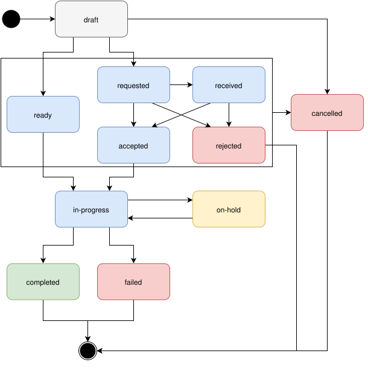

import MedplumCodeBlock from '@site/src/components/MedplumCodeBlock';
import Tabs from '@theme/Tabs';
import TabItem from '@theme/TabItem';

import ExampleCode from '!!raw-loader!@site/..//examples/src/careplans/tasks.ts';

# Tasks and Work Queues

Calling a patient, reviewing an assessment, and checking an authorization all need someone to own the next step. Use [Task](/docs/api/fhir/resources/task) to represent each unit of work, including its owner, status, and completion evidence. Keep the clinical request and resulting record linked to the Task so the team can see both the work and its context.

For role eligibility and clinical review, see [Teams and Delegation](/docs/careplans/teams-and-delegation). For dependencies, deadlines, and completion criteria, see [Handoffs and Escalation](/docs/careplans/handoffs-and-escalation).

The Medplum [Clinical Task Management Demo](https://github.com/medplum/medplum-task-demo) provides an in-depth reference implementation of a task management system that addresses these concerns.

## Start with One Clear Unit of Work {/* #introduction */}

Start with an action someone can finish: call the patient, review the result, or collect a missing document. A Task gives that action an owner and a lifecycle. Its links give the assignee the clinical context they need to do the work.

For example, a [`Task`](/docs/api/fhir/resources/task) might represent the task of having a practitioner complete a [PHQ-9 questionnaire](https://www.apa.org/depression-guideline/patient-health-questionnaire.pdf) for a patient as part of their onboarding.

A common application is for organizations to build **task queue systems** to route tasks to the correct practitioner based on specialty, level of credential, and availability. The [Medplum Task Demo](https://github.com/medplum/medplum-task-demo) application provides a minimalist task queue that demonstrates task search, assignment, and status. For real-time task updates, consider using [Subscriptions](/docs/subscriptions).

## Name the Work to Be Done {/* #task-type */}

Use `Task.code` to describe the kind of work. A title such as "Review intake assessment" tells the assignee what to do. Reusing a consistent code for that work type also lets you find all assessment reviews in one query.

Use a verified standard code when it matches the work. Otherwise, start with `Task.code.text` or define a local CodeSystem for work types that need consistent search and automation.

`Task.description` can be used to add additional descriptive text to the specific [`Task`](/docs/api/fhir/resources/task) instance.

**Example: **

```ts
{
  resourceType: 'Task',
  id: 'example-task',
  code: {
    text: 'Complete PHQ-9',
  },
  description: "Patient to complete PHQ-9 depression screening",
  //...
}
```

## Show Where the Work Stands {/* #task-status */}

A coordinator should be able to tell whether work is ready, underway, or waiting on someone else. Start with those operational questions when choosing your status transitions.

[`Task`](/docs/api/fhir/resources/task) provides three fields: `status`, `businessStatus`, and `statusReason`.

`Task.status` maps to the FHIR task lifecycle shown below. It provides coarse-grained information about the activity state of a [`Task`](/docs/api/fhir/resources/task) and is most useful for day-to-day operations, as it allows for efficient queries on active, completed, and cancelled tasks. These queries will remain stable as your implementation scales. Use `requested`, `received`, `accepted`, and `rejected` when the workflow includes a request/acknowledgment exchange, including within one system. Internal actionable work can start at `ready`.



`Task.businessStatus` should map to your implementation's specific operational funnel. It provides fine-grained information to help customer service and operations teams troubleshoot tasks and monitor progress. It is also useful for analytics teams to compute conversion metrics between pipeline stages.

`Task.statusReason` describes _why_ the [`Task`](/docs/api/fhir/resources/task) has the current status, and is most commonly used when `status` is set to `"on-hold"` or `"cancelled"`. Using an orthogonal `statusReason` allows operations teams to efficiently query for all tasks at the same point in the funnel, while analytics teams can further break down by all the reasons they may be on hold.

## Make Urgency Visible {/* #task-priority */}

`Task.priority` can be used to indicate the urgency of the task. This field uses a fixed set of codes that are borrowed from acute in-patient care settings.

| **Code**                                                                                       | **Definition**                                                                               |
| ---------------------------------------------------------------------------------------------- | -------------------------------------------------------------------------------------------- |
| [`routine`](https://hl7.org/fhir/R4/codesystem-request-priority.html#request-priority-routine) | The request has normal priority.                                                             |
| [`urgent`](https://hl7.org/fhir/R4/codesystem-request-priority.html#request-priority-urgent)   | The request should be actioned promptly - higher priority than `routine`.                    |
| [`asap`](https://hl7.org/fhir/R4/codesystem-request-priority.html#request-priority-asap)       | The request should be actioned as soon as possible - higher priority than `urgent`.          |
| [`stat`](https://hl7.org/fhir/R4/codesystem-request-priority.html#request-priority-stat)       | The request should be actioned immediately - highest possible priority (i.e., an emergency). |

While these terms might feel awkward in a digital health setting, Medplum recommends that implementations use these codes rather than create their own extensions in order to maintain interoperability with the ecosystem.

## Give the Task an Owner {/* #task-assignment */}

`Task.for` indicates who _benefits_ from the task, and is most commonly the patient for whom care is being delivered.

`Task.owner` indicates the party responsible for _performing_ the task. This can be either:

- An individual: [`Practitioner`](/docs/api/fhir/resources/practitioner), [`PractitionerRole`](/docs/api/fhir/resources/practitionerrole), [`Patient`](/docs/api/fhir/resources/patient), [`RelatedPerson`](/docs/api/fhir/resources/relatedperson), or
- A group: [`Organization`](/docs/api/fhir/resources/organization), [`HealthcareService`](/docs/api/fhir/resources/healthcareservice), [`CareTeam`](/docs/api/fhir/resources/careteam)

You can search for all unassigned tasks using the [`:missing`](/docs/search/basic-search#missing) search modifier.

<Tabs groupId="language">
  <TabItem value="ts" label="Typescript">
    <MedplumCodeBlock language="ts" selectBlocks="searchMissingTs">
      {ExampleCode}
    </MedplumCodeBlock>
  </TabItem>
  <TabItem value="cli" label="CLI">
    <MedplumCodeBlock language="bash" selectBlocks="searchMissingCli">
      {ExampleCode}
    </MedplumCodeBlock>
  </TabItem>
  <TabItem value="curl" label="cURL">
    <MedplumCodeBlock language="bash" selectBlocks="searchMissingCurl">
      {ExampleCode}
    </MedplumCodeBlock>
  </TabItem>
</Tabs>

### Describe the Role Required {/* #describe-the-role-required */}

Use `Task.performerType` for the kind of participant needed, such as a coordinator or clinical reviewer. Keep the role vocabulary consistent with your PractitionerRole model and verify that each code describes the actual role. A general assistant and a physician assistant, for example, have different responsibilities.

```ts
{
  resourceType: 'Task',
  // Illustrative local vocabulary; replace the namespace with one you govern.
  performerType: [{
    coding: [{
      system: 'https://example.org/CodeSystem/workflow-roles',
      code: 'intake-coordinator',
      display: 'Intake coordinator',
    }],
  }],
  // ...
}
```

The `example.org` namespace and code above define an illustrative local role, not a standard clinical code. Use the same coding in your role model and in the pool's token search:

```http
GET /fhir/R4/Task?performer=https%3A%2F%2Fexample.org%2FCodeSystem%2Fworkflow-roles%7Cintake-coordinator&owner:missing=true&status=ready
```

`text` alone does not supply the `system|code` token used by this query. Add a work-type filter when the same role handles several queues.

See [Teams and Delegation](/docs/careplans/teams-and-delegation) for eligibility and [Message Response Tracking and Routing](/docs/communications/message-response-tracking-and-routing) for a conversation-based work queue.

## Link the Record Someone Needs to Act On {/* #task-focus */}

The `Task.focus` element tracks the FHIR resource being _operated on_ by this task, known as the "focal resource". See the [Examples](#examples) section below for examples of focal resources in common scenarios.

When several people work on the same referral, their Tasks can all point to that ServiceRequest. Populating `focus` makes it possible to find those work items together and see where the referral is waiting.

## Set Start Dates and Due Dates {/* #task-start--due-dates */}

For a Task seeking fulfillment of a request referenced by `focus`, the `Task.restriction.period` field describes the fulfillment window, with `Task.restriction.period.end` representing the _due date_, and `Task.restriction.period.start` representing the (potentially optional) start date. A task that cannot be started until November 1 and is due at the end of December looks like this:

```ts
{
  resourceType: 'Task',
  status: 'requested',
  intent: 'order',
  focus: { reference: 'ServiceRequest/example' },
  for: { reference: 'Patient/example' },
  restriction: {
    period: {
      start: '2026-11-01T00:00:00.000Z',
      end: '2026-12-31T23:59:59.999Z',
    },
  },
}
```

These guides use `restriction.period.start/end` for planned start and due dates in general work queues as well as request fulfillment. The broader use is an application convention; agree on its mapping when exchanging Tasks with another system. Use `executionPeriod` for actual work. See [Handoffs and Deadlines](/docs/careplans/handoffs-and-escalation#represent-time-accurately) for business calendars and pauses.

### Searching by due date range

The `due-date` search parameter searches `Task.restriction.period`. Prefixes such as `le`, `ge`, `sa`, and `eb` are described in [Searching by comparison](/docs/search/basic-search#searching-by-comparison).

With the default index, Medplum stores one timestamp for `due-date`: `period.start` when it is set, and `period.end` when the start is missing. Every prefix compares that single value. On the task above, `due-date=le2026-11-30` matches, because November 1 is on or before November 30, even though the due date is December 31. The same task matches `due-date=lt2026-12-01` as soon as November 1 has passed, so it shows up in an overdue list while it is still on time.

Enable the [`range-search`](/docs/self-hosting/project-settings#project-feature-flags) project feature to compare both bounds. This allows for "start dates" or future scheduled tasks. A missing start is treated as the beginning of time, and a missing end as the end of time. A date with no time covers that calendar day, so `le2026-09-30` includes a start later on September 30 and excludes a start on October 1.

:::tip[Medplum hosted service]
If you use Medplum's hosted service, please email [support@medplum.com](mailto:support@medplum.com) to enable `range-search` for your project.
:::

The examples below assume `range-search` is on and that today is 2026-09-30.

**Hide tasks scheduled for the future.** Returns tasks whose start is today or earlier, including overdue tasks and tasks that have an end but no start. The sample task stays out until November 1.

```
GET [base]/Task?due-date=le2026-09-30
```

Tasks with no `restriction.period` are omitted, because there is no period to compare. To keep them, combine the date test with a missing check in [`_filter`](/docs/search/filter-search-parameter):

```
GET [base]/Task?_filter=due-date le 2026-09-30 or due-date pr false
```

**Actionable today.** The period overlaps today: the start has arrived and the due date has not passed. The sample task is excluded in September, included through December, and excluded again in January.

```
GET [base]/Task?due-date=2026-09-30
```

**Overdue.** The period ended before today. The sample task is excluded until after December 31. Use `eb` for this query. `lt` compares the start, so `due-date=lt2026-11-15` includes the sample task during November, while the due date is still in December.

```
GET [base]/Task?due-date=eb2026-09-30
```

**Due on or before the end of November.** The period ends before December 1. The sample task is excluded. A task due on November 29 is included.

```
GET [base]/Task?due-date=eb2026-12-01
```

**Scheduled for the future.** The start is after today. The sample task is included until November 1.

```
GET [base]/Task?due-date=sa2026-09-30
```

## Record When the Work Happened {/* #task-completion-times */}

The `Task.executionPeriod` field describes the time period over which the [`Task`](/docs/api/fhir/resources/task) was actually actioned. Properly populating this field makes it easier to identify stalled tasks and compute turnaround-time metrics.

`Task.executionPeriod.start` is used to store the start time of the _first action_ taken against this task.

`Task.executionPeriod.end` is used to mark the completion time of the _final action_ taken against this task.

## Leave Context for the Next Person {/* #task-comments */}

`Task.note` can be used to capture narrative text that is not represented elsewhere in the resource.

The most common use for this field is to record comments from the task assignee as they work on the task. When used this way, it is a best practice to include `authorReference` or `authorString`, along with `time`, in the [`Annotation`](/docs/api/fhir/datatypes/annotation).

## Break Larger Jobs into Subtasks {/* #subtasks */}

`Tasks` can be organized into a hierarchical structure to create subtasks. To represent this hierarchy, subtasks should reference their parent using the `Task.partOf` element. `Task.partOf` is a searchable field that can be used to query all sub-tasks of a given task, and can be combined with the [`_revinclude`](/docs/search/includes#_include-and-_revinclude) and [`:iterate`](/docs/search/includes#iterate-modifier) directives to query the entire [`Task`](/docs/api/fhir/resources/task) tree.

:::caution[Start with a shallow Task hierarchy]

While task hierarchy functionality is powerful, it can be complex to maintain and operationalize. Medplum recommends that most implementations start with a single-level [`Task`](/docs/api/fhir/resources/task) hierarchy and gradually add depth over time.

:::

## Examples

| Use Case                                        | Task Owner                    | Focal Resource       | Example `businessStatuses`                                                                                                                                                                         | Additional Info                                                  |
| ----------------------------------------------- | ----------------------------- | -------------------- | -------------------------------------------------------------------------------------------------------------------------------------------------------------------------------------------------- | ---------------------------------------------------------------- |
| Complete patient intake questionnaire           | New Patient. Care Coordinator | `Questionnaire`      | <ol><li>Questionnaire sent to patient</li><li>First reminder sent</li><li>Second reminder sent</li><li>Questionnaire completed by patient</li><li>Responses reviewed by care coordinator</li></ol> | Use `Task.output` to reference resulting `QuestionnaireResponse` |
| Review lab report                               | Physician                     | `DiagnosticReport`   | <ol><li>Report Available</li><li>Assigned to physician</li><li>Reviewed by physician</li><li>Discussed with patient</li></ol>                                                                      |                                                                  |
| Verify patient identity (e.g. driver's license) | Patient. Care Coordinator     | `DocumentReference`  | <ol><li>Identification document requested</li><li>Documentation received</li><li>Documentation received</li><li>Documentation verified</li></ol>                                                   |                                                                  |
| Complete encounter notes                        | Physician                     | `ClinicalImpression` | <ol><li>Encounter complete. Physician note required</li><li>Note drafted</li> <li>Note finalized</li></ol>                                                                                         | Use `Task.encounter` to reference the original encounter         |

## Build a Queue and Let Staff Claim Work {/* #build-and-claim-a-queue */}

A queue is a filtered view of Tasks, not a separate FHIR resource. Use `code` for work type, `status` for lifecycle, `businessStatus` for a local stage, `performerType` for the required role, and `owner` for current accountability. Keep a stable local coding namespace for operational concepts that do not have an appropriate verified standard code.

```http
GET /fhir/R4/Task?owner=HealthcareService/intake&status=ready,on-hold
GET /fhir/R4/Task?owner:missing=true&status=ready
GET /fhir/R4/Task?owner=PractitionerRole/coordinator&status=ready,in-progress
```

Add work-type and role filters for the actual pool, and follow pagination. Group-owned items are not returned by `owner:missing=true`; choose whether the group or an unassigned role pool owns the work before writing queue queries.

:::caution[Two people may claim the same Task]

To claim an item, read the Task, check its current state and the claimant's eligibility, then update `owner` with `If-Match` for the version read. A `412 Precondition Failed` means the record changed; reload and let the user act on the current state. Do not automatically overwrite another claimant. See [Version Checking](/docs/fhir-datastore/updating-data#preventing-lost-updates-with-version-checking).

:::

Use `Task.for` for the patient beneficiary, and set the clinical request's own patient reference separately. Non-patient work can omit `for` when there is no beneficiary. Configure [assignment and access rules](/docs/careplans/teams-and-delegation#assignment-and-access) for each queue. For work arising from a conversation, see [Message Response Tracking and Routing](/docs/communications/message-response-tracking-and-routing).

Use [Operational Reporting](/docs/careplans/operational-reporting) for stage durations and queue aging. The most recent modification time is not necessarily when an item entered its current stage.

## Give Patients and Caregivers Their Own Work List {/* #give-patients-and-caregivers-their-own-work-list */}

A patient completing intake has a different job from the clinician reviewing the answers. Give each a separate Task so the portal can show the patient's next action while staff track review in their own queue.

For a questionnaire assignment, set `owner` and `for` to the Patient and `focus` to the Questionnaire. This example shows the assignment after submission:

```json
{
  "resourceType": "Task",
  "status": "completed",
  "intent": "order",
  "code": { "text": "Complete intake questionnaire" },
  "owner": { "reference": "Patient/example" },
  "for": { "reference": "Patient/example" },
  "focus": { "reference": "Questionnaire/intake" },
  "output": [{
    "type": { "text": "Submitted answers" },
    "valueReference": { "reference": "QuestionnaireResponse/intake-response" }
  }]
}
```

The portal queries the authenticated participant's open assignments and displays the action, due date, and progress. Use the assignment's Questionnaire to render the form, retain the QuestionnaireResponse with the patient as `subject`, and complete the Task when the required submission criteria are met. If staff must review the answers, create a separate review Task focused on that response.

For caregiver work, use a RelatedPerson owner and keep `Task.for` pointing to the patient. Configure the caregiver's permitted actions through [Access Policies](/docs/access/access-policies). The QuestionnaireResponse's `source` can identify the patient or caregiver who supplied the answers, while `author` identifies who recorded them. See [Questionnaires](/docs/questionnaires) for form rendering and response handling.

## See Also

- The [FHIR Workflow Specification](http://hl7.org/fhir/R4/workflow.html)
- [Medplum Task Demo](https://github.com/medplum/medplum-task-demo)
- [Blog Post: Task Management Apps](/blog/task-management-apps#dashboards)
- [Chart data model](/docs/charting/chart-data-model#encounter-centric-resources)
