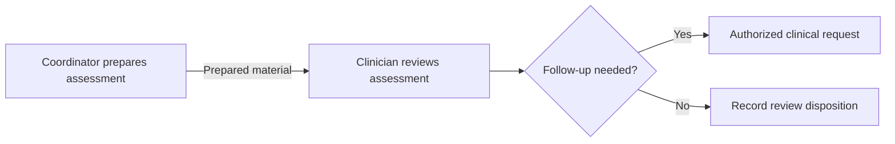

# Teams, Assignment, and Top-of-License Care

A clinician shouldn't have to chase a missing intake form before reviewing it. A coordinator can prepare the information, and the clinician can make the clinical decision. Top-of-license care makes that division of work explicit, with the right qualifications and review at each step.

Start with the work and eligibility rules agreed by the practice, then represent them in the resource model. The [Digital Health Operations blog post](/blog/digital-health-operations#top-of-license-care) explains why a shared task system is useful across clinical and administrative roles.

## Name the Team, the Role, and the Task Owner {/* #separate-three-kinds-of-responsibility */}

| Responsibility | Recommended representation |
| --- | --- |
| A practitioner's service and organizational role | `PractitionerRole`, linked to `practitioner`, `organization`, and the relevant `healthcareService` |
| Ongoing participation in a patient's care | `CareTeam.subject` and `CareTeam.participant`, including `member`, `role`, and `period` |
| Accountability for one action | `Task.owner`; use `performerType` to describe the required kind of participant |

An organization-wide intake pool does not need a patient-specific CareTeam for every Task. Use an `Organization` or `HealthcareService` owner when the group is accountable, or an unowned role pool when eligible staff claim work. A patient CareTeam documents ongoing participation, including patients and caregivers when appropriate.

Link an ongoing team through `CarePlan.careTeam` or `EpisodeOfCare.team`. A case coordinator can be represented by `EpisodeOfCare.careManager`. Keep today's Task owner explicit even when it is a member of that team.

## Let Coordinators Prepare and Clinicians Review {/* #model-preparation-and-clinical-review */}

Consider an assessment workflow: a coordinator checks completeness, then a clinician reviews the assessment and decides on follow-up. Use two Tasks because the owners and completion criteria differ. That gives each person a clear place to start and a clear definition of done.

These arrows show the handoff your application manages. The resource links below retain the evidence for each step.

| Step | Task context | Completion evidence |
| --- | --- | --- |
| Prepare the assessment | `for` references the patient; `focus` references the QuestionnaireResponse being prepared | `output` references the prepared QuestionnaireResponse or supporting document |
| Review the assessment | `for` references the patient; `input` references the prepared material; `owner` identifies the reviewer | A documented review disposition, and references to resulting requests in `output` |

Every input and output needs a `type` and one `value[x]`, for example `type.text = "Prepared assessment"` with `valueReference`. Text labels are readable examples; use a governed local CodeSystem when automation must recognize the meaning.

Create the review Task when preparation completes, using a stable identifier and conditional create. Use `partOf` when both belong to a real parent Task, and implement the transition as described in [Handoffs](/docs/careplans/handoffs-and-escalation#release-the-next-step).

:::caution[Keep clinical authorization with the reviewer]

Completing preparation does not authorize a clinical service. Persist a clinical request through the authorized review/release path. Record the clinician or organization responsible for the request in its own requester/author fields; the Bot that saved it is not necessarily the clinical author.

:::

## Check Who Can Take the Work {/* #check-eligibility-before-assignment */}

Use `Task.performerType` to classify the required role, then evaluate the candidate's current credentials, service enrollment, jurisdiction, availability, and supervision requirements in the controlled assignment path. A matching role code alone is insufficient.

For multi-state services, follow [State-by-State Licensure](/docs/scheduling/state-by-state-licensure): a PractitionerRole represents a service or service line and can reference multiple jurisdiction Locations. Scheduling operations do not enforce licensure; the application validates eligibility before offering or booking an appointment.

Agree on which roles may perform each action with the practice, including any supervision requirements. Use those decisions to configure assignment rules and validated role codes.

## Hand Off Work Without Losing Its Owner {/* #claim-transfer-and-escalate */}

Use a version-checked update when changing `Task.owner`. If another person has claimed the item, reload and evaluate the new state. Let the user act on the current assignment.

For the same work item, reassignment normally updates the existing Task. Record a transfer reason in an authored, timestamped `note`, or explicit `Provenance` when a structured reason is needed. If the next person has a distinct obligation, create a separate Task with its own completion evidence.

If no eligible assignee is available, put the Task `on-hold`, explain why in `statusReason`, and assign an accountable escalation owner. A local `businessStatus` can identify the exception queue.

## Configure Who Can See the Work {/* #assignment-and-access */}

Enforce resource access with [Access Policies](/docs/access/access-policies) and ProjectMembership, including what the former owner can read after transfer. Assignment records responsibility; permission rules determine visibility for the Task and each linked resource. Keep patient references on each patient-related resource.

For conversation-based work, use [Message Response Tracking and Routing](/docs/communications/message-response-tracking-and-routing). It applies these ownership rules while retaining the conversation's participants.
