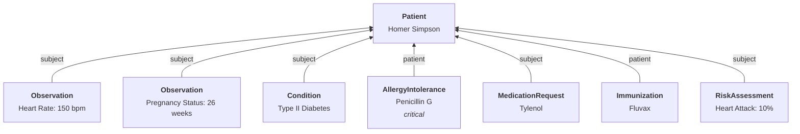
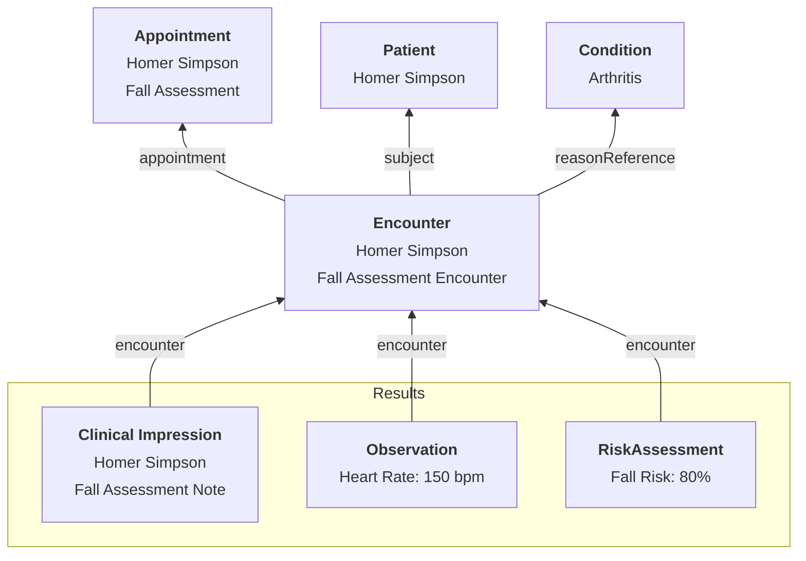

import ExampleCode from '!!raw-loader!@site/../examples/src/charting/representing-diagnoses.ts';
import MedplumCodeBlock from '@site/src/components/MedplumCodeBlock';

# Chart Data Model

A charting UI reads patient-level data that persists across visits and encounter-level data created during each visit. This page is a reference: the first half covers longitudinal patient context (summary, demographics, devices), the second covers encounter-time resources (Observations, Conditions, Allergies, external documents). Each major resource has its own section. For visit orchestration and the SOAP-aligned template pattern, see [Visit Templates and the SOAP Approach](/docs/charting/visit-templates).

## Patient Summary and Queries

Demographics come from the [`Patient`](/docs/api/fhir/resources/patient) resource. You can load related records with [Patient `$everything`](/docs/api/fhir/operations/patient-everything), but that response can be large for a dashboard view. Prefer targeted searches for active [`CarePlan`](/docs/api/fhir/resources/careplan), [`MedicationRequest`](/docs/api/fhir/resources/medicationrequest), [`Condition`](/docs/api/fhir/resources/condition), and other slices your UI needs. See [Search](/docs/search/) to compose queries.

React components that help assemble timelines and summaries include [PatientTimeline](https://storybook.medplum.com/?path=/docs/medplum-patienttimeline--patient), [Timeline](https://storybook.medplum.com/?path=/docs/medplum-timeline--basic), [Search control](https://storybook.medplum.com/?path=/docs/medplum-searchcontrol--checkboxes), [ResourceAvatar](https://storybook.medplum.com/?path=/docs/medplum-resourceavatar--image), [FhirPathDisplay](https://storybook.medplum.com/?path=/docs/medplum-fhirpathdisplay--id), and tab navigation (for example [Mantine Tabs](https://mantine.dev/core/tabs/), used throughout Medplum apps).



### Key Resources for Patient Context

| Resource                                                                                                           | Description                                                                                                                                       |
| ------------------------------------------------------------------------------------------------------------------ | ------------------------------------------------------------------------------------------------------------------------------------------------- |
| [`Observation`](/docs/api/fhir/resources/observation)                                                              | Point-in-time clinical measurements and findings.                                                                                                  |
| [`Condition`](/docs/api/fhir/resources/condition)                                                                  | Diagnoses and longitudinal problems.                                                                                                               |
| [`RiskAssessment`](/docs/api/fhir/resources/riskassessment)                                                        | Modeled risk scores and similar assessments.                                                                                                       |
| [`AllergyIntolerance`](/docs/api/fhir/resources/allergyintolerance)                                                | Adverse reactions to drugs or substances.                                                                                                          |
| [`Immunization`](/docs/api/fhir/resources/immunization)                                                             | Vaccination history.                                                                                                                               |
| [`Medication`](/docs/api/fhir/resources/medication)                                                                | Drug definitions; ordering uses [`MedicationRequest`](/docs/api/fhir/resources/medicationrequest) and summaries may use [`MedicationStatement`](/docs/api/fhir/resources/medicationstatement). |
| [`MedicationAdministration`](/docs/api/fhir/resources/medicationadministration)                                   | Documents when the patient received or took a medication (administration event). |

### Key Code Systems

| Code System                                                                                                                                 | Description                                                                                                                                                                                                            |
| ------------------------------------------------------------------------------------------------------------------------------------------- | ---------------------------------------------------------------------------------------------------------------------------------------------------------------------------------------------------------------------- |
| [LOINC](/docs/careplans/loinc)                                                                                                              | Used in [`Observation`](/docs/api/fhir/resources/observation) and [`RiskAssessment`](/docs/api/fhir/resources/riskassessment) for clinical coding, compliance, billing, and reporting.                                    |
| [ICD-10](https://www.cdc.gov/nchs/icd/icd10cm_browsertool.htm)                                                                              | Used in [`Condition`](/docs/api/fhir/resources/condition) for interoperability and billing; also common on encounter-related billing metadata.                                                                           |
| [RXNORM](/docs/medications/medication-codes#rxnorm)                                                                                         | Drug coding for allergies and medication orders.                                                                                                                                                                       |
| [SNOMED](https://www.snomed.org/)                                                                                                           | Substances and clinical concepts.                                                                                                                                                                                       |
| [CVX](https://www2a.cdc.gov/vaccines/iis/iisstandards/vaccines.asp?rpt=cvx)                                                                 | Immunization vaccine types.                                                                                                                                                                                             |

## Encounter-Centric Resources

During a visit, resources typically link to an [`Encounter`](/docs/api/fhir/resources/encounter). Notes often use [`ClinicalImpression`](/docs/api/fhir/resources/clinicalimpression); measurements use [`Observation`](/docs/api/fhir/resources/observation); orders use [`ServiceRequest`](/docs/api/fhir/resources/servicerequest) and [`MedicationRequest`](/docs/api/fhir/resources/medicationrequest).

Note capture varies by product: some apps use a simple free-text area and persist narrative on [`Encounter`](/docs/api/fhir/resources/encounter) and/or [`ClinicalImpression`](/docs/api/fhir/resources/clinicalimpression). Others drive charting from a library of [Questionnaires](/docs/questionnaires/) and use [Bots](/docs/bots/) or [`$extract`](/docs/api/fhir/operations/extract) to create the right resources. Medplum is headless, so either pattern (or a mix) is valid – see [Visit Templates and the SOAP Approach](/docs/charting/visit-templates) for template-driven visits.



| Resource                                                          | Role |
| ----------------------------------------------------------------- | ---- |
| [`Encounter`](/docs/api/fhir/resources/encounter)                 | Visit container in-person or virtual. |
| [`ClinicalImpression`](/docs/api/fhir/resources/clinicalimpression) | Assessment narrative and findings for the encounter. |
| [`Condition`](/docs/api/fhir/resources/condition)                   | Encounter diagnoses when categorized accordingly. |
| [`Observation`](/docs/api/fhir/resources/observation)               | Vitals and other measurements tied to the encounter. |
| [`RiskAssessment`](/docs/api/fhir/resources/riskassessment)       | Structured risk scores for the encounter when used. |

Encounter billing often references [CPT](https://www.ama-assn.org/practice-management/cpt/cpt-overview-and-code-approval) and [ICD-10](https://www.cdc.gov/nchs/icd/icd10cm_browsertool.htm) on billing-related structures; see [Provider visits](/docs/provider/visits) and [Billing](/docs/billing/).

## Patient Demographics

Capturing patient demographics is a core EHR capability. ONC references this under [demographics (a)(5)](https://www.healthit.gov/test-method/demographics). Data may arrive via UI, integration, or API.

The [USCDI](/docs/fhir-datastore/understanding-uscdi-dataclasses) V2 standard defines technical expectations; see the [US Core Patient profile](https://hl7.org/fhir/us/core/stu3.1.1/StructureDefinition-us-core-patient.html).

### React Components

Medplum provides React components for [Patient demographics](https://storybook.medplum.com/?path=/story/medplum-resourceform--us-core-patient) aligned with common collection requirements.

### Capturing Aliases

Use `Patient.name` with `period` and `use` to represent legal history – for example maiden names:

```json
{
  "name": [
    {
      "given": ["Marge", "Jacqueline"],
      "family": "Simpson",
      "period": { "start": "1980-01-01T00:00:00Z" },
      "use": "official"
    },
    {
      "given": ["Marge", "Jacqueline"],
      "family": "née Bouvier",
      "period": { "end": "1980-01-01T00:00:00Z" },
      "use": "old"
    }
  ]
}
```

### Demographic Value Sets

Use standard value sets rather than ad hoc codes. Correct coding supports reporting and interoperability.

| Category  | Name                                                                                                                                |
| --------- | ----------------------------------------------------------------------------------------------------------------------------------- |
| Gender    | [Administrative Gender Value Set](https://hl7.org/fhir/R4/valueset-administrative-gender.html)                                       |
| Race      | [US Core Race Extension](http://hl7.org/fhir/us/core/StructureDefinition/us-core-race)                                               |
| Ethnicity | [US Core Ethnicity Extension](http://hl7.org/fhir/us/core/StructureDefinition/us-core-ethnicity)                                     |
| Birth Sex | [Birth Sex Extension](http://hl7.org/fhir/us/core/StructureDefinition/us-core-birthsex)                                              |

### Lifecycle

Managing duplicates belongs in every implementation – see [Patient deduplication](/docs/fhir-datastore/patient-deduplication).

When a patient dies, record time of death on `Patient.deceased`. Represent cause of death as an [`Observation`](/docs/api/fhir/resources/observation) with ICD-10 or another appropriate ontology.

### Common Identifiers

Capture identifiers such as driver license or national identifiers as namespaced identifiers on `Patient`. See [Naming data identifiers](/docs/fhir-basics#naming-data-identifiers). [Integration](/docs/integration) covers exchange-oriented lookups.

### Related Reading

- [ONC (a)(5)](https://www.healthit.gov/test-method/demographics)
- [Sample data](/docs/tutorials/importing-sample-data)
- [US Core Patient Profile](https://hl7.org/fhir/us/core/stu3.1.1/StructureDefinition-us-core-patient.html)
- [US Core Patient Storybook](https://storybook.medplum.com/?path=/story/medplum-resourceform--us-core-patient)
- [ONC Certification for Medplum](/docs/compliance/onc)
- [(a)(5) User Testing Video](https://youtu.be/NcxFl-GJ9Mc)

:::caution[Pre-release]

ONC (a)(5) certification is under development.

:::

## Implantable Devices

Implantable device lists support safety, recalls, and adverse-event reporting. ONC describes expectations under [implantable device list (a)(14)](https://www.healthit.gov/test-method/implantable-device-list). Data may be captured via UI, integration, or API.

See the [US Core implantable device profile](https://hl7.org/fhir/us/core/stu3.1.1/StructureDefinition-us-core-implantable-device.html) and [USCDI](/docs/fhir-datastore/understanding-uscdi-dataclasses).

### Device Identifiers and Safety

Recording implantable devices supports:

- Considering implants during treatment and testing
- Finding patients affected by recalls
- Supporting adverse-event reporting

At minimum, record presence of the device and a coded device type.

Also support collecting when applicable:

- Device Identifier ([UDI-DI](https://www.fda.gov/medical-devices/global-unique-device-identification-database-gudid/accessgudid-public))
- Full UDI (human-readable or AIDC form)
- Parsed production identifiers (manufacture date, expiration, lot, serial, distinct identifier)
- MRI safety and latex presence where relevant

### React Components

Medplum provides [implantable device React components](https://storybook.medplum.com/?path=/story/medplum-resourceform--us-core-implantable-device). List devices with a [search control](https://storybook.medplum.com/?path=/story/medplum-searchcontrol--checkboxes) over `Device`; see [search by reference](/docs/search/basic-search#searching-by-reference).

A sample [FHIR Bundle](https://drive.google.com/file/d/1tLJ4qyWNczAvcfhxMA6HyKETdwFlDYjV/view?usp=sharing) illustrates implantable device data.

### Querying the FDA API

Medplum can query the [FDA Device Lookup API](https://accessgudid.nlm.nih.gov/resources/developers/v3/device_lookup_api) to populate identifiers, manufacturer, and safety fields when a device identifier is supplied.

### Related Reading

- [ONC (a)(14)](https://www.healthit.gov/test-method/implantable-device-list)
- [Sample device bundle](https://drive.google.com/file/d/1tLJ4qyWNczAvcfhxMA6HyKETdwFlDYjV/view?usp=sharing)
- [US Core Implantable Device](https://hl7.org/fhir/us/core/stu3.1.1/StructureDefinition-us-core-implantable-device.html)
- [GUDID](https://www.fda.gov/medical-devices/global-unique-device-identification-database-gudid/accessgudid-public)
- [Implantable Device Storybook](https://storybook.medplum.com/?path=/story/medplum-resourceform--us-core-implantable-device)
- [User Safety Testing Script](https://docs.google.com/document/d/14D9ZZQW8kbdqHxEfskdXkaHkJVIx1RLJ/edit)
- [(a)(14) video](https://youtu.be/DIjHguFUHB4)
- [Device bot reference](https://github.com/medplum/medplum-ee/blob/main/packages/provider-app/src/device-bot.ts)

## Observations and Vital Signs

Vital signs measure core physiological functions – blood pressure, pulse, respiration, temperature, and related values. Store them as [`Observation`](/docs/api/fhir/resources/observation) resources with coded `Observation.code` (typically [LOINC](/docs/careplans/loinc) per US Core expectations).

### Observation Elements

| Element        | Description                                                                                                                                                                                                                                                                                                                                                                               | Code System                                                                                         | Example                   |
| -------------- | ----------------------------------------------------------------------------------------------------------------------------------------------------------------------------------------------------------------------------------------------------------------------------------------------------------------------------------------------------------------------------------------- | --------------------------------------------------------------------------------------------------- | ------------------------- |
| `status`       | Preliminary, final, amended, cancelled, etc.                                                                                                                                                                                                                                                                                                                                             | [Observation status](http://hl7.org/fhir/R4/valueset-observation-status.html)                      | registered                |
| `code`         | What was observed.                                                                                                                                                                                                                                                                                                                                                                        | [LOINC](/docs/careplans/loinc)                                                                      | 8867-4 Heart Rate         |
| `subject`      | Who or what the observation is about.                                                                                                                                                                                                                                                                                                                                                     |                                                                                                     | Patient/homer-simpson     |
| `encounter`    | Visit when observation was taken.                                                                                                                                                                                                                                                                                                                                                         |                                                                                                     | Encounter/example         |
| `basedOn`      | Plan or order that prompted the observation.                                                                                                                                                                                                                                                                                                                                              |                                                                                                     | CarePlan/example          |
| `performer`    | Responsible party – patient for home readings, clinician or device in clinic.                                                                                                                                                                                                                                                                                                              |                                                                                                     | Practitioner/example      |
| `value[x]`     | Result – see [Observation datatypes](#observation-datatypes).                                                                                                                                                                                                                                                                                                                               |                                                                                                     |                           |
| `dataAbsentReason` | Why a value is missing.                                                                                                                                                                                                                                                                                                                                                               | [Data absent reason](http://hl7.org/fhir/R4/valueset-data-absent-reason.html)                       | asked-but-unknown         |
| `interpretation` | High / low / normal categories.                                                                                                                                                                                                                                                                                                                                                         | [Interpretation](http://hl7.org/fhir/R4/valueset-observation-interpretation.html)                     | N                         |
| `device`       | Device used to produce the measurement.                                                                                                                                                                                                                                                                                                                                                   |                                                                                                     | Device/apple-watch        |
| `specimen`     | Specimen when lab-derived.                                                                                                                                                                                                                                                                                                                                                                |                                                                                                     | Specimen/example          |
| `component`    | Sub-results that belong together (for example BP systolic/diastolic). See [Multi-component observations](#multi-component-observations).                                                                                                                                                                                                                                                   |                                                                                                     |                           |

<details>
  <summary>Example: body temperature</summary>

```js
{
  "resourceType": "Observation",
  "id": "example-observation-1",
  "code": {
    "system": "http://loinc.org",
    "code": "8310-5",
    "display": "Body temperature",
  },
  "valueQuantity": {
    "value": 98.2,
    "unit": "degrees Fahrenheit",
    "system": "http://unitsofmeasure.org/",
    "code": "[degF]",
  },
  "status": "final",
}
```

</details>

<details>
  <summary>Example: observation from survey input</summary>

```js
{
  "resourceType": "Observation",
  "id": "example-observation-2",
  "code": {
    "system": "http://loinc.org",
    "code": "29463-7",
    "display": "Body weight",
  },
  "valueQuantity": {
    "value": 165,
    "unit": "pounds",
    "system": "http://unitsofmeasure.org/",
    "code": "[lb_av]",
  },
  "status": "preliminary",
  "method": {
    "system": "http://example-practice.org/",
    "code": "entry-survey",
    "display": "entry survey",
  },
}
```

</details>

<details>
  <summary>Example: device-measured observation</summary>

```js
{
  "resourceType": "Observation",
  "id": "example-observation-3",
  "code": {
    "system": "http://loinc.org",
    "code": "8480-6",
    "display": "Systolic blood pressure",
  },
  "valueQuantity": {
    "value": 100,
    "unit": "mmHg",
    "system": "http://unitsofmeasure.org",
    "code": "mm[Hg]",
  },
  "status": "preliminary",
  "device": {
    "resource": {
      "resourceType": "Device",
      "id": "example-device",
    },
  },
}
```

</details>

<details>
  <summary>Example: patient-performed observation</summary>

```js
{
  "resourceType": "Observation",
  "id": "example-observation-4",
  "code": {
    "system": "http://loinc.org",
    "code": "8867-4",
    "display": "Heart rate",
  },
  "valueQuantity": {
    "value": 70,
    "unit": "beats per minute",
    "system": "http://unitsofmeasure.org",
    "code": "{Beats}/min",
  },
  "status": "preliminary",
  "subject": {
    "resource": {
      "resourceType": "Patient",
      "id": "example-patient",
    },
  },
  "performer": {
    "resource": {
      "resourceType": "Patient",
      "id": "example-patient"
    },
  },
}
```

</details>

:::tip[Units]

`valueQuantity` uses FHIR Quantity: numeric `value` plus coded units when possible via [UCUM](https://ucum.org/).

:::

### Observation Datatypes

| value[x]               | Description                                                     | Datatype                                                    | Application           | Example        |
| ---------------------- | --------------------------------------------------------------- | ----------------------------------------------------------- | --------------------- | -------------- |
| `valueQuantity`        | Numeric value with unit                                         | [Quantity](/docs/api/fhir/datatypes/quantity)               | Height                | 177 cm         |
| `valueCodeableConcept` | Coded answer                                                    | [CodeableConcept](/docs/api/fhir/datatypes/codeableconcept) | Lab interpretation    | SNOMED coded   |
| `valueString`          | Free text                                                       | string                                                      | Pain description      | mild pain      |
| `valueBoolean`         | Yes/no                                                          | boolean                                                     | Screening flags       | true           |
| `valueInteger`         | Whole number                                                    | number                                                      | Counts                | 28             |
| `valueRange`           | Interval                                                        | [Range](/docs/api/fhir/datatypes/range)                     | Temperature band      | 98.0 – 98.7    |
| `valueRatio`           | Ratio                                                           | [Ratio](/docs/api/fhir/datatypes/ratio)                     | Ratios                | example ratio  |
| `valueSampledData`     | Time series                                                     | [SampledData](/docs/api/fhir/datatypes/sampleddata)         | Wearables summaries   | see below      |
| `valueTime`            | Time only                                                       | string                                                      | Time-of-day phenomena | 15:30:00       |
| `valueDateTime`        | DateTime                                                        | string                                                      | Instant readings      | 2023-07-24Z    |
| `valuePeriod`          | Interval over time                                              | [Period](/docs/api/fhir/datatypes/period)                   | Episodes              | start–end      |

### Using valueSampledData for Time Series

`valueSampledData` holds dense series (wearables, CGM summaries) in one `Observation`.

Use it when:

- Samples repeat on a fixed cadence
- A wearable exports many points
- Many discrete Observation rows would be inefficient

:::warning[Wearables scale]

Medplum is not optimized for massive wearable ingestion at second-level granularity across huge populations. Prefer summaries and aggregated Observations in Medplum; stream raw high-frequency feeds to analytics stores when needed.

:::

<details>
  <summary>Example: heart rate sampled data</summary>

```js
{
  "resourceType": "Observation",
  "status": "final",
  "code": {
    "system": "http://loinc.org",
    "code": "8867-4",
    "display": "Heart rate"
  },
  "subject": {
    "reference": "Patient/example-patient"
  },
  "device": {
    "reference": "Device/apple-watch-123"
  },
  "effectivePeriod": {
    "start": "2024-01-15T08:00:00Z",
    "end": "2024-01-15T09:00:00Z"
  },
  "valueSampledData": {
    "origin": {
      "value": 60,
      "unit": "beats/min",
      "system": "http://unitsofmeasure.org",
      "code": "{Beats}/min"
    },
    "period": 60000,
    "dimensions": 1,
    "factor": 1,
    "data": "5 3 2 4 1 2 3 2 1 0 2 1 3 2 4 3 2 1 0 1 2 3 4 5 4 3 2 1 0 1 2 3 4 5 6 5 4 3 2 1 0 1 2 3 4 5 4 3 2 1 0 1 2 3 4 5 4 3 2 1 0"
  }
}
```

</details>

#### Helper Functions

`@medplum/core` exposes three helpers for working with `valueSampledData`. Use whichever fits the call site–they are independent.

`expandSampledData` turns the packed string into an array of numeric values:

```typescript
import { expandSampledData } from '@medplum/core';

const values = expandSampledData({
  origin: { value: 60, unit: 'beats/min' },
  period: 60000,
  dimensions: 1,
  factor: 1,
  data: '5 3 2 4 1',
});
```

`expandSampledObservation` lifts the same expansion to the Observation level, returning one Observation per sample:

```typescript
import { expandSampledObservation } from '@medplum/core';

const expandedObservations = expandSampledObservation({
  resourceType: 'Observation',
  code: { /* ... */ },
  valueSampledData: { /* ... */ },
  effectiveDateTime: '2024-01-15T08:00:00Z',
});
```

`summarizeObservations` and `DataSampler` aggregate many observations into a single summary–useful for dashboards built off wearable data:

```typescript
import { summarizeObservations, DataSampler } from '@medplum/core';

const summary = summarizeObservations(
  observations,
  { text: 'Average Heart Rate' },
  (data) => data.reduce((a, b) => a + b, 0) / data.length,
);

const sampler = new DataSampler({
  code: { text: 'Heart Rate' },
  unit: { unit: 'beats/min', code: '{Beats}/min' },
});
```

### Multi-component Observations

Use `Observation.component` when multiple values share method, performer, device, and time – classic case is blood pressure.

:::caution[Use Sparingly]

`component` adds complexity. Prefer it only when necessary.

:::

<details>
  <summary>Example: blood pressure panel</summary>

```js
{
  "resourceType": "Observation",
  "id": "example-component-observation",
  "code": {
    "system": "http://loinc.org",
    "code": "85354-9",
    "display": "Blood pressure panel with all children optional",
  },
  "component": [
    {
      "code": {
        "system": "http://loinc.org",
        "code": "8480-6",
        "display": "Systolic blood pressure",
      },
      "valueQuantity": {
        "value": 100,
        "unit": "mmHg",
        "system": "http://unitsofmeasure.org/",
        "code": "mm[Hg]",
      },
    },
    {
      "code": {
        "system": "http://loinc.org",
        "code": "8462-4",
        "display": "Diastolic blood pressure",
      },
      "valueQuantity": {
        "value": 80,
        "unit": "mmHg",
        "system": "http://unitsofmeasure.org/",
        "code": "mm[Hg]",
      },
    },
  ],
}
```

</details>

### Reference Ranges

Use `Observation.referenceRange` for patient-specific normals. Definitions often live in `ObservationDefinition` resources – see [Observation reference ranges](/docs/careplans/reference-ranges).

## Diagnoses and Problem List

Diagnoses generally fall into encounter diagnoses versus longitudinal problem list items. [`Condition`](/docs/api/fhir/resources/condition) covers both, plus SDOH and other coded problems.

Applications include:

- Social determinants of health
- Chronic conditions
- Substance use
- Cognitive or functional impairment

### Condition Elements

| Element              | Description                                                                                                                                                                                             | Code System                                                                                       | Example           |
| -------------------- | ------------------------------------------------------------------------------------------------------------------------------------------------------------------------------------------------------- | ------------------------------------------------------------------------------------------------- | ----------------- |
| `code`               | Condition identity                                                                                                                                                                                      | ICD-10, SNOMED                                                                                    | Example code      |
| `category`           | encounter-diagnosis vs problem-list-item                                                                                                                                                                | [Condition category](https://build.fhir.org/valueset-condition-category.html)                     | problem-list-item |
| `clinicalStatus`     | Active, recurrence, etc.                                                                                                                                                                                | [Clinical status](https://build.fhir.org/valueset-condition-clinical.html)                      | active            |
| `verificationStatus` | Provisional, confirmed, etc.                                                                                                                                                                            | [Verification](https://build.fhir.org/valueset-condition-ver-status.html)                       | provisional       |
| `severity`           | Subjective severity                                                                                                                                                                                     | [Severity](https://build.fhir.org/valueset-condition-severity.html)                               | severe            |
| `subject`            | Patient                                                                                                                                                                                                 |                                                                                                   | Patient/example   |
| `onset[x]`           | Onset timing                                                                                                                                                                                            |                                                                                                   |                   |
| `abatement[x]`       | Resolution timing                                                                                                                                                                                       |                                                                                                   |                   |
| `recordedDate`       | When documented                                                                                                                                                                                         |                                                                                                   |                   |
| `stage`              | Staging when applicable                                                                                                                                                                                 |                                                                                                   |                   |
| `evidence`           | Supporting resources such as Observation                                                                                                                                                                |                                                                                                   |                   |
| `note`               | Additional narrative                                                                                                                                                                                    |                                                                                                   |                   |

Each `Condition` is an instance of a problem – recurrence is a new resource; link clinically via narrative or extensions as your workflow requires.

<details>
  <summary>Example Condition</summary>
  <MedplumCodeBlock language="ts" selectBlocks="sampleCondition">
    {ExampleCode}
  </MedplumCodeBlock>
</details>

<details>
  <summary>Example ValueSet of Condition codes</summary>
  <MedplumCodeBlock language="ts" selectBlocks="sampleValueSet">
    {ExampleCode}
  </MedplumCodeBlock>
</details>

Do not use `Condition` for allergies – use [`AllergyIntolerance`](/docs/api/fhir/resources/allergyintolerance); see [Allergies and intolerances](#allergies-and-intolerances). Social factors may still be recorded as `Condition` when that matches your IG.

### Encounter Diagnosis

Set `category` to `encounter-diagnosis` and link `encounter` to the visit. Follow [US Core encounter diagnosis](https://hl7.org/fhir/us/core/STU5.0.1/StructureDefinition-us-core-condition-encounter-diagnosis.html) when applicable.

### Problem List Item

Use `category` `problem-list-item` for longitudinal active problems. Best practice: keep separate `Condition` instances for encounter diagnoses versus promoted problem-list rows so history stays auditable. Usually require an explicit action to promote an encounter diagnosis to the problem list.

### Symptoms vs Conditions

[`Observation`](/docs/api/fhir/resources/observation) is point-in-time; [`Condition`](/docs/api/fhir/resources/condition) is ongoing. Use Observation for transient symptoms; Condition when tracking over time. Example: single fever spike as Observation; prolonged fever course as Condition. More detail appears under [Observations and vital signs](#observations-and-vital-signs).

## Allergies and Intolerances

Allergies use [`AllergyIntolerance`](/docs/api/fhir/resources/allergyintolerance).

| Element              | Description                                                      |
| -------------------- | ---------------------------------------------------------------- |
| `clinicalStatus`     | Active vs inactive over time                                     |
| `verificationStatus` | Confirmed vs unconfirmed                                         |
| `category`           | Food, medication, environment, biologic                          |
| `code`               | RxNorm for drugs, SNOMED often for foods/environment             |
| `patient`            | Who experiences the allergy                                      |
| `encounter`          | Encounter where reviewed                                         |
| `recorder`           | Who documented                                                   |
| `asserter`           | Who asserted (patient, clinician, related person, etc.)        |

### Recording Allergy Status

Cover:

1. Known allergies – document specifics.
2. No known allergies – document explicit negatives when clinically asserted (for example NKDA concepts).
3. Unknown status – document when workup is required.

Only record NKDA or unknown when clinically relevant. Documenting NKDA “by default” when allergies were never assessed can mislead future care.

### Example: Unconfirmed Egg Protein

```js
{
  resourceType: 'AllergyIntolerance',
  subject: {
    reference: 'Patient/homer-simpson',
  },
  code: {
    coding: [
      {
        system: 'http://hl7.org/fhir/sid/snomed',
        code: '213020009',
        display: "Allergy to egg protein",
      },
    ],
  },
  verificationStatus: {
    coding: [
      {
        system: 'http://hl7.org/fhir/ValueSet/condition-ver-status',
        code: 'unconfirmed',
        display: 'Unconfirmed',
      },
    ],
  },
};
```

### Example: Patient-Confirmed No Drug Allergies

Use SNOMED [no known allergy](https://bioportal.bioontology.org/ontologies/SNOMEDCT?p=classes&conceptid=http%3A%2F%2Fpurl.bioontology.org%2Fontology%2FSNOMEDCT%2F716186003) concepts when appropriate; adjust `asserter` if the source is not the patient.

```js
{
  resourceType: 'AllergyIntolerance',
  subject: {
    reference: 'Patient/homer-simpson',
  },
  code: {
    coding: [
      {
        system: 'http://hl7.org/fhir/sid/snomed',
        code: '409137002',
        display: "No known drug allergy",
      },
    ],
  },
  clinicalStatus: {
    coding: [
      {
        system: 'http://hl7.org/fhir/ValueSet/condition-clinical',
        code: 'active',
        display: 'Active',
      },
    ],
  },
  verificationStatus: {
    coding: [
      {
        system: 'http://hl7.org/fhir/ValueSet/condition-ver-status',
        code: 'confirmed',
        display: 'Confirmed',
      },
    ],
  },
  asserter : {
    reference : 'Patient/homer-simpson',
  },
};
```

When allergy documentation is not clinically relevant (for example isolated orthopedic brace care without meds), omit `AllergyIntolerance` rather than forcing NKDA.

## External Documents in the Chart

External PDFs and images are indexed with [`DocumentReference`](/docs/api/fhir/resources/documentreference) pointing at [`Binary`](/docs/api/fhir/resources/binary) or URLs – see [External files and Document references](/docs/fhir-datastore/external-documents).

## See Also

- [Visit Templates and the SOAP Approach](/docs/charting/visit-templates)
- [Intake](/docs/intake/)
- [Patient](/docs/api/fhir/resources/patient) FHIR resource API
- [Observation](/docs/api/fhir/resources/observation) FHIR resource API
- [Condition](/docs/api/fhir/resources/condition) FHIR resource API
- [AllergyIntolerance](/docs/api/fhir/resources/allergyintolerance) FHIR resource API
- [Parsing Questionnaire Responses](/docs/questionnaires/parsing-questionnaire-responses)
- [Ordering Labs And Imaging](/docs/labs-imaging/ordering-labs-imaging)
- [Representing Prescriptions](/docs/medications/representing-prescriptions-and-medication-orders)
