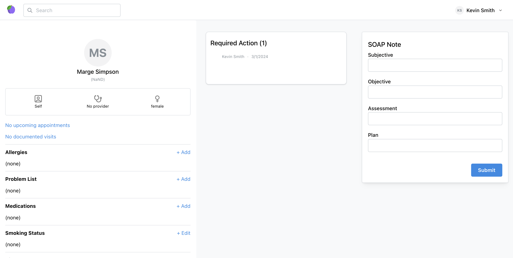

# Charting

Charting composes FHIR resources into workflows clinicians use during and between visits. Medplum is headless: your app chooses layout, while the data model stays interoperable.

Typical pillars:

- Patient summary — demographics, problems, allergies, medications, immunizations, documents, and trends
- Visit documentation — structured forms, narrative assessment, diagnoses, and measurements tied to an [`Encounter`](/docs/api/fhir/resources/encounter)
- Orders and follow-up — labs, imaging, medications, referrals, and care plans

## Where To Start

1. [Designing Charting](/docs/charting/designing-charting) — discovery questions (visit types, parsing, signing, template ownership).
2. [Visit Templates](/docs/charting/visit-templates) — [`PlanDefinition`](/docs/api/fhir/resources/plandefinition), SOAP-style documentation, [`$apply`](/docs/api/fhir/operations/plandefinition-apply), signing.
3. [Chart Data Model](/docs/charting/chart-data-model) — Patient, Observation, Condition, allergies, devices, vitals, and queries for the chart UI.

Supporting guides:

- [Structured Data Capture and parsing](/docs/questionnaires/structured-data-capture) — `$extract` versus Bots for questionnaire responses.
- [Provider Visits](/docs/provider/visits) — Care Templates and Provider app setup (UI-specific).
- [Authoring Clinical Protocols](/docs/careplans/protocols) — advanced PlanDefinition composition.

## Sample Application

Charting can look however you want. A reference UI built from Medplum [React components](https://storybook.medplum.com/?path=/docs/medplum-introduction--docs) lives in [medplum-provider](https://github.com/medplum/medplum/tree/main/examples/medplum-provider).

## Orders and Billing

Orders are usually [`ServiceRequest`](/docs/api/fhir/resources/servicerequest) and [`MedicationRequest`](/docs/api/fhir/resources/medicationrequest) resources, optionally spawned from ActivityDefinitions in visit templates. See [Labs and Imaging](/docs/labs-imaging), [Medications](/docs/medications/representing-prescriptions-and-medication-orders), and [Provider visits](/docs/provider/visits) for billing-oriented ChargeItem flows.

## Reference

- [Charting Demo Video](https://youtu.be/PHZr9q20tbM) on YouTube (3 min)
- [Sample ICD-9 ValueSet bundle](https://drive.google.com/file/d/1cFHGBud9IlGH86yilxe-KkDxGUbGr2Mn/view?usp=sharing)
- [Charting Features and Fixes](https://github.com/medplum/medplum/pulls?q=is%3Apr+label%3Acharting) on GitHub

## See Also

- [Chart Data Model](/docs/charting/chart-data-model)
- [Visit Templates](/docs/charting/visit-templates)
- [Questionnaires](/docs/questionnaires/)
