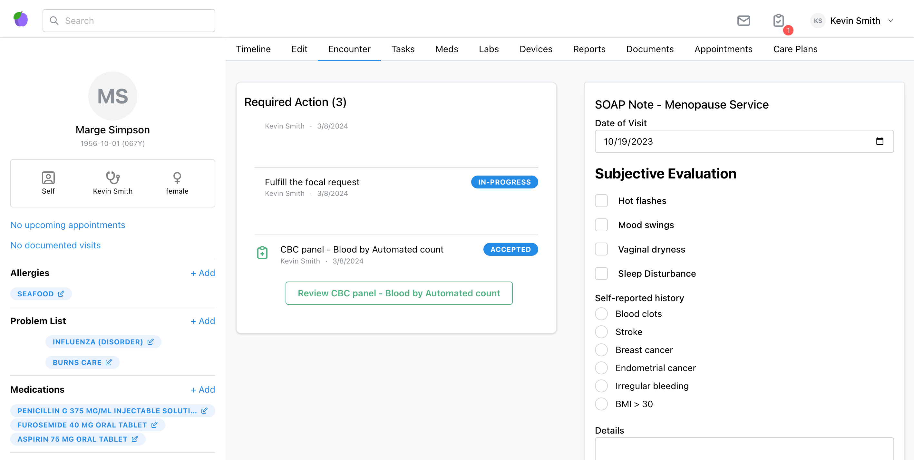

# Charting

Building out a charting experience requires composing multiple FHIR resources into an experience that meets the requirements of practitioners. There are three primary interactions that developers should consider when building out a custom charting experience:

- **Summarizing patient history** and status
- **Capturing clinical notes**
- **Placing orders** for medications, labs, imaging, etc.

## Patient History

Here is a **sample** of what a charting experience might look like - to be clear, charting can look however you want it to. A sample charting application built off of Medplum [React components](https://storybook.medplum.com/?path=/docs/medplum-introduction--docs) and be found on [medplum-chart-demo github](https://github.com/medplum/medplum/tree/main/examples/medplum-chart-demo).

When summarizing patient history, gathering demographic data from the [Patient](/docs/api/fhir/resources/patient.mdx) resource is a basic first step. You can also query all resources related to a given patient from the [Patient `$everything`](/docs/api/fhir/operations/patient-everything) endpoint.

Depending on your use case, `$everything` may be verbose to summarize in a chart, so queries for specific resources like active [CarePlans](/docs/api/fhir/resources/careplan.mdx), [MedicationRequests](/docs/api/fhir/resources/medicationrequest.mdx), [Conditions](/docs/api/fhir/resources/condition.mdx) may be more appropriate. [Search](/docs/search/) is useful to construct the specific queries that will give the context needed for a chart.

React components are available to aid in building a quick charting experience. [PatientTimeline](https://storybook.medplum.com/?path=/docs/medplum-patienttimeline--patient), [Timeline](https://storybook.medplum.com/?path=/docs/medplum-timeline--basic), [Search control](https://storybook.medplum.com/?path=/docs/medplum-searchcontrol--checkboxes), [ResourceAvatar](https://storybook.medplum.com/?path=/docs/medplum-resourceavatar--image), [FhirPathDisplay](https://storybook.medplum.com/?path=/docs/medplum-fhirpathdisplay--id) and Tabs are potential components that can speed development of the summarized history.

### Key Resources

| **Resource**                                                                    | **Description**                                                                                                                                       |
| ------------------------------------------------------------------------------- | ----------------------------------------------------------------------------------------------------------------------------------------------------- |
| [`Observation`](/docs/api/fhir/resources/observation)                           | A structured representation of **point-in-time clinical measurements.**                                                                               |
| [`Condition`](/docs/api/fhir/resources/condition)                               | A record of a **long-term diagnosis** for a patient.                                                                                                  |
| [`RiskAssessment`](/docs/api/fhir/resources/riskassessment)                     | A specialized form of an [`Observation`](/docs/api/fhir/resources/observation) used to model **propensity for an adverse outcome.**                   |
| [`AllergyIntolerance`](/docs/api/fhir/resources/allergyintolerance)             | Used for a specific type of risk: **adverse reaction to a drug or substance.**                                                                        |
| [`Immunization`](/docs/api/fhir/resources/immunization)                         | A summary statement of vaccination records.                                                                                                           |
| [`Medication`](/docs/api/fhir/resources/medication)                             | A representation of an instance of a given drug. The [`Medication`](/docs/api/fhir/resources/medication) lifecycle also includes the below resources. |
| [`MedicationRequest`](/docs/api/fhir/resources/medicationrequest)               | An order or prescription.                                                                                                                             |
| [`MedicationAdministration`](/docs/api/fhir/resources/medicationadministration) | A lifecycle resource representing when the [`Patient`](/docs/api/fhir/resources/patient) ingests the drug.                                            |
| [`MedicationStatement`](/docs/api/fhir/resources/medicationstatement)           | A summary statement of the drug.                                                                                                                      |

### Key Code Systems

| **Code System**                                                             | **Description**                                                                                                                                                                                                            |
| --------------------------------------------------------------------------- | -------------------------------------------------------------------------------------------------------------------------------------------------------------------------------------------------------------------------- |
| [LOINC](https://www.medplum.com/docs/careplans/loinc)                       | Used in [`Observation`](/docs/api/fhir/resources/observation) and [`RiskAssessment`](/docs/api/fhir/resources/riskassessment) resources for compliance, billing, and reporting.                                            |
| [ICD-10](https://www.cdc.gov/nchs/icd/icd10cm_browsertool.htm)              | Used in [`Condition`](/docs/api/fhir/resources/condition) resources for interoperability and billing.                                                                                                                      |
| [RXNORM](https://www.medplum.com/docs/medications/medication-codes#rxnorm)  | Used in [`AllergyIntolerance`](/docs/api/fhir/resources/allergyintolerance) resources to track drug intolerances and [`MedicationRequest`](/docs/api/fhir/resources/medicationrequest) resources to track requested drugs. |
| [SNOMED](https://www.snomed.org/)                                           | Used in [`AllergyIntolerance`](/docs/api/fhir/resources/allergyintolerance) resources to track substance intolerances.                                                                                                     |
| [CVX](https://www2a.cdc.gov/vaccines/iis/iisstandards/vaccines.asp?rpt=cvx) | Used in [`Immunization`](/docs/api/fhir/resources/immunization) resources to track vaccine types.                                                                                                                          |

## Encounter & Charting {#encounter-charting}

### Capturing Notes

A wide variety of notes experiences are possible, and customizability is one of the key reasons to use a headless system. From a technical perspective, after a practitioner/patient interaction is complete, a set of appropriate FHIR resources should be created.

Some implementations have a simple text box and allow the practitioner to enter text free form, then construct [Encounter](/docs/api/fhir/resources/encounter.mdx) and/or [ClinicalImpression](/docs/api/fhir/resources/clinicalimpression.mdx) resources.

Some implementations have a library of [Questionnaires](/docs/questionnaires/) that practitioners fill out and use [Bots](/docs/bots/) to drive workflow and create resources in a specific way.

### Key Resources

| **Resource**                                                        | **Description**                                                                                                                                                                                                                                                                                                                                                |
| ------------------------------------------------------------------- | -------------------------------------------------------------------------------------------------------------------------------------------------------------------------------------------------------------------------------------------------------------------------------------------------------------------------------------------------------------- |
| [`Encounter`](/docs/api/fhir/resources/encounter)                   | Primary tracking resource for a visit (either in-person or virtual).                                                                                                                                                                                                                                                                                           |
| [`ClinicalImpression`](/docs/api/fhir/resources/clinicalimpression) | Medplum-advised resource for recording unstructured notes.                                                                                                                                                                                                                                                                                                     |
| [`Condition`](/docs/api/fhir/resources/condition)                   | A record of a **long-term diagnosis** for a [`Patient`](/docs/api/fhir/resources/patient). The outcome of an [`Encounter`](/docs/api/fhir/resources/encounter) can be a [`Condition`](/docs/api/fhir/resources/condition) with a type of 'encounter diagnosis'. For more details see the [Representing Diagnoses docs](/docs/charting/representing-diagnoses). |
| [`Observation`](/docs/api/fhir/resources/observation)               | A structured representation of **point-in-time clinical measurements.**                                                                                                                                                                                                                                                                                        |
| [`RiskAssessment`](/docs/api/fhir/resources/riskassessment)         | A specialized form of an [`Observation`](/docs/api/fhir/resources/observation) that is used to model **propensity for an adverse outcome.**                                                                                                                                                                                                                    |

### Key Code Systems

| **Code System**                                                                        | **Description**                                                                           |
| -------------------------------------------------------------------------------------- | ----------------------------------------------------------------------------------------- |
| [CPT](https://www.ama-assn.org/practice-management/cpt/cpt-overview-and-code-approval) | Used to annotate [`Encounter`](/docs/api/fhir/resources/encounter) resources for billing. |
| [ICD-10](https://www.cdc.gov/nchs/icd/icd10cm_browsertool.htm)                         | Used to annotate [`Encounter`](/docs/api/fhir/resources/encounter) resources for billing. |

- [CPT](https://www.ama-assn.org/practice-management/cpt/cpt-overview-and-code-approval): Used to annotate [`Encounter`](/docs/api/fhir/resources/encounter) resources for billing.
- [ICD-10](https://www.cdc.gov/nchs/icd/icd10cm_browsertool.htm): Used to annotate [`Encounter`](/docs/api/fhir/resources/encounter) resources for billing.

## Placing Orders

Placing orders requires constructing the right resources, which can be created directly or via [`Questionnaires`](/docs/api/fhir/resources/questionnaire) and [`Bots`](/docs/api/fhir/medplum/bot). Refer to our section on [Labs and Imaging](/docs/labs-imaging/index.md) or [Prescriptions](/docs/medications/representing-prescriptions-and-medication-orders) for more details.

## Reference

- Sample application [Charting Demo Source Code](https://github.com/medplum/medplum/tree/main/examples/medplum-chart-demo)
- [Charting Demo Video](https://youtu.be/PHZr9q20tbM) on Youtube (3 min)
- [Medical condition/diagnosis 1CD-9](https://drive.google.com/file/d/1cFHGBud9IlGH86yilxe-KkDxGUbGr2Mn/view?usp=sharing) sample ValueSet bundle
- [Charting Features and Fixes](https://github.com/medplum/medplum/pulls?q=is%3Apr+label%3Acharting) on Github
