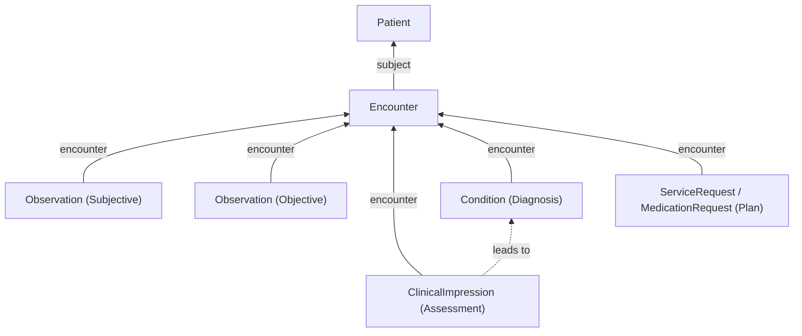

# Creating SOAP Notes

Creating a note while charting can take many forms. One very popular method for clinical note taking is the SOAP note. "SOAP" stands for:

- **Subjective** - the symptoms reported by the patient (feeling lethargic, pain in abdomen, etc.)
- **Objective** - the observable data collected by the clinician (discoloring in eyes, elevated heart rate, etc.)
- **Assessment** - the clinical analysis (diagnosis of depression, etc.)
- **Plan** - strategy to treat the above (CBT, medication, lifestyle changes, etc.)

When capturing this data digitally, it could be very tempting to just store this as a `QuestionnaireResponse` — which would be how these fields are collected in the first place. However, this is not the "happy path" that utilizes FHIR to its fullest potential.

The primary reason why this is the case is that `QuestionnaireResponse` resources contain response values, but those response values are not searchable in FHIR. In order to uphold interoperability, information in your notes should be parsed into the proper FHIR resources.

## Workflow Design Considerations

How notes are actually captured and processed varies significantly by practice type. The examples below illustrate common patterns:

### Questionnaire-Driven Capture (e.g., Primary Care)

Many practices collect notes through a `Questionnaire` that always includes a standard set of fields — for example, a primary care practice might require blood pressure and weight at every visit. The `QuestionnaireResponse` holds the raw form submission, but those answers should be parsed into structured `Observation` resources so the data is searchable and interoperable. See [Structured Data Capture](/docs/questionnaires/structured-data-capture) for how to use the `$extract` operation to automate this, and [Bot for QuestionnaireResponse](/docs/bots/bot-for-questionnaire-response) for a custom parsing approach using Bots.

### Template-Driven Plan Section (e.g., Specialty Protocols)

Some practices maintain a library of pre-built [`PlanDefinition`](/docs/api/fhir/resources/plandefinition) resources for common treatment protocols. Instead of a freeform Plan section, the clinician selects a template and the application instantiates the corresponding `ServiceRequest`, `MedicationRequest`, or `CarePlan` resources automatically via the [`$apply` operation](/docs/api/fhir/operations/plandefinition-apply).

### Pre-Filled Notes from Patient Intake (e.g., Dermatology)

In specialties with a bounded set of conditions — like dermatology — patients can pre-select what they want to be seen for during intake. Because those values are known in advance, developers can pre-populate the Subjective and Objective sections before the clinician opens the chart, reducing data entry to a review-and-confirm step.

Enter FHIR's purpose-built resources. The FHIR spec maps the SOAP framework directly onto specific resource types:

| **SOAP**   | **FHIR Resource**                                                                                         | **Description**                               |
| ---------- | --------------------------------------------------------------------------------------------------------- | --------------------------------------------- |
| Subjective | [`Observation`](/docs/api/fhir/resources/observation)                                                     | Patient-reported symptoms and concerns        |
| Objective  | [`Observation`](/docs/api/fhir/resources/observation)                                                     | Clinician-measured findings and vitals        |
| Assessment | [`ClinicalImpression`](/docs/api/fhir/resources/clinicalimpression)                                       | Clinical analysis, differential, and summary  |
| Plan       | [`CarePlan`](/docs/api/fhir/resources/careplan), [`ServiceRequest`](/docs/api/fhir/resources/servicerequest), [`MedicationRequest`](/docs/api/fhir/resources/medicationrequest) | Treatment strategy, orders, and prescriptions |

## How It All Fits Together

All four SOAP components are linked back to the same [`Encounter`](/docs/api/fhir/resources/encounter), which serves as the central organizing resource for a visit.



A typical workflow looks something like this:

1. A practitioner opens a chart for an `Encounter`.
2. Patient-reported symptoms are saved as `Observation` resources with `performer` set to the patient (Subjective).
3. The clinician records their measurements as `Observation` resources with `performer` set to the practitioner or device (Objective).
4. A `ClinicalImpression` is created (or updated) with the clinical analysis and `note` (Assessment).
5. One or more `Condition` resources are created for formal diagnoses arising from the assessment.
6. Orders are placed as `ServiceRequest` or `MedicationRequest` resources (Plan).
7. The `ClinicalImpression` status is set to `completed` and a `Provenance` record is created to sign and lock the note.

<details>
  <summary>Example: full SOAP note FHIR R4 Bundle</summary>

[Download soap-note-bundle.json](/examples/soap-note-bundle.json)

```json
{
  "resourceType": "Bundle",
  "type": "collection",
  "entry": [
    {
      "fullUrl": "urn:uuid:example-encounter",
      "resource": {
        "resourceType": "Encounter",
        "id": "example-encounter",
        "status": "finished",
        "class": {
          "system": "http://terminology.hl7.org/CodeSystem/v3-ActCode",
          "code": "AMB",
          "display": "ambulatory"
        },
        "subject": { "reference": "Patient/homer-simpson" },
        "participant": [
          {
            "individual": { "reference": "Practitioner/dr-alice-smith" }
          }
        ],
        "period": {
          "start": "2024-01-15T10:00:00Z",
          "end": "2024-01-15T11:30:00Z"
        }
      }
    },
    {
      "fullUrl": "urn:uuid:obs-subjective-fatigue",
      "resource": {
        "resourceType": "Observation",
        "id": "obs-subjective-fatigue",
        "status": "final",
        "code": {
          "coding": [
            {
              "system": "http://loinc.org",
              "code": "75325-1",
              "display": "Symptom"
            }
          ],
          "text": "Fatigue"
        },
        "subject": { "reference": "Patient/homer-simpson" },
        "encounter": { "reference": "Encounter/example-encounter" },
        "performer": [{ "reference": "Patient/homer-simpson" }],
        "valueString": "Patient reports feeling lethargic for the past week"
      }
    },
    {
      "fullUrl": "urn:uuid:obs-objective-heart-rate",
      "resource": {
        "resourceType": "Observation",
        "id": "obs-objective-heart-rate",
        "status": "final",
        "code": {
          "coding": [
            {
              "system": "http://loinc.org",
              "code": "8867-4",
              "display": "Heart rate"
            }
          ]
        },
        "subject": { "reference": "Patient/homer-simpson" },
        "encounter": { "reference": "Encounter/example-encounter" },
        "performer": [{ "reference": "Practitioner/dr-alice-smith" }],
        "valueQuantity": {
          "value": 112,
          "unit": "beats/min",
          "system": "http://unitsofmeasure.org",
          "code": "{Beats}/min"
        }
      }
    },
    {
      "fullUrl": "urn:uuid:clinical-impression-assessment",
      "resource": {
        "resourceType": "ClinicalImpression",
        "id": "clinical-impression-assessment",
        "status": "completed",
        "subject": { "reference": "Patient/homer-simpson" },
        "encounter": { "reference": "Encounter/example-encounter" },
        "date": "2024-01-15T11:00:00Z",
        "description": "Patient presents with fatigue and abdominal pain.",
        "finding": [
          {
            "itemReference": { "reference": "Condition/condition-gastritis" }
          }
        ],
        "note": [
          {
            "text": "Assessment: symptoms consistent with gastritis. Differential includes peptic ulcer disease. Will monitor response to treatment."
          }
        ]
      }
    },
    {
      "fullUrl": "urn:uuid:condition-gastritis",
      "resource": {
        "resourceType": "Condition",
        "id": "condition-gastritis",
        "clinicalStatus": {
          "coding": [
            {
              "system": "http://terminology.hl7.org/CodeSystem/condition-clinical",
              "code": "active"
            }
          ]
        },
        "verificationStatus": {
          "coding": [
            {
              "system": "http://terminology.hl7.org/CodeSystem/condition-ver-status",
              "code": "confirmed"
            }
          ]
        },
        "code": {
          "coding": [
            {
              "system": "http://hl7.org/fhir/sid/icd-10-cm",
              "code": "K29.70",
              "display": "Gastritis, unspecified, without bleeding"
            }
          ]
        },
        "subject": { "reference": "Patient/homer-simpson" },
        "encounter": { "reference": "Encounter/example-encounter" }
      }
    },
    {
      "fullUrl": "urn:uuid:service-request-lab",
      "resource": {
        "resourceType": "ServiceRequest",
        "id": "service-request-lab",
        "status": "active",
        "intent": "order",
        "code": {
          "coding": [
            {
              "system": "http://loinc.org",
              "code": "13958-0",
              "display": "Helicobacter pylori [Presence] in Stool by Immunoassay"
            }
          ]
        },
        "subject": { "reference": "Patient/homer-simpson" },
        "encounter": { "reference": "Encounter/example-encounter" },
        "requester": { "reference": "Practitioner/dr-alice-smith" }
      }
    },
    {
      "fullUrl": "urn:uuid:provenance-note-signed",
      "resource": {
        "resourceType": "Provenance",
        "id": "provenance-note-signed",
        "target": [{ "reference": "Encounter/example-encounter" }],
        "recorded": "2024-01-15T11:30:00Z",
        "reason": [
          {
            "coding": [
              {
                "system": "http://terminology.hl7.org/CodeSystem/v3-ActReason",
                "code": "SIGN",
                "display": "Signed"
              }
            ]
          }
        ],
        "agent": [
          {
            "type": {
              "coding": [
                {
                  "system": "http://terminology.hl7.org/CodeSystem/provenance-participant-type",
                  "code": "author"
                }
              ]
            },
            "who": { "reference": "Practitioner/dr-alice-smith" }
          }
        ]
      }
    }
  ]
}
```

</details>

## Subjective & Objective — `Observation`

Both the Subjective and Objective components of a SOAP note are stored as [`Observation`](/docs/api/fhir/resources/observation) resources. The key distinction is in the `performer` field:

- **Subjective**: The patient themselves is the `performer`, indicating a self-reported symptom.
- **Objective**: The clinician or a device is the `performer`, indicating a measured finding.

Both types share the same resource structure, with the `code` field (typically a [LOINC](/docs/careplans/loinc) code) describing what was observed and the `value[x]` field holding the result.

<details>
  <summary>Example: patient-reported fatigue (Subjective)</summary>

```json
{
  "resourceType": "Observation",
  "status": "final",
  "code": {
    "coding": [
      {
        "system": "http://loinc.org",
        "code": "75325-1",
        "display": "Symptom"
      }
    ],
    "text": "Fatigue"
  },
  "subject": { "reference": "Patient/homer-simpson" },
  "encounter": { "reference": "Encounter/example-encounter" },
  "performer": [{ "reference": "Patient/homer-simpson" }],
  "valueString": "Patient reports feeling lethargic for the past week"
}
```

</details>

<details>
  <summary>Example: elevated heart rate (Objective)</summary>

```json
{
  "resourceType": "Observation",
  "status": "final",
  "code": {
    "coding": [
      {
        "system": "http://loinc.org",
        "code": "8867-4",
        "display": "Heart rate"
      }
    ]
  },
  "subject": { "reference": "Patient/homer-simpson" },
  "encounter": { "reference": "Encounter/example-encounter" },
  "performer": [{ "reference": "Practitioner/dr-alice-smith" }],
  "valueQuantity": {
    "value": 112,
    "unit": "beats/min",
    "system": "http://unitsofmeasure.org",
    "code": "{Beats}/min"
  }
}
```

</details>

For a deeper look at `Observation` resources and how to model measurements with the correct LOINC codes, see [Capturing Vital Signs](/docs/charting/capturing-vital-signs).

## Assessment — `ClinicalImpression`

`ClinicalImpression` is the FHIR-native resource for recording a clinical assessment. Per the FHIR specification, it is literally the equivalent of the "A" in SOAP — it represents the clinician's summary, differential diagnosis, and overall impression formed during the encounter.

:::tip Why `ClinicalImpression` and not `DocumentReference` or `QuestionnaireResponse`?

Some implementations store the Assessment as a `DocumentReference` or leave it as a raw `QuestionnaireResponse`, treating the entire note as an opaque blob of text. `ClinicalImpression` is the recommended approach because it gives each part of the assessment a structured home — findings, differentials, and clinical reasoning are all discrete, searchable fields that other systems can consume. The goal is to maximize structured, codified data and minimize free-text wherever possible.

:::

A `ClinicalImpression` is typically created at the start of an encounter with a status of `in-progress`, and then transitioned to `completed` once the note is signed.

### Key Fields

| **Field**     | **Description**                                                                                       | **Example**                                             |
| ------------- | ----------------------------------------------------------------------------------------------------- | ------------------------------------------------------- |
| `status`      | Lifecycle state of the impression.                                                                    | `in-progress`, `completed`                              |
| `subject`     | Reference to the `Patient`.                                                                           | `Patient/homer-simpson`                                 |
| `encounter`   | Reference to the `Encounter` during which the assessment was made.                                    | `Encounter/example-encounter`                           |
| `date`        | When the assessment was made.                                                                         | `2024-01-15T10:00:00Z`                                  |
| `description` | A short summary of the assessment.                                                                    | `Patient presents with fatigue and abdominal pain.`     |
| `note`        | Free-text narrative of the clinical impression. `note[0].text` is typically used for the main note.  | `Likely gastritis. Rule out peptic ulcer. Will monitor.`|

<details>
  <summary>Example: ClinicalImpression created at the start of an encounter</summary>

```json
{
  "resourceType": "ClinicalImpression",
  "status": "in-progress",
  "subject": { "reference": "Patient/homer-simpson" },
  "encounter": { "reference": "Encounter/example-encounter" },
  "date": "2024-01-15T10:00:00Z",
  "description": "Patient presents with fatigue and abdominal pain.",
  "note": [
    {
      "text": "Assessment: symptoms consistent with gastritis. Differential includes peptic ulcer disease. Will monitor response to treatment."
    }
  ]
}
```

</details>

A `ClinicalImpression` often leads to a formal diagnosis, which is modeled as a [`Condition`](/docs/api/fhir/resources/condition) resource. The `Condition` represents the persistent, codified diagnosis (using ICD-10 or SNOMED), while the `ClinicalImpression` captures the clinical reasoning behind it. For more on how to model diagnoses, see [Representing Diagnoses](/docs/charting/representing-diagnoses).

## Plan — Orders and Care

The Plan component maps to the order resources in FHIR. Depending on what the clinician intends to do, the appropriate resource will differ:

| **Plan Action**          | **FHIR Resource**                                                                       |
| ------------------------ | --------------------------------------------------------------------------------------- |
| Lab or imaging order     | [`ServiceRequest`](/docs/api/fhir/resources/servicerequest)                             |
| Medication prescription  | [`MedicationRequest`](/docs/api/fhir/resources/medicationrequest)                       |
| Ongoing care strategy    | [`CarePlan`](/docs/api/fhir/resources/careplan)                                         |
| Referral                 | [`ServiceRequest`](/docs/api/fhir/resources/servicerequest) with appropriate `category` |

For details on placing orders, see [Ordering Labs and Imaging](/docs/charting/ordering-labs-imaging) and [Representing Prescriptions](/docs/medications/representing-prescriptions-and-medication-orders).

## Signing and Locking Notes

Once the full note is complete and reviewed, the `ClinicalImpression` status should be set to `completed`. A [`Provenance`](/docs/api/fhir/resources/provenance) resource is then created to record who signed the note and when. Once both conditions are met — the `ClinicalImpression` is `completed` and a `Provenance` record exists for the associated `Encounter` — the note is considered signed and locked.

<details>
  <summary>Example: Provenance record indicating a clinician sign-off</summary>

```json
{
  "resourceType": "Provenance",
  "target": [{ "reference": "Encounter/example-encounter" }],
  "recorded": "2024-01-15T11:30:00Z",
  "reason": [
    {
      "coding": [
        {
          "system": "http://terminology.hl7.org/CodeSystem/v3-ActReason",
          "code": "SIGN",
          "display": "Signed"
        }
      ]
    }
  ],
  "agent": [
    {
      "type": {
        "coding": [
          {
            "system": "http://terminology.hl7.org/CodeSystem/provenance-participant-type",
            "code": "author"
          }
        ]
      },
      "who": { "reference": "Practitioner/dr-alice-smith" }
    }
  ]
}
```

</details>


## Reference

- [`ClinicalImpression` resource reference](/docs/api/fhir/resources/clinicalimpression)
- [`Observation` resource reference](/docs/api/fhir/resources/observation)
- [`Condition` resource reference](/docs/api/fhir/resources/condition)
- [Capturing Vital Signs](/docs/charting/capturing-vital-signs)
- [Representing Diagnoses](/docs/charting/representing-diagnoses)
- [Ordering Labs and Imaging](/docs/charting/ordering-labs-imaging)
- [medplum-provider example app](https://github.com/medplum/medplum/tree/main/examples/medplum-provider)
