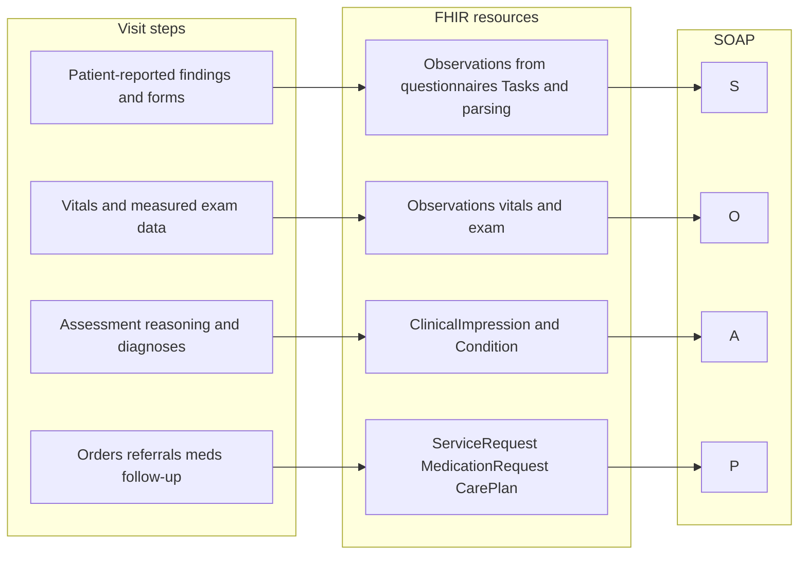
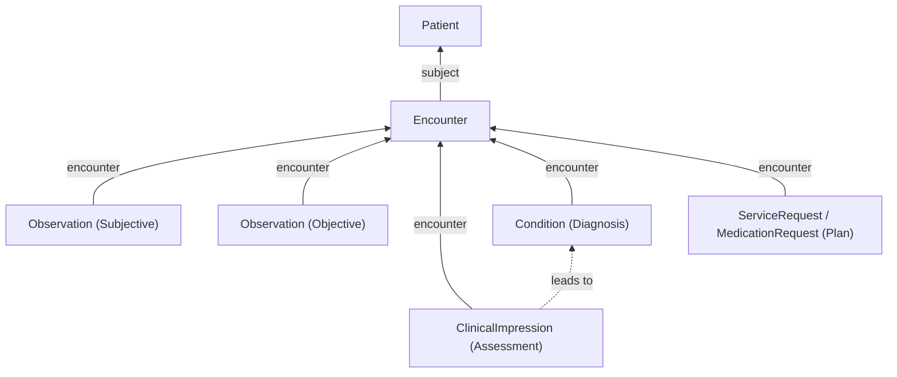

# Visit Templates and the SOAP Approach

Most clinical products still organize encounter documentation around some variant of SOAP – Subjective, Objective, Assessment, Plan – even when the screen does not label the sections that way. Visit templates are how Medplum ties that workflow to FHIR: instead of a single undifferentiated note, you instantiate a [`PlanDefinition`](/docs/api/fhir/resources/plandefinition) per visit type so clinicians get the right questionnaires and order tasks when the encounter opens (Care Templates in Medplum Provider are this concept in the UI).

The pattern this guide recommends maps SOAP to FHIR with one deliberate split: Subjective, Objective, and Plan are primarily structured resources (Observations from forms or devices; ServiceRequest / MedicationRequest / CarePlan for orders), while Assessment is where narrative free text belongs – on [`ClinicalImpression`](/docs/api/fhir/resources/clinicalimpression), with coded diagnoses on [`Condition`](/docs/api/fhir/resources/condition) when you need them. That keeps the record interoperable and searchable without asking clinicians to avoid prose where judgment is the point.

See [Designing Charting](/docs/charting/designing-charting) for product framing. For authoring `PlanDefinition` graphs, nested actions, and ActivityDefinitions, see [Authoring Clinical Protocols](/docs/careplans/protocols). For configuring Care Templates in the hosted app, see [Provider Visits](/docs/provider/visits).

## Visit Template Lifecycle

1. Author a `PlanDefinition` whose `action` entries reference Questionnaires and ActivityDefinitions. Authoring detail lives in [Authoring Clinical Protocols](/docs/careplans/protocols).
2. Invoke [`$apply`](/docs/api/fhir/operations/plandefinition-apply) with `subject` (Patient) and optionally `encounter`, `practitioner`, and `organization`.
3. Medplum creates Tasks (and ServiceRequests when `ActivityDefinition.kind` is ServiceRequest).
4. Clinicians complete Questionnaires and orders; parse responses into FHIR resources using [Parsing Questionnaire Responses](/docs/questionnaires/structured-data-capture) or Bots.
5. Sign the visit using `ClinicalImpression.status` and a `Provenance` on the Encounter (see [Signing and Locking Notes](#signing-and-locking-notes)).

## Common Visit-Template Patterns

A few shapes recur in real implementations.

- _Questionnaire-driven capture (primary care)_ – a standard form per visit type (vitals, intake screen) submits a `QuestionnaireResponse` whose answers are parsed into `Observation` resources via `$extract` or a Bot.
- _Template-driven plan (specialty protocols)_ – a `PlanDefinition` for the protocol instantiates `ServiceRequest`, `MedicationRequest`, or `CarePlan` from `ActivityDefinition` actions on `$apply` rather than free-text plan sections. See [Authoring Clinical Protocols](/docs/careplans/protocols).
- _Pre-filled context from intake_ – when intake narrows the problem list (e.g. dermatology lesions), prepopulate Questionnaire or Observation drafts before the clinician opens the chart.

Avoid storing everything as raw `QuestionnaireResponse` only – answers there are not first-class searchable fields the way Observations and Conditions are. Parse into the proper resources (see [Parsing Questionnaire Responses](/docs/questionnaires/structured-data-capture)).

## How Visits, FHIR, and SOAP Line Up

The diagram below is intentionally simplified – real encounters interleave steps – but shows how common visit steps map to FHIR resources and SOAP letters. Template mechanics (what `$apply` creates first) are separate from documentation; everything eventually references the same Encounter.



The encounter graph below shows the same resources hanging off a single [`Encounter`](/docs/api/fhir/resources/encounter):



<details>
  <summary>Example: full SOAP note FHIR R4 Bundle</summary>

[Download soap-note-bundle.json](/examples/soap-note-bundle.json)

```json
{
  "resourceType": "Bundle",
  "type": "collection",
  "entry": [
    {
      "fullUrl": "urn:uuid:example-encounter",
      "resource": {
        "resourceType": "Encounter",
        "id": "example-encounter",
        "status": "finished",
        "class": {
          "system": "http://terminology.hl7.org/CodeSystem/v3-ActCode",
          "code": "AMB",
          "display": "ambulatory"
        },
        "subject": { "reference": "Patient/homer-simpson" },
        "participant": [
          {
            "individual": { "reference": "Practitioner/dr-alice-smith" }
          }
        ],
        "period": {
          "start": "2024-01-15T10:00:00Z",
          "end": "2024-01-15T11:30:00Z"
        }
      }
    },
    {
      "fullUrl": "urn:uuid:obs-subjective-fatigue",
      "resource": {
        "resourceType": "Observation",
        "id": "obs-subjective-fatigue",
        "status": "final",
        "code": {
          "coding": [
            {
              "system": "http://loinc.org",
              "code": "75325-1",
              "display": "Symptom"
            }
          ],
          "text": "Fatigue"
        },
        "subject": { "reference": "Patient/homer-simpson" },
        "encounter": { "reference": "Encounter/example-encounter" },
        "performer": [{ "reference": "Patient/homer-simpson" }],
        "valueString": "Patient reports feeling lethargic for the past week"
      }
    },
    {
      "fullUrl": "urn:uuid:obs-objective-heart-rate",
      "resource": {
        "resourceType": "Observation",
        "id": "obs-objective-heart-rate",
        "status": "final",
        "code": {
          "coding": [
            {
              "system": "http://loinc.org",
              "code": "8867-4",
              "display": "Heart rate"
            }
          ]
        },
        "subject": { "reference": "Patient/homer-simpson" },
        "encounter": { "reference": "Encounter/example-encounter" },
        "performer": [{ "reference": "Practitioner/dr-alice-smith" }],
        "valueQuantity": {
          "value": 112,
          "unit": "beats/min",
          "system": "http://unitsofmeasure.org",
          "code": "{Beats}/min"
        }
      }
    },
    {
      "fullUrl": "urn:uuid:clinical-impression-assessment",
      "resource": {
        "resourceType": "ClinicalImpression",
        "id": "clinical-impression-assessment",
        "status": "completed",
        "subject": { "reference": "Patient/homer-simpson" },
        "encounter": { "reference": "Encounter/example-encounter" },
        "date": "2024-01-15T11:00:00Z",
        "description": "Patient presents with fatigue and abdominal pain.",
        "finding": [
          {
            "itemReference": { "reference": "Condition/condition-gastritis" }
          }
        ],
        "note": [
          {
            "text": "Assessment: symptoms consistent with gastritis. Differential includes peptic ulcer disease. Will monitor response to treatment."
          }
        ]
      }
    },
    {
      "fullUrl": "urn:uuid:condition-gastritis",
      "resource": {
        "resourceType": "Condition",
        "id": "condition-gastritis",
        "clinicalStatus": {
          "coding": [
            {
              "system": "http://terminology.hl7.org/CodeSystem/condition-clinical",
              "code": "active"
            }
          ]
        },
        "verificationStatus": {
          "coding": [
            {
              "system": "http://terminology.hl7.org/CodeSystem/condition-ver-status",
              "code": "confirmed"
            }
          ]
        },
        "code": {
          "coding": [
            {
              "system": "http://hl7.org/fhir/sid/icd-10-cm",
              "code": "K29.70",
              "display": "Gastritis, unspecified, without bleeding"
            }
          ]
        },
        "subject": { "reference": "Patient/homer-simpson" },
        "encounter": { "reference": "Encounter/example-encounter" }
      }
    },
    {
      "fullUrl": "urn:uuid:service-request-lab",
      "resource": {
        "resourceType": "ServiceRequest",
        "id": "service-request-lab",
        "status": "active",
        "intent": "order",
        "code": {
          "coding": [
            {
              "system": "http://loinc.org",
              "code": "13958-0",
              "display": "Helicobacter pylori [Presence] in Stool by Immunoassay"
            }
          ]
        },
        "subject": { "reference": "Patient/homer-simpson" },
        "encounter": { "reference": "Encounter/example-encounter" },
        "requester": { "reference": "Practitioner/dr-alice-smith" }
      }
    },
    {
      "fullUrl": "urn:uuid:provenance-note-signed",
      "resource": {
        "resourceType": "Provenance",
        "id": "provenance-note-signed",
        "target": [{ "reference": "Encounter/example-encounter" }],
        "recorded": "2024-01-15T11:30:00Z",
        "reason": [
          {
            "coding": [
              {
                "system": "http://terminology.hl7.org/CodeSystem/v3-ActReason",
                "code": "SIGN",
                "display": "Signed"
              }
            ]
          }
        ],
        "agent": [
          {
            "type": {
              "coding": [
                {
                  "system": "http://terminology.hl7.org/CodeSystem/provenance-participant-type",
                  "code": "author"
                }
              ]
            },
            "who": { "reference": "Practitioner/dr-alice-smith" }
          }
        ]
      }
    }
  ]
}
```

</details>

## Subjective and Objective – Observation

Both Subjective and Objective are [`Observation`](/docs/api/fhir/resources/observation) resources. The distinction is usually `performer`:

- Subjective: patient as `performer` for self-reported symptoms.
- Objective: clinician or device as `performer` for measured findings.

Use appropriate coding (typically [LOINC](/docs/careplans/loinc)) and `value[x]`. For measurement details see [Observations and vital signs](/docs/charting/chart-data-model#observations-and-vital-signs).

<details>
  <summary>Example: patient-reported fatigue (Subjective)</summary>

```json
{
  "resourceType": "Observation",
  "status": "final",
  "code": {
    "coding": [
      {
        "system": "http://loinc.org",
        "code": "75325-1",
        "display": "Symptom"
      }
    ],
    "text": "Fatigue"
  },
  "subject": { "reference": "Patient/homer-simpson" },
  "encounter": { "reference": "Encounter/example-encounter" },
  "performer": [{ "reference": "Patient/homer-simpson" }],
  "valueString": "Patient reports feeling lethargic for the past week"
}
```

</details>

<details>
  <summary>Example: elevated heart rate (Objective)</summary>

```json
{
  "resourceType": "Observation",
  "status": "final",
  "code": {
    "coding": [
      {
        "system": "http://loinc.org",
        "code": "8867-4",
        "display": "Heart rate"
      }
    ]
  },
  "subject": { "reference": "Patient/homer-simpson" },
  "encounter": { "reference": "Encounter/example-encounter" },
  "performer": [{ "reference": "Practitioner/dr-alice-smith" }],
  "valueQuantity": {
    "value": 112,
    "unit": "beats/min",
    "system": "http://unitsofmeasure.org",
    "code": "{Beats}/min"
  }
}
```

</details>

## Assessment – Clinical Impression

[`ClinicalImpression`](/docs/api/fhir/resources/clinicalimpression) is the FHIR-native assessment resource – the “A” in SOAP.

:::tip[Why ClinicalImpression instead of DocumentReference or raw QuestionnaireResponse?]

Some apps store assessment as `DocumentReference` or leave narrative only in `QuestionnaireResponse`. `ClinicalImpression` gives findings, summary, and reasoning discrete fields other systems can consume. Prefer structured coded data and use free-text where clinicians need it.

:::

Usually create `ClinicalImpression` early with `status` `in-progress`, then transition to `completed` when signed.

| Field         | Description                                     | Example                                                 |
| ------------- | ----------------------------------------------- | ------------------------------------------------------- |
| `status`      | Lifecycle state                                 | `in-progress`, `completed`                              |
| `subject`     | Patient                                         | `Patient/homer-simpson`                                 |
| `encounter`   | Encounter                                       | `Encounter/example-encounter`                           |
| `date`        | When assessed                                   | `2024-01-15T10:00:00Z`                                  |
| `description` | Short summary                                   | Patient presents with fatigue and abdominal pain.       |
| `note`        | Narrative; `note[0].text` is common for the note | Assessment narrative text                               |

<details>
  <summary>Example: ClinicalImpression at encounter start</summary>

```json
{
  "resourceType": "ClinicalImpression",
  "status": "in-progress",
  "subject": { "reference": "Patient/homer-simpson" },
  "encounter": { "reference": "Encounter/example-encounter" },
  "date": "2024-01-15T10:00:00Z",
  "description": "Patient presents with fatigue and abdominal pain.",
  "note": [
    {
      "text": "Assessment: symptoms consistent with gastritis. Differential includes peptic ulcer disease. Will monitor response to treatment."
    }
  ]
}
```

</details>

Formal diagnoses are often modeled as [`Condition`](/docs/api/fhir/resources/condition) while `ClinicalImpression` carries reasoning. See [Diagnoses and problem list](/docs/charting/chart-data-model#diagnoses-and-problem-list).

## Plan – Orders and Care

Plan items are concrete FHIR requests: [`ServiceRequest`](/docs/api/fhir/resources/servicerequest) for labs, imaging, and referrals (use `category` to distinguish), [`MedicationRequest`](/docs/api/fhir/resources/medicationrequest) for prescriptions, and [`CarePlan`](/docs/api/fhir/resources/careplan) for ongoing care strategy. Generate them inline from `ActivityDefinition` actions on the visit template rather than free text. See [Ordering Labs and Imaging](/docs/labs-imaging/ordering-labs-imaging) and [Representing Prescriptions](/docs/medications/representing-prescriptions-and-medication-orders) for detail.

## Signing and Locking Notes

When the note is complete, set `ClinicalImpression.status` to `completed` and create [`Provenance`](/docs/api/fhir/resources/provenance) targeting the Encounter to record signer and time. "Signed" and "locked" are separate product decisions – co-signing, post-sign editable windows, and amendment workflows belong in your own discovery; see [Designing Charting](/docs/charting/designing-charting) for the structure-vs-narrative framing.

<details>
  <summary>Example: Provenance for clinician sign-off</summary>

```json
{
  "resourceType": "Provenance",
  "target": [{ "reference": "Encounter/example-encounter" }],
  "recorded": "2024-01-15T11:30:00Z",
  "reason": [
    {
      "coding": [
        {
          "system": "http://terminology.hl7.org/CodeSystem/v3-ActReason",
          "code": "SIGN",
          "display": "Signed"
        }
      ]
    }
  ],
  "agent": [
    {
      "type": {
        "coding": [
          {
            "system": "http://terminology.hl7.org/CodeSystem/provenance-participant-type",
            "code": "author"
          }
        ]
      },
      "who": { "reference": "Practitioner/dr-alice-smith" }
    }
  ]
}
```

</details>

## See Also

- [Authoring Clinical Protocols](/docs/careplans/protocols)
- [ClinicalImpression](/docs/api/fhir/resources/clinicalimpression) FHIR resource API
- [Observation](/docs/api/fhir/resources/observation) FHIR resource API
- [Condition](/docs/api/fhir/resources/condition) FHIR resource API
- [Chart Data Model](/docs/charting/chart-data-model)
- [PlanDefinition `$apply`](/docs/api/fhir/operations/plandefinition-apply)
- [medplum-provider example app](https://github.com/medplum/medplum/tree/main/examples/medplum-provider)
