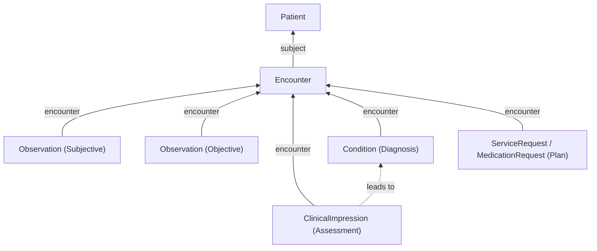

# Visit Templates and Clinical Notes

Visit templates (Care Templates in Medplum Provider) are authored as [`PlanDefinition`](/docs/api/fhir/resources/plandefinition) resources. They combine [`Questionnaire`](/docs/api/fhir/resources/questionnaire) actions for structured capture and [`ActivityDefinition`](/docs/api/fhir/resources/activitydefinition) actions for orders and other definitional steps. At runtime, [`PlanDefinition/$apply`](/docs/api/fhir/operations/plandefinition-apply) produces a concrete [`CarePlan`](/docs/api/fhir/resources/careplan), [`RequestGroup`](/docs/api/fhir/resources/requestgroup), and [`Task`](/docs/api/fhir/resources/task) set for the patient (and optionally the [`Encounter`](/docs/api/fhir/resources/encounter)).

SOAP-style documentation fits naturally inside this model: subjective and objective findings become [`Observation`](/docs/api/fhir/resources/observation) resources, assessment maps to [`ClinicalImpression`](/docs/api/fhir/resources/clinicalimpression), and plan maps to orders and care resources. See [Designing Charting](/docs/charting/designing-charting) for discovery questions, [Authoring Clinical Protocols](/docs/careplans/protocols) for advanced PlanDefinition patterns, and [Provider visits](/docs/provider/visits) for configuring Care Templates in the Provider app.

## Visit Template Lifecycle

1. Author a `PlanDefinition` with `action` entries referencing Questionnaires and ActivityDefinitions (or inline descriptions).
2. Invoke `$apply` with `subject` (Patient) and optionally `encounter`, `practitioner`, and `organization` parameters.
3. Medplum creates Tasks (and ServiceRequests when `ActivityDefinition.kind` is ServiceRequest, per server behavior — see [protocols](/docs/careplans/protocols) and the `$apply` reference).
4. Clinicians complete Questionnaires and orders; parse responses into FHIR resources using [Structured Data Capture](/docs/questionnaires/structured-data-capture) or Bots.
5. Sign the visit when appropriate using `ClinicalImpression` status and `Provenance` on the Encounter (see [Signing And Locking](#signing-and-locking-notes)).

## SOAP Notes Inside Visit Templates

SOAP is a common note rubric:

- Subjective — symptoms reported by the patient
- Objective — observable or measured data collected by the clinician
- Assessment — clinical analysis
- Plan — treatment strategy, orders, follow-up

Digitally, it is tempting to store everything as a raw `QuestionnaireResponse`. That is usually not the interoperability-friendly path: answers in `QuestionnaireResponse` alone are not first-class searchable FHIR fields in the way Observations and Conditions are. Prefer parsing into the proper resources (see [Structured Data Capture](/docs/questionnaires/structured-data-capture)).

### Workflow Patterns

#### Questionnaire-Driven Capture (Primary Care Example)

Many practices collect visits through a Questionnaire with a standard set of fields — blood pressure and weight every visit, for example. The `QuestionnaireResponse` holds the submission; answers should be parsed into structured `Observation` resources. Use `$extract` or Bots as described in the parsing guide.

#### Template-Driven Plan (Specialty Protocols)

Maintain PlanDefinitions for common protocols. Instead of only free-text plan sections, instantiate `ServiceRequest`, `MedicationRequest`, or `CarePlan` via `$apply` from ActivityDefinitions.

#### Pre-Filled Context From Intake (Specialty Example)

When intake narrows the problem list — dermatology intake selecting lesions — prepopulate questionnaire or Observation drafts before the clinician opens the chart.

### SOAP to FHIR Mapping

| SOAP       | FHIR resource                                                                                         | Description                                      |
| ---------- | ----------------------------------------------------------------------------------------------------- | ------------------------------------------------ |
| Subjective | [`Observation`](/docs/api/fhir/resources/observation)                                                 | Patient-reported symptoms and concerns           |
| Objective  | [`Observation`](/docs/api/fhir/resources/observation)                                                 | Clinician-measured findings and vitals           |
| Assessment | [`ClinicalImpression`](/docs/api/fhir/resources/clinicalimpression)                                     | Clinical analysis, differential, summary         |
| Plan       | [`CarePlan`](/docs/api/fhir/resources/careplan), [`ServiceRequest`](/docs/api/fhir/resources/servicerequest), [`MedicationRequest`](/docs/api/fhir/resources/medicationrequest) | Orders, prescriptions, ongoing care |

## How It Fits Together

All SOAP components link to the same [`Encounter`](/docs/api/fhir/resources/encounter), which organizes the visit.



Typical sequence:

1. Open a chart for an Encounter (often created from scheduling).
2. Apply the visit template (`$apply`) so Tasks and draft orders exist.
3. Save patient-reported symptoms as `Observation` with patient as `performer` (Subjective).
4. Save clinician measurements as `Observation` with practitioner or device as `performer` (Objective).
5. Create or update `ClinicalImpression` with assessment narrative in `note` (Assessment).
6. Create `Condition` resources for formal diagnoses where appropriate.
7. Place plan items as `ServiceRequest`, `MedicationRequest`, or `CarePlan` (Plan).
8. Complete signing when the note is final (below).

<details>
  <summary>Example: full SOAP note FHIR R4 Bundle</summary>

[Download soap-note-bundle.json](/examples/soap-note-bundle.json)

```json
{
  "resourceType": "Bundle",
  "type": "collection",
  "entry": [
    {
      "fullUrl": "urn:uuid:example-encounter",
      "resource": {
        "resourceType": "Encounter",
        "id": "example-encounter",
        "status": "finished",
        "class": {
          "system": "http://terminology.hl7.org/CodeSystem/v3-ActCode",
          "code": "AMB",
          "display": "ambulatory"
        },
        "subject": { "reference": "Patient/homer-simpson" },
        "participant": [
          {
            "individual": { "reference": "Practitioner/dr-alice-smith" }
          }
        ],
        "period": {
          "start": "2024-01-15T10:00:00Z",
          "end": "2024-01-15T11:30:00Z"
        }
      }
    },
    {
      "fullUrl": "urn:uuid:obs-subjective-fatigue",
      "resource": {
        "resourceType": "Observation",
        "id": "obs-subjective-fatigue",
        "status": "final",
        "code": {
          "coding": [
            {
              "system": "http://loinc.org",
              "code": "75325-1",
              "display": "Symptom"
            }
          ],
          "text": "Fatigue"
        },
        "subject": { "reference": "Patient/homer-simpson" },
        "encounter": { "reference": "Encounter/example-encounter" },
        "performer": [{ "reference": "Patient/homer-simpson" }],
        "valueString": "Patient reports feeling lethargic for the past week"
      }
    },
    {
      "fullUrl": "urn:uuid:obs-objective-heart-rate",
      "resource": {
        "resourceType": "Observation",
        "id": "obs-objective-heart-rate",
        "status": "final",
        "code": {
          "coding": [
            {
              "system": "http://loinc.org",
              "code": "8867-4",
              "display": "Heart rate"
            }
          ]
        },
        "subject": { "reference": "Patient/homer-simpson" },
        "encounter": { "reference": "Encounter/example-encounter" },
        "performer": [{ "reference": "Practitioner/dr-alice-smith" }],
        "valueQuantity": {
          "value": 112,
          "unit": "beats/min",
          "system": "http://unitsofmeasure.org",
          "code": "{Beats}/min"
        }
      }
    },
    {
      "fullUrl": "urn:uuid:clinical-impression-assessment",
      "resource": {
        "resourceType": "ClinicalImpression",
        "id": "clinical-impression-assessment",
        "status": "completed",
        "subject": { "reference": "Patient/homer-simpson" },
        "encounter": { "reference": "Encounter/example-encounter" },
        "date": "2024-01-15T11:00:00Z",
        "description": "Patient presents with fatigue and abdominal pain.",
        "finding": [
          {
            "itemReference": { "reference": "Condition/condition-gastritis" }
          }
        ],
        "note": [
          {
            "text": "Assessment: symptoms consistent with gastritis. Differential includes peptic ulcer disease. Will monitor response to treatment."
          }
        ]
      }
    },
    {
      "fullUrl": "urn:uuid:condition-gastritis",
      "resource": {
        "resourceType": "Condition",
        "id": "condition-gastritis",
        "clinicalStatus": {
          "coding": [
            {
              "system": "http://terminology.hl7.org/CodeSystem/condition-clinical",
              "code": "active"
            }
          ]
        },
        "verificationStatus": {
          "coding": [
            {
              "system": "http://terminology.hl7.org/CodeSystem/condition-ver-status",
              "code": "confirmed"
            }
          ]
        },
        "code": {
          "coding": [
            {
              "system": "http://hl7.org/fhir/sid/icd-10-cm",
              "code": "K29.70",
              "display": "Gastritis, unspecified, without bleeding"
            }
          ]
        },
        "subject": { "reference": "Patient/homer-simpson" },
        "encounter": { "reference": "Encounter/example-encounter" }
      }
    },
    {
      "fullUrl": "urn:uuid:service-request-lab",
      "resource": {
        "resourceType": "ServiceRequest",
        "id": "service-request-lab",
        "status": "active",
        "intent": "order",
        "code": {
          "coding": [
            {
              "system": "http://loinc.org",
              "code": "13958-0",
              "display": "Helicobacter pylori [Presence] in Stool by Immunoassay"
            }
          ]
        },
        "subject": { "reference": "Patient/homer-simpson" },
        "encounter": { "reference": "Encounter/example-encounter" },
        "requester": { "reference": "Practitioner/dr-alice-smith" }
      }
    },
    {
      "fullUrl": "urn:uuid:provenance-note-signed",
      "resource": {
        "resourceType": "Provenance",
        "id": "provenance-note-signed",
        "target": [{ "reference": "Encounter/example-encounter" }],
        "recorded": "2024-01-15T11:30:00Z",
        "reason": [
          {
            "coding": [
              {
                "system": "http://terminology.hl7.org/CodeSystem/v3-ActReason",
                "code": "SIGN",
                "display": "Signed"
              }
            ]
          }
        ],
        "agent": [
          {
            "type": {
              "coding": [
                {
                  "system": "http://terminology.hl7.org/CodeSystem/provenance-participant-type",
                  "code": "author"
                }
              ]
            },
            "who": { "reference": "Practitioner/dr-alice-smith" }
          }
        ]
      }
    }
  ]
}
```

</details>

## Subjective and Objective — Observation

Both Subjective and Objective are [`Observation`](/docs/api/fhir/resources/observation) resources. The distinction is usually `performer`:

- Subjective: patient as `performer` for self-reported symptoms.
- Objective: clinician or device as `performer` for measured findings.

Use appropriate coding (typically [LOINC](/docs/careplans/loinc)) and `value[x]`. For measurement details see [Observations and vital signs](/docs/charting/chart-data-model#observations-and-vital-signs).

<details>
  <summary>Example: patient-reported fatigue (Subjective)</summary>

```json
{
  "resourceType": "Observation",
  "status": "final",
  "code": {
    "coding": [
      {
        "system": "http://loinc.org",
        "code": "75325-1",
        "display": "Symptom"
      }
    ],
    "text": "Fatigue"
  },
  "subject": { "reference": "Patient/homer-simpson" },
  "encounter": { "reference": "Encounter/example-encounter" },
  "performer": [{ "reference": "Patient/homer-simpson" }],
  "valueString": "Patient reports feeling lethargic for the past week"
}
```

</details>

<details>
  <summary>Example: elevated heart rate (Objective)</summary>

```json
{
  "resourceType": "Observation",
  "status": "final",
  "code": {
    "coding": [
      {
        "system": "http://loinc.org",
        "code": "8867-4",
        "display": "Heart rate"
      }
    ]
  },
  "subject": { "reference": "Patient/homer-simpson" },
  "encounter": { "reference": "Encounter/example-encounter" },
  "performer": [{ "reference": "Practitioner/dr-alice-smith" }],
  "valueQuantity": {
    "value": 112,
    "unit": "beats/min",
    "system": "http://unitsofmeasure.org",
    "code": "{Beats}/min"
  }
}
```

</details>

## Assessment — Clinical Impression

[`ClinicalImpression`](/docs/api/fhir/resources/clinicalimpression) is the FHIR-native assessment resource — the “A” in SOAP.

:::tip[Why ClinicalImpression instead of DocumentReference or raw QuestionnaireResponse?]

Some apps store assessment as `DocumentReference` or leave narrative only in `QuestionnaireResponse`. `ClinicalImpression` gives findings, summary, and reasoning discrete fields other systems can consume. Prefer structured coded data and use free-text where clinicians need it.

:::

Usually create `ClinicalImpression` early with `status` `in-progress`, then transition to `completed` when signed.

| Field         | Description                                     | Example                                                 |
| ------------- | ----------------------------------------------- | ------------------------------------------------------- |
| `status`      | Lifecycle state                                 | `in-progress`, `completed`                              |
| `subject`     | Patient                                         | `Patient/homer-simpson`                                 |
| `encounter`   | Encounter                                       | `Encounter/example-encounter`                           |
| `date`        | When assessed                                   | `2024-01-15T10:00:00Z`                                  |
| `description` | Short summary                                   | Patient presents with fatigue and abdominal pain.       |
| `note`        | Narrative; `note[0].text` is common for the note | Assessment narrative text                               |

<details>
  <summary>Example: ClinicalImpression at encounter start</summary>

```json
{
  "resourceType": "ClinicalImpression",
  "status": "in-progress",
  "subject": { "reference": "Patient/homer-simpson" },
  "encounter": { "reference": "Encounter/example-encounter" },
  "date": "2024-01-15T10:00:00Z",
  "description": "Patient presents with fatigue and abdominal pain.",
  "note": [
    {
      "text": "Assessment: symptoms consistent with gastritis. Differential includes peptic ulcer disease. Will monitor response to treatment."
    }
  ]
}
```

</details>

Formal diagnoses are often modeled as [`Condition`](/docs/api/fhir/resources/condition) while `ClinicalImpression` carries reasoning. See [Diagnoses and problem list](/docs/charting/chart-data-model#diagnoses-and-problem-list).

## Plan — Orders and Care

| Plan action              | FHIR resource                                                                             |
| ------------------------ | ----------------------------------------------------------------------------------------- |
| Lab or imaging order     | [`ServiceRequest`](/docs/api/fhir/resources/servicerequest)                             |
| Medication prescription  | [`MedicationRequest`](/docs/api/fhir/resources/medicationrequest)                       |
| Ongoing care strategy    | [`CarePlan`](/docs/api/fhir/resources/careplan)                                         |
| Referral                 | [`ServiceRequest`](/docs/api/fhir/resources/servicerequest) with appropriate `category` |

Details: [Ordering Labs And Imaging](/docs/labs-imaging/ordering-labs-imaging), [Representing Prescriptions](/docs/medications/representing-prescriptions-and-medication-orders).

## Signing and Locking Notes

When the note is complete, set `ClinicalImpression.status` to `completed`. Create [`Provenance`](/docs/api/fhir/resources/provenance) targeting the Encounter to record signer and time. Product-wise, “signed” and “locked” may differ — see [Designing Charting](/docs/charting/designing-charting) section 2.4 for co-sign, amendments, and audit queries.

<details>
  <summary>Example: Provenance for clinician sign-off</summary>

```json
{
  "resourceType": "Provenance",
  "target": [{ "reference": "Encounter/example-encounter" }],
  "recorded": "2024-01-15T11:30:00Z",
  "reason": [
    {
      "coding": [
        {
          "system": "http://terminology.hl7.org/CodeSystem/v3-ActReason",
          "code": "SIGN",
          "display": "Signed"
        }
      ]
    }
  ],
  "agent": [
    {
      "type": {
        "coding": [
          {
            "system": "http://terminology.hl7.org/CodeSystem/provenance-participant-type",
            "code": "author"
          }
        ]
      },
      "who": { "reference": "Practitioner/dr-alice-smith" }
    }
  ]
}
```

</details>

## See Also

- [ClinicalImpression](/docs/api/fhir/resources/clinicalimpression) FHIR resource API
- [Observation](/docs/api/fhir/resources/observation) FHIR resource API
- [Condition](/docs/api/fhir/resources/condition) FHIR resource API
- [Chart Data Model](/docs/charting/chart-data-model)
- [PlanDefinition `$apply`](/docs/api/fhir/operations/plandefinition-apply)
- [medplum-provider example app](https://github.com/medplum/medplum/tree/main/examples/medplum-provider)
