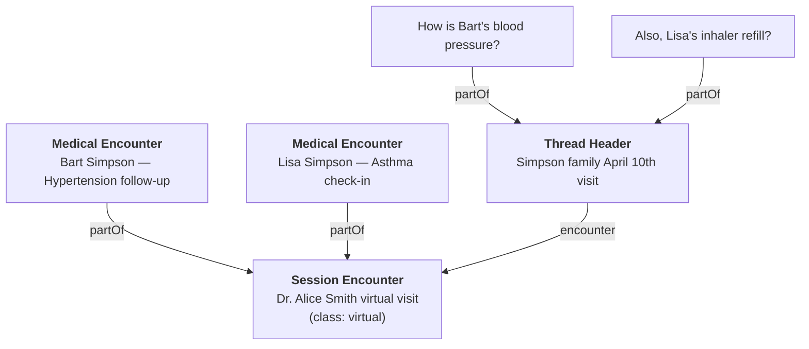

# Async Encounters

In healthcare, an "encounter" refers to any diagnostic or treatment interaction between a patient and provider. Traditionally this means an in-person visit, but in digital health it can take on asynchronous forms — SMS chains, in-app chat threads, or email exchanges. The FHIR [`Encounter`](/docs/api/fhir/resources/encounter) resource represents these interactions regardless of modality.

If your application needs to track clinical encounters tied to messaging threads — for billing, quality metrics, or compliance — you can link threads to FHIR Encounter resources.

## Thread-to-Encounter Relationship



## Define what a "session" means

A session could be:

- One thread = one session (simplest)
- All messages from a single day = one session (for rolling chat models)
- An explicitly initiated care interaction

## Create an Encounter for the session

:::note Required element
[`Encounter.class`](/docs/api/fhir/resources/encounter) is required in FHIR and should be taken from the [HL7 Act Encounter Code Valueset](https://terminology.hl7.org/3.1.0/ValueSet-v3-ActEncounterCode.html). Asynchronous care contexts will almost always use the code `VR` ("virtual").
:::

```ts
const encounter = await medplum.createResource({
  resourceType: 'Encounter',
  status: 'in-progress',
  class: {
    system: 'http://terminology.hl7.org/CodeSystem/v3-ActCode',
    code: 'VR',
    display: 'virtual',
  },
  subject: { reference: 'Patient/homer-simpson' },
  participant: [
    {
      individual: { reference: 'Practitioner/doctor-alice-smith' },
    },
  ],
});
```

If the session only involves a single patient, set `Encounter.subject` to that patient and you're all set. For multi-patient sessions, see [below](#multi-patient-sessions).

## Link the thread header to the Encounter

Link only the **thread header** [`Communication`](/docs/api/fhir/resources/communication) to the Encounter via `Communication.encounter`. Child messages inherit the encounter context through their `partOf` reference to the thread header — they do not need their own `encounter` field.

```ts
await medplum.patchResource('Communication', threadHeader.id!, [
  { op: 'add', path: '/encounter', value: { reference: `Encounter/${encounter.id}` } },
]);
```

## Multi-patient sessions

If a single thread discusses multiple patients (e.g. a parent asking about both children), create child Encounters with `partOf` to represent distinct medical encounters for each patient. The Communication thread stays linked to the session Encounter, while clinical details live on the per-patient child Encounters.

```ts
const childEncounter = await medplum.createResource({
  resourceType: 'Encounter',
  status: 'in-progress',
  class: {
    system: 'http://terminology.hl7.org/CodeSystem/v3-ActCode',
    code: 'VR',
    display: 'virtual',
  },
  subject: { reference: 'Patient/bart-simpson' },
  partOf: { reference: `Encounter/${encounter.id}` },
  reasonCode: [
    {
      coding: [{ system: 'http://snomed.info/sct', code: '38341003', display: 'Hypertension' }],
    },
  ],
  type: [
    {
      coding: [{ system: 'https://medplum.com/CodeSystem/encounter-type', code: 'medical-encounter', display: 'Medical Encounter' }],
    },
  ],
});
```

Use `Encounter.type` to distinguish session-level Encounters from per-patient medical Encounters. Populate each medical Encounter with the clinical details for that patient (diagnoses via `reasonCode`, service type, etc.). This hierarchy is important for billing and quality metrics — a well-documented encounter with the correct practitioner, diagnosis codes, and service type per patient is critical for reimbursement and for computing quality of care metrics.

:::tip
Record family members involved in the session via `Encounter.participant`. See the [Family Relationships guide](/docs/fhir-datastore/family-relationships) for modeling family member references.
:::

:::tip US Core compatibility
Check the [USCDI guide](/docs/fhir-datastore/understanding-uscdi-dataclasses) for information on making your Encounter resources compatible with US Core standards.
:::

Verify by searching `Encounter?class=VR` and `Communication?encounter=Encounter/{id}`.

## See Also

- [Organizing Communications Using Threads](/docs/communications/organizing-communications) — thread structure and `encounter` element
- [Encounter](/docs/api/fhir/resources/encounter) and [Communication](/docs/api/fhir/resources/communication) FHIR resource API
