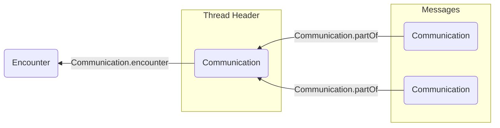
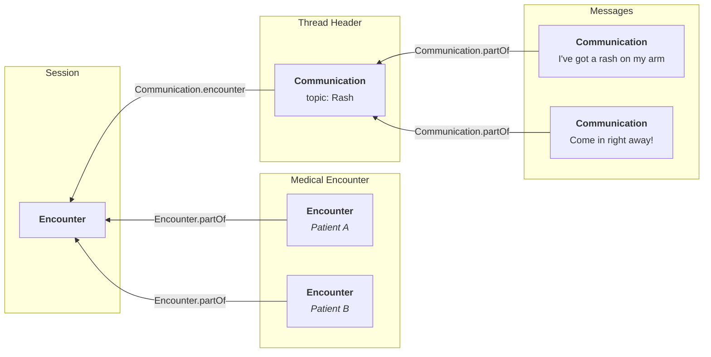

# Representing Asynchronous Encounters

## Intro

In healthcare, an "encounter" refers to any diagnostic or treatment interaction between a patient and provider. In traditional healthcare settings, this typically refers to an in-person visit, and is represented by the [`Encounter`](/docs/api/fhir/resources/encounter) resource.

But in digital health, this can take on a variety of asynchronous forms, including SMS chains, in-app chat threads, or even an email exchange.

In this guide, we'll show you how to represent these kinds of asynchronous encounters in FHIR.

## Defining Sessions

To get started, you'll first need to determine what determines a "session" in your care setting.

A session could be a single SMS chain, or a single email thread. Many digital health apps ask the patient to explicitly initiate a messaging session with a provider.

Alternatively, if your care setting has more of a rolling interaction model (e.g. a continuous text thread), you may choose to group all communications from the same day into a session.

## Representing Sessions in FHIR

Each session should be represented by an [`Encounter`](/docs/api/fhir/resources/encounter) resource. All of the messages that are part of this session should be represented as a thread of [`Communication`](/docs/api/fhir/resources/communication) resources. The thread should be linked to the session using the `Communication.encounter` element of _only_ the thread header. For more details on modeling threads, see the [Organizing Communications docs](/docs/communications/organizing-communications#building-and-structuring-threads).

You should record the participating physicians using the `Encounter.participant` element. You can also record any family members who are part of the session here (see our [Family Relationships guide](/docs/fhir-datastore/family-relationships) ).

:::tip Asynchronous Encounter Ontologies

The `Encounter.class` is a required element in FHIR and should be taken from the [HL7 Act Encounter Code Valueset](https://terminology.hl7.org/3.1.0/ValueSet-v3-ActEncounterCode.html). Asynchronous care contexts will almost always use the code `VR` ("virtual").

Also check our [USCDI guide](/docs/fhir-datastore/understanding-uscdi-dataclasses) for information on how to make your [`Encounter`](/docs/api/fhir/resources/encounter) compatible with the US Core standards.

:::

If your session only involves providing care for a single patient, then you can set the `Encounter.subject` element to refer to the patient and you're all set! If, however, multiple patients are involved in the session, continue reading.

## Handling Multiple-Patient Sessions

In some care settings, a session may discuss the health of multiple patients. For example, a mother may ask about the health of both of her children in the same email exchange.

In these situations, we'll have to represent distinct "medical encounters" for each patient.

We can use the hierarchical nature of the [`Encounter`](/docs/api/fhir/resources/encounter) resource to split out medical encounters for each session. The `Encounter.partOf` element creates a parent-child relationship between [`Encounters`](/docs/api/fhir/resources/encounter), which is perfect for encounters that overlap in time.

To properly represent your asynchronous encounter, you should:

1. Create an [`Encounter`](/docs/api/fhir/resources/encounter) for the session
2. Create a new [`Encounter`](/docs/api/fhir/resources/encounter) for each patient to represent a medical encounter
3. Set the `Encounter.subject` of each medical encounter to the corresponding patient
4. Populate each medical encounter with the clinical details (diagnoses, reasons for visit) of the corresponding patient.
5. Set the `Encounter.partOf` element for each medical encounter to refer to the session's [`Encounter`](/docs/api/fhir/resources/encounter)

The thread of [`Communication`](/docs/api/fhir/resources/communication) resources should still be linked to the "session" encounter, but the clinical details for each patient will live on the medical encounters. You can add an additional value the `Encounter.type` element to tag encounters as either "sessions" or "medical encounters."

While creating an [`Encounter`](/docs/api/fhir/resources/encounter) hierarchy like this is a bit more work up front, it promotes good data hygiene. A well documented encounter, with the correct practitioner, diagnosis codes, service type _per patient_ is critical to [billing](/docs/billing), and it is important for patient analytics use cases, such as computing quality of care metrics.
