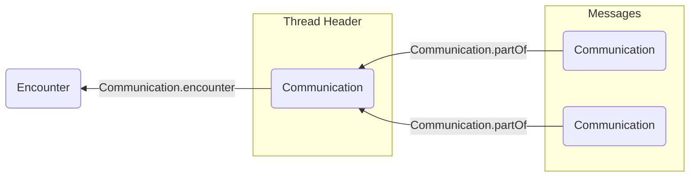
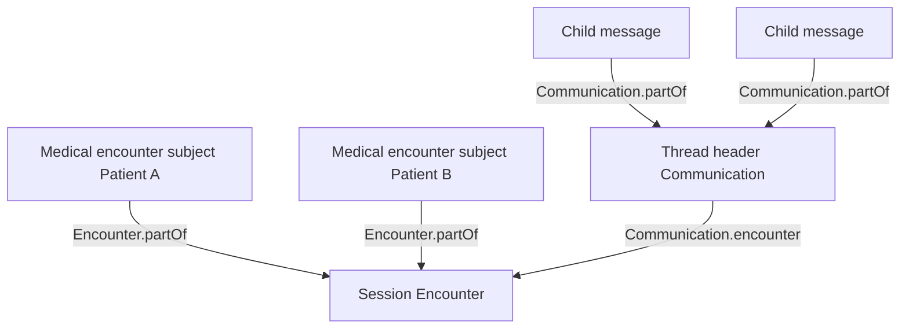

import ExampleCode from '!!raw-loader!@site/../examples/src/communications/messaging-examples.ts';
import MedplumCodeBlock from '@site/src/components/MedplumCodeBlock';
import Tabs from '@theme/Tabs';
import TabItem from '@theme/TabItem';

# Representing Asynchronous Encounters

## Intro

In healthcare, an "encounter" refers to any diagnostic or treatment interaction between a patient and provider. In traditional healthcare settings, this typically refers to an in-person visit, and is represented by the [`Encounter`](/docs/api/fhir/resources/encounter) resource.

But in digital health, this can take on a variety of asynchronous forms, including SMS chains, in-app chat threads, or even an email exchange.

In this guide, we'll show you how to represent these kinds of asynchronous encounters in FHIR.

## Defining Sessions

To get started, you'll first need to determine what determines a "session" in your care setting.

A session could be a single SMS chain, or a single email thread. Many digital health apps ask the patient to explicitly initiate a messaging session with a provider.

Alternatively, if your care setting has more of a rolling interaction model (e.g. a continuous text thread), you may choose to group all communications from the same day into a session.

Other common choices include treating one messaging thread as one session, or starting a session only when the patient explicitly opens a new care interaction.

## Representing Sessions in FHIR

Each session should be represented by an [`Encounter`](/docs/api/fhir/resources/encounter) resource. All of the messages that are part of this session should be represented as a thread of [`Communication`](/docs/api/fhir/resources/communication) resources. The thread should be linked to the session using the [`Communication.encounter`](/docs/api/fhir/resources/communication) element of only the thread header. For more details on modeling threads, see [Building and Structuring Threads](/docs/communications/messaging-data-model#building-and-structuring-threads).

:::note[Encounter on the thread header only]

Set [`Communication.encounter`](/docs/api/fhir/resources/communication) on the thread header only. Child messages point at the header with [`Communication.partOf`](/docs/api/fhir/resources/communication); they do not need their own `encounter` element for this pattern.

:::

You should record the participating physicians using the [`Encounter.participant`](/docs/api/fhir/resources/encounter) element. You can also record any family members who are part of the session here (see our [Family Relationships guide](/docs/fhir-datastore/family-relationships)).

:::tip[Asynchronous Encounter Ontologies]

The [`Encounter.class`](/docs/api/fhir/resources/encounter) element is required in FHIR and should be taken from the [HL7 Act Encounter Code Valueset](https://terminology.hl7.org/3.1.0/ValueSet-v3-ActEncounterCode.html). Asynchronous care contexts will almost always use the code `VR` ("virtual").

Also check our [USCDI guide](/docs/fhir-datastore/understanding-uscdi-dataclasses) for information on how to make your [`Encounter`](/docs/api/fhir/resources/encounter) compatible with the US Core standards.

:::

If your session only involves providing care for a single patient, then you can set the [`Encounter.subject`](/docs/api/fhir/resources/encounter) element to refer to the patient and you're all set! If, however, multiple patients are involved in the session, continue reading.

## Walkthrough: Session Encounter and Thread Link

If you need encounters for billing, quality programs, or compliance, create a session [`Encounter`](/docs/api/fhir/resources/encounter), then link your existing thread header with a JSON Patch on [`Communication.encounter`](/docs/api/fhir/resources/communication). This assumes you already have a thread header [`Communication`](/docs/api/fhir/resources/communication). For how thread headers and messages are structured, see [Building and Structuring Threads](/docs/communications/messaging-data-model#building-and-structuring-threads).

### Create the Session Encounter

The snippet uses virtual class `VR` and example [`Patient`](/docs/api/fhir/resources/patient) and [`Practitioner`](/docs/api/fhir/resources/practitioner) references. Replace them with ids that exist in your project.

<MedplumCodeBlock language="ts" selectBlocks="asyncEncountersCreateSessionEncounterTs">
  {ExampleCode}
</MedplumCodeBlock>

### Link the Thread Header to the Encounter

Patch only the thread header. The snippet uses the session Encounter id from the previous step and an existing thread header [`Communication`](/docs/api/fhir/resources/communication) (no `payload`, no `partOf`).

<MedplumCodeBlock language="ts" selectBlocks="asyncEncountersLinkThreadHeaderEncounterTs">
  {ExampleCode}
</MedplumCodeBlock>

## Handling Multiple-Patient Sessions

In some care settings, a session may discuss the health of multiple patients. For example, a mother may ask about the health of both of her children in the same email exchange.

In these situations, we'll have to represent distinct "medical encounters" for each patient.

We can use the hierarchical nature of the [`Encounter`](/docs/api/fhir/resources/encounter) resource to split out medical encounters for each session. The [`Encounter.partOf`](/docs/api/fhir/resources/encounter) element creates a parent-child relationship between [`Encounters`](/docs/api/fhir/resources/encounter), which is perfect for encounters that overlap in time.

To properly represent your asynchronous encounter, you should:

1. Create an [`Encounter`](/docs/api/fhir/resources/encounter) for the session
2. Create a new [`Encounter`](/docs/api/fhir/resources/encounter) for each patient to represent a medical encounter
3. Set the [`Encounter.subject`](/docs/api/fhir/resources/encounter) of each medical encounter to the corresponding patient
4. Populate each medical encounter with the clinical details (diagnoses, reasons for visit) of the corresponding patient.
5. Set the [`Encounter.partOf`](/docs/api/fhir/resources/encounter) element for each medical encounter to refer to the session's [`Encounter`](/docs/api/fhir/resources/encounter)

The thread of [`Communication`](/docs/api/fhir/resources/communication) resources should still be linked to the "session" encounter, but the clinical details for each patient will live on the medical encounters. You can add a value to the [`Encounter.type`](/docs/api/fhir/resources/encounter) element to tag encounters as either "sessions" or "medical encounters."

While creating an [`Encounter`](/docs/api/fhir/resources/encounter) hierarchy like this is a bit more work up front, it promotes good data hygiene. A well documented encounter, with the correct practitioner, diagnosis codes, [`Encounter.serviceType`](/docs/api/fhir/resources/encounter), and [`Encounter.reasonCode`](/docs/api/fhir/resources/encounter) per patient is critical to [billing](/docs/billing), and it is important for patient analytics use cases, such as computing quality of care metrics.

### Walkthrough: Child Encounter for One Patient

Create one child [`Encounter`](/docs/api/fhir/resources/encounter) per patient, referencing the session Encounter from the walkthrough above in [`Encounter.partOf`](/docs/api/fhir/resources/encounter). Use [`Encounter.type`](/docs/api/fhir/resources/encounter) (here a custom coding) to distinguish medical encounters from the parent session. Replace the patient reference with your data.

<MedplumCodeBlock language="ts" selectBlocks="asyncEncountersChildMedicalEncounterTs">
  {ExampleCode}
</MedplumCodeBlock>

:::tip[Family participants]

Record family members involved in the session on [`Encounter.participant`](/docs/api/fhir/resources/encounter). See [Family Relationships](/docs/fhir-datastore/family-relationships) for modeling related persons.

:::

## Verify with Search

Use these searches to confirm virtual encounters exist and that the thread header is linked to the session Encounter. The TypeScript tab chains the session Encounter id from the walkthrough above. For CLI and cURL, replace `{sessionEncounterId}` with your session Encounter id.

<Tabs groupId="language">
  <TabItem value="ts" label="TypeScript">
    <MedplumCodeBlock language="ts" selectBlocks="asyncEncountersVerifySearchesTs">
      {ExampleCode}
    </MedplumCodeBlock>
  </TabItem>
  <TabItem value="cli" label="CLI">
    <MedplumCodeBlock language="bash" selectBlocks="asyncEncountersVerifySearchesCli">
      {ExampleCode}
    </MedplumCodeBlock>
  </TabItem>
  <TabItem value="curl" label="cURL">
    <MedplumCodeBlock language="bash" selectBlocks="asyncEncountersVerifySearchesCurl">
      {ExampleCode}
    </MedplumCodeBlock>
  </TabItem>
</Tabs>

## See Also

- [Encounter](/docs/api/fhir/resources/encounter) FHIR resource API
- [Communication](/docs/api/fhir/resources/communication) FHIR resource API
- [Messaging Data Model](/docs/communications/messaging-data-model) — thread headers and messages
- [Searching and Querying Threads](/docs/communications/searching-and-querying-threads) — finding thread headers and messages
- [Family Relationships](/docs/fhir-datastore/family-relationships) — participants and related persons
