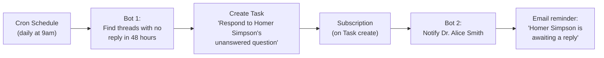

import ExampleCode from '!!raw-loader!@site/..//examples/src/communications/messaging-examples.ts';
import MedplumCodeBlock from '@site/src/components/MedplumCodeBlock';

# Bot Automation for Messaging

Medplum [Bots](/docs/bots/bot-basics) and [FHIR Subscriptions](/docs/subscriptions) enable automation around messaging workflows. This page covers two patterns: managing Task lifecycle when messages are sent in a thread, and reminding providers when threads go stale.

## Message Task Lifecycle

When messages are sent in a thread, a single Bot can manage the full [Task](/docs/api/fhir/resources/task) lifecycle: creating a Task when a message needs a response, and completing it when a provider replies. Using one Bot with one Subscription avoids race conditions that arise when separate Bots share the same trigger criteria.

The Bot checks whether an open Task already exists for the thread:

- If no open Task exists, it creates one (routed to a provider pool via `performerType`).
- If an open Task exists and the sender is not the patient (`sender !== task.for`), it treats the message as a provider response and completes the Task with `output` pointing to the response Communication.
- If an open Task exists but the sender is the patient (e.g. a follow-up message), it does nothing — the Task stays open.

For the full Task model (focus, for, owner, performerType, claiming, rerouting), see the Task-based message response tracking and routing documentation when available.

### Bot Code

<MedplumCodeBlock language="ts" selectBlocks="messageTaskLifecycleTs">
  {ExampleCode}
</MedplumCodeBlock>

:::tip
Customize the "should I create a Task?" logic for your workflow. For example, check `Communication.category` or the sender's resource type to decide which messages need a response Task. The `performerType` value determines which provider pool the Task is routed to — change the SNOMED code to match your team structure.
:::

### Deploy and Subscribe

1. Create a Bot resource in the Medplum App (Project Admin → Bots → New). See [Deploying Bots](/docs/bots/bot-basics#deploying-a-bot) for full steps.
2. Create a [Subscription](/docs/api/fhir/resources/subscription) that triggers the Bot for new child messages:

<MedplumCodeBlock language="ts" selectBlocks="subscriptionMessageTaskLifecycleTs">
  {ExampleCode}
</MedplumCodeBlock>

The criteria `part-of:missing=false` ensures the Subscription only fires for child messages (which have `partOf`), not thread headers. Adding `status=in-progress` prevents the Subscription from firing when messages are retracted (`entered-in-error`) or when drafts (`preparation`) are saved — it only triggers for newly sent messages.

### Verify

1. Create a thread and send a message as a patient — a Task should be created with `status: "requested"` and `focus` pointing to the thread header
2. Send a follow-up message as the same patient — no new Task should be created, the existing one stays open
3. Send a response as a provider — the Task should now have `status: "completed"` and an `output` entry referencing the response Communication
4. Query `Task?focus=Communication/{thread-id}` to confirm

## Stale Thread Reminders

A cron-triggered Bot can periodically scan for threads without timely responses and create reminder Tasks, which can in turn trigger notifications.

### Bot Code

<MedplumCodeBlock language="ts" selectBlocks="staleThreadRemindersTs">
  {ExampleCode}
</MedplumCodeBlock>

The 3-day threshold is configurable — adjust based on your response time expectations per thread category and urgency.

### Deploy

1. Deploy the Bot and configure it to run on a cron schedule (e.g., once per hour, once per day). See [Cron Jobs for Bots](/docs/bots/bot-cron-job).
2. Create a Subscription to trigger notifications when reminder Tasks are created:

<MedplumCodeBlock language="ts" selectBlocks="subscriptionStaleReminderTs">
  {ExampleCode}
</MedplumCodeBlock>

The notification Bot receives the Task, looks up the thread and intended owner, and sends an email, SMS, or push notification. See [Integration Patterns](/docs/communications/integration-patterns) for outbound notification examples.

## Analytics and SLA Tracking

FHIR search is designed for clinical data lookups, not aggregate analytics. Metrics like response time, SLA compliance, and escalation rates are best calculated by exporting Task data to your analytics platform (e.g. BigQuery, Snowflake, Redshift).

Key data points available on each Task:

- `Task.authoredOn` — when the Task was created
- `Task.status` and status change timestamps — track time-to-claim and time-to-complete
- `Task.owner` — who handled it
- `Task.priority` — urgency level at creation and any subsequent changes
- `Task.focus` — which thread the Task is about

To surface urgency in your UI without building SLA infrastructure, use `Task.priority` (`routine`, `urgent`, `asap`, `stat`) to drive visual indicators like color coding and sort order in your task queue.

## See Also

- [Organizing Communications Using Threads](/docs/communications/organizing-communications) — thread headers, `partOf`, and the messaging data model
- [Integration Patterns](/docs/communications/integration-patterns) — outbound notifications and external channel patterns
- [Bots](/docs/bots/bot-basics) and [Subscriptions](/docs/subscriptions)
- [Cron Jobs for Bots](/docs/bots/bot-cron-job) — scheduling Bots on a timer
- [Task](/docs/api/fhir/resources/task) and [Communication](/docs/api/fhir/resources/communication) FHIR resource API
