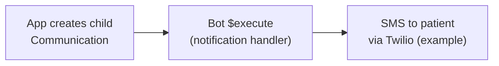
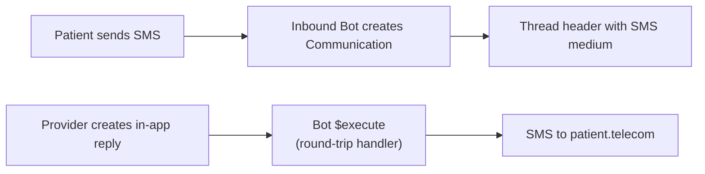

import ExampleCode from '!!raw-loader!@site/..//examples/src/communications/messaging-examples.ts';
import MedplumCodeBlock from '@site/src/components/MedplumCodeBlock';

# External Messaging Integration Patterns

These patterns show how to bridge Medplum messaging to external channels (SMS, email, push notifications) using [Bots](/docs/bots/bot-basics) and on-demand [`$execute`](/docs/api/fhir/operations/bot-execute). For in-platform automations (Tasks, reminders, scheduling), see [Messaging Automations](/docs/communications/messaging-automations).

:::note Prerequisites

Bots are an [advanced feature](/docs/bots/bot-basics) that may need to be enabled for your project.

:::

## Outbound: Notify External Systems on New Messages {#outbound-messaging-notifications}

Create a Bot that sends an external notification for a child `Communication` (same handler whether you trigger it from your app server or from another Bot). The handler reads `event.input` as the `Communication` resource.

<MedplumCodeBlock language="ts" selectBlocks="externalNotifyOnMessageBotTs">
  {ExampleCode}
</MedplumCodeBlock>

After you create the in-app message, invoke the Bot with [`executeBot()`](/docs/sdk/core.medplumclient) so provider API errors (invalid number, throttling, etc.) return to the caller instead of failing asynchronously behind a subscription.

<MedplumCodeBlock language="ts" selectBlocks="externalNotifyExecuteTs">
  {ExampleCode}
</MedplumCodeBlock>

The example uses [`createResourceIfNoneExist()`](/docs/sdk/core.medplumclient) with a stable application message id so a retry of the same send does not insert duplicate `Communication` rows. See [Bot $execute](/docs/api/fhir/operations/bot-execute) for authentication options, content types, and async execution.

:::tip Processing Notification Bundles

When you handle live updates (WebSocket `Subscription` notifications or similar), locate the new `Communication` by scanning `bundle.entry` for `resourceType === 'Communication'` instead of assuming a fixed entry index. See [Searching and Querying Threads](/docs/communications/searching-and-querying-threads#live-updates).

:::

## Inbound: Create Messages from External Webhooks

Wire inbound provider webhooks to a Bot using [`$execute`](/docs/api/fhir/operations/bot-execute) (see [Consuming Webhooks](/docs/bots/consuming-webhooks)). Some partners send OAuth-signed or otherwise authenticated webhooks; others require a public URL and an [unauthenticated webhook](/docs/bots/consuming-webhooks#unauthenticated-webhooks) endpoint—use the pattern that matches your vendor and lock down access (signatures, narrow AccessPolicy, and validation inside the Bot).

When an inbound message arrives from an external channel, the Bot typically solves two problems: sender resolution (who sent this?) and thread matching (which conversation does it belong to?). FHIR [conditional references](https://www.hl7.org/fhir/references.html#conditional) can resolve the sender at write time when the external system provides enough context.

### Sender Resolution with Conditional References

Use a conditional reference on `sender` so the server resolves the patient at create time — no separate search step:

<MedplumCodeBlock language="ts" selectBlocks="inboundSmsConditionalSenderTs">
  {ExampleCode}
</MedplumCodeBlock>

The snippet above only demonstrates sender resolution. It omits `partOf` on purpose — you still match or create a thread using one of the strategies below before you treat the example as a complete inbound message.

The conditional reference `Patient?phone=<number>` resolves to exactly one matching [`Patient`](/docs/api/fhir/resources/patient) at write time (no separate search in your Bot). For email, use `Patient?email=<address>`.

:::caution Conditional References and the Whole `POST`

If any conditional reference on the `Communication` you are creating does not resolve — zero matches or more than one match — the server rejects the entire create. There is no partial write. That applies to `sender` (for example `Patient?phone=...`) and, in Strategy 1 below, to `partOf` (for example `Communication?identifier=<system>|<conversationId>` matching how you indexed the thread header).

Order this to match your product rules:

- Reject unrecognized inbound senders — Using `Patient?phone=...` (or `Patient?email=...`) without pre-creating the patient is appropriate: the request fails until that phone or email uniquely identifies an existing patient.
- Accept messages from new numbers or addresses — Resolve identity first (search, create, or upsert a `Patient`), then create the `Communication` with a normal literal reference such as `Patient/{id}` on `sender`, or with a conditional you know will match.

The [`MedplumClient`](/docs/sdk/core.medplumclient) helper `createResourceIfNoneExist()` is described in [Working with FHIR](/docs/fhir-datastore/working-with-fhir) (see Creating Patient — it performs a search-then-conditional-create style flow). For update-or-create in one step, see [Upsert](/docs/fhir-datastore/working-with-fhir#upsert) on the same page.

Other fallbacks (such as a `display`-only reference without a resolved `reference`) depend on your validation rules — they may still fail if your server requires a resolved `sender`.

:::

Use `Communication.medium` to record which channel the message used. That supports channel indicators in your UI and downstream routing back through the same channel.

### Thread Matching Strategies

Sender resolution and thread matching are separate. The conditional reference above answers “who sent this” but you still need to decide which thread the message belongs to. Pick a strategy based on what the external system provides.

#### Strategy 1: External Conversation ID (Recommended When Available)

If the external system has its own conversation identifier (Twilio Conversations, email `Message-ID` / `In-Reply-To`, etc.), store that id on the thread header as an `identifier` when the thread is first created. The system and value must match what you pass in the conditional `partOf` reference on inbound messages. Set `medium` on the header if you use round-trip routing (see below).

Upsert the thread header (no `partOf`, no `payload` on the header) so setup is idempotent if the same conversation id is seen more than once. [`upsertResource()`](/docs/sdk/core.medplumclient.upsertresource) matches on the same `identifier` search you will use for conditional `partOf`:

<MedplumCodeBlock language="ts" selectBlocks="createThreadWithExternalIdTs">
  {ExampleCode}
</MedplumCodeBlock>

Inbound messages can then use a conditional reference for `partOf`:

<MedplumCodeBlock language="ts" selectBlocks="inboundSmsWithExternalThreadIdTs">
  {ExampleCode}
</MedplumCodeBlock>

Both `sender` and `partOf` can resolve via conditional references in a single `POST`. The `partOf` reference uses the same `identifier` search shape you stored on the thread header (for example `Communication?identifier=https://twilio.com|<conversationSid>` — the system and value must match how you set [`Communication.identifier`](/docs/api/fhir/resources/communication)). If no header matches, that conditional fails and the whole `Communication` create fails, same as an unmatched `Patient?phone`. You must also include the external id on every inbound payload so the server can resolve `partOf`.

#### Strategy 2: Patient + Active Thread Lookup (Fallback for Stateless Channels)

If the channel is stateless (basic SMS, email without thread headers), there may be no external conversation id. The Bot resolves the patient, then searches for their most recent open thread header. This example uses the same active-thread filter as other messaging docs (`status:not=completed,entered-in-error,stopped,unknown` — see [Searching and Querying Threads](/docs/communications/searching-and-querying-threads#search-query-cheat-sheet)). The webhook payload must include the provider’s stable message id (`providerMessageId` in the example) for deduplication.

<MedplumCodeBlock language="ts" selectBlocks="inboundSmsActiveThreadLookupBotTs">
  {ExampleCode}
</MedplumCodeBlock>

:::tip Unknown Inbound Numbers

The handler above returns quietly when no `Patient` matches the phone search. In production, log the raw number, write a dead-letter or audit record, or page an operator so retries and fraud attempts are visible.

:::

:::tip Modeling Thread Headers for Real Apps

When you create a new thread from inbound SMS, consider setting `sender`, `recipient`, and `topic` consistently with [Messaging Data Model](/docs/communications/messaging-data-model) so inbox searches and access policies behave as expected.

:::

#### Strategy 3: New Thread Per Inbound Message

Always create a new thread header for each inbound message. No matching logic. This fits one-off acknowledgments where messages are independent rather than a single ongoing conversation.

| Strategy                               | Best for                                                  | Tradeoff                                                                         |
| -------------------------------------- | --------------------------------------------------------- | -------------------------------------------------------------------------------- |
| External conversation ID (conditional) | Platforms with conversation state (Twilio, email threads) | Cleanest and declarative; requires storing the external id on the header         |
| Patient + active thread lookup         | Stateless SMS or simple email                             | Search logic in the Bot; ambiguous if several open threads exist for one patient |
| New thread per message                 | One-off notifications                                     | Ongoing conversations become fragmented                                        |

:::caution Webhook Retries and Duplicate Messages

Providers such as Twilio and SendGrid often retry webhook delivery. The same inbound event can hit your Bot more than once. Store the provider’s message id (or similar) on the [`Communication`](/docs/api/fhir/resources/communication) as an [`identifier`](/docs/api/fhir/resources/communication) and create with [`createResourceIfNoneExist()`](/docs/sdk/core.medplumclient) or another conditional-create pattern so a retry does not insert a second identical message.

:::

## Round-Trip: Routing Replies Through the Original Channel

When the patient reached you on SMS, provider replies composed in your app should often go back out on SMS. After you upsert the thread header with `medium` indicating SMS (as in Strategy 1), persist the provider’s in-app reply as a child `Communication`, then [`$execute`](/docs/api/fhir/operations/bot-execute) the same style of outbound Bot with that resource as input. The Bot inspects the thread header: if `medium` includes SMS, resolve the patient from `subject`, read `Patient.telecom` for a phone number, and call your SMS API.

<MedplumCodeBlock language="ts" selectBlocks="roundTripReplyBotTs">
  {ExampleCode}
</MedplumCodeBlock>

Orchestration from your app or API layer:

<MedplumCodeBlock language="ts" selectBlocks="roundTripReplyExecuteTs">
  {ExampleCode}
</MedplumCodeBlock>

Your product may key off the last inbound message’s `medium` instead of the header if that fits your model better.

## See Also

- [Communication](/docs/api/fhir/resources/communication) FHIR resource API
- [Messaging Data Model](/docs/communications/messaging-data-model)
- [Searching and Querying Threads](/docs/communications/searching-and-querying-threads)
- [Messaging Automations](/docs/communications/messaging-automations)
- [Working with FHIR](/docs/fhir-datastore/working-with-fhir) — conditional create, `createResourceIfNoneExist()`, upsert
- [Bots](/docs/bots/bot-basics) and [Bot $execute](/docs/api/fhir/operations/bot-execute)
