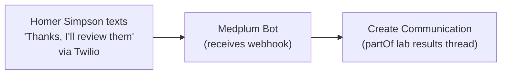

# Integration Patterns

These patterns show how to bridge Medplum messaging to external channels (SMS, email, push notifications) using Bots and Subscriptions.

## Outbound: Notify External Systems on New Messages


Create a Bot that sends an external notification:

```ts
import type { BotEvent, MedplumClient } from '@medplum/core';
import type { Communication } from '@medplum/fhirtypes';

export async function handler(medplum: MedplumClient, event: BotEvent<Communication>): Promise<void> {
  const communication = event.input;
  const messageText = communication.payload?.[0]?.contentString;
  const recipientRef = communication.recipient?.[0]?.reference;

  // Look up recipient contact info and send via your external service
  // e.g. Twilio SMS, SendGrid email, Firebase push
  console.log(`Sending notification to ${recipientRef}: ${messageText}`);
}
```

Create a [Subscription](/docs/api/fhir/resources/subscription) to trigger the Bot for new messages:

```ts
await medplum.createResource({
  resourceType: 'Subscription',
  status: 'active',
  reason: 'Send external notification on new message',
  criteria: 'Communication?part-of:missing=false&status=in-progress',
  channel: {
    type: 'rest-hook',
    endpoint: 'Bot/{your-bot-id}',
  },
});
```

## Inbound: Create Messages from External Webhooks



When an inbound message arrives from an external channel (SMS, email), the Bot needs to solve two problems: **sender resolution** (who sent this?) and **thread matching** (which conversation does it belong to?). FHIR conditional references can handle both declaratively when the external system provides enough context.

### Sender resolution with conditional references

Use a conditional reference on `sender` to let the FHIR server resolve the patient identity inline at write time — no separate search step needed:

```ts
await medplum.createResource({
  resourceType: 'Communication',
  status: 'in-progress',
  sender: {
    reference: `Patient?phone=${webhookData.fromPhoneNumber}`,
  },
  payload: [{ contentString: webhookData.messageText }],
  sent: new Date().toISOString(),
  medium: [{
    coding: [{
      system: 'http://terminology.hl7.org/CodeSystem/v3-ParticipationMode',
      code: 'SMSWRIT',
      display: 'SMS',
    }],
  }],
  // partOf — see thread matching below
});
```

The conditional reference `Patient?phone=<number>` resolves to the matching [Patient](/docs/api/fhir/resources/patient) at write time. For email, use `Patient?email=<address>`. If the reference doesn't resolve (no match or multiple matches), the POST will fail — handle this in your Bot by falling back to a `display`-only sender or creating the Patient first.

Use `Communication.medium` to tag the channel a message arrived from. This lets your UI display channel indicators (e.g. an SMS icon) and lets downstream logic route responses back through the same channel.

### Thread matching strategies

Sender resolution and thread matching are separate problems. The conditional reference above solves "who sent this" but you still need to determine *which thread* to attach the message to. Choose a strategy based on what the external system provides:

#### Strategy 1: External conversation ID (recommended when available)

If the external system has its own conversation concept (Twilio Conversations, email thread IDs via `Message-ID`/`In-Reply-To` headers), store that ID on the thread header as an `identifier` when the thread is first created. Inbound messages can then use a conditional reference for `partOf`:

```ts
await medplum.createResource({
  resourceType: 'Communication',
  status: 'in-progress',
  partOf: [{
    reference: `Communication?identifier=https://twilio.com|${webhookData.conversationSid}`,
  }],
  sender: {
    reference: `Patient?phone=${webhookData.fromPhoneNumber}`,
  },
  payload: [{ contentString: webhookData.messageText }],
  sent: new Date().toISOString(),
  medium: [{
    coding: [{
      system: 'http://terminology.hl7.org/CodeSystem/v3-ParticipationMode',
      code: 'SMSWRIT',
      display: 'SMS',
    }],
  }],
});
```

This is the cleanest approach — fully declarative, no search logic. Both `sender` and `partOf` resolve via conditional references in a single POST. It requires that the thread header was created with the external conversation ID as an `identifier`, and that the external system consistently provides it on every inbound message. When you create that header, list every participant in `recipient`, including whoever opened or owns the thread (the same actor as `sender` when applicable)—see [Organizing Communications](/docs/communications/organizing-communications#building-and-structuring-threads).

#### Strategy 2: Patient + active thread lookup (fallback for stateless channels)

If the external channel is stateless (basic SMS, simple email without thread headers), there's no external conversation ID to match on. The Bot resolves the patient first, then searches for their most recent open thread:

```ts
import type { BotEvent, MedplumClient } from '@medplum/core';

export async function handler(medplum: MedplumClient, event: BotEvent): Promise<void> {
  const webhookData = event.input as Record<string, string>;

  const patients = await medplum.searchResources('Patient', {
    phone: webhookData.fromPhoneNumber,
  });

  if (patients.length === 0) {
    return;
  }

  const patient = patients[0];

  const activeThreads = await medplum.searchResources('Communication', {
    'part-of:missing': true,
    subject: `Patient/${patient.id}`,
    status: 'in-progress',
    _sort: '-_lastUpdated',
    _count: '1',
  });

  let threadId: string;
  if (activeThreads.length > 0) {
    threadId = activeThreads[0].id!;
  } else {
    const newThread = await medplum.createResource({
      resourceType: 'Communication',
      status: 'in-progress',
      topic: { text: `SMS conversation with ${patient.name?.[0]?.text ?? 'Patient'}` },
      subject: { reference: `Patient/${patient.id}` },
      recipient: [{ reference: `Patient/${patient.id}` }],
    });
    threadId = newThread.id!;
  }

  await medplum.createResource({
    resourceType: 'Communication',
    status: 'in-progress',
    partOf: [{ reference: `Communication/${threadId}` }],
    sender: { reference: `Patient/${patient.id}` },
    payload: [{ contentString: webhookData.messageText }],
    sent: new Date().toISOString(),
    medium: [{
      coding: [{
        system: 'http://terminology.hl7.org/CodeSystem/v3-ParticipationMode',
        code: 'SMSWRIT',
        display: 'SMS',
      }],
    }],
  });
}
```

#### Strategy 3: New thread per inbound message

Always create a new thread header for each inbound message. No matching logic at all. This works for one-off inbound notifications (appointment confirmations, lab result acknowledgments) where messages are independent rather than part of a back-and-forth.

| Strategy | Best for | Tradeoff |
| --- | --- | --- |
| External conversation ID (conditional ref) | Platforms with conversation state (Twilio Conversations, email threads) | Cleanest — fully declarative. Requires external ID on thread header. |
| Patient + active thread lookup | Stateless channels (basic SMS, simple email) | Requires search logic in Bot. May match wrong thread if patient has multiple open threads. |
| New thread per message | One-off notifications | Fragments ongoing conversations. |

## See Also

- [Organizing Communications](/docs/communications/organizing-communications) — thread headers, `sender` / `recipient`, and structure
- [Bot Automation for Messaging](/docs/communications/bot-automation-for-messaging)
- [Communication](/docs/api/fhir/resources/communication) and [Subscription](/docs/api/fhir/resources/subscription) FHIR resource API
- [Bots](/docs/bots/bot-basics)
