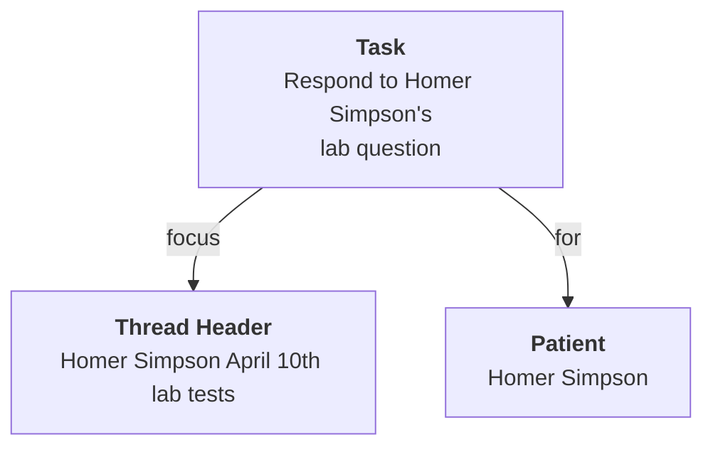

import ExampleCode from '!!raw-loader!@site/../examples/src/communications/messaging-examples.ts';
import MedplumCodeBlock from '@site/src/components/MedplumCodeBlock';
import Tabs from '@theme/Tabs';
import TabItem from '@theme/TabItem';

# Message Response Tracking and Routing

When messages need responses — and those responses need to be tracked, assigned, and rerouted — use the FHIR [`Task`](/docs/api/fhir/resources/task) resource alongside [`Communication`](/docs/api/fhir/resources/communication). This separates message content ([`Communication`](/docs/api/fhir/resources/communication)) from the routing and assignment lifecycle ([`Task`](/docs/api/fhir/resources/task)), allowing you to reassign work without modifying conversation data.

:::tip Assignment model
Do you need to assign work to named individuals only, to a pool by provider type, or both? That choice drives whether you use `owner`, `performerType`, or both.
:::

:::note Key concept

[`Task`](/docs/api/fhir/resources/task) is the authoritative source for routing and assignment. `Communication.recipient` is informational — it reflects who should see the thread (for access policy scoping and display), but if there's ever a conflict between `Task.owner` and `Communication.recipient`, the [`Task`](/docs/api/fhir/resources/task) is the source of truth. When rerouting, always update the [`Task`](/docs/api/fhir/resources/task) first, then update `Communication.recipient` to match.

:::

## Communication + Task Relationship

## Task Element Reference

| Element          | What It Does                                                                                                                                                              |
| ---------------- | ------------------------------------------------------------------------------------------------------------------------------------------------------------------------- |
| `focus`          | Links the [`Task`](/docs/api/fhir/resources/task) to the [`Communication`](/docs/api/fhir/resources/communication) thread header it's tracking                                                                                                           |
| `for`            | The patient this Task is about (mirrors `Communication.subject`)                                                                                                          |
| `owner`          | Who is currently responsible — a [`Practitioner`](/docs/api/fhir/resources/practitioner) (individual). Cleared when rerouting to a pool.                                                                           |
| `performerType`  | The type of provider who should handle this Task (e.g. "Health coach"). Used for pool-based routing — providers whose `PractitionerRole.code` matches can claim the Task. |
| `requester`      | Who created or triggered the Task                                                                                                                                         |
| `status`         | Task lifecycle: `requested` → `accepted` → `completed` (or `cancelled`)                                                                                                  |
| `businessStatus` | Custom status for your workflow (e.g. `unassigned`, `claimed`, `escalated`)                                                                                               |
| `priority`       | Urgency level: `routine`, `urgent`, `asap`, `stat`                                                                                                                        |
| `output`         | References the response Communication that resolved the Task                                                                                                              |

## Create a Task for a Thread

:::tip When to create a Task
Does this message require a tracked response? If not, keep it as Communication only. Use `Communication.category` or a Bot to determine which messages need routing.
:::

When a new message arrives that requires action, create a [`Task`](/docs/api/fhir/resources/task) linked to the thread via `focus`. Use `performerType` to route to a provider pool, or set `owner` directly for individual assignment.

<MedplumCodeBlock language="ts" selectBlocks="createTaskForThreadTs">
  {ExampleCode}
</MedplumCodeBlock>

To assign directly to a specific provider instead of a pool, set `owner` to the [`Practitioner`](/docs/api/fhir/resources/practitioner) reference and omit `performerType`.

:::tip

Only create a [`Task`](/docs/api/fhir/resources/task) for messages that require a response. Use `Communication.category` or business logic in a Bot to determine which messages need routing. In production, [`Task`](/docs/api/fhir/resources/task) creation is typically handled by a Bot triggered via a [`Subscription`](/docs/api/fhir/resources/subscription) on [`Communication`](/docs/api/fhir/resources/communication) creation rather than created manually.

:::

## Claim a Task from the Pool

When a team member picks up the [`Task`](/docs/api/fhir/resources/task), update `status` to `accepted` and set `owner` to the specific [`Practitioner`](/docs/api/fhir/resources/practitioner):

<MedplumCodeBlock language="ts" selectBlocks="claimTaskTs">
  {ExampleCode}
</MedplumCodeBlock>

To see unclaimed [`Task`](/docs/api/fhir/resources/task) resources in a pool, query by `performerType`:

<Tabs groupId="language">
  <TabItem value="ts" label="TypeScript">
    <MedplumCodeBlock language="ts" selectBlocks="queryUnclaimedTasksTs">
      {ExampleCode}
    </MedplumCodeBlock>
  </TabItem>
  <TabItem value="cli" label="CLI">
    <MedplumCodeBlock language="bash" selectBlocks="queryUnclaimedTasksCli">
      {ExampleCode}
    </MedplumCodeBlock>
  </TabItem>
  <TabItem value="curl" label="cURL">
    <MedplumCodeBlock language="bash" selectBlocks="queryUnclaimedTasksCurl">
      {ExampleCode}
    </MedplumCodeBlock>
  </TabItem>
</Tabs>

## Reroute to a Different Provider

:::tip Reroute target
Are you reassigning to one specific provider or back to a pool? Update `owner` and `Communication.recipient` for an individual; clear `owner`, set `performerType`, and clear `recipient` for a pool.
:::

Update `Task.owner` and `Communication.recipient` to reassign the thread:

<MedplumCodeBlock language="ts" selectBlocks="rerouteToProviderTs">
  {ExampleCode}
</MedplumCodeBlock>

## Reroute to a Provider Pool

Clear `Task.owner`, set `Task.performerType` to the role type, and clear `Communication.recipient`. Providers whose `PractitionerRole.code` matches the `performerType` can see and claim the [`Task`](/docs/api/fhir/resources/task).

<MedplumCodeBlock language="ts" selectBlocks="rerouteToPoolTs">
  {ExampleCode}
</MedplumCodeBlock>

To find Tasks routed to a pool:

<Tabs groupId="language">
  <TabItem value="ts" label="TypeScript">
    <MedplumCodeBlock language="ts" selectBlocks="poolTasksTs">
      {ExampleCode}
    </MedplumCodeBlock>
  </TabItem>
  <TabItem value="cli" label="CLI">
    <MedplumCodeBlock language="bash" selectBlocks="poolTasksCli">
      {ExampleCode}
    </MedplumCodeBlock>
  </TabItem>
  <TabItem value="curl" label="cURL">
    <MedplumCodeBlock language="bash" selectBlocks="poolTasksCurl">
      {ExampleCode}
    </MedplumCodeBlock>
  </TabItem>
</Tabs>

Providers match pools via their `PractitionerRole.code`.

## Tracking Reroute History

:::tip Audit trail
Do you need an audit trail of who owned the Task and why it was rerouted? Version history gives who/when; add `Task.note` or `Provenance` for reasons.
:::

When [`Task`](/docs/api/fhir/resources/task) resources are rerouted, you may need an audit trail of who owned them previously, when they were reassigned, and why. [`Task`](/docs/api/fhir/resources/task) version history (`meta.versionId`) automatically captures every state change, so the basic audit trail is always available via `medplum.readHistory('Task', task.id!)`. The question is how to capture the reason for the reroute.

### Free Text Reasons

Use `Task.note` to append a human-readable reason on each reroute. Notes are an array, so each reroute adds an entry with the author and timestamp:

<MedplumCodeBlock language="ts" selectBlocks="rerouteWithNoteTs">
  {ExampleCode}
</MedplumCodeBlock>

### Structured Reason Codes

If you need standardized, queryable reason codes, create a [`Provenance`](/docs/api/fhir/resources/provenance) resource alongside the [`Task`](/docs/api/fhir/resources/task) update. `Provenance.reason` accepts coded values:

<MedplumCodeBlock language="ts" selectBlocks="rerouteProvenanceTs">
  {ExampleCode}
</MedplumCodeBlock>

You can then query `Provenance?target=Task/{id}` to get the full reroute history with structured reasons.

### Reroute Visibility

:::tip Visibility after reroute
After reroute, should the previous owner still see the Task (e.g. for reference), or only the new owner? That determines whether you update `Task.owner` in place or create a new Task for the new owner.
:::

`Task.owner` is `0..1`, so it can only reference a single [`Practitioner`](/docs/api/fhir/resources/practitioner). When rerouting, you need to decide whether the original owner retains visibility.

#### Update Task in Place

If the original owner does not need to see the Task after reroute, update `Task.owner` directly. The original owner loses access (assuming access policies are scoped to `owner`):

<MedplumCodeBlock language="ts" selectBlocks="simpleRerouteTs">
  {ExampleCode}
</MedplumCodeBlock>

#### Create a New Task for the New Owner

If the original owner does need to retain visibility, create a new [`Task`](/docs/api/fhir/resources/task) for the new owner and mark the original as rerouted. Both owners can see their respective [`Task`](/docs/api/fhir/resources/task) resources, and `Task.focus` links both to the same thread:

<MedplumCodeBlock language="ts" selectBlocks="dualTaskRerouteTs">
  {ExampleCode}
</MedplumCodeBlock>

## See Also

- [Messaging Data Model](/docs/communications/messaging-data-model) — thread headers, messages, and [`Communication`](/docs/api/fhir/resources/communication) structure
- [`Communication`](/docs/api/fhir/resources/communication) FHIR resource API
- [`Task`](/docs/api/fhir/resources/task) FHIR resource API
- [Contact Center Demo](https://github.com/medplum/medplum-chat-demo) — an in-depth example of a provider messaging application
