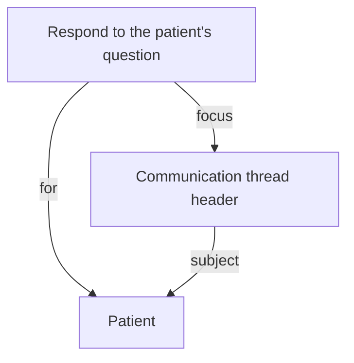

# Message Response Tracking and Routing

A conversation can move between teams while the patient keeps replying in the same thread. Use a Task to track who owes the next response, and Communication to retain what everyone said. Reassigning the work then preserves the conversation and its history.

:::tip[Choose an assignment model]

Use a named owner when one person is responsible, a group owner for team accountability, or an unowned pool when eligible staff claim work. The examples below use an unowned role pool.

:::

## Communication + Task Relationship


```mermaid
flowchart TD
    Task[Respond to the patient's question] -->|focus| Comm[Communication thread header]
    Task -->|for| Patient[Patient]
    Comm -->|subject| Patient
```

`Task.owner` identifies the accountable assignee. The thread's `Communication.recipient` retains all conversation participants, including its creator. When a new assignee joins the conversation, add that participant through your membership workflow; preserve the other participants. Returning work to a pool changes the Task's routing fields while retaining the conversation's membership. See the [Messaging Data Model](/docs/communications/messaging-data-model).

## Task Element Reference

| Element | What it does |
| --- | --- |
| `focus` | References the Communication thread header requiring a response |
| `for` | Identifies the patient the work concerns |
| `owner` | Identifies the accountable person, practitioner role, or group; unset for an unowned pool |
| `performerType` | Describes the required role, evaluated through the application's eligibility rules |
| `requester` | Identifies who requested the work |
| `status` | Tracks the work lifecycle, such as `ready`, `in-progress`, and `completed` |
| `businessStatus` | Records local stages such as waiting for clinical review |
| `priority` | Uses `routine`, `urgent`, `asap`, or `stat` |
| `output` | References the response Communication that resolved the obligation, with a type describing that output |

## Create a Task for a Thread

Create a Task when a message needs an accountable response. Informational messages can stay in the conversation without creating work. For repeated events, conditionally create the Task using a stable identifier for the thread and response obligation.

```json
{
  "resourceType": "Task",
  "identifier": [{
    "system": "https://example.org/message-work",
    "value": "thread-001-response-001"
  }],
  "status": "ready",
  "intent": "order",
  "code": { "text": "Respond to patient question" },
  "focus": { "reference": "Communication/thread-001" },
  "for": { "reference": "Patient/example" },
  "performerType": [{ "text": "Clinical reviewer" }]
}
```

The role label is illustrative. Configure a verified role code for searchable pools. Set an `owner` when assigning directly, retaining `performerType` when the role requirement remains relevant.

## Claim a Task from the Pool

Query for the pool's work type, role, open status, and `owner:missing=true`. A role filter alone also returns work that someone has already claimed. A group-owned queue instead searches for that group's owner reference.

Read the current Task, check the claimant's eligibility, and update `owner` using `If-Match` for the version read. If the version changed, reload the Task and let the user review the current assignment. Follow [Build a Queue and Let Staff Claim Work](/docs/careplans/tasks#build-and-claim-a-queue) for the shared claiming pattern.

Claiming establishes ownership. Set `in-progress` when the response work begins. Workflows that explicitly request and acknowledge a handoff can use `requested` and `accepted` as described in [Handoffs](/docs/careplans/handoffs-and-escalation#define-lifecycle-and-completion).

## Reroute to a Different Provider

For the same response obligation, update the existing Task's `owner` with a version check. Record why it moved so the next person can pick up the conversation. If that person is joining the thread, update the participant list to include them while preserving the remaining members.

Use a transaction Bundle when linked resource updates must succeed together. Apply version checks to both records. See [FHIR Batch and Transaction Requests](/docs/fhir-datastore/fhir-batch-requests).

## Reroute to a Provider Pool

Clear `Task.owner`, set the required `performerType`, and return the work to the pool's actionable status. Retain its `focus`, patient context, and history. Keep the thread's participant list intact; the pool is a routing destination for work.

Configure eligibility through [Teams and Delegation](/docs/careplans/teams-and-delegation#check-eligibility-before-assignment) and visibility through the [assignment and access rules](/docs/careplans/teams-and-delegation#assignment-and-access). This includes access to the thread and individual messages the assignee needs to read.

## Tracking Reroute History

Resource history retains earlier Task versions, including previous owners. Use an authored note for the reason, or Provenance when the workflow needs structured attribution. See [Resource History](/docs/fhir-datastore/resource-history).

### Free Text Reasons

Append an Annotation to `Task.note` with `authorReference` or `authorString`, `time`, and a concise reason. Preserve earlier notes. For example, "Transferred to the clinical review pool because the patient asked about their treatment plan" gives the next assignee useful context.

### Structured Reason Codes

Create Provenance targeting the relevant Task version, recording the actor and a verified local or standard reason code. Use `occurredDateTime` for the effective transfer time and `recorded` for when it was recorded. See [Operational Reporting](/docs/careplans/operational-reporting#build-a-transition-model) for deriving owner and stage intervals.

### Reroute Visibility

Decide whether the previous owner should retain access through AccessPolicy. Their access to a Task and to the conversation are separate policy decisions.

#### Update Task in Place

Keep one Task when the obligation stays the same. Updating its owner preserves one work history, and access policies can permit the former owner to retain visibility where required.

#### Create a New Task for the New Owner

Create a separate Task when the next person has a distinct obligation with its own completion criteria, such as a clinical review alongside a coordinator's patient response. Both can focus on the same thread. Choose this pattern because the work is separate, rather than to duplicate an item for visibility.

## Complete the Response and Notify the Team

Reference the resolving message in `Task.output` with a `type` and `valueReference`. Complete the Task when the response satisfies the workflow's criteria. If the reply creates another obligation, give that work an owner and its own completion criteria.

Use [assignee notifications](/docs/careplans/automating-workflows#let-the-assignee-know) for live queue updates and outbound alerts. Use [Handoffs and Escalation](/docs/careplans/handoffs-and-escalation#escalate-without-duplicating-work) when the response becomes overdue.

## See Also

- [Messaging Data Model](/docs/communications/messaging-data-model)
- [Tasks and Work Queues](/docs/careplans/tasks)
- [Teams and Delegation](/docs/careplans/teams-and-delegation)
