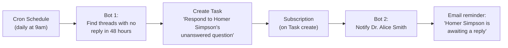

import ExampleCode from '!!raw-loader!@site/..//examples/src/communications/messaging-examples.ts';
import MedplumCodeBlock from '@site/src/components/MedplumCodeBlock';

# Messaging Automations

Medplum [Bots](/docs/bots/bot-basics) and [FHIR Subscriptions](/docs/subscriptions) let you automate messaging workflows without manual intervention, while still giving you full control over your business logic. There are two main design patterns:

- **Real-time automations** — A Bot triggered by a [Subscription](/docs/subscriptions) on [`Communication`](/docs/api/fhir/resources/communication) creation. The Bot runs immediately when a message is sent, making it ideal for actions that depend on the current state of the system (e.g., creating Tasks, checking provider availability).
- **Recurring automations** — A Bot running on a [cron schedule](/docs/bots/bot-cron-job). The Bot periodically scans existing resources to find conditions that need action (e.g., threads with no response for N days).

Both patterns let you encode your own rules — who gets a Task, what SLA thresholds to enforce, when to escalate — while keeping the automation infrastructure out of your application code.

## Real-Time Automations

A real-time automation uses a [Subscription](/docs/subscriptions) on `Communication` to trigger a [Bot](/docs/bots/bot-basics) whenever a message is sent in a thread. Because the Bot fires at message creation time, it has access to the current state of the system: who sent the message, whether a Task already exists, and whether the assigned provider is available.

### Example: Message Task Lifecycle

A single Bot can manage the full [Task](/docs/api/fhir/resources/task) lifecycle for a thread: creating a Task when a message needs a response, and completing it when a provider replies.

The Bot checks whether an open Task already exists for the thread:

- If no open Task exists, it creates one (routed to a provider pool via `performerType`).
- If an open Task exists and the sender is not the patient (`sender !== task.for`), it treats the message as a provider response and completes the Task with `output` pointing to the response Communication.
- If an open Task exists but the sender is the patient (e.g. a follow-up message), it does nothing — the Task stays open.

#### Bot Code

<MedplumCodeBlock language="ts" selectBlocks="messageTaskLifecycleTs">
  {ExampleCode}
</MedplumCodeBlock>

:::tip
Customize the "should I create a Task?" logic for your workflow. For example, check `Communication.category` or the sender's resource type to decide which messages need a response Task. The `performerType` value determines which provider pool the Task is routed to — change the SNOMED code to match your team structure.
:::

#### Deploy and Subscribe

1. Create a Bot resource in the Medplum App (Project Admin → Bots → New). See [Deploying Bots](/docs/bots/bot-basics#deploying-a-bot) for full steps.
2. Create a [Subscription](/docs/api/fhir/resources/subscription) that triggers the Bot for new child messages:

<MedplumCodeBlock language="ts" selectBlocks="subscriptionMessageTaskLifecycleTs">
  {ExampleCode}
</MedplumCodeBlock>

The criteria `part-of:missing=false` ensures the Subscription only fires for child messages (which have `partOf`), not thread headers. Adding `status=in-progress` prevents the Subscription from firing when messages are retracted (`entered-in-error`) or when drafts (`preparation`) are saved — it only triggers for newly sent messages.

#### Verify

1. Create a thread and send a message as a patient — a Task should be created with `status: "requested"` and `focus` pointing to the thread header
2. Send a follow-up message as the same patient — no new Task should be created, the existing one stays open
3. Send a response as a provider — the Task should now have `status: "completed"` and an `output` entry referencing the response Communication
4. Query `Task?focus=Communication/{thread-id}` to confirm

### Example: OOO Rerouting

When a message arrives for a provider who is currently out of office, a Bot can automatically reroute the [Task](/docs/api/fhir/resources/task) back to the provider pool so another team member can pick it up.

The Bot uses the Medplum [scheduling model](/docs/scheduling) to determine availability. It looks up the assigned provider's [Schedule](/docs/api/fhir/resources/schedule) and calls [`$find`](/docs/scheduling/schedule-find) for the current time window. If no free slots are returned — whether because of explicit time blocks (vacation, holidays) or because the provider has no [availability](/docs/scheduling/defining-availability) defined for the current day — the Task is rerouted to the pool.

#### Bot Code

<MedplumCodeBlock language="ts" selectBlocks="oooRerouteTs">
  {ExampleCode}
</MedplumCodeBlock>

:::tip
This example reroutes to the `performerType` pool. You could instead reroute to a specific coverage provider by setting `Task.owner` to that provider's reference. You can also customize the availability check — for instance, querying a different `serviceType` or adjusting the time window.
:::

#### Deploy and Subscribe

This Bot uses the same Subscription criteria as the lifecycle example — it triggers on new child messages (`Communication?part-of:missing=false&status=in-progress`). You can run both automations from a single Bot, or deploy them as separate Bots with separate Subscriptions depending on your preference.

## Recurring Automations

A recurring automation uses a [cron-triggered Bot](/docs/bots/bot-cron-job) to periodically scan existing resources and take action on conditions that have developed over time. This pattern is well suited for SLA enforcement, reminders, and cleanup tasks where the trigger is the passage of time rather than a specific event.

### Example: Stale Thread Reminders

A cron-triggered Bot can periodically scan for threads without timely responses and create reminder Tasks, which can in turn trigger notifications.

#### Bot Code

<MedplumCodeBlock language="ts" selectBlocks="staleThreadRemindersTs">
  {ExampleCode}
</MedplumCodeBlock>

The 3-day threshold is configurable — adjust based on your response time expectations per thread category and urgency.

#### Deploy

1. Deploy the Bot and configure it to run on a cron schedule (e.g., once per hour, once per day). See [Cron Jobs for Bots](/docs/bots/bot-cron-job).
2. Create a Subscription to trigger notifications when reminder Tasks are created:

<MedplumCodeBlock language="ts" selectBlocks="subscriptionStaleReminderTs">
  {ExampleCode}
</MedplumCodeBlock>

The notification Bot receives the Task, looks up the thread and intended owner, and sends an email, SMS, or push notification.

## Analytics and SLA Tracking

FHIR search is designed for clinical data lookups, not aggregate analytics. Metrics like response time, SLA compliance, and escalation rates are best calculated by exporting Task data to your analytics platform (e.g. BigQuery, Snowflake, Redshift).

Key data points available on each Task:

- `Task.authoredOn` — when the Task was created
- `Task.status` and status change timestamps — track time-to-claim and time-to-complete
- `Task.owner` — who handled it
- `Task.priority` — urgency level at creation and any subsequent changes
- `Task.focus` — which thread the Task is about

To surface urgency in your UI without building SLA infrastructure, use `Task.priority` (`routine`, `urgent`, `asap`, `stat`) to drive visual indicators like color coding and sort order in your task queue.

## See Also

- [Organizing Communications Using Threads](/docs/communications/organizing-communications) — thread headers, `partOf`, and the messaging data model
- [Defining Availability](/docs/scheduling/defining-availability) — how to configure provider schedules and time blocks
- [Schedule $find](/docs/scheduling/schedule-find) — checking provider availability
- [Bots](/docs/bots/bot-basics) and [Subscriptions](/docs/subscriptions)
- [Cron Jobs for Bots](/docs/bots/bot-cron-job) — scheduling Bots on a timer
- [Task](/docs/api/fhir/resources/task) and [Communication](/docs/api/fhir/resources/communication) FHIR resource API
