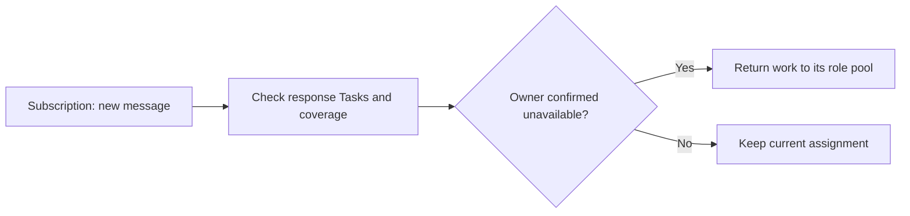
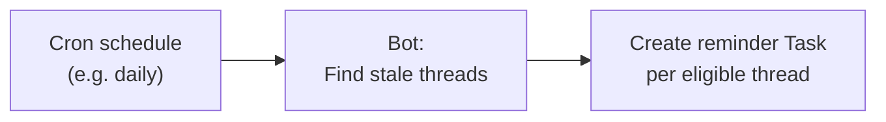

import ExampleCode from '!!raw-loader!@site/..//examples/src/communications/messaging-examples.ts';
import RoutingCode from '!!raw-loader!@site/../examples/src/communications/out-of-office-routing.ts';
import MedplumCodeBlock from '@site/src/components/MedplumCodeBlock';

# Messaging Automations

:::note[Prerequisites]

The patterns on this page use **Medplum Bots** — an [advanced feature](/docs/bots/bot-basics) that is disabled by default on many projects — and **FHIR Subscriptions**. Recurring automations also use **cron-scheduled Bots** ([Cron Jobs for Bots](/docs/bots/bot-cron-job)). Confirm Bots are enabled for your project and that you can create Bots and Subscriptions (typically as a Project administrator).

:::

Medplum [Bots](/docs/bots/bot-basics) and [FHIR Subscriptions](/docs/subscriptions) let you automate messaging workflows without manual intervention, while still giving you full control over your business logic. There are two main design patterns:

- **Real-time automations** — A Bot triggered by a [Subscription](/docs/subscriptions) on [`Communication`](/docs/api/fhir/resources/communication) when a message is sent. This page walks through **out-of-office rerouting**: checking provider availability at message time and returning work to a pool when the assignee is unavailable. Other common real-time patterns include creating or completing [Tasks](/docs/api/fhir/resources/task) when messages arrive; you can apply the same Subscription shape and tailor the Bot logic.
- **Recurring automations** — A Bot running on a [cron schedule](/docs/bots/bot-cron-job). The Bot periodically scans existing resources to find conditions that need action (e.g., threads with no response for N days).

Both patterns let you encode your own rules — who gets a Task, what SLA thresholds to enforce, when to escalate — while keeping the automation infrastructure out of your application code.

## Real-Time Automations

A real-time automation uses a [Subscription](/docs/subscriptions) on `Communication` to trigger a [Bot](/docs/bots/bot-basics) whenever a message is sent in a thread. Because the Bot runs at message creation time, it can inspect the current state of the system: who sent the message, which [Task](/docs/api/fhir/resources/task) (if any) is focused on the thread, and whether the assigned provider is available.

### Example: OOO rerouting

When a message arrives for a provider who is currently out of office, a Bot can automatically reroute the [Task](/docs/api/fhir/resources/task) back to the provider pool so another team member can pick it up.

Use your practice's coverage roster or explicit absence records to decide whether the assigned person can respond. A lack of bookable appointments does not establish that someone is out of office or unable to answer messages.

```mermaid
flowchart LR
    Sub["Subscription: new message"] --> Bot["Check response Tasks and coverage"]
    Bot --> Away{"Owner confirmed unavailable?"}
    Away -->|Yes| Reroute["Return work to its role pool"]
    Away -->|No| Keep["Keep current assignment"]
```

#### Bot Code

The factory below returns a Bot handler. Supply `isUnavailable` from your application's coverage integration and a coded response work type. Return `true` only for confirmed unavailability; if the lookup fails, throw so the Bot's recovery process can handle it. The handler uses the [safe pool transfer helper](/docs/communications/message-response-tracking-and-routing#reroute-to-a-provider-pool), preserving thread participants and checking the Task version.

<MedplumCodeBlock language="ts" selectBlocks="oooImports, oooRerouteTs">
  {RoutingCode}
</MedplumCodeBlock>

:::tip[Define the response pool before enabling automation]

This example handles `ready`, `accepted`, and `in-progress` response work with one coded `performerType`. It leaves unowned work, ambiguous pools, and paused Tasks for their existing workflow. Confirm your coverage policy allows in-progress work to return to `ready`; another workflow may require a handoff acknowledgment.

:::

#### Deploy and Subscribe

1. Configure the factory with your coverage lookup and response-work coding, then export the returned handler as the Bot entry point. Bundle the imported helper with the Bot. Create a Bot resource in the Medplum App (Project Admin → Bots → New). See [Deploying Bots](/docs/bots/bot-basics#deploying-a-bot) for full steps.
2. Create a [Subscription](/docs/api/fhir/resources/subscription) that triggers the Bot for new child messages:

<MedplumCodeBlock language="ts" selectBlocks="subscriptionOooRerouteTs">
  {ExampleCode}
</MedplumCodeBlock>

The criteria `part-of:missing=false` limits the Subscription to child messages (which have `partOf`), not thread headers. `status=in-progress` avoids firing on retracted messages (`entered-in-error`) or drafts (`preparation`) — it targets newly sent messages.

#### Verify

1. Mark a provider unavailable in the coverage source used by `isUnavailable`.
2. Create an owned response Task with the configured work-type code and one coded role pool, then send a new child message in the thread.
3. Confirm the Task has `owner` removed, `status: ready`, and an appended reroute note. The thread's participants should remain unchanged.
4. Test an available owner, an absent role code, and a concurrent Task update. On a version conflict, reload and reevaluate coverage and assignment before retrying; preserve the newer assignment.

## Recurring Automations

A recurring automation uses a [cron-triggered Bot](/docs/bots/bot-cron-job) to periodically scan existing resources and take action on conditions that have developed over time. This pattern is well suited for SLA enforcement, reminders, and cleanup tasks where the trigger is the passage of time rather than a specific event.

### Example: Stale Thread Reminders

A cron-triggered Bot can periodically scan for threads without timely responses and create reminder Tasks for your queue or follow-up workflows.

```mermaid
flowchart LR
    Cron["Cron schedule<br/>(e.g. daily)"] --> Bot["Bot:<br/>Find stale threads"]
    Bot --> CreateTask["Create reminder Task<br/>per eligible thread"]
```

#### Bot Code

<MedplumCodeBlock language="ts" selectBlocks="staleThreadRemindersTs">
  {ExampleCode}
</MedplumCodeBlock>

The 3-day threshold is configurable — adjust based on your response time expectations per thread category and urgency.

#### Deploy

Deploy the Bot and configure it to run on a cron schedule (e.g., once per hour, once per day). See [Cron Jobs for Bots](/docs/bots/bot-cron-job).

## Analytics and SLA Tracking

FHIR search is designed for clinical data lookups, not aggregate analytics. Metrics like response time, SLA compliance, and escalation rates are best calculated by exporting Task data to your analytics platform (e.g. BigQuery, Snowflake, Redshift).

Key data points available on each Task:

- `Task.authoredOn` — when the Task was created
- `Task.status` and status change timestamps — track time-to-claim and time-to-complete
- `Task.owner` — who handled it
- `Task.priority` — urgency level at creation and any subsequent changes
- `Task.focus` — which thread the Task is about

To surface urgency in your UI without building SLA infrastructure, use `Task.priority` (`routine`, `urgent`, `asap`, `stat`) to drive visual indicators like color coding and sort order in your task queue.

## See Also

- [Messaging Data Model](/docs/communications/messaging-data-model) — thread headers, `partOf`, and how messages relate
- [Defining Availability](/docs/scheduling/defining-availability) — how to configure provider schedules and time blocks
- [Appointment $find](/docs/scheduling/appointment-find) — checking provider availability
- [Bots](/docs/bots/bot-basics) and [Subscriptions](/docs/subscriptions)
- [Cron Jobs for Bots](/docs/bots/bot-cron-job) — scheduling Bots on a timer
- [Task](/docs/api/fhir/resources/task) and [Communication](/docs/api/fhir/resources/communication) FHIR resource API
