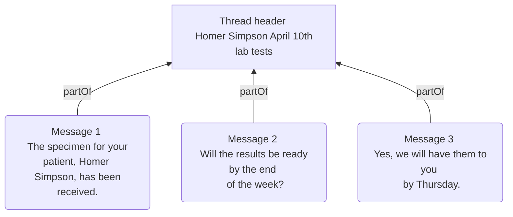

import ExampleCode from '!!raw-loader!@site/..//examples/src/communications/messaging-examples.ts';
import MedplumCodeBlock from '@site/src/components/MedplumCodeBlock';

# Messaging Data Model

In a healthcare context, messages are sent all the time and can include many scenarios (patient to physician, physician to physician, and more), so ensuring they are well organized is important. This guide explains how to model and organize threads in Medplum.

Medplum messaging uses a two-level hierarchy of FHIR [`Communication`](/docs/api/fhir/resources/communication) resources: a thread header that represents the conversation, and child messages that hold the actual content. The same pattern supports provider-to-provider chat, patient-to-care-team messaging, and internal coordination.

This page covers:

- Representing individual messages and key [`Communication`](/docs/api/fhir/resources/communication) elements
- Thread architecture and how to structure thread headers and messages
- Tagging and grouping threads with `category`

For a working reference app, see the [Contact Center Demo](https://github.com/medplum/medplum-chat-demo).

## Thread Architecture

A thread header has no `payload` and no `partOf`. It exists to group messages. Each message has both: `payload` with content and `partOf` pointing at the header. That distinction is how you tell headers apart from messages when querying the API (for example `part-of:missing=true` matches thread headers). For more query patterns and live updates, see [Searching and Querying Threads](/docs/communications/searching-and-querying-threads).

## Representing Individual Messages

The FHIR [`Communication`](/docs/api/fhir/resources/communication) resource represents any healthcare message regardless of channel (email, SMS, in-app chat, and more).

| Element | Description | Relevant Valueset | Example |
| --- | --- | --- | --- |
| `payload` | Text, attachments, or resources communicated to the recipient. On messages this is often `contentString`, `contentAttachment`, or `contentReference`. Omit on thread headers. | | You have an appointment scheduled for 2pm. |
| `sender` | The person or team that sent the message. | | Practitioner/doctor-alice-smith |
| `recipient` | The person or team that receives the message; can list multiple for group threads. On the thread header, include the full participant list (see [Building and Structuring Threads](#building-and-structuring-threads)). | | Practitioner/doctor-gregory-house |
| `topic` | The main focus of the conversation or message, similar to an email subject line. Put `topic` on the thread header for the thread title. Duplicating the same `topic` on every child message is **recommended** when you want message-level display, search, or subscriptions to carry the subject without reading the header; it is **not** required for a minimal valid thread. | Custom internal text | In person physical with Homer Simpson on April 10th, 2023 |
| `category` | Optional for basic threading. Use when you want a tag on the thread or message—for example filters, routing, or analytics. See [How to Tag or Group Threads](#how-to-tag-or-group-threads) for when to duplicate on children. | [HL7 Communication Category](http://terminology.hl7.org/CodeSystem/communication-category), SNOMED, custom | [See below](#how-to-tag-or-group-threads) |
| `reasonCode` | The specific reason the message was sent. Define a medical reason and/or a workflow reason: use the clinical findings subset of SNOMED for medical reasons and custom internal coding for workflow reasons. | [SNOMED Clinical Findings](http://hl7.org/fhir/R4/valueset-clinical-findings.html), custom internal | [301180005](https://browser.ihtsdotools.org/?perspective=full&conceptId1=301180005&edition=MAIN/2023-11-01&release=&languages=en) — Cardiovascular system normal (finding) |
| `partOf` | On a message, reference to the thread header [`Communication`](/docs/api/fhir/resources/communication). Empty on the thread header. | | [See Building and Structuring Threads](#building-and-structuring-threads) |
| `inResponseTo` | Optional link to a specific prior message when the user explicitly replies to that message (for example a reply action). For linear chronological chat, `partOf` plus sorting by `sent` is usually enough. | | Communication/previous-communication |
| `medium` | Channel or channels used; can be an array so one resource reflects multiple modalities. | [Participation Mode Codes](http://terminology.hl7.org/CodeSystem/v3-ParticipationMode) | email |
| `subject` | Patient or group the conversation is about. | | Patient/homer-simpson |
| `encounter` | Optional link from the thread header to a session [`Encounter`](/docs/api/fhir/resources/encounter). See [Representing Asynchronous Encounters](/docs/communications/async-encounters). | | Encounter/example-appointment |
| `sent` / `received` | When the message was sent or received. | | 2023-04-10T10:00:00Z |
| `status` | Transmission and lifecycle state on the resource. Draft, sent, retracted, and related patterns are summarized in [Communication Lifecycle](#communication-lifecycle). For read tracking via Tasks, see [Read Receipts and Message Status](/docs/communications/read-receipts-and-message-status). | [Event Status Codes](http://hl7.org/fhir/R4/valueset-event-status.html) | in-progress |

:::note `category` vs. `reasonCode`

`category` classifies the message at a broad level (for example notification versus alert). `reasonCode` explains why it was sent in more detail (for example appointment reminder versus abnormal lab result). A message can carry both, such as `category` for notification and `reasonCode` for appointment reminder.

:::

For every search parameter, see the [Communication API reference](/docs/api/fhir/resources/communication#search-parameters).

## Communication Lifecycle {#communication-lifecycle}

| Stage | FHIR representation |
| --- | --- |
| Draft | `Communication.status` is `preparation`. |
| Sent | `Communication.status` is `in-progress` and `Communication.sent` is populated when applicable. |
| Read | Varies based on requirements; see [Read Receipts and Message Status](/docs/communications/read-receipts-and-message-status). |
| Retracted | `Communication.status` is `entered-in-error` for retract-and-correct or similar workflows. |

## Building and Structuring Threads

Beyond single messages, most products group messages into threads. In FHIR, use a two-level hierarchy: one parent [`Communication`](/docs/api/fhir/resources/communication) as the thread header and child [`Communication`](/docs/api/fhir/resources/communication) resources as messages. Children link to the header with `partOf`.

The header represents the thread, not a specific message. It has no `payload` and no `partOf`. Child messages include `payload` and `partOf` pointing at the header.

A minimal thread can use `topic` on the **header only** (for example [Creating Your First Thread](/docs/communications/creating-your-first-thread)); UIs usually show that title when rendering the message list. Duplicate the same `topic` on **each child** when you need each `Communication` to carry the subject for message-level search, subscriptions, or exports without joining the header.

:::tip Thread header: `sender` and `recipient`

Set `sender` to whoever created or opened the thread when that applies. Include that same actor in `recipient`, together with every other participant. Treat `recipient` on the header as the full participant list for routing and UI, not only others who received a message.

FHIR search cannot express `recipient OR sender` in one parameter. Inbox-style filters such as `recipient=Practitioner/{id}` only match headers where that practitioner appears in `recipient`, so omitting the thread creator breaks threads the user started. See [Searching and Querying Threads](/docs/communications/searching-and-querying-threads) for query patterns that rely on this convention.

:::

  
Example of a thread grouped using a Communication resource

  <MedplumCodeBlock language="ts" selectBlocks="communicationGroupedThread">
    {ExampleCode}
  </MedplumCodeBlock>

## How to Tag or Group Threads

Tagging helps users interpret threads at a glance (for example a thread owned by nursing). Use `Communication.category` for that classification across purpose, audience, or nature.

You can omit `category` entirely if you do not need tags. **When using `category`,** put it on both the thread header and child [`Communication`](/docs/api/fhir/resources/communication) resources so message-level searches and filters stay consistent with the thread. `category` is an array, so each resource can carry multiple tags.

| Type of tag | Codesystem |
| --- | --- |
| Level of credential | [SNOMED Care Team Member Function valueset](https://vsac.nlm.nih.gov/valueset/2.16.840.1.113762.1.4.1099.30/expansion) |
| Clinical specialty | [SNOMED Care Team Member Function valueset](https://vsac.nlm.nih.gov/valueset/2.16.840.1.113762.1.4.1099.30/expansion) |
| Product offering | SNOMED, [LOINC](/docs/careplans/loinc), custom internal coding |

  
Example of multiple categories

  <MedplumCodeBlock language="ts" selectBlocks="communicationCategories">
    {ExampleCode}
  </MedplumCodeBlock>

:::tip Designing category schemes

You can use multiple `category` entries (for example separate entries for specialty and credential level). That tends to be self-documenting and easier to maintain, but queries may need to match several categories.

You can also use a single combined `category` code that encodes several dimensions. That can simplify search with one parameter and keep payloads smaller, but combinations explode over time and the app may need extra parsing.

:::

## See Also

- [Thread Lifecycle, Participants, and Access Control](/docs/communications/thread-lifecycle-participants-access-control) — thread status, managing participants, and access policies
- [Searching and Querying Threads](/docs/communications/searching-and-querying-threads) — queries, filters, subscriptions, and UI patterns
- [Representing Asynchronous Encounters](/docs/communications/async-encounters) — linking thread headers to [`Encounter`](/docs/api/fhir/resources/encounter)
- [Sending Messages and Attachments](/docs/communications/sending-messages-and-attachments) — `payload` and attachments
- [Read Receipts and Message Status](/docs/communications/read-receipts-and-message-status) — unread and read state with Tasks
- [Communication](/docs/api/fhir/resources/communication) FHIR resource API
