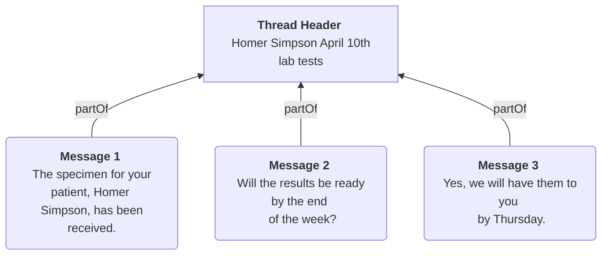

# Messaging Data Model

Messaging on Medplum uses a two-level hierarchy of FHIR [`Communication`](/docs/api/fhir/resources/communication) resources: a **thread header** that represents the conversation, and **child messages** that contain the actual content.

## Thread Architecture

A thread header has **no `payload`** and **no `partOf`** — it exists solely to group messages. A message has **both**: `payload` with content, and `partOf` pointing to its header. This distinction is how you tell them apart in search results.

## Communication Element Reference

| Element        | What It Does                                                                                                                                           |
| -------------- | ------------------------------------------------------------------------------------------------------------------------------------------------------ |
| `payload`      | The message content — text (`contentString`), attachments (`contentAttachment`), or resource references (`contentReference`). Empty on thread headers. |
| `sender`       | Who sent the message (e.g. `Practitioner/alice-smith`).                                                                                                |
| `recipient`    | Who should receive it. Can be multiple for group threads.                                                                                              |
| `subject`      | The patient this conversation is about (e.g. `Patient/homer-simpson`).                                                                                 |
| `topic`        | A human-readable subject line for the thread (e.g. "Lab results follow-up"). Set on **both** header and messages.                                      |
| `category`     | Tags for filtering and grouping threads (e.g. by specialty, urgency).                                                                                  |
| `status`       | Lifecycle state. See table below.                                                                                                                      |
| `sent`         | Timestamp when the message was sent.                                                                                                                   |
| `received`     | Timestamp when the message was delivered.                                                                                                               |
| `partOf`       | Links a message to its thread header. Empty on thread headers.                                                                                         |
| `inResponseTo` | *(Optional)* Links a message to the specific message it replies to. Use only for explicit reply-to-a-specific-message actions, not for every message. |
| `medium`       | Channel(s) used (e.g. email, SMS, in-app chat). This is an array — a single Communication can be sent via multiple channels.                           |
| `reasonCode`   | The specific reason the message was sent. More granular than `category`. Use [SNOMED Clinical Findings](http://hl7.org/fhir/R4/valueset-clinical-findings.html) for medical reasons, custom codes for workflow reasons. |
| `encounter`    | Links the thread to a clinical encounter (see [Async Encounters](/docs/communications/async-encounters)).                                                                  |

:::note category vs. reasonCode
These elements are similar but serve different purposes. `category` broadly classifies the message type (e.g. "notification," "alert"), while `reasonCode` provides granular detail about *why* it was sent (e.g. "appointment reminder," "abnormal lab result"). A message might have `category = notification` and `reasonCode = appointment reminder`.
:::

For the full list of Communication search parameters, see the [Communication API reference](/docs/api/fhir/resources/communication#search-parameters).

## Communication Lifecycle

| Stage         | FHIR Representation                                   |
| ------------- | ----------------------------------------------------- |
| **Draft**     | `Communication.status` is set to `"preparation"`      |
| **Sent**      | `Communication.status` is `"in-progress"`, `Communication.sent` is populated |
| **Read**      | Tracked via a read-receipt [`Task`](/docs/api/fhir/resources/task) (see [Read Receipts Using Tasks](/docs/communications/read-receipts-and-message-status)) |
| **Retracted** | `Communication.status` is set to `"entered-in-error"` |

## See Also

- [Building Your First Thread](/docs/communications/building-your-first-thread)
- [Communication](/docs/api/fhir/resources/communication) FHIR resource API
