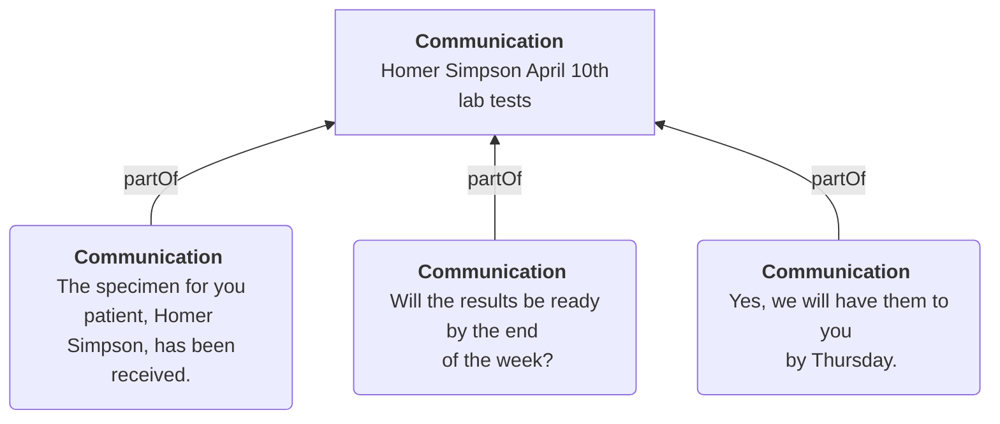

import ExampleCode from '!!raw-loader!@site/..//examples/src/communications/organizing-communications.ts';
import MedplumCodeBlock from '@site/src/components/MedplumCodeBlock';
import Tabs from '@theme/Tabs';
import TabItem from '@theme/TabItem';

# Organizing Communications Using Threads

## Introduction

In a healthcare context, messages are sent all the time and can include many scenarios (patient to physician, physician to physician, and more), so ensuring they are well-organized is vital. This guide covers how to model and organize threads using Medplum.

- Representing individual messages
- Building and structuring threads
- How to "tag" or group threads
- Searching for and sorting communications and threads

## Representing Individual Messages

The FHIR [`Communication`](/docs/api/fhir/resources/communication) resource is a representation of any message sent in a healthcare setting. This can include emails, SMS messages, phone calls and more.

| **Element**       | **Description**                                                                                                                                                                                                                                                                                                              | **Relevant Valueset**                                                                                          | **Example**                                                                                                                                                                |
| ----------------- | ---------------------------------------------------------------------------------------------------------------------------------------------------------------------------------------------------------------------------------------------------------------------------------------------------------------------------- | -------------------------------------------------------------------------------------------------------------- | -------------------------------------------------------------------------------------------------------------------------------------------------------------------------- |
| `payload`         | Text, attachments, or resources that are being communicated to the recipient.                                                                                                                                                                                                                                                |                                                                                                                | You have an appointment scheduled for 2pm.                                                                                                                                 |
| `sender`          | The person or team that sent the message.                                                                                                                                                                                                                                                                                    |                                                                                                                | Practitioner/doctor-alice-smith                                                                                                                                            |
| `recipient`       | The person or team that received the message.                                                                                                                                                                                                                                                                                |                                                                                                                | Practitioner/doctor-gregory-house                                                                                                                                          |
| `topic`           | A description of the main focus of the message. Similar to the subject line of an email.                                                                                                                                                                                                                                     | Custom Internal Code                                                                                           | In person physical with Homer Simpson on April 10th, 2023                                                                                                                  |
| `category`        | The type of message being conveyed. Like a tag that can be applied to the message.                                                                                                                                                                                                                                           | [SNOMED Codes](http://hl7.org/fhir/R4/valueset-medication-form-codes.html)                                     | [See below](#building-and-structuring-threads)                                                                                                                             |
| `reasonCode`      | The specific reason as to why the message was sent. It is recommended to define two reasons a message was sent: a medical reason or a workflow reason. For a medical reason, it is recommended to use the clinical findings subset of SNOMED codes. For workflow reasons, it is recommended to use a custom internal coding. | [SNOMED Clinical Findings Codes](http://hl7.org/fhir/R4/valueset-clinical-findings.html), Custom Internal Code | [301180005](https://browser.ihtsdotools.org/?perspective=full&conceptId1=301180005&edition=MAIN/2023-11-01&release=&languages=en) - Cardiovascular system normal (finding) |
| `partOf`          | A reference to another resource of which the [`Communication`](/docs/api/fhir/resources/communication) is a component.                                                                                                                                                                                                       |                                                                                                                | [See below](#how-to-tag-or-group-threads)                                                                                                                                  |
| `inResponseTo`    | A reference to another [`Communication`](/docs/api/fhir/resources/communication) resource which the current one was created to respond to.                                                                                                                                                                                   |                                                                                                                | Communication/previous-communication                                                                                                                                       |
| `medium`          | The technology used for this [`Communication`](/docs/api/fhir/resources/communication) (e.g. email, fax, phone).                                                                                                                                                                                                             | [Participation Mode Codes](http://terminology.hl7.org/CodeSystem/v3-ParticipationMode)                         | email                                                                                                                                                                      |
| `subject`         | A reference to the patient or group that this [`Communication`](/docs/api/fhir/resources/communication) is about.                                                                                                                                                                                                            |                                                                                                                | Patient/homer-simpson                                                                                                                                                      |
| `encounter`       | A reference to a medical encounter to which this [`Communication`](/docs/api/fhir/resources/communication) is tightly associated.                                                                                                                                                                                            |                                                                                                                | Encounter/example-appointment                                                                                                                                              |
| `sent`/`received` | The time that the message was either sent or received.                                                                                                                                                                                                                                                                       |                                                                                                                | 2023-04-10T10:00:00Z                                                                                                                                                       |
| `status`          | The status of transmission.                                                                                                                                                                                                                                                                                                  | [Event Status Codes](http://hl7.org/fhir/R4/valueset-event-status.html)                                        | in-progress                                                                                                                                                                |

:::tip The `Communication` lifecycle

Most messaging based workflows track messages through three stages: **sent**, **received**, and **read**.

While FHIR standard doesn't offer specific guidance on representing this lifecycle, Medplum recommends the following model:

| Stage    | Representation                          |
| -------- | --------------------------------------- |
| sent     | `Communication.sent` is populated       |
| received | `Communication.received` is populated   |
| read     | `Communication.status` is `"completed"` |

:::

:::note `category` vs. `reasonCode`

The `category` and `reasonCode` elements are similar, but offer different use cases. The `category` field is used to broadly classify messages, while the `reasonCode` is used to provide more granular detail about why a message was sent. For example, a `category` may be a notification while the `reasonCode` could be an appointment reminder.

:::

## Building and Structuring Threads

Beyond producing individual messages, most healthcare communication tools group messages into "threads". When building a thread in FHIR, it is important to model these groupings so that they are easily identifiable and searchable.

When creating threads, a two-level hierarchy should be used. This will include one parent [`Communication`](/docs/api/fhir/resources/communication) resource, or thread header, that represents that thread itself, and child [`Communication`](/docs/api/fhir/resources/communication) resources that represent each individual message.

Threads should be grouped using a top-level "thread header" [`Communication`](/docs/api/fhir/resources/communication) resource that represents the thread itself, rather than any individual message. The child resources should be linked to the thread header using the `partOf` field. This allows you to create a thread where each message is linked to the thread header as a common reference point.

In these threads, the thread header needs to be distinguished from the children. Since the header resource will not have any content or refer to a header of its own, this can be done by omitting a message in the `payload` field and a resource reference in the `partOf` field.

Additionally, to help organize threads, it is useful to use add a `topic` element to give the thread a subject. Similar to the subject line of an email, the `topic` should be given a high level of specificity to help distinguish the thread. The `topic` should be assigned to both the thread header and child [`Communication`](/docs/api/fhir/resources/communication) resources in any thread.

  
Example of a thread grouped using a Communication resource

  <MedplumCodeBlock language="ts" selectBlocks="communicationGroupedThread">
    {ExampleCode}
  </MedplumCodeBlock>

## How to Tag or Group Threads

It can be useful to "tag", or group, threads so that a user can easily reference or interpret a certain type of message at a high level. For example, if there is a thread about a task that needs to be performed by a nurse, it can be tagged as such.

Tagging can be effectively done using the `Communication.category` element, which represents the type of message being conveyed. It allows messages to be classified into different types or groups based on specifications like purpose, nature, or intended audience.

When assigning a `category` to a thread, it should be included on both the thread header and child [`Communication`](/docs/api/fhir/resources/communication) resources. It is also important to note that the `category` field is an array, so each [`Communication`](/docs/api/fhir/resources/communication) can have multiple tags.

Here are some common types of tags that can be used for grouping:

| Type of Tag         | Codesystem                                                                                                                   |
| ------------------- | ---------------------------------------------------------------------------------------------------------------------------- |
| Level of credential | [SNOMED Care Team Member Function valueset](https://vsac.nlm.nih.gov/valueset/2.16.840.1.113762.1.4.1099.30/expansion)       |
| Clinical specialty  | [SNOMED Care Team Member Function valueset](https://vsac.nlm.nih.gov/valueset/2.16.840.1.113762.1.4.1099.30/expansion)       |
| Product offering    | [SNOMED](http://hl7.org/fhir/R4/valueset-medication-form-codes.html), [LOINC](/docs/careplans/loinc), Custom Internal Coding |

  
Example of Multiple Categories

  <MedplumCodeBlock language="ts" selectBlocks="communicationCategories">
    {ExampleCode}
  </MedplumCodeBlock>

:::tip Designing category schemes

There are different ways that you can categorize threads, each one with its own pros and cons. For example, you can have threads with multiple `category` fields, one for specialty and one for level of credentials, etc., where you would search for multiple categories at once. The pros to this are that the data model is more self-explanatory, since each `category` is explicitly represented, and better maintainability, since it is easier to update and add individual categories. However, this can also lead to more complex queries.

Alternatively, you can have threads that have just one `category` that combines specialty, level of credentials, etc., and search for that specific category. This allows for simpler searching, needing only one `category` search parameter, and a simpler, more compact data model. The downside is that it may require more parsing and logic on the front-end to handle the combined categories and that as more combinations arise, maintaining the coding system may become difficult.

:::

## Searching for and Sorting `Communication` Resources

### Searching for All Threads in a System

To search for all threads in the system, we need to find the thread header [`Communication`](/docs/api/fhir/resources/communication) resource. One of the factors that differentiates a thread header resource from a "message-level", or child, resource is that thread header resources do not have a value in the `partOf` field.

<Tabs groupId="language">
  <TabItem value="ts" label="Typescript">
    <MedplumCodeBlock language="ts" selectBlocks="searchParentThreadsTs">
      {ExampleCode}
    </MedplumCodeBlock>
  </TabItem>
  <TabItem value="cli" label="CLI">
    <MedplumCodeBlock language="bash" selectBlocks="searchParentThreadsCli">
      {ExampleCode}
    </MedplumCodeBlock>
  </TabItem>
  <TabItem value="curl" label="cURL">
    <MedplumCodeBlock language="bash" selectBlocks="searchParentThreadsCurl">
      {ExampleCode}
    </MedplumCodeBlock>
  </TabItem>
</Tabs>

In this example, we use the `:missing` search modifier to search for any [`Communication`](/docs/api/fhir/resources/communication) resources that do not reference another resource in their `partOf` field. This gives us all of the thread header [`Communication`](/docs/api/fhir/resources/communication) resources in the system.

### Searching For All Messages in a Thread

Once you have found the thread you want, you may want to retrieve the messages from only that specific thread, in the correct order.

<Tabs groupId="language">
  <TabItem value="ts" label="Typescript">
    <MedplumCodeBlock language="ts" selectBlocks="searchSpecificThreadTs">
      {ExampleCode}
    </MedplumCodeBlock>
  </TabItem>
  <TabItem value="cli" label="CLI">
    <MedplumCodeBlock language="bash" selectBlocks="searchSpecificThreadCli">
      {ExampleCode}
    </MedplumCodeBlock>
  </TabItem>
  <TabItem value="curl" label="cURL">
    <MedplumCodeBlock language="bash" selectBlocks="searchSpecificThreadCurl">
      {ExampleCode}
    </MedplumCodeBlock>
  </TabItem>
</Tabs>

In the above example, we search for [`Communication`](/docs/api/fhir/resources/communication) resources that reference our thread header in the `partOf` field. This will retrieve all the messages, but there is no guarantee they will be in the correct order, so we use the `sort` search parameter to sort by the `sent` field. For more details on using the search functionality, see the [Search docs](/docs/search/basic-search).

### Putting It All Together

To put this all together, we can also search for all threads and return their messages with them.

<Tabs groupId="language">
  <TabItem value="ts" label="Typescript">
    <MedplumCodeBlock language="ts" selectBlocks="searchThreadsWithMessagesTs">
      {ExampleCode}
    </MedplumCodeBlock>
  </TabItem>
  <TabItem value="cli" label="CLI">
    <MedplumCodeBlock language="bash" selectBlocks="searchThreadsWithMessagesCli">
      {ExampleCode}
    </MedplumCodeBlock>
  </TabItem>
  <TabItem value="curl" label="cURL">
    <MedplumCodeBlock language="bash" selectBlocks="searchThreadsWithMessagesCurl">
      {ExampleCode}
    </MedplumCodeBlock>
  </TabItem>
</Tabs>

Here we are using the same initial search to return all of the thread headers in the system. However, we use the `_revinclude` parameter, allowing us to also search for all [`Communication`](/docs/api/fhir/resources/communication) resources that reference one of our search results in the `partOf` field. This allows us to return all of the child messages as well.

You can also filter down your searches further by including additional parameters.

<Tabs groupId="language">
  <TabItem value="ts" label="Typescript">
    <MedplumCodeBlock language="ts" selectBlocks="searchFilteredThreadsTs">
      {ExampleCode}
    </MedplumCodeBlock>
  </TabItem>
  <TabItem value="cli" label="CLI">
    <MedplumCodeBlock language="bash" selectBlocks="searchFilteredThreadsCli">
      {ExampleCode}
    </MedplumCodeBlock>
  </TabItem>
  <TabItem value="curl" label="cURL">
    <MedplumCodeBlock language="bash" selectBlocks="searchFilteredThreadsCurl">
      {ExampleCode}
    </MedplumCodeBlock>
  </TabItem>
</Tabs>

Here we build upon our search by adding the `subject` parameter to search for all threads that are related to a given patient. For other items to filter your search on, see the [`Communication` Search Parameters](/docs/api/fhir/resources/communication#search-parameters).
