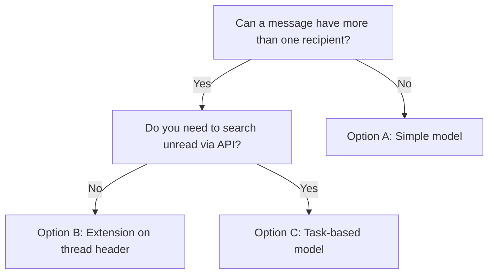

import ExampleCode from '!!raw-loader!@site/../examples/src/communications/messaging-examples.ts';
import MedplumCodeBlock from '@site/src/components/MedplumCodeBlock';
import Tabs from '@theme/Tabs';
import TabItem from '@theme/TabItem';

# Read Receipts and Message Status

How you track sent, received, and read for messages depends on two things: whether a message can have more than one recipient (group threads), and whether you need to search for unread messages via the API. Use the decision guide below to choose the right model.

## Decision Guide

1. Can a message have more than one recipient (i.e. more than two total participants in the thread)?

- No → Use [Option A: Simple Communication-based model](#option-a-simple-model-11-threads-only). Searchable and simple; does not support group threads.
- Yes → Go to question 2.

2. Do you need to search for unread messages via the API?

- No → Use [Option B: Extension on thread header](#option-b-extension-on-thread-header). Not searchable, but works for groups; you can still show a "user not up to date" dot and sort by timestamps.
- Yes → Use [Option C: Task-based model](#option-c-task-based-model-groups--searchable). Most complex; supports group threads and searchable read receipts.

---

## Option A: Simple Model (1:1 Threads Only)

Use this when each message has a single sender and a single recipient (no group threads). Sent, received, and read are represented directly on the [`Communication`](/docs/api/fhir/resources/communication) resource.

| Stage    | Representation                          |
| -------- | --------------------------------------- |
| sent     | `Communication.sent` is populated       |
| received | `Communication.received` is populated   |
| read     | `Communication.status` is `"completed"` |

Pros: Searchable (e.g. `Communication?status=completed` or `status:not=completed`), simple, no extra resources.  
Limitation: Does not support group threads; one recipient per message only.

### Mark a Message as Read

<MedplumCodeBlock language="ts" selectBlocks="simpleModelMarkReadTs">
  {ExampleCode}
</MedplumCodeBlock>

### Query Unread Messages

<Tabs groupId="language">
  <TabItem value="ts" label="TypeScript">
    <MedplumCodeBlock language="ts" selectBlocks="simpleModelQueryUnreadTs">
      {ExampleCode}
    </MedplumCodeBlock>
  </TabItem>
  <TabItem value="cli" label="CLI">
    <MedplumCodeBlock language="bash" selectBlocks="simpleModelQueryUnreadCli">
      {ExampleCode}
    </MedplumCodeBlock>
  </TabItem>
  <TabItem value="curl" label="cURL">
    <MedplumCodeBlock language="bash" selectBlocks="simpleModelQueryUnreadCurl">
      {ExampleCode}
    </MedplumCodeBlock>
  </TabItem>
</Tabs>

---

## Option B: Extension on Thread Header

Use this when you have group threads but do not need to search for unread messages via the API. Store per-participant read state in a custom [extension](https://www.hl7.org/fhir/extensibility.html) on the thread header [`Communication`](/docs/api/fhir/resources/communication) (the one with no `partOf`).

Pros: Works for group threads; no extra resources beyond the thread header; simpler than the Task-based model.  
Limitation: Not searchable via API — you cannot run a query like "all threads where Practitioner X has unread messages." You can still, for a thread you already have, read the extension and compare to the latest message to show a "user is not up to date" dot and sort the thread list by last message timestamp.

### Thread Header With Read-State Extension

<MedplumCodeBlock language="ts" selectBlocks="threadHeaderWithReadExtensionTs">
  {ExampleCode}
</MedplumCodeBlock>

### Update Last-Read When a User Views the Thread

Find the participant's read-state block by URL (e.g. with `getExtension` from `@medplum/core`), update `lastRead` and `lastReadAt`, then save with `updateResource` (PUT). Avoid patching by extension index (e.g. `/extension/0/...`), since the order of extensions can vary and other extensions may exist on the resource.

<MedplumCodeBlock language="ts" selectBlocks="updateThreadReadStateTs">
  {ExampleCode}
</MedplumCodeBlock>

---

## Option C: Task-Based Model (Groups + Searchable)

Use this when you have group threads and need to search for unread messages via the API. Each "message needs to be read by recipient" is represented by a [`Task`](/docs/api/fhir/resources/task) with a dedicated code (e.g. `read-receipt`). Tasks are created when messages are sent and completed when the recipient reads.

Pros: Supports group threads; read receipts are searchable (e.g. unread count, unread per thread).  
Con: Most complex data model; requires creating and updating Task resources when messages are sent and when the user marks as read.

:::note `Task.code` and example URIs

FHIR R4 requires each [`Task`](/docs/api/fhir/resources/task) to include `code`. The examples below use `system` `https://medplum.com/task-codes` and code `read-receipt` as a **stable documentation convention** so searches such as `Task?code=https://medplum.com/task-codes|read-receipt` match the snippets. That URL is **not** a hosted global CodeSystem. In production, use a namespace your organization controls, or keep the same `system|code` string project-wide for consistency with these examples.

:::

### Mark as Read

When the user reads the message, complete the Task:

<MedplumCodeBlock language="ts" selectBlocks="markReadReceiptTaskTs">
  {ExampleCode}
</MedplumCodeBlock>

### Find Unread in a Specific Thread

<Tabs groupId="language">
  <TabItem value="ts" label="TypeScript">
    <MedplumCodeBlock language="ts" selectBlocks="unreadInThreadTs">
      {ExampleCode}
    </MedplumCodeBlock>
  </TabItem>
  <TabItem value="cli" label="CLI">
    <MedplumCodeBlock language="bash" selectBlocks="unreadInThreadCli">
      {ExampleCode}
    </MedplumCodeBlock>
  </TabItem>
  <TabItem value="curl" label="cURL">
    <MedplumCodeBlock language="bash" selectBlocks="unreadInThreadCurl">
      {ExampleCode}
    </MedplumCodeBlock>
  </TabItem>
</Tabs>

### Count Total Unread for the Current User

<Tabs groupId="language">
  <TabItem value="ts" label="TypeScript">
    <MedplumCodeBlock language="ts" selectBlocks="unreadCountTs">
      {ExampleCode}
    </MedplumCodeBlock>
  </TabItem>
  <TabItem value="cli" label="CLI">
    <MedplumCodeBlock language="bash" selectBlocks="unreadCountCli">
      {ExampleCode}
    </MedplumCodeBlock>
  </TabItem>
  <TabItem value="curl" label="cURL">
    <MedplumCodeBlock language="bash" selectBlocks="unreadCountCurl">
      {ExampleCode}
    </MedplumCodeBlock>
  </TabItem>
</Tabs>

---

## See Also

- [Messaging Data Model](/docs/communications/messaging-data-model) — thread structure and Communication elements
- [Searching and Querying Threads](/docs/communications/searching-and-querying-threads) — thread list queries, filters, and subscriptions
- [Communication](/docs/api/fhir/resources/communication) and [Task](/docs/api/fhir/resources/task) FHIR resource API
