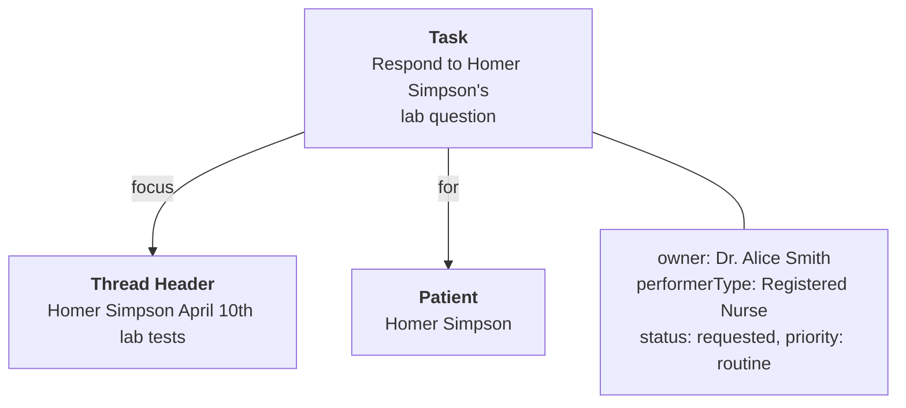

import ExampleCode from '!!raw-loader!./messaging-examples.ts';
import MedplumCodeBlock from '@site/src/components/MedplumCodeBlock';
import Tabs from '@theme/Tabs';
import TabItem from '@theme/TabItem';

# Task-Based Routing

When messages need responses — and those responses need to be tracked, assigned, and rerouted — use the FHIR `Task` resource alongside `Communication`. This separates the **message content** (Communication) from the **routing and assignment lifecycle** (Task), so you can reassign work without muddying the conversation data.

> **Key concept:** `Task` is the **authoritative** source for routing and assignment. `Communication.recipient` is **informational** — it reflects who should see the thread (for access policy scoping and display), but if there's ever a conflict between `Task.owner` and `Communication.recipient`, the Task is the source of truth. When rerouting, always update the Task first, then update the Communication recipient to match.

## Communication + Task Relationship



## Task Element Reference

| Element          | What It Does                                                                                                                                                              |
| ---------------- | ------------------------------------------------------------------------------------------------------------------------------------------------------------------------- |
| `focus`          | Links the Task to the Communication thread header it's tracking                                                                                                           |
| `for`            | The patient this Task is about (mirrors `Communication.subject`)                                                                                                          |
| `owner`          | Who is currently responsible — a `Practitioner` (individual). Cleared when rerouting to a pool.                                                                           |
| `performerType`  | The type of provider who should handle this Task (e.g. "Health coach"). Used for pool-based routing — providers whose `PractitionerRole.code` matches can claim the Task. |
| `requester`      | Who created or triggered the Task                                                                                                                                         |
| `status`         | Task lifecycle: `requested` → `accepted` → `completed` (or `cancelled`)                                                                                                  |
| `businessStatus` | Custom status for your workflow (e.g. `unassigned`, `claimed`, `escalated`)                                                                                               |
| `priority`       | Urgency level: `routine`, `urgent`, `asap`, `stat`                                                                                                                        |
| `output`         | References the response Communication that resolved the Task                                                                                                              |

## Create a Task for a thread

When a new message arrives that requires action, create a Task linked to the thread via `focus`. Use `performerType` to route to a provider pool, or set `owner` directly for individual assignment.

```ts
const task = await medplum.createResource({
  resourceType: 'Task',
  status: 'requested',
  intent: 'order',
  priority: 'routine',
  focus: { reference: `Communication/${threadHeader.id}` },
  for: { reference: 'Patient/homer-simpson', display: 'Homer Simpson' },
  performerType: [{
    coding: [{
      system: 'http://snomed.info/sct',
      code: '224535009',
      display: 'Registered nurse',
    }],
  }],
  requester: { reference: 'Practitioner/doctor-alice-smith' },
  authoredOn: new Date().toISOString(),
});
```

To assign directly to a specific provider instead of a pool, set `owner` to the Practitioner reference and omit `performerType`.

> **Tip:** Don't create a Task for every message — only for messages that require a response. Use `Communication.category` or business logic in a Bot to decide which messages need Tasks. In production, Task creation is typically handled by a Bot triggered via a Subscription on `Communication` creation rather than created manually.

## Claim a Task from the pool

When a team member picks up the Task, update `status` to `accepted` and set `owner` to the specific Practitioner:

```ts
await medplum.patchResource('Task', task.id!, [
  { op: 'replace', path: '/status', value: 'accepted' },
  {
    op: 'replace',
    path: '/owner',
    value: { reference: 'Practitioner/doctor-gregory-house', display: 'Dr. Gregory House' },
  },
]);
```

To see unclaimed Tasks in a pool, query by `performerType`:

```
Task?performer=http://snomed.info/sct|224535009&status=requested
```

## Reroute to a different provider

Update `Task.owner` and `Communication.recipient` to reassign the thread:

```ts
await medplum.patchResource('Task', task.id!, [
  {
    op: 'replace',
    path: '/owner',
    value: { reference: 'Practitioner/dr-cardio', display: 'Dr. Cardio' },
  },
  {
    op: 'remove',
    path: '/performerType',
  },
]);

await medplum.patchResource('Communication', threadHeader.id!, [
  { op: 'replace', path: '/recipient', value: [{ reference: 'Practitioner/dr-cardio', display: 'Dr. Cardio' }] },
]);
```

## Reroute to a provider pool

Clear `Task.owner`, set `Task.performerType` to the role type, and clear `Communication.recipient`. Providers whose `PractitionerRole.code` matches the `performerType` can see and claim the Task.

```ts
await medplum.patchResource('Task', task.id!, [
  { op: 'remove', path: '/owner' },
  { op: 'replace', path: '/status', value: 'requested' },
  {
    op: 'add',
    path: '/performerType',
    value: [{
      coding: [{
        system: 'http://snomed.info/sct',
        code: '17561000',
        display: 'Cardiologist',
      }],
    }],
  },
]);

await medplum.patchResource('Communication', threadHeader.id!, [
  { op: 'remove', path: '/recipient' },
]);
```

To find Tasks routed to a pool:

<Tabs groupId="language">
  <TabItem value="ts" label="TypeScript">
    <MedplumCodeBlock language="ts" selectBlocks="poolTasksTs">
      {ExampleCode}
    </MedplumCodeBlock>
  </TabItem>
  <TabItem value="cli" label="CLI">
    <MedplumCodeBlock language="bash" selectBlocks="poolTasksCli">
      {ExampleCode}
    </MedplumCodeBlock>
  </TabItem>
  <TabItem value="curl" label="cURL">
    <MedplumCodeBlock language="bash" selectBlocks="poolTasksCurl">
      {ExampleCode}
    </MedplumCodeBlock>
  </TabItem>
</Tabs>

Providers match pools via their `PractitionerRole.code`.

## Tracking Reroute History

When Tasks are rerouted, you'll want an audit trail of who owned it previously, when it was reassigned, and why. Task version history (`meta.versionId`) automatically captures every state change, so the basic audit trail is always available via `medplum.readHistory('Task', task.id!)`. The question is how to capture the **reason** for the reroute.

### Capturing reroute reasons

**Free text reasons:** Use `Task.note` to append a human-readable reason on each reroute. Notes are an array, so each reroute adds an entry with the author and timestamp:

```ts
await medplum.patchResource('Task', task.id!, [
  {
    op: 'replace',
    path: '/owner',
    value: { reference: 'Practitioner/dr-cardio', display: 'Dr. Cardio' },
  },
  {
    op: 'add',
    path: '/note/-',
    value: {
      authorReference: { reference: 'Practitioner/doctor-gregory-house' },
      time: new Date().toISOString(),
      text: 'Rerouting to cardiology — patient has new cardiac symptoms',
    },
  },
]);
```

**Structured reason codes:** If you need standardized, queryable reason codes, create a `Provenance` resource alongside the Task update. `Provenance.reason` accepts coded values:

```ts
await medplum.createResource({
  resourceType: 'Provenance',
  target: [{ reference: `Task/${task.id}` }],
  recorded: new Date().toISOString(),
  agent: [
    {
      who: { reference: 'Practitioner/doctor-gregory-house', display: 'Dr. Gregory House' },
    },
  ],
  reason: [
    {
      coding: [
        {
          system: 'https://medplum.com/CodeSystem/reroute-reason',
          code: 'specialty-referral',
          display: 'Specialty referral',
        },
      ],
    },
  ],
});
```

You can then query `Provenance?target=Task/{id}` to get the full reroute history with structured reasons.

### Reroute visibility: should the original owner still see the Task?

`Task.owner` is `0..1`, so it can only reference a single Practitioner. When rerouting, you need to decide whether the original owner retains visibility.

**If the original owner does NOT need to see the Task after reroute:** Update `Task.owner` directly. The original owner loses access (assuming access policies are scoped to `owner`):

```ts
await medplum.patchResource('Task', task.id!, [
  { op: 'replace', path: '/owner', value: { reference: 'Practitioner/dr-cardio' } },
]);
```

**If the original owner DOES need to retain visibility:** Create a new Task for the new owner and mark the original as rerouted. Both owners can see their respective Tasks, and `Task.focus` links both to the same thread:

```ts
const newTask = await medplum.createResource({
  resourceType: 'Task',
  status: 'requested',
  intent: 'order',
  priority: task.priority,
  focus: task.focus,
  for: task.for,
  owner: { reference: 'Practitioner/dr-cardio', display: 'Dr. Cardio' },
  requester: { reference: 'Practitioner/doctor-gregory-house' },
  authoredOn: new Date().toISOString(),
  note: [{
    authorReference: { reference: 'Practitioner/doctor-gregory-house' },
    time: new Date().toISOString(),
    text: 'Rerouted from original Task — needs cardiology review',
  }],
});

await medplum.patchResource('Task', task.id!, [
  { op: 'replace', path: '/status', value: 'cancelled' },
  {
    op: 'add',
    path: '/note/-',
    value: {
      authorReference: { reference: 'Practitioner/doctor-gregory-house' },
      time: new Date().toISOString(),
      text: 'Rerouted to Dr. Cardio — see new Task',
    },
  },
]);
```

## In your UI

Build a task queue view by querying unclaimed Tasks for the current user's pool. Use `Task.priority` to drive visual urgency indicators (color coding, sort order, badges). Display the linked thread's `topic` (from the `focus` Communication) so the provider has context before claiming.

After claiming, navigate the user to the thread detail view so they can read the conversation and respond.

---
