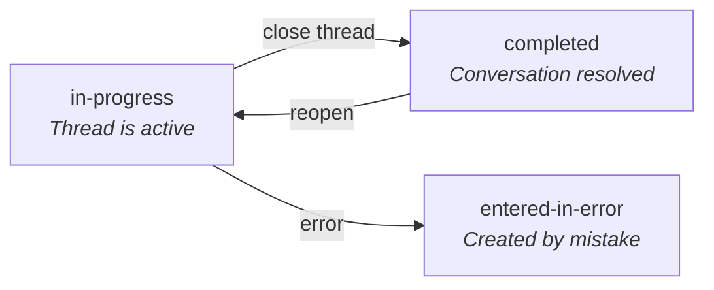

import ExampleCode from '!!raw-loader!@site/../examples/src/communications/messaging-examples.ts';
import MedplumCodeBlock from '@site/src/components/MedplumCodeBlock';
import Tabs from '@theme/Tabs';
import TabItem from '@theme/TabItem';

# Thread Lifecycle, Participants & Access Control

## Thread Status

The `status` field on a thread header controls whether the thread is active or closed. This is independent from the `status` on individual messages, which tracks read state.



| Level              | `status` meaning                    | Common values                                                                                            |
| ------------------ | ----------------------------------- | -------------------------------------------------------------------------------------------------------- |
| Thread header      | Is the conversation open or closed? | `in-progress` (active), `completed` (closed), `entered-in-error`                                         |
| Individual message | Message lifecycle                   | `preparation` (draft), `in-progress` (sent), `entered-in-error` (retracted/edited) |

### Close a thread

```ts
await medplum.patchResource('Communication', threadHeader.id!, [
  { op: 'replace', path: '/status', value: 'completed' },
]);
```

### Filter for active threads only

<Tabs groupId="language">
  <TabItem value="ts" label="TypeScript">
    <MedplumCodeBlock language="ts" selectBlocks="filterActiveThreadsTs">
      {ExampleCode}
    </MedplumCodeBlock>
  </TabItem>
  <TabItem value="cli" label="CLI">
    <MedplumCodeBlock language="bash" selectBlocks="filterActiveThreadsCli">
      {ExampleCode}
    </MedplumCodeBlock>
  </TabItem>
  <TabItem value="curl" label="cURL">
    <MedplumCodeBlock language="bash" selectBlocks="filterActiveThreadsCurl">
      {ExampleCode}
    </MedplumCodeBlock>
  </TabItem>
</Tabs>

### Reopen a closed thread

```ts
await medplum.patchResource('Communication', threadHeader.id!, [
  { op: 'replace', path: '/status', value: 'in-progress' },
]);
```

:::caution
Closing a thread header does not automatically change the `status` of child messages. They are independent. A closed thread can still contain unread messages — decide in your UI whether to show them or filter by header status.
:::

## Managing Participants

Threads support multiple participants through the `recipient` array on the thread header. You can create group threads and add or remove participants over time.

### Create a group thread

Set multiple entries in the `recipient` array when creating the thread header:

```ts
const groupThread = await medplum.createResource({
  resourceType: 'Communication',
  status: 'in-progress',
  topic: { text: 'Care coordination - Homer Simpson' },
  subject: { reference: 'Patient/homer-simpson', display: 'Homer Simpson' },
  recipient: [
    { reference: 'Practitioner/doctor-alice-smith', display: 'Dr. Alice Smith' },
    { reference: 'Practitioner/doctor-gregory-house', display: 'Dr. Gregory House' },
    { reference: 'Practitioner/nurse-jackie', display: 'Nurse Jackie' },
  ],
});
```

### Add a participant

Use a JSON Patch to append to the `recipient` array:

```ts
await medplum.patchResource('Communication', groupThread.id!, [
  {
    op: 'add',
    path: '/recipient/-',
    value: { reference: 'Practitioner/dr-wilson', display: 'Dr. Wilson' },
  },
]);
```

### Remove a participant

Replace the `recipient` array without the removed person. First read the current recipients, filter, then patch:

```ts
const thread = await medplum.readResource('Communication', groupThread.id!);
const updatedRecipients = thread.recipient?.filter(
  (r) => r.reference !== 'Practitioner/nurse-jackie'
);

await medplum.patchResource('Communication', groupThread.id!, [
  { op: 'replace', path: '/recipient', value: updatedRecipients },
]);
```

:::caution
Adding or removing recipients on the thread header does not retroactively change recipients on existing child messages. When sending new messages in the thread, use the thread header's current recipient list to keep things in sync.
:::

:::tip
The read-then-replace pattern above is susceptible to race conditions if multiple users modify the recipient list simultaneously. For production code, use the resource's `meta.versionId` with an `If-Match` header to detect conflicts, or use `medplum.updateResource()` which handles version-aware updates.
:::

## Access Control

`recipient` and `sender` on Communications define who *should* see a thread. FHIR access policies enforce who *can* see it.

### Participant-scoped access

For most messaging use cases, restrict Communication reads so users can only see threads where they appear as a `recipient` or `sender`. This is configured via a FHIR [access policy](/docs/access/access-policies) on the Medplum project — not in application code.

Example access policy for a practitioner who should only see Communications where they are a participant:

```json
{
  "resourceType": "AccessPolicy",
  "name": "Messaging - Participant Access",
  "resource": [
    {
      "resourceType": "Communication",
      "criteria": "Communication?recipient=%profile.reference&sender=%profile.reference",
      "readonly": false
    }
  ]
}
```

### Admin and supervisor access

Supervisors, compliance officers, or support staff often need to see all threads regardless of whether they're a participant. Create a separate access policy role that grants broader Communication read access:

```json
{
  "resourceType": "AccessPolicy",
  "name": "Messaging - Supervisor Access",
  "resource": [
    {
      "resourceType": "Communication",
      "readonly": true
    },
    {
      "resourceType": "Task",
      "readonly": true
    }
  ]
}
```

Assign this role to admin users. Note that the supervisor policy above grants read-only access — supervisors can view all threads but cannot send messages or modify status. Adjust `readonly` based on your requirements.

### Complex access patterns

For multi-tenant messaging, role-based visibility, compartment-based access, or cross-organization threads, see the [Access Policy documentation](/docs/access/access-policies) or contact [hello@medplum.com](mailto:hello@medplum.com) for guidance. These patterns require careful access policy design.

:::tip
Test access policies early. Create two test users with different roles. Log in as each and verify that thread visibility matches expectations. Access policy bugs are much harder to debug once real patient data is involved.
:::

## In your UI

Show thread status visually in your thread list — use labels or icons to distinguish active (`in-progress`) from closed (`completed`) threads. Display the participant list from the thread header's `recipient` array, and update it dynamically when participants are added or removed.

When a new participant is added, verify they can actually see the thread by checking that your access policies cover the new user. Adding someone to the `recipient` array without a matching access policy will silently fail — the thread won't appear in their queries.

## See Also

- [Read Receipts Using Tasks](/docs/communications/read-receipts-and-message-status)
- [Access Policies](/docs/access/access-policies)
- [Communication](/docs/api/fhir/resources/communication) FHIR resource API
