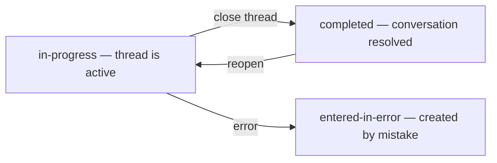

import ExampleCode from '!!raw-loader!@site/..//examples/src/communications/messaging-examples.ts';
import MedplumCodeBlock from '@site/src/components/MedplumCodeBlock';
import Tabs from '@theme/Tabs';
import TabItem from '@theme/TabItem';

# Thread Lifecycle, Participants, and Access Control

This guide explains how thread header [`Communication.status`](/docs/api/fhir/resources/communication) models open versus closed threads, how to manage participants on the header with [`recipient`](/docs/api/fhir/resources/communication), and how FHIR [access policies](/docs/access/access-policies) align with who should see a thread.

For the underlying thread versus message shape, see [Messaging Data Model](/docs/communications/messaging-data-model).

## Thread Status

The `status` field on a thread header controls whether the thread is active or closed. This is independent from `status` on individual messages, which reflects draft, sent, retracted, and similar states.

| Level | `status` meaning | Common values |
| --- | --- | --- |
| Thread header | Is the conversation open or closed? | `in-progress` (active), `completed` (closed), `entered-in-error` |
| Individual message | Message lifecycle | `preparation` (draft), `in-progress` (sent), `entered-in-error` (retracted or similar) |

### Close a Thread

<MedplumCodeBlock language="ts" selectBlocks="threadLifecycleCloseHeaderTs">
  {ExampleCode}
</MedplumCodeBlock>

### Filter for Active Threads Only

<Tabs groupId="language">
  <TabItem value="ts" label="Typescript">
    <MedplumCodeBlock language="ts" selectBlocks="filterActiveThreadsTs">
      {ExampleCode}
    </MedplumCodeBlock>
  </TabItem>
  <TabItem value="cli" label="CLI">
    <MedplumCodeBlock language="bash" selectBlocks="filterActiveThreadsCli">
      {ExampleCode}
    </MedplumCodeBlock>
  </TabItem>
  <TabItem value="curl" label="cURL">
    <MedplumCodeBlock language="bash" selectBlocks="filterActiveThreadsCurl">
      {ExampleCode}
    </MedplumCodeBlock>
  </TabItem>
</Tabs>

### Reopen a Closed Thread

<MedplumCodeBlock language="ts" selectBlocks="threadLifecycleReopenHeaderTs">
  {ExampleCode}
</MedplumCodeBlock>

:::caution

Closing a thread header does not automatically change the `status` of child messages; they are independent. A closed thread can still contain unread messages if you track read state separately (for example with Tasks). Decide in your UI whether to show those messages or filter by header status.

:::

## Managing Participants

Threads support multiple participants through the `recipient` array on the thread header. You can create group threads and add or remove participants over time.

### Create a Group Thread

Set multiple entries in `recipient` when creating the thread header:

<MedplumCodeBlock language="ts" selectBlocks="threadLifecycleGroupThreadTs">
  {ExampleCode}
</MedplumCodeBlock>

### Add a Participant

Use a JSON Patch to append to the `recipient` array:

<MedplumCodeBlock language="ts" selectBlocks="threadLifecycleAddParticipantTs">
  {ExampleCode}
</MedplumCodeBlock>

### Remove a Participant

Replace the `recipient` array without the removed person. Read the current header, filter, then patch:

<MedplumCodeBlock language="ts" selectBlocks="threadLifecycleRemoveParticipantTs">
  {ExampleCode}
</MedplumCodeBlock>

:::caution

Adding or removing recipients on the thread header does not retroactively change recipients on existing child messages. When sending new messages in the thread, use the thread header’s current recipient list so the conversation stays consistent.

:::

:::tip

The read-then-replace pattern for removing participants can race if several users edit the list at once. For production, use the resource’s `meta.versionId` with an `If-Match` header to detect conflicts, or use `medplum.updateResource()` for version-aware updates.

:::

## Access Control

`recipient` and `sender` on [`Communication`](/docs/api/fhir/resources/communication) describe who should see a thread. [Access policies](/docs/access/access-policies) on the Medplum project enforce who can read and write those resources.

### Participant-Scoped Access

For typical messaging, restrict Communication reads so users only see threads where they appear as a `recipient` or `sender`. Configure that with an access policy on the project, not only in application code.

Example policy sketch for a practitioner who should only see Communications where they participate:

<MedplumCodeBlock language="json" selectBlocks="messagingParticipantScopedAccessPolicyJson">
  {ExampleCode}
</MedplumCodeBlock>

:::note

`AccessPolicy` `criteria` uses Medplum’s search subset. See [Access Policies](/docs/access/access-policies) for supported modifiers and limitations before relying on a criteria string in production.

:::

### Admin and Supervisor Access

Supervisors, compliance staff, or support roles often need to see all threads even when they are not participants. Use a separate access policy (or role) that grants broader Communication read access:

<MedplumCodeBlock language="json" selectBlocks="messagingSupervisorAccessPolicyJson">
  {ExampleCode}
</MedplumCodeBlock>

Assign that policy to admin users as appropriate. The example above is read-only: supervisors can view threads but not send or change status unless you set `readonly` differently.

### Complex Access Patterns

Multi-tenant messaging, role-based visibility, compartment rules, and cross-organization threads need careful policy design. See [Access Policies](/docs/access/access-policies) or contact [hello@medplum.com](mailto:hello@medplum.com) for guidance.

:::tip

Test access policies early with two test users in different roles. Sign in as each and confirm thread visibility matches expectations. Policy mistakes are much harder to debug once real patient data is in the project.

:::

## In Your UI

Show thread status in the thread list (for example labels or icons for active `in-progress` versus closed `completed`). Render participants from the header’s `recipient` array and refresh when participants change.

When you add a participant, confirm they can query the thread: an updated `recipient` alone does not grant access if your policies do not allow that user to read the Communication. Otherwise the thread may not appear in their searches.

## See Also

- [Messaging Data Model](/docs/communications/messaging-data-model) — thread headers, messages, and key elements
- [Searching and Querying Threads](/docs/communications/searching-and-querying-threads) — queries and filters
- [Message Response Tracking and Routing](/docs/communications/message-response-tracking-and-routing) — Tasks as the source of truth for assignment when you use routing
- [Access Policies](/docs/access/access-policies) — criteria, compartments, and parameterized policies
- [Communication](/docs/api/fhir/resources/communication) FHIR resource API
- [Task](/docs/api/fhir/resources/task) FHIR resource API
