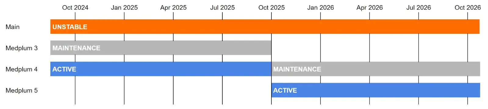

# Medplum Version Policy

## Overview

Medplum follows semantic versioning (semver) for all components of our healthcare developer platform. This document outlines our version release strategy, support timeline, and upgrade requirements to help organizations plan their deployment and maintenance schedules effectively.

## Component Versioning

All Medplum components are released in lockstep with the same version number:

- API Server
- Client SDKs
- React Component Library
- Agent
- Supporting tools and utilities

> **Release-artifact consistency:** Every deliverable (Docker images, npm packages, Helm charts, Terraform modules, etc.) is published with the _identical_ semver tag for a given release to avoid cross-version drift.

## Release Schedule

### Major Versions (X.0.0)

- Released annually in Q4
- Support lifecycle consists of:
  - 1 year **Active** status with full support and feature updates
  - 1 year **Maintenance** status with critical updates only
  - **Enterprise extension:** security-only patch releases for an additional 12 months (36 months total from GA)1
- Primarily driven by updates to core dependencies
- Include any necessary breaking changes, concentrated into the annual release
- _Availability of a new major in Q4 does **not** require immediate adoption; customers may remain on the previous major for its entire Active + Maintenance (+ Enterprise extension, if applicable) window._

1 The 36-month security-patch commitment applies to licensed **Enterprise** customers and is not promised for free/open-source users.

### Minor Versions (X.Y.0)

- Released 2-3 times per year
- Require server maintenance including potential database migrations
- Must be deployed sequentially (cannot skip minor versions)
- Include backwards-compatible feature additions and improvements
- _The `medplum upgrade` / `medplum aws upgrade` tool automatically chains sequential minors (e.g., 4.0 → 4.3) and supports transactional rollback._

### Patch Versions (X.Y.Z)

- Released approximately weekly
- Include bug fixes and non-breaking feature additions
- Can be deployed directly without intermediate steps

### Security Patch SLA

| Severity (CVSS v3) | Publication deadline |
| ------------------ | -------------------- |
| Critical (≥ 9.0)   | ≤ 7 calendar days    |
| High 7.0–8.9       | ≤ 14 calendar days   |

## Dependency Support

### Scheduled Release Dependencies

#### Node.js

- Supports current "Active" and "Maintenance" [LTS Node.js versions](https://nodejs.org/en/about/previous-releases)
- All unit and integration tests are run against supported versions
- Follows Node.js even-numbered LTS release schedule (16.x, 18.x, 20.x, etc.)

#### PostgreSQL

- Supports all [PostgreSQL LTS versions](https://www.postgresql.org/support/versioning/) that overlap with Medplum "Active" releases
- Integration tests are run against all supported versions
- Typically covers 4 major PostgreSQL versions

### Other Major Dependencies

Dependencies without predefined release schedules (e.g., Redis, React, Mantine) follow these support guidelines:

- The major version of each dependency supported at the start of a Medplum major version will continue to be supported throughout that Medplum version's lifecycle
- Support requirements are re-evaluated during each major Medplum version release
- Example: If Redis v6 is supported at the release of Medplum v4.0.0, it will continue to receive support throughout Medplum v4.x.x's lifecycle
- _Baseline versions are otherwise frozen for that major; bumps occur only to remediate critical CVEs and will be announced ≥ 30 days in advance._

## FHIR Roadmap Alignment

| Medplum Series | Default FHIR Version   | Notes                                                 |
| -------------- | ---------------------- | ----------------------------------------------------- |
| 4.x            | R4 (US Core / USCDI)   | Current GA                                            |
| 5.x            | **R4 remains default** | R5 work is paused; any R5 work is experimental/opt-in |
| Future 6.x     | R6 (planned)           | Migration path will follow USRSC guidance             |

## Deprecation & Removal Policy

A feature marked **deprecated** in minor _N_ will **not** be removed until major _N + 1_.

## Deployment Requirements

### Self-Hosted Deployments

- Must use supported versions of Node.js and PostgreSQL
- Required to use Medplum CLI for version upgrades
- Must perform sequential minor version upgrades for proper data migration (handled automatically by the upgrade tooling)
- Automated tooling provided for migration processes

### Enterprise Considerations

#### Compliance Requirements

- HIPAA compliance requires maintaining supported software versions
- SOC 2 requirements include regular security updates and version maintenance
- ONC certification is only valid for "Active" versions
- Enterprise customers should maintain upgrade schedules aligned with support windows

#### Maintenance Support

During the "Maintenance" year of a major version, updates are limited to:

- Security vulnerabilities and patches
- Critical bug fixes
- Enterprise customer stability requirements

#### Advance Change Notice

Medplum provides ≥ 30 days written notice for:

- Breaking changes introduced in a major release
- Newly introduced deprecations
- Baseline dependency bumps for CVE remediation

Notice channels: email to named enterprise contacts, GitHub release notes, and the Medplum Slack `#announcements` channel.

## Version Lifecycle Example

Using version 4.0.0 as an example:

- Q4 2024: Version 4.0.0 released, enters "Active" status
- Q4 2025: Version 5.0.0 released, version 4.x.x enters "Maintenance" status
- Q4 2026: Version 4.x.x enters **Enterprise security-patch-only** window
- Q4 2027: Version 4.x.x reaches end-of-life

## Recommended Practices

1. Production deployments should maintain current "Active" versions when possible
2. Plan major version upgrades annually during the Q4 release window
3. Schedule minor version upgrades within 30 days of release
4. Monitor the Medplum changelog for security updates and patch releases
5. Use Medplum CLI for all version upgrades to ensure proper migration handling
