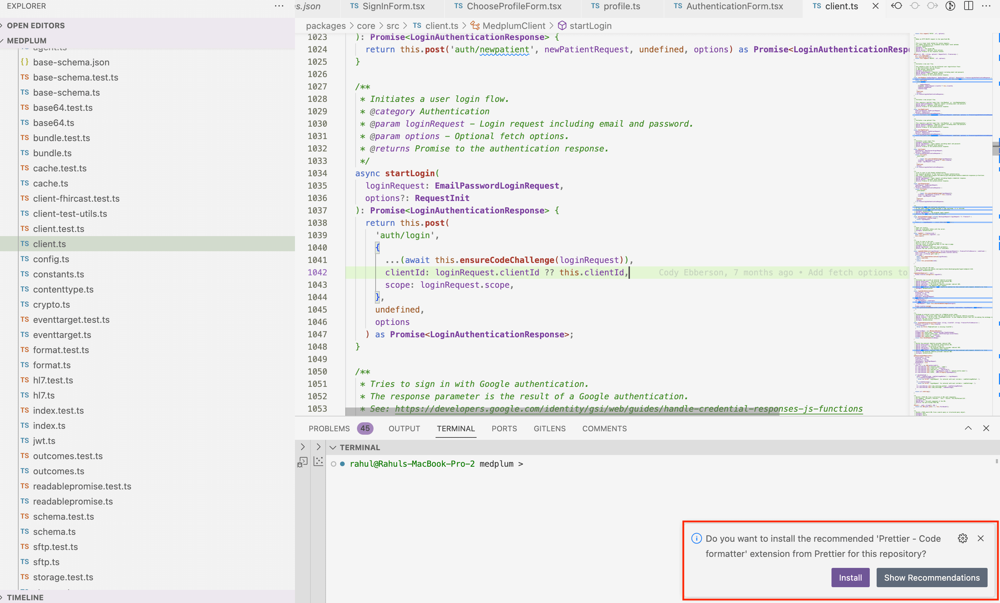

# Local development setup

Ready to get started developing Medplum on your local machine? Great! First, you'll need to set up your own copy of the
[Medplum repository](http://github.com/medplum/medplum) to work on, by [forking the repository](https://docs.github.com/en/get-started/quickstart/fork-a-repo)
into your own GitHub account. **Note:** If you don't want to make changes and submit them back to the Medplum project,
you can skip this step and proceed directly to the next step.

After you've created your own fork of the Medplum repository, copy it to your local machine to work on by cloning it.

## Clone the repo

If you created a fork to submit Pull Requests from, you'll need to ensure you clone your fork, rather than the official
Medplum repository. Otherwise, use `git@github.com:medplum/medplum.git` below to copy the official repository, which
you can use to build and run the app locally.

```bash
git clone git@github.com:{YOUR GITHUB USERNAME}/medplum.git medplum
```

If you get an error saying `Permission denied` using `ssh`, you can refer to the [Github docs on setting up SSH keys](https://help.github.com/articles/error-permission-denied-publickey/).
Alternatively, you can use the `https` method as a fallback.

```sh
git clone https://github.com/{YOUR GITHUB USERNAME}/medplum.git medplum
```

That will create a complete copy of the project source code on your local machine, including code for the Medplum Server, Medplum App, and associated libraries.

In the next step, we'll build the application and run the tests.

## (Optional) Set up [Prettier](https://prettier.io/) and [ESLint](https://eslint.org/) in your IDE

The Medplum CI system uses the tools [Prettier](https://prettier.io/) and [ESLint](https://eslint.org/) to enforce its code style and ensure consistent coding standards.

If you are planning on submitting a PR, we highly suggest setting up these tools in your IDE to receive feedback and fix errors while developing.

### On Visual Studio Code

The medplum repo comes with configured recommended Visual Studio Code extensions.

When you first open with workspace, Visual Studio will automatically prompt you to install the recommended extensions.


Alternatively, you can search for the "Recommended Extensions" in the Visual Studio extension manager and install from there.

import videoUrl from './recommended-extensions.webm';

  <video width="100%"  playsInline autoPlay muted loop preload="auto" >
    <source src={videoUrl} type="video/webm"/>
  </video>
