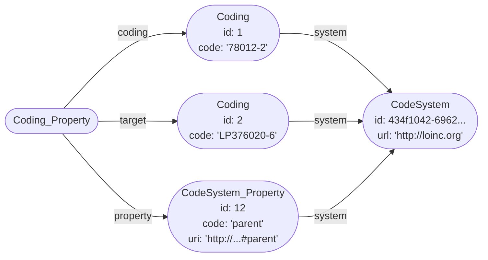

# Terminology Architecture

:::caution

This page documents internal Medplum implementation details, and refers to point-in-time code snapshots that may be
different from the current application code, and are subject to change at any time without prior notice.

:::

## Table Schema

Medplum uses a handful of dedicated tables to store terminology data. The foundation of these is `Coding`, which stores
individual codes related to `CodeSystem` resources by their ID:

**Coding**

| Column  | Type     | Nullable | Notes                |
| ------- | -------- | -------- | -------------------- |
| id      | `bigint` | not null | Primary key          |
| system  | `uuid`   | not null | Refers to CodeSystem |
| code    | `text`   | not null |                      |
| display | `text`   |          |                      |

The `Coding` table has a unique index on `(system, code)` — there can only be one row for a given code per CodeSystem.

Codings can also have properties, which define additional metadata about the codes. These are defined in the
`CodeSystem_Property` table, and then referenced in `Coding_Property` alongside the property values:

**CodeSystem_Property**

| Column      | Type     | Nullable | Notes                                                             |
| ----------- | -------- | -------- | ----------------------------------------------------------------- |
| id          | `bigint` | not null | Primary key                                                       |
| system      | `uuid`   | not null | Refers to CodeSystem                                              |
| code        | `text`   | not null | Name of the property                                              |
| type        | `text`   | not null | Type of value the property takes                                  |
| uri         | `text`   |          | URI describing any special roles the property has (e.g. `parent`) |
| description | `text`   |          |                                                                   |

The `CodeSystem_Property` table has a unique index on `(system, code)` — there can only be a single property for a given
code per CodeSystem.

**Coding_Property**

| Column   | Type     | Nullable | Notes                         |
| -------- | -------- | -------- | ----------------------------- |
| coding   | `bigint` | not null | Refers to Coding              |
| property | `bigint` | not null | Refers to CodeSystem_Property |
| target   | `bigint` |          | Refers to Coding              |
| value    | `text`   |          |                               |

There is a covering unique index on `Coding_Property`; each row must be fully unique. It is valid for a Coding to have
multiple values for a given property.

## CodeSystem Hierarchies

Many code systems define parent-child relationships between their codes, to denote that one code is a more general
category and the other a more specific instance of that category. These relationships are stored as properties of the
related codes: the properties are marked with a special `uri` (e.g. `http://hl7.org/fhir/concept-properties#parent` or
`http://hl7.org/fhir/concept-properties#child`), and the `target` of the `Coding_Property` row points to the other Coding.

For example, two codes might be related as follows:



:::note

While FHIR supports specifying hierarchical relationships with either `parent` or `child` properties, Medplum currently
only supports `parent` for simplicity, since the two are inversely equivalent.

:::

## Terminology Operations

FHIR specifies a suite of Operation endpoints to interact with terminology information, which Medplum implements on top
of the tables described above.

### `CodeSystem/$validate-code`

Validating whether a CodeSystem contains any of a set of codes is a simple query:

```sql
-- Get CodeSystem by URL
SELECT id, content FROM "CodeSystem" WHERE url = ?;

-- Check whether codes exist
SELECT id, code, display FROM "Coding"
WHERE code IN (?, ?) AND system = ?;
```

### `CodeSystem/$lookup`

Looking up a given code in a CodeSystem is similar to the `$validate-code` operation above, but also looks up any
properties of the given code:

```sql
-- Get CodeSystem by URL
SELECT id, content FROM "CodeSystem" WHERE url = ?;

-- Look up code and attached properties
SELECT
  "Coding".display,
  property.code,
  property.type,
  property.description,
  property.value
FROM "Coding"
  LEFT JOIN "Coding_Property" AS cp ON "Coding".id = cp.coding
  LEFT JOIN "CodeSystem_Property" AS property ON cp.property = property.id
WHERE "Coding".code = ? AND "Coding".system = ?;
```

### `CodeSystem/$subsumes`

Subsumption testing involves checking whether one code is related to another through a hierarchy defined by the code
system. For example, one might want to check whether the code for "amoxicillin" descends from the code for "antibiotics".

The `parent` properties from each code are recursively traversed to check if either is an ancestor of the other:

```sql
-- Get CodeSystem by URL
SELECT id, content FROM "CodeSystem" WHERE url = ?;

-- Check if codeA is an ancestor of codeB; this query is performed once in each direction
WITH RECURSIVE "cte_ancestors" AS (
    SELECT id, code, display FROM "Coding"
    WHERE system = ? AND code = ?
  UNION
      SELECT c.id, c.code, c.display FROM "Coding" c
        INNER JOIN "Coding_Property" AS cp ON c.id = cp.target
        INNER JOIN "CodeSystem_Property" AS property ON (
          cp.property = property.id
          AND property.code = ?
        )
        INNER JOIN "cte_ancestors" AS ancestor ON cp.coding = ancestor.id
      WHERE
        c.system = ?
)
SELECT code, display FROM "cte_ancestors"
WHERE code = ?
LIMIT 1;
```

### `ValueSet/$validate-code`

FHIR ValueSets [define which codes should be used](/docs/terminology#defining-and-using-code-systems) from specific code
systems for some use case. Determining if a given code is in the ValueSet is one of the core FHIR terminology operations,
and is designed to be used in resource validation.

For each `ValueSet.compose.include` that matches the `system` of the coding to be validated, the server checks if the
given code satisfies the inclusion criteria. If there is `filter`, the database is queried to check if the required
properties are present. For hierarchical `is-a` filters, the above recursive ancestor query is used; otherwise, a
generic property filter is applied:

```sql
SELECT  c.id, c.code, c.display FROM "Coding" c
  LEFT JOIN "Coding_Property" AS cp ON (
    c.id = cp.coding
    AND cp.value = ?
  )
  LEFT JOIN "CodeSystem_Property" AS property ON (
    c.system = property.system
    AND property.id = cp.property
    AND property.code = ?
  )
WHERE (
  c.system = ?
  AND c.code = ?
  AND cp.value IS NOT NULL
  AND property.system IS NOT NULL
);
```

### `ValueSet/$expand`

ValueSet expansion is similar to the `$validate-code` operation, but rather than checking a single code it returns an
(optionally-filtered) list of codes that are contained in the ValueSet. This is often used to support typeahead queries
in user interfaces.

For each `ValueSet.compose.include`, codes from the given system are added to the expansion. If a `filter` parameter is
passed to the `$expand` operation, this is used to constraint the returned set of codes:

```sql
-- Expand a hierarchy, starting from the parent code
WITH RECURSIVE "cte_descendants" AS (
    SELECT id, code, display FROM "Coding"
    WHERE system = ? AND code = ?
  UNION
      SELECT c.id, c.code, c.display FROM "Coding" c
        INNER JOIN "Coding_Property" AS cp ON c.id = cp.coding AND cp.property = ?
        INNER JOIN "cte_descendants" AS descendant ON cp.target = descendant.id
)
SELECT id, code, display FROM "cte_descendants"
LIMIT 101;

-- When a text filter is present, apply it first
-- and then check whether those codes are in the hierarchy
SELECT id, code, display FROM "Coding"
WHERE (
    system = ?
    AND to_tsvector('english', display) @@ to_tsquery('english', ?)
    AND EXISTS(
      WITH RECURSIVE "cte_ancestors" AS (
          SELECT origin.id, origin.code, origin.display FROM "Coding" origin
          WHERE origin.system = ? AND origin.code = "Coding".code
        UNION
          SELECT c.id, c.code, c.display FROM "Coding" c
            INNER JOIN "Coding_Property" AS cp ON c.id = cp.target AND cp.property = ?
            INNER JOIN "cte_ancestors" AS ancestor ON cp.coding = ancestor.id
      )
      SELECT 1 FROM "cte_ancestors" WHERE code = ?
    )
)
LIMIT 21;
```

### `CodeSystem/$import`

Medplum supports a [non-standard Operation][import-operation] to load codes into the database for large code systems.
It generates bulk inserts for codes and their properties:

```sql
-- Get CodeSystem by URL
SELECT id, content FROM "CodeSystem" WHERE url = ?;

-- Import codes
INSERT INTO "Coding" (system, code, display) VALUES
  (?, '8867-4', 'Heart rate'),
  (?, '8302-2', 'Body height')
  ON CONFLICT (system, code) DO UPDATE
  SET display = EXCLUDED.display;

-- Get property by system and code
SELECT id FROM "CodeSystem_Property" WHERE system = ? AND code = ?;

-- Import properties
INSERT INTO "Coding_Property" (coding, property, value, target) VALUES
  (1, 12, 'LP415671-9', 2),
  (1, 21, 'Qn', null)
  ON CONFLICT DO NOTHING;
```

[import-operation]: https://github.com/medplum/medplum/blob/78cf54ff8bc2fbc3bfecb0c73be1c581179fae2d/packages/server/src/fhir/operations/codesystemimport.ts#L11-L38
