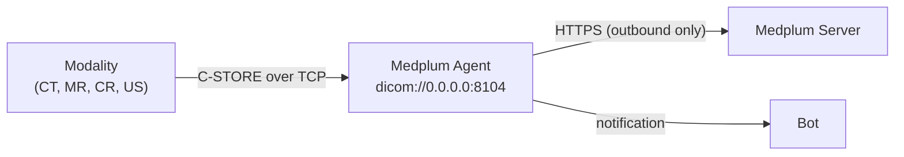

# DICOM with the Medplum Agent

Imaging equipment does not speak DICOMweb. Modalities, workstations, and legacy PACS speak **DIMSE** —
the DICOM message service over raw TCP — and they speak it on a hospital network with no route to the
public internet. The [Medplum Agent](/docs/agent) bridges that gap: it runs inside the firewall,
presents itself to the modality as an ordinary DICOM Storage SCP, and forwards each received instance
to Medplum over an outbound HTTPS connection.



The Agent needs no inbound firewall rule. From the network's perspective it is a device that listens
on a local port and makes outbound HTTPS calls, which is what makes it deployable in environments
that will not expose a PACS to the internet.

## Supported DIMSE operations

| Operation | Supported | Notes                                                        |
| --------- | --------- | ------------------------------------------------------------ |
| `C-ECHO`  | Yes       | Always answers success. Use it to verify connectivity first. |
| `C-STORE` | Yes       | Stores the instance and notifies a Bot.                      |
| `C-FIND`  | No        |                                                              |
| `C-GET`   | No        |                                                              |
| `C-MOVE`  | No        |                                                              |

The Agent accepts every presentation context and transfer syntax the calling AE proposes, and
negotiates a maximum PDU length of 64 KB. In practice this means a modality's default configuration
usually associates successfully without transfer syntax tuning.

## Configuring a DICOM channel

A DICOM channel is configured the same way as any other Agent channel — an
[`Endpoint`](/docs/api/fhir/resources/endpoint) describing what to listen on, referenced from a
channel entry on the [`Agent`](/docs/api/fhir/medplum/agent) resource. See
[Intro to Medplum Agent](/docs/agent) for the full setup, including the `Bot` and `ClientApplication`
that go with it.

What makes the channel a DICOM channel is the `dicom://` scheme on `Endpoint.address`:

```json
{
  "resourceType": "Endpoint",
  "status": "active",
  "name": "CT Scanner",
  "connectionType": {
    "system": "http://terminology.hl7.org/CodeSystem/endpoint-connection-type",
    "code": "dicom-stow-rs"
  },
  "payloadType": [
    {
      "coding": [
        {
          "system": "http://terminology.hl7.org/CodeSystem/endpoint-payload-type",
          "code": "any"
        }
      ]
    }
  ],
  "address": "dicom://0.0.0.0:8104?storage=dicomweb"
}
```

The Agent selects the channel implementation from the address scheme alone — `connectionType` is
descriptive metadata for humans and reporting, not something the Agent interprets. Port 104 is the
registered DICOM port, but it is privileged on Linux; 8104 and 11112 are the usual unprivileged
choices.

Configure the modality to send to the Agent host at that port. The Agent accepts any Called AE Title,
and records both the calling and called AE titles on the notification it sends to the Bot.

## Storage modes

The `storage` query parameter controls where a received instance ends up.

| Mode                 | What happens                                                                                                                                                                                                             | Requires                                  |
| -------------------- | ------------------------------------------------------------------------------------------------------------------------------------------------------------------------------------------------------------------------ | ----------------------------------------- |
| `binary` _(default)_ | The instance is uploaded as a FHIR [`Binary`](/docs/api/fhir/resources/binary), and a reference to it is included in the Bot payload.                                                                                    | Any server version                        |
| `dicomweb`           | The instance is sent to the server's [STOW-RS endpoint](./dicomweb-api.md#stow-rs-store-instances), which files it into `DicomStudy`, `DicomSeries`, and `DicomInstance` resources. No `Binary` is created by the Agent. | Medplum Server \> 5.1.27, Agent \> 5.1.28 |

`binary` remains the default so that a DICOM channel configured before DICOMweb existed keeps working
unchanged. **New deployments that want studies in the DICOM data model should set
`storage=dicomweb`.** In that mode the payload delivered to the Bot has no `binary` field — the study
is addressed through the DICOM resources the server created instead.

An unrecognized `storage` value logs a warning and falls back to `binary`, so a typo cannot silently
point a channel at an endpoint the server may not have. Against a server without DICOMweb support,
the STOW-RS request 404s and the `C-STORE` fails with a processing failure status.

Changing the storage mode takes effect on
[`Agent/$reload-config`](/docs/agent/reload-config) without a restart, and without rebinding the port.

## What the Bot receives

Every `C-STORE` produces a notification to the channel's target `Bot`, regardless of storage mode:

```json
{
  "association": {
    "callingAeTitle": "CT_SCANNER_1",
    "calledAeTitle": "MEDPLUM"
  },
  "dataset": {
    "00080018": { "vr": "UI", "Value": ["1.2.840.113619.2.55.3.12345"] },
    "00080060": { "vr": "CS", "Value": ["MR"] },
    "0020000D": { "vr": "UI", "Value": ["1.2.840.113619.2.55.3.99999"] }
  },
  "binary": { "reference": "Binary/0195f2c1-..." }
}
```

- `association` carries the AE titles from the DIMSE association, which is how you tell one modality
  from another when several send to the same channel.
- `dataset` is the instance's DICOM JSON with `PixelData` `(7FE0,0010)` removed — enough to route,
  match a patient, or build an order reconciliation, without shipping the image through the Bot.
- `binary` is present only in `binary` storage mode.

A minimal Bot that logs each arrival:

```ts
import { BotEvent, MedplumClient } from '@medplum/core';

interface DicomNotification {
  association: { callingAeTitle?: string; calledAeTitle?: string };
  dataset: Record<string, { vr: string; Value?: unknown[] }>;
  binary?: { reference?: string };
}

export async function handler(medplum: MedplumClient, event: BotEvent<DicomNotification>): Promise<void> {
  const { association, dataset } = event.input;
  const sopInstanceUid = dataset['00080018']?.Value?.[0];
  console.log(`Received ${sopInstanceUid} from ${association.callingAeTitle}`);
}
```

In `dicomweb` mode the server already creates an `ImagingStudy` and resolves its `subject` when the
DICOM Patient ID matches exactly one `Patient` in the project. A Bot is the place to handle the cases
that need judgment — studies whose patient could not be resolved, or one matched to the wrong record.
Correcting `ImagingStudy.subject` by hand sticks; the server never downgrades it. See
[Relationship to FHIR ImagingStudy](./data-model.md#relationship-to-fhir-imagingstudy).

## Testing a channel

Verify connectivity before involving the modality. With
[dcmtk](https://dicom.offis.de/dcmtk.php.en) installed:

```bash
# C-ECHO — verifies the association handshake only
echoscu -v localhost 8104

# C-STORE — sends a file
storescu -v localhost 8104 MRBRAIN.DCM
```

A successful `C-STORE` in `dicomweb` mode should be followed by a new `DicomStudy` in your project.
If the `C-STORE` returns a processing failure, check the Agent's **channel log** — the main Agent log
deliberately excludes message content, so DICOM transfer detail lands in the channel log, which
[may contain PHI](/docs/agent/configuration#channel-logger).

To test without a modality or dcmtk at all, skip DIMSE entirely and use
[`medplum dicomweb stow`](./cli.md).

## See also

- [Intro to Medplum Agent](/docs/agent)
- [Agent Features](/docs/agent/features) — version matrix for `storage=dicomweb` and other channel options
- [Agent Troubleshooting](/docs/agent/troubleshooting)
- [DICOMweb API](./dicomweb-api.md)
